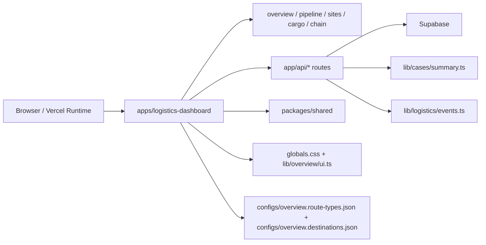
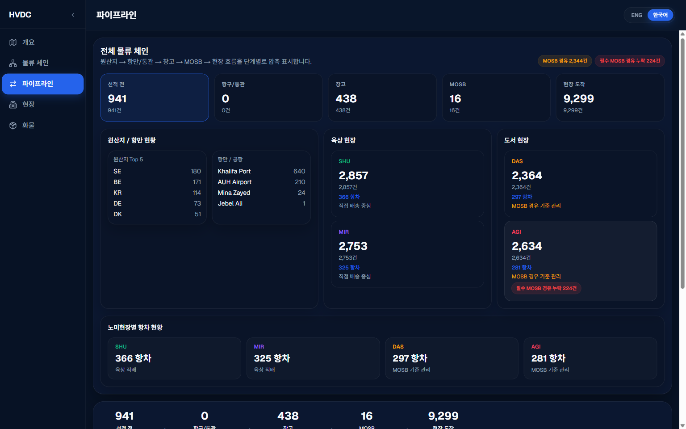
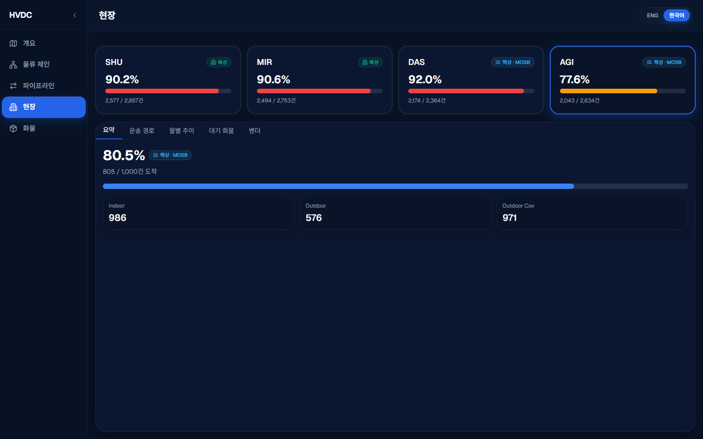
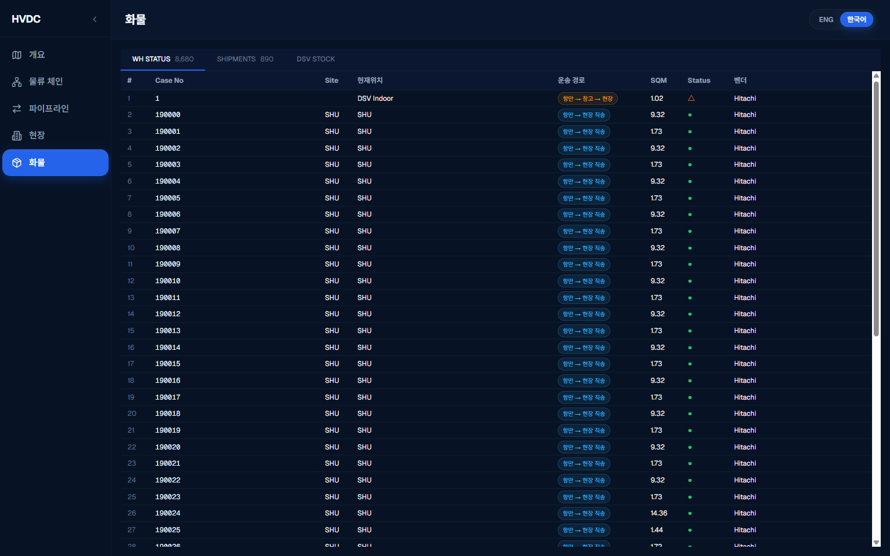
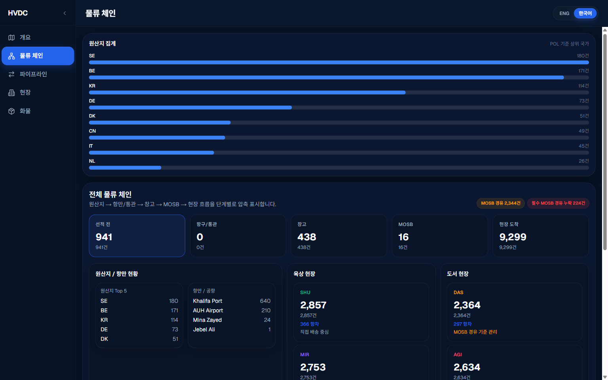

# LOGI MASTER DASH

> HVDC logistics operations dashboard monorepo.

[](https://nextjs.org)
[](https://react.dev)
[](https://typescriptlang.org)
[](https://supabase.com)
[](https://pnpm.io)

---

## Overview

This repository currently ships one active dashboard application:

- `apps/logistics-dashboard`

The active runtime combines:

- a 7-row `/overview` cockpit
- a shared dashboard shell on `/overview`, `/pipeline`, `/sites`, `/cargo`, and `/chain`
- `/pipeline`, `/sites`, `/cargo`, and `/chain` drilldown pages
- Supabase-backed operational APIs
- shared URL restoration contracts
- map, heatmap, worklist, and KPI monitoring flows

Root workspace support files remain in place for shared packages, configs, scripts, and migration assets.

---

## Repository Layout

```text
/
|- apps/
|  \- logistics-dashboard/
|- packages/
|  |- shared/
|  |- ui-components/
|  \- doc-intelligence/
|- configs/
|- scripts/
|- supabase/
|- docs/
\- README.md
```

Important source-of-truth locations:

- `apps/logistics-dashboard/app/globals.css`
- `apps/logistics-dashboard/lib/overview/ui.ts`
- `apps/logistics-dashboard/lib/navigation/contracts.ts`
- `apps/logistics-dashboard/lib/cases/summary.ts`
- `apps/logistics-dashboard/lib/logistics/events.ts`
- `configs/overview.route-types.json`
- `configs/overview.destinations.json`

---

## Architecture Graph



---

## Quick Start

### Prerequisites

- Node.js 20+
- `pnpm` 10+
- Supabase project credentials

### Install

```bash
pnpm install
```

### Run the workspace

```bash
pnpm dev
```

### Run only the dashboard app

```bash
pnpm --filter @repo/logistics-dashboard dev
```

Default local URL:

- `http://localhost:3001`

### Production-like local run

```bash
pnpm --filter @repo/logistics-dashboard build
pnpm --filter @repo/logistics-dashboard start -- --port 3005
```

---

## Environment Variables

Create `apps/logistics-dashboard/.env.local`:

```env
NEXT_PUBLIC_SUPABASE_URL=<your-project-url>
NEXT_PUBLIC_SUPABASE_ANON_KEY=<your-anon-key>
SUPABASE_SERVICE_ROLE_KEY=<your-service-role-key>
NEXT_PUBLIC_FORCE_PLACEHOLDER_SUPABASE=false
```

Rules:

- never expose `SUPABASE_SERVICE_ROLE_KEY` to browser code
- keep `NEXT_PUBLIC_FORCE_PLACEHOLDER_SUPABASE=false` in real-data environments
- if credentials are missing or placeholder mode is forced, some routes fall back to placeholder behavior

---

## Active Routes

- `/overview`
  - 7-row cockpit
  - dashboard shell with sidebar/header
  - KPI rail, map, mission control, site matrix, radar, ops snapshot
- `/pipeline`
  - 5-stage pipeline analysis
- `/sites`
  - 4-site readiness and site detail tabs
- `/cargo`
  - warehouse status, shipments, and stock tabs
- `/chain`
  - logistics chain and route drilldown

Overview deep-link query vocabulary:

- `route_type`
- `stage`
- `site`
- `focus`
- `tab`
- `caseId`
- `vendor`
- `category`
- `voyage_stage`

---

## Screen Gallery

Captured from the local dashboard runtime on `http://localhost:3001`.

### Pipeline



### Sites



### Cargo



### Chain



---

## Workspace Commands

From the repository root:

```bash
pnpm dev
pnpm build
pnpm lint
pnpm typecheck
pnpm test
```

App-scoped:

```bash
pnpm --filter @repo/logistics-dashboard dev
pnpm --filter @repo/logistics-dashboard build
pnpm --filter @repo/logistics-dashboard typecheck
pnpm --filter @repo/logistics-dashboard test
```

---

## Architecture Notes

Current runtime rules:

- `apps/logistics-dashboard` is the only active app under `apps/`
- `KpiProvider` owns dashboard-level realtime once at the shell layer
- URL-driven pages keep `page.tsx` as a server component and move `useSearchParams()` into `*PageClient.tsx`
- `/api/cases/summary` and `/api/overview` share `lib/cases/summary.ts`
- `/api/events` and `/api/overview` share `lib/logistics/events.ts`
- theme SSOT is CSS-based, not `tailwind.config.ts`

UI invariants:

- map left
- right panel right
- HVDC panel bottom
- dark premium theme by default

---

## Documentation

Dashboard application docs:

- [apps/logistics-dashboard/README.md](apps/logistics-dashboard/README.md)
- [apps/logistics-dashboard/docs/LAYOUT.md](apps/logistics-dashboard/docs/LAYOUT.md)
- [apps/logistics-dashboard/docs/COMPONENTS.md](apps/logistics-dashboard/docs/COMPONENTS.md)
- [apps/logistics-dashboard/docs/SYSTEM-ARCHITECTURE.md](apps/logistics-dashboard/docs/SYSTEM-ARCHITECTURE.md)
- [apps/logistics-dashboard/docs/SUPABASE.md](apps/logistics-dashboard/docs/SUPABASE.md)
- [apps/logistics-dashboard/docs/DEPLOYMENT.md](apps/logistics-dashboard/docs/DEPLOYMENT.md)
- [apps/logistics-dashboard/docs/GITHUB-DEPLOY-STRUCTURE.md](apps/logistics-dashboard/docs/GITHUB-DEPLOY-STRUCTURE.md)

Project-wide references:

- [AGENTS.md](AGENTS.md)
- [CHANGELOG.md](CHANGELOG.md)
- [PROJECT_SUMMARY.md](PROJECT_SUMMARY.md)
- [STATUS.md](STATUS.md)
- [docs/README.md](docs/README.md)

---

## Deployment

Production and preview deployment are managed through Vercel.

Deployment-sensitive files:

- `apps/logistics-dashboard/app/layout.tsx`
- `apps/logistics-dashboard/app/(dashboard)/overview/page.tsx`
- `apps/logistics-dashboard/app/(dashboard)/pipeline/page.tsx`
- `apps/logistics-dashboard/app/(dashboard)/sites/page.tsx`
- `apps/logistics-dashboard/app/(dashboard)/cargo/page.tsx`
- `apps/logistics-dashboard/app/(dashboard)/chain/page.tsx`
- `apps/logistics-dashboard/vercel.json` when present in future app-level setup
- root `vercel.json`

See:

- [apps/logistics-dashboard/docs/DEPLOYMENT.md](apps/logistics-dashboard/docs/DEPLOYMENT.md)
- [apps/logistics-dashboard/docs/GITHUB-DEPLOY-STRUCTURE.md](apps/logistics-dashboard/docs/GITHUB-DEPLOY-STRUCTURE.md)

---

## License

Private.
