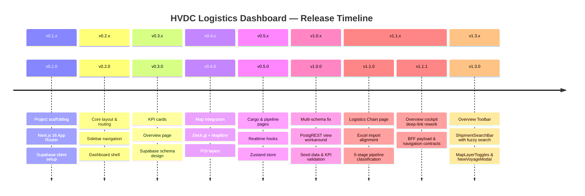
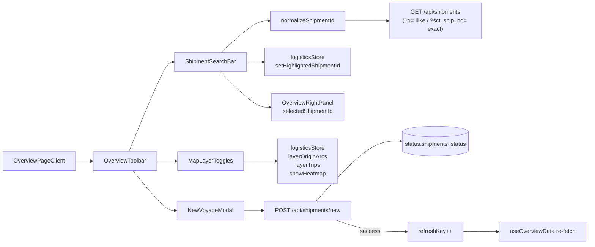

# Changelog

All notable changes to the HVDC Logistics Dashboard are documented in this file.

The format is based on [Keep a Changelog](https://keepachangelog.com/en/1.0.0/),
and this project adheres to [Semantic Versioning](https://semver.org/spec/v2.0.0.html).

---

## [1.3.5] — 2026-03-15

### Production Metadata Cleanup

#### Fixed
- `app/layout.tsx` — updated the root metadata title and description from the stale MOSB-only branding to the current HVDC dashboard branding
- `app/layout.tsx` — removed the unused Vercel Analytics injection that was causing a production `/_vercel/insights/script.js` 404 in the browser console

---

## [1.3.4] — 2026-03-15

### Overview Heatmap Fix

#### Fixed
- `app/api/overview/route.ts` — overview map now uses the same joined-event query and fallback logic as `/api/events`, so the heatmap receives event data again when the live table is empty or partially unmappable
- `app/api/events/route.ts` — event route now reuses the shared logistics event helper instead of maintaining a second copy of the mapping and mock fallback logic
- `lib/logistics/events.ts` — added a shared Supabase event mapper, joined select SSOT, and mock event generator used by both overview and events routes
- `lib/logistics/__tests__/events.test.ts` — added regression coverage for joined-event mapping and non-empty mock fallback generation

---

## [1.3.2] — 2026-03-14

### Overview Visual Polish

#### Changed
- `components/overview/OverviewPageClient.tsx` — widened the breathing room between Open Radar and Ops Snapshot with a `gap-5` row-7 grid and a slightly more balanced desktop column ratio
- `components/overview/OpenRadarTable.tsx` — tightened radar row density and increased filter-pill spacing without changing selection or navigation behavior
- `components/overview/OpsSnapshot.tsx` — aligned the four subsection cards with larger grid gaps and a shared minimum card height
- `lib/overview/ui.ts` — softened risk badges/progress fills and increased DAS/AGI chip fill visibility while keeping the dark premium token system intact

---

## [1.3.3] — 2026-03-14

### Overview Count Stability Fix

#### Fixed
- `app/api/overview/route.ts` — removed the shared nested summary-state bug that caused overview counts to inflate on repeated requests
- `app/api/cases/summary/route.ts` — now uses the same shared cases-summary builder as overview so both routes stay aligned
- `lib/cases/summary.ts` — added a fresh summary factory and reusable aggregation helper to prevent request-to-request mutation drift
- `lib/cases/__tests__/summary.test.ts` — added regression tests for isolated empty summaries and stable repeated aggregation output

---

## [1.3.1] — 2026-03-14

### Dark Premium Theme Consolidation

#### Added
- `docs/superpowers/plans/2026-03-14-dark-premium-dashboard-theme.md` — implementation plan that locks the CSS-theme SSOT, 7-row Overview preservation, and cross-page retheme scope

#### Changed
- `app/globals.css` — added hvdc semantic dashboard tokens for page, panel, border, text, site, brand, status, radius, and shadow values
- `lib/overview/ui.ts` — converted to a semantic recipe layer with shared helpers for route badges, gate badges, readiness badges, voyage stage badges, customs states, and progress fills
- `overview`, `chain`, `pipeline`, `sites`, and `cargo` page shells now use the same dark premium token system
- Overview support surfaces (`MissionControl`, `SiteDeliveryMatrix`, `OpenRadarTable`, `OpsSnapshot`, `ShipmentSearchBar`, `MapLayerToggles`, `NewVoyageModal`) now consume semantic recipes instead of inline color literals
- Chain, Sites, Pipeline, and Cargo tables/cards/chips/progress surfaces were aligned to the same panel and badge system without changing the existing data or navigation contracts
- docs in `apps/logistics-dashboard/docs` and `README.md` now describe the actual Tailwind v4 CSS-theme architecture instead of the removed `light-ops`/`tailwind.config.ts` approach

---

## Change History Overview



---

## [1.3.0] — 2026-03-14

### Overview Toolbar (Search + Map Toggles + New Voyage Modal)



### Added

- `components/overview/OverviewToolbar.tsx` — toolbar row above KpiStripCards containing search, map layer toggles, and new voyage button
- `components/overview/ShipmentSearchBar.tsx` — fuzzy shipment ID search bar with debounced dropdown (300 ms), map highlight, and right-panel detail card
- `components/overview/MapLayerToggles.tsx` — three pill toggle buttons: Origin Arc / 항차 / Heatmap
- `components/overview/NewVoyageModal.tsx` — full voyage entry form (8 field rows: SCT SHIP NO, vendor, POL/POD, ship mode/incoterms/MR No., vessel/B/L, ETD/ATD/ETA/ATA, transit/customs/inland days, site checkboxes, description textarea) that POSTs to `/api/shipments/new`
- `lib/search/normalizeShipmentId.ts` — ID normalization supporting `hvdc-adopt-sct-0001`, `sct0001`, `sct001`, `case12345` formats; returns `{ type: 'exact' | 'ilike', value: string }`
- `lib/search/__tests__/normalizeShipmentId.test.ts` — 7 Vitest tests, all passing
- `app/api/shipments/new/route.ts` — `POST /api/shipments/new`; inserts into `status.shipments_status` via `supabaseAdmin.schema('status')`; returns 200 ok / 409 duplicate_hvdc_code / 400 / 500

### Changed

- `app/api/shipments/route.ts` — added `?q=` ilike param (mutually exclusive with `?sct_ship_no=` exact match via `else if`)
- `store/logisticsStore.ts` + `types/logistics.ts` — added `layerOriginArcs: boolean` (default `true`), `layerTrips: boolean` (default `true`), `highlightedShipmentId: string | null`, and their corresponding actions
- `components/map/layers/createTripsLayer.ts` — added optional `highlightId?: string | null` 4th param; highlighted trip renders white `[255,255,255,220]`, others dimmed to 30% alpha
- `components/overview/OverviewMap.tsx` — `showOriginArcs` now respects `layerOriginArcs` store toggle; `createTripsLayer` call fixed from wrong `showPoiLayer` to `layerTrips`; `highlightedShipmentId` passed through
- `components/overview/OverviewRightPanel.tsx` — new optional props `selectedShipmentId?: string | null` and `onClearSelection?: () => void`; shows `ShipmentDetailCard` at top when a shipment is selected
- `hooks/useOverviewData.ts` — added optional `options?: { refreshKey?: number }` param; third `useEffect` triggers re-fetch when `refreshKey` changes
- `components/overview/OverviewPageClient.tsx` — integrated `OverviewToolbar` as first child, `NewVoyageModal` wired with `refreshKey++` on success, `selectedShipmentId` state wired to `OverviewRightPanel`

### Fixed

- `createTripsLayer` was incorrectly receiving `showPoiLayer` (a zoom-gated boolean) as its `visible` argument — now correctly uses `layerTrips` store toggle

---

## [1.1.1] — 2026-03-13

### 🧭 Overview Cockpit Deep-Link Rework

#### Added
- `app/api/overview/route.ts` — cockpit BFF payload with `schemaVersion`, hero metrics, alerts, route summary, site readiness, warehouse pressure, live feed, and map snapshot
- `components/overview/OverviewPageClient.tsx` — map-first overview shell with right panel and bottom HVDC panel
- `components/overview/OverviewBottomPanel.tsx` — pipeline strip + prioritized shared worklist
- `components/navigation/PageContextBanner.tsx` — plain-language URL context chips for Pipeline / Sites / Cargo / Chain
- `hooks/useOverviewData.ts` — page-local overview fetch with visible-only polling and focus refetch
- `configs/overview.route-types.json` — SSOT route taxonomy
- `configs/overview.destinations.json` — SSOT overview destination registry
- `lib/navigation/contracts.ts` — typed query parsing/serialization and `buildDashboardLink`
- `lib/overview/routeTypes.ts` — config-backed route mapping helpers
- tests for route type config and navigation contracts under `lib/overview/__tests__` and `lib/navigation/__tests__`

#### Changed
- Overview page now uses plain-language route labels instead of user-facing `Flow Code`
- `/api/cases`, `/api/cases/summary`, `/api/shipments`, `/api/chain/summary` now understand `route_type` while keeping `flow_code` compatibility
- Pipeline, Sites, Cargo, and Chain now restore overview-originated state from URL and expose context banners
- `SiteDetail`, `PipelineCasesTable`, `WhStatusTable`, `ShipmentsTable`, `CargoDrawer`, and `FlowChain` now render route labels instead of `FC0~FC5`
- `useInitialDataLoad` now supports an `enabled` flag so overview primes the shared worklist only when the store is empty

#### Fixed
- Direct overview drilldowns now survive refresh/back/forward instead of depending on local component state
- Overview map clicks now open the relevant dashboard page using the shared navigation contract

## [1.1.0] — 2026-03-13

### 🔄 Logistics Chain + Excel Import Alignment

#### Added
- `app/(dashboard)/chain/page.tsx` — new end-to-end logistics chain page
- `components/chain/FlowChain.tsx` — origin → port → warehouse → MOSB → site chain visualization
- `components/chain/OriginCountrySummary.tsx` — POL-based origin country summary
- `components/pipeline/PipelineCasesTable.tsx` — stage-specific case table with independent fetch state
- `components/pipeline/PipelineTableWrapper.tsx` — local pipeline filters decoupled from cargo store filters
- `components/sites/SiteTypeTag.tsx` — land / island site badges
- `app/api/chain/summary/route.ts` — chain aggregation API
- `app/api/shipments/origin-summary/route.ts` — origin country aggregation API
- `lib/cases/pipelineStage.ts` — 5-stage classification helper (`pre-arrival`, `port`, `warehouse`, `mosb`, `site`)
- `lib/cases/storageType.ts` — storage bucket normalization helper
- `lib/map/flowLines.ts` — POI-based ArcLayer definitions
- `scripts/import-excel.mjs` — Excel ETL for `wh status` and `hvdc all status`

#### Changed
- `/api/cases` now supports `stage` and `id` query parameters
- `/api/cases/summary` now uses `storage_type` normalization and 5-stage aggregation
- `/api/shipments` now returns normalized ship modes and passes through `ATD` / `ATA`
- Pipeline page now shows the 5-stage flow and a stage-specific drilldown table
- Overview map now renders UAE internal flow arcs from `POI_LOCATIONS` without the duplicate HVDC POI overlay
- Sites page now shows 3-bucket storage breakdown and cargo drilldown links
- Cargo page now restores `tab` / `caseId` from the URL and supports drawer fallback fetch by case ID
- Sidebar navigation now includes `물류 체인`

#### Fixed
- Removed invalid `wh_storage_type` assumptions in favor of `storage_type`
- Removed pipeline table reliance on global cargo filter state
- Corrected MOSB / port / warehouse stage classification by `status_location`
- Rebuilt schema/view setup scripts to support case-level flows and `DOC_SHU/DOC_DAS/DOC_MIR/DOC_AGI`
- Fixed Cargo tab hydration so direct links like `/cargo?tab=shipments` no longer get rewritten back to `wh` on first load

## [1.0.0] — 2026-03-13

### 🚀 Production Release — HVDC Logistics Dashboard

#### Added
- **Public view layer for PostgREST multi-schema access**
  - `public.v_cases` → mirrors `case.cases`
  - `public.v_flows` → mirrors `case.flows`
  - `public.v_shipments_status` → mirrors `status.shipments_status`
  - `public.v_stock_onhand` → mirrors `wh.stock_onhand`
- **Seed data** via `seed-data.mjs` — 1,050 total rows with realistic HVDC logistics data
  - `case.cases`: 300행 (AGI 40% / SHU·MIR·DAS 각 20%)
  - `case.flows`: 300행 (Flow Code 0~5, AGI/DAS는 FC ≥ 3 강제)
  - `status.shipments_status`: 300행 (ETD/ETA/ATA 랜덤 생성)
  - `wh.stock_onhand`: 150행 (15가지 HVDC 자재)
- **KPI validation** — all 4 dashboard KPI cards confirmed showing non-zero values
- `docs/SYSTEM-ARCHITECTURE.md` — full system architecture documentation
- `docs/LAYOUT.md` — UI layout structure documentation
- `docs/COMPONENTS.md` — component library documentation
- `docs/SUPABASE.md` — database schema and Supabase configuration
- `README.md` — comprehensive project README

#### Fixed
- **Critical: PostgREST 403 Forbidden** on `.schema('case')`, `.schema('status')`, `.schema('wh')` calls
  - Root cause: Custom PostgreSQL schemas not in `db.schema` Supabase config
  - Fix: All API routes now query `public.v_*` views instead of raw schema tables
- **KPI cards showing 0** for 현장 도착 and 창고 재고
  - Root cause: All seed data had `status_current = 'Pre Arrival'`
  - Fix: UPDATE SQL executed to distribute status values correctly
- `apps/api/cases/route.ts` — switched from `.schema('case').from('cases')` to `.from('v_cases')`
- `apps/api/cases/summary/route.ts` — switched to `.from('v_cases')`
- `apps/api/stock/route.ts` — switched from `.schema('wh').from('stock_onhand')` to `.from('v_stock_onhand')`

#### Changed
- Database query strategy: Direct schema access → Public view proxy pattern
- Supabase client: Added error boundary for missing environment variables

---

## [0.5.0] — 2026-03-10

### 🔗 Realtime & State Management

#### Added
- **Zustand store** (`store/logisticsStore.ts`)
  - Normalized data storage for cases, shipments, stock
  - KPI selectors with memoization
  - Optimistic updates for realtime events
- **Custom hooks**
  - `useSupabaseRealtime.ts` — WebSocket subscription with auto-reconnect (exponential backoff)
  - `useKpiRealtime.ts` — KPI-specific realtime updates
  - `useKpiRealtimeWithFallback.ts` — graceful degradation to polling
  - `useLiveFeed.ts` — activity feed stream
  - `useInitialDataLoad.ts` — parallel initial data fetching
  - `useBatchUpdates.ts` — debounced batch state updates
  - `useMultiTabSync.ts` — BroadcastChannel cross-tab synchronization
- **Pipeline page** (`app/(dashboard)/pipeline/page.tsx`)
  - `FlowPipeline` component — visual flow code progression
  - `FlowCodeDonut` — Recharts donut chart for flow distribution
  - `CustomsStatusCard` — customs clearance status
  - Pipeline filter controls
- **Sites page** (`app/(dashboard)/sites/page.tsx`)
  - `SiteCards` — per-site status cards
  - `SiteDetail` — expandable detail panel
  - `AgiAlertBanner` — AGI/DAS site alert system
- **Cargo page** (`app/(dashboard)/cargo/page.tsx`)
  - `CargoTabs` — Shipments / WH Status / DSV Stock tabs
  - `ShipmentsTable` — paginated shipments with sorting
  - `WhStatusTable` — warehouse status grid
  - `DsvStockTable` — DSV stock levels
  - `CargoDrawer` — slide-over detail panel

#### Changed
- Overview page: added right panel with activity feed and alerts
- Map: added POI clustering for performance

---

## [0.4.0] — 2026-03-07

### 🗺️ Geospatial Map Integration

#### Added
- **Deck.gl + Maplibre GL** integration
  - `OverviewMap.tsx` — main map component
  - `HvdcPoiLayers.tsx` — HVDC site POI layer
  - `HeatmapLegend.tsx` — cargo density legend
  - `layers/` — ScatterplotLayer, HeatmapLayer, IconLayer configs
- **POI data** (`lib/map/`)
  - `poiLocations.ts` — warehouse & hub coordinates
  - `hvdcPoiLocations.ts` — HVDC project sites (AGI, DAS, MIR, SHU, MOSB)
  - `poiTypes.ts` — POI type definitions with icon mappings
- **Dubai timezone utilities** (`lib/time.ts`)
  - `toGulfTime()` — convert UTC to GST (UTC+4)
  - `formatRelativeGulf()` — relative time in Gulf timezone
  - `isBusinessHours()` — UAE business hours check

#### Changed
- Root layout: dark theme enforced globally
- Dashboard layout: responsive 2-column grid

---

## [0.3.0] — 2026-03-04

### 📊 KPI Cards & Overview Page

#### Added
- **KPI Strip Cards** (`components/overview/KpiStripCards.tsx`)
  - Total Cases
  - 현장 도착 (Site Arrival)
  - 창고 재고 (Warehouse Stock)
  - Flow Code distribution
- **KPI Provider** (`components/layout/KpiProvider.tsx`)
  - Context-based KPI distribution
  - SSR-safe Suspense boundary
- **Overview page** (`app/(dashboard)/overview/page.tsx`)
  - 3-column layout: KPI + Map + Right Panel
- **API routes**
  - `app/api/cases/summary/route.ts` — KPI aggregation endpoint
  - `app/api/cases/route.ts` — paginated cases with filters
  - `app/api/stock/route.ts` — warehouse stock endpoint
  - `app/api/shipments/route.ts` — shipment data
  - `app/api/events/route.ts` — event stream
  - `app/api/locations/route.ts` — location list
  - `app/api/location-status/route.ts` — per-location status
  - `app/api/worklist/route.ts` — work items
- **Mock fallback** (`lib/api.ts`) — static data when Supabase unavailable

#### Changed
- Supabase multi-schema design finalized: `case`, `status`, `wh` schemas

---

## [0.2.0] — 2026-03-01

### 🏗️ Core Layout & Routing

#### Added
- **App Router structure**
  - Root layout (`app/layout.tsx`) with dark theme + Inter font
  - Dashboard route group (`app/(dashboard)/layout.tsx`)
  - Redirect: `/` → `/overview`
- **Sidebar** (`components/layout/Sidebar.tsx`)
  - Navigation: Overview, Cargo, Pipeline, Sites
  - Collapsible with keyboard shortcut `Cmd+B`
  - Active route highlighting
- **Dashboard Header** (`components/layout/DashboardHeader.tsx`)
  - Page title + breadcrumbs
  - Last-updated timestamp
  - Search bar
- **Shadcn UI components** (`components/ui/`)
  - button, card, badge, input, label, select, skeleton, switch
- **Search index** (`lib/search/searchIndex.ts`) — client-side full-text search

#### Changed
- Tailwind config: extended with HVDC brand colors
- `globals.css`: CSS variables for dark/light theme tokens

---

## [0.1.0] — 2026-02-26

### 🌱 Project Initialization

#### Added
- Next.js 16.3 with App Router, TypeScript 5.4
- React 19.2.0
- Tailwind CSS 3.4 + `tailwindcss-animate`
- Supabase JS client (`@supabase/supabase-js` 2.x)
- `lib/supabase.ts` — client factory with env-var fallback
- `types/logistics.ts` — core type definitions
- `types/cases.ts` — case/stock row types
- `lib/utils.ts` — `cn()` class-merge utility
- `lib/data/ontology-locations.ts` — HVDC node definitions
- `lib/hvdc/buckets.ts` — status bucket grouping
- `.env.local.example` — environment variable template
- ESLint + Prettier configuration
- `recreate-tables.mjs` — database setup script
- `seed-data.mjs` — initial seed data script

#### Infrastructure
- Supabase project: `rkfffveonaskewwzghex` ("supabase-cyan-yacht")
- Region: ap-southeast-1
- PostgreSQL 15 with multi-schema design
- Row Level Security policies configured

---

## Migration Guide

### v0.x → v1.0.0 (PostgREST Schema Fix)

If you have existing API routes using `.schema()` calls, update them:

```typescript
// ❌ Before (causes 403 Forbidden)
const { data } = await supabase
  .schema('case')
  .from('cases')
  .select('*')

// ✅ After (uses public view)
const { data } = await supabase
  .from('v_cases')
  .select('*')
```

Run this SQL in Supabase SQL Editor to create the required views:

```sql
-- Required views for PostgREST access
CREATE OR REPLACE VIEW public.v_cases AS SELECT * FROM case.cases;
CREATE OR REPLACE VIEW public.v_flows AS SELECT * FROM case.flows;
CREATE OR REPLACE VIEW public.v_shipments_status AS SELECT * FROM status.shipments_status;
CREATE OR REPLACE VIEW public.v_stock_onhand AS SELECT * FROM wh.stock_onhand;

-- Grant access
GRANT SELECT ON public.v_cases TO anon, authenticated;
GRANT SELECT ON public.v_flows TO anon, authenticated;
GRANT SELECT ON public.v_shipments_status TO anon, authenticated;
GRANT SELECT ON public.v_stock_onhand TO anon, authenticated;
```

---

## Known Issues

| Issue | Status | Workaround |
|-------|--------|------------|
| Custom schema PostgREST access | ✅ Fixed in v1.0.0 | Use `v_*` public views |
| KPI cards showing 0 | ✅ Fixed in v1.0.0 | Run UPDATE SQL for status distribution |
| Map tile loading on slow networks | 🔄 Open | MapLibre offline tiles planned |
| Multi-tab realtime dedup | ✅ Mitigated | `useMultiTabSync` via BroadcastChannel |

---

## Links

- [README](README.md)
- [System Architecture](docs/SYSTEM-ARCHITECTURE.md)
- [Layout Guide](docs/LAYOUT.md)
- [Component Documentation](docs/COMPONENTS.md)
- [Supabase Schema](docs/SUPABASE.md)
- [Deployment Guide](docs/DEPLOYMENT.md)
