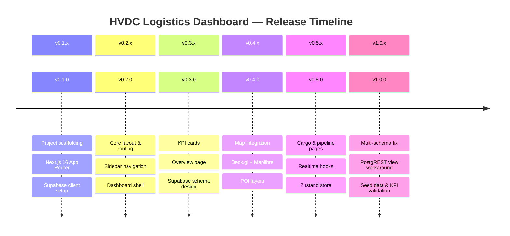

# Changelog

All notable changes to the HVDC Logistics Dashboard are documented in this file.

The format is based on [Keep a Changelog](https://keepachangelog.com/en/1.0.0/),
and this project adheres to [Semantic Versioning](https://semver.org/spec/v2.0.0.html).

---

## Change History Overview



---

## [1.0.0] — 2026-03-13

### 🚀 Production Release — HVDC Logistics Dashboard

#### Added
- **Public view layer for PostgREST multi-schema access**
  - `public.v_cases` → mirrors `case.cases`
  - `public.v_flows` → mirrors `case.flows`
  - `public.v_shipments_status` → mirrors `status.shipments_status`
  - `public.v_stock_onhand` → mirrors `wh.stock_onhand`
- **Seed data** via `seed-data.mjs` — 1,050 total rows with realistic HVDC logistics data
  - `case.cases`: 300행 (AGI 40% / SHU·MIR·DAS 각 20%)
  - `case.flows`: 300행 (Flow Code 0~5, AGI/DAS는 FC ≥ 3 강제)
  - `status.shipments_status`: 300행 (ETD/ETA/ATA 랜덤 생성)
  - `wh.stock_onhand`: 150행 (15가지 HVDC 자재)
- **KPI validation** — all 4 dashboard KPI cards confirmed showing non-zero values
- `docs/SYSTEM-ARCHITECTURE.md` — full system architecture documentation
- `docs/LAYOUT.md` — UI layout structure documentation
- `docs/COMPONENTS.md` — component library documentation
- `docs/SUPABASE.md` — database schema and Supabase configuration
- `README.md` — comprehensive project README

#### Fixed
- **Critical: PostgREST 403 Forbidden** on `.schema('case')`, `.schema('status')`, `.schema('wh')` calls
  - Root cause: Custom PostgreSQL schemas not in `db.schema` Supabase config
  - Fix: All API routes now query `public.v_*` views instead of raw schema tables
- **KPI cards showing 0** for 현장 도착 and 창고 재고
  - Root cause: All seed data had `status_current = 'Pre Arrival'`
  - Fix: UPDATE SQL executed to distribute status values correctly
- `apps/api/cases/route.ts` — switched from `.schema('case').from('cases')` to `.from('v_cases')`
- `apps/api/cases/summary/route.ts` — switched to `.from('v_cases')`
- `apps/api/stock/route.ts` — switched from `.schema('wh').from('stock_onhand')` to `.from('v_stock_onhand')`

#### Changed
- Database query strategy: Direct schema access → Public view proxy pattern
- Supabase client: Added error boundary for missing environment variables

---

## [0.5.0] — 2026-03-10

### 🔗 Realtime & State Management

#### Added
- **Zustand store** (`store/logisticsStore.ts`)
  - Normalized data storage for cases, shipments, stock
  - KPI selectors with memoization
  - Optimistic updates for realtime events
- **Custom hooks**
  - `useSupabaseRealtime.ts` — WebSocket subscription with auto-reconnect (exponential backoff)
  - `useKpiRealtime.ts` — KPI-specific realtime updates
  - `useKpiRealtimeWithFallback.ts` — graceful degradation to polling
  - `useLiveFeed.ts` — activity feed stream
  - `useInitialDataLoad.ts` — parallel initial data fetching
  - `useBatchUpdates.ts` — debounced batch state updates
  - `useMultiTabSync.ts` — BroadcastChannel cross-tab synchronization
- **Pipeline page** (`app/(dashboard)/pipeline/page.tsx`)
  - `FlowPipeline` component — visual flow code progression
  - `FlowCodeDonut` — Recharts donut chart for flow distribution
  - `CustomsStatusCard` — customs clearance status
  - Pipeline filter controls
- **Sites page** (`app/(dashboard)/sites/page.tsx`)
  - `SiteCards` — per-site status cards
  - `SiteDetail` — expandable detail panel
  - `AgiAlertBanner` — AGI/DAS site alert system
- **Cargo page** (`app/(dashboard)/cargo/page.tsx`)
  - `CargoTabs` — Shipments / WH Status / DSV Stock tabs
  - `ShipmentsTable` — paginated shipments with sorting
  - `WhStatusTable` — warehouse status grid
  - `DsvStockTable` — DSV stock levels
  - `CargoDrawer` — slide-over detail panel

#### Changed
- Overview page: added right panel with activity feed and alerts
- Map: added POI clustering for performance

---

## [0.4.0] — 2026-03-07

### 🗺️ Geospatial Map Integration

#### Added
- **Deck.gl + Maplibre GL** integration
  - `OverviewMap.tsx` — main map component
  - `HvdcPoiLayers.tsx` — HVDC site POI layer
  - `HeatmapLegend.tsx` — cargo density legend
  - `layers/` — ScatterplotLayer, HeatmapLayer, IconLayer configs
- **POI data** (`lib/map/`)
  - `poiLocations.ts` — warehouse & hub coordinates
  - `hvdcPoiLocations.ts` — HVDC project sites (AGI, DAS, MIR, SHU, MOSB)
  - `poiTypes.ts` — POI type definitions with icon mappings
- **Dubai timezone utilities** (`lib/time.ts`)
  - `toGulfTime()` — convert UTC to GST (UTC+4)
  - `formatRelativeGulf()` — relative time in Gulf timezone
  - `isBusinessHours()` — UAE business hours check

#### Changed
- Root layout: dark theme enforced globally
- Dashboard layout: responsive 2-column grid

---

## [0.3.0] — 2026-03-04

### 📊 KPI Cards & Overview Page

#### Added
- **KPI Strip Cards** (`components/overview/KpiStripCards.tsx`)
  - Total Cases
  - 현장 도착 (Site Arrival)
  - 창고 재고 (Warehouse Stock)
  - Flow Code distribution
- **KPI Provider** (`components/layout/KpiProvider.tsx`)
  - Context-based KPI distribution
  - SSR-safe Suspense boundary
- **Overview page** (`app/(dashboard)/overview/page.tsx`)
  - 3-column layout: KPI + Map + Right Panel
- **API routes**
  - `app/api/cases/summary/route.ts` — KPI aggregation endpoint
  - `app/api/cases/route.ts` — paginated cases with filters
  - `app/api/stock/route.ts` — warehouse stock endpoint
  - `app/api/shipments/route.ts` — shipment data
  - `app/api/events/route.ts` — event stream
  - `app/api/locations/route.ts` — location list
  - `app/api/location-status/route.ts` — per-location status
  - `app/api/worklist/route.ts` — work items
- **Mock fallback** (`lib/api.ts`) — static data when Supabase unavailable

#### Changed
- Supabase multi-schema design finalized: `case`, `status`, `wh` schemas

---

## [0.2.0] — 2026-03-01

### 🏗️ Core Layout & Routing

#### Added
- **App Router structure**
  - Root layout (`app/layout.tsx`) with dark theme + Inter font
  - Dashboard route group (`app/(dashboard)/layout.tsx`)
  - Redirect: `/` → `/overview`
- **Sidebar** (`components/layout/Sidebar.tsx`)
  - Navigation: Overview, Cargo, Pipeline, Sites
  - Collapsible with keyboard shortcut `Cmd+B`
  - Active route highlighting
- **Dashboard Header** (`components/layout/DashboardHeader.tsx`)
  - Page title + breadcrumbs
  - Last-updated timestamp
  - Search bar
- **Shadcn UI components** (`components/ui/`)
  - button, card, badge, input, label, select, skeleton, switch
- **Search index** (`lib/search/searchIndex.ts`) — client-side full-text search

#### Changed
- Tailwind config: extended with HVDC brand colors
- `globals.css`: CSS variables for dark/light theme tokens

---

## [0.1.0] — 2026-02-26

### 🌱 Project Initialization

#### Added
- Next.js 16.3 with App Router, TypeScript 5.4
- React 19.2.0
- Tailwind CSS 3.4 + `tailwindcss-animate`
- Supabase JS client (`@supabase/supabase-js` 2.x)
- `lib/supabase.ts` — client factory with env-var fallback
- `types/logistics.ts` — core type definitions
- `types/cases.ts` — case/stock row types
- `lib/utils.ts` — `cn()` class-merge utility
- `lib/data/ontology-locations.ts` — HVDC node definitions
- `lib/hvdc/buckets.ts` — status bucket grouping
- `.env.local.example` — environment variable template
- ESLint + Prettier configuration
- `recreate-tables.mjs` — database setup script
- `seed-data.mjs` — initial seed data script

#### Infrastructure
- Supabase project: `rkfffveonaskewwzghex` ("supabase-cyan-yacht")
- Region: ap-southeast-1
- PostgreSQL 15 with multi-schema design
- Row Level Security policies configured

---

## Migration Guide

### v0.x → v1.0.0 (PostgREST Schema Fix)

If you have existing API routes using `.schema()` calls, update them:

```typescript
// ❌ Before (causes 403 Forbidden)
const { data } = await supabase
  .schema('case')
  .from('cases')
  .select('*')

// ✅ After (uses public view)
const { data } = await supabase
  .from('v_cases')
  .select('*')
```

Run this SQL in Supabase SQL Editor to create the required views:

```sql
-- Required views for PostgREST access
CREATE OR REPLACE VIEW public.v_cases AS SELECT * FROM case.cases;
CREATE OR REPLACE VIEW public.v_flows AS SELECT * FROM case.flows;
CREATE OR REPLACE VIEW public.v_shipments_status AS SELECT * FROM status.shipments_status;
CREATE OR REPLACE VIEW public.v_stock_onhand AS SELECT * FROM wh.stock_onhand;

-- Grant access
GRANT SELECT ON public.v_cases TO anon, authenticated;
GRANT SELECT ON public.v_flows TO anon, authenticated;
GRANT SELECT ON public.v_shipments_status TO anon, authenticated;
GRANT SELECT ON public.v_stock_onhand TO anon, authenticated;
```

---

## Known Issues

| Issue | Status | Workaround |
|-------|--------|------------|
| Custom schema PostgREST access | ✅ Fixed in v1.0.0 | Use `v_*` public views |
| KPI cards showing 0 | ✅ Fixed in v1.0.0 | Run UPDATE SQL for status distribution |
| Map tile loading on slow networks | 🔄 Open | MapLibre offline tiles planned |
| Multi-tab realtime dedup | ✅ Mitigated | `useMultiTabSync` via BroadcastChannel |

---

## Links

- [README](README.md)
- [System Architecture](docs/SYSTEM-ARCHITECTURE.md)
- [Layout Guide](docs/LAYOUT.md)
- [Component Documentation](docs/COMPONENTS.md)
- [Supabase Schema](docs/SUPABASE.md)
- [Deployment Guide](docs/DEPLOYMENT.md)
