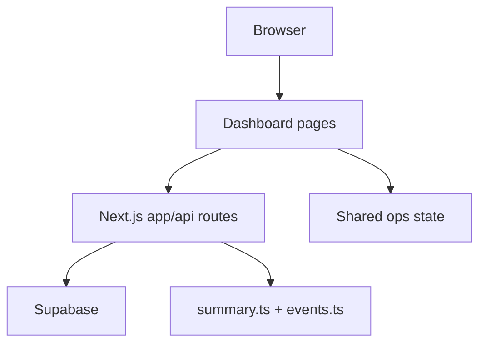

# HVDC Logistics Dashboard

> Real-time logistics operations dashboard for UAE HVDC projects.

[](https://nextjs.org)
[](https://react.dev)
[](https://typescriptlang.org)
[](https://supabase.com)
[](https://tailwindcss.com)

---

## Overview

`apps/logistics-dashboard` is the active Next.js app for:

- overview cockpit and map visibility
- pipeline, sites, cargo, and chain drilldowns
- Supabase-backed operational APIs
- URL-restored cross-page navigation

Current implementation highlights:

- `/overview` is a Map First + Bottom Collapse cockpit inside the shared dashboard shell, backed by `GET /api/overview` — the map occupies 55–65% of viewport height with a floating Mission Control card overlay
- `/pipeline`, `/sites`, `/cargo`, and `/chain` restore state from URL query params
- public UI uses plain-language `route_type` labels instead of exposing raw Flow Code labels
- styling SSOT is `app/globals.css` plus `lib/overview/ui.ts`
- overview and events routes share one event-mapping helper so map heatmap input stays consistent

---

## Routes

Active dashboard routes:

- `/overview`
  - Map First + Bottom Collapse cockpit (Overview 3.0)
  - sidebar + header shell
  - slim KPI strip + slim stage chain (Origin / Port-Air / Customs / Warehouse / MOSB / Site)
  - full-width dominant map (520–680px) with floating Mission Control overlay
  - collapsible bottom panel — Site Matrix and Voyage Radar (closed by default)
  - bottom nav: Logistics Chain / Pipeline / Sites / Cargo
- `/pipeline`
  - 5-stage pipeline analysis
- `/sites`
  - 4-site readiness and detail tabs
- `/cargo`
  - warehouse status, shipments, and stock tabs
- `/chain`
  - logistics chain and route drilldown

Overview deep links use this public query vocabulary:

- `route_type`
- `stage`
- `site`
- `focus`
- `tab`
- `caseId`
- `vendor`
- `category`
- `voyage_stage`

Examples:

- `/pipeline?stage=warehouse&route_type=via-mosb`
- `/sites?site=AGI&tab=summary`
- `/cargo?tab=shipments&site=DAS&route_type=via-mosb`
- `/chain?focus=mosb&route_type=via-warehouse-mosb`

Plain-language route labels:

- `출발 준비 중`
- `항만 → 현장 직송`
- `항만 → 창고 → 현장`
- `항만 → MOSB → 현장`
- `항만 → 창고 → MOSB → 현장`
- `경로 확인 필요`

---

## Screen Gallery

Captured from the local dashboard runtime on `http://localhost:3001`.

### Pipeline


### Sites


### Cargo


### Chain


---

## Quick Start

### Prerequisites

- Node.js 20+
- `pnpm` 10+
- Supabase project credentials

### Install

```bash
pnpm install
cd apps/logistics-dashboard
```

### Environment variables

Create `.env.local` with:

```bash
NEXT_PUBLIC_SUPABASE_URL=<your-project-url>
NEXT_PUBLIC_SUPABASE_ANON_KEY=<your-anon-key>
SUPABASE_SERVICE_ROLE_KEY=<your-service-role-key>
NEXT_PUBLIC_FORCE_PLACEHOLDER_SUPABASE=false
```

### Run locally

```bash
pnpm dev
```

Default local URL:

- `http://localhost:3001`

Production-like local run:

```bash
pnpm build
pnpm start --port 3005
```

---

## Technology Stack

| Layer | Technology |
|---|---|
| Framework | Next.js 16 App Router |
| UI | React 19 |
| Language | TypeScript 5 |
| Styling | Tailwind CSS 4 |
| Map | maplibre-gl + deck.gl |
| State | Zustand + shared ops store |
| Database | Supabase |
| Realtime | Supabase Realtime |
| Tests | Vitest |

---

## Architecture Summary



Key architecture rules:

- `KpiProvider` is the only dashboard-level KPI realtime owner
- overview uses page-local polling and focus refetch, not a second global realtime owner
- `page.tsx` stays server-rendered on URL-driven pages, while `*PageClient.tsx` owns `useSearchParams()`
- `/api/cases/summary` and `/api/overview` both reuse `lib/cases/summary.ts`
- `/api/events` and `/api/overview` both reuse `lib/logistics/events.ts`

---

## Map and Heatmap

Overview map behavior:

- `OverviewMap` is the main visual anchor on `/overview`
- heatmap visibility depends on:
  - toolbar heatmap toggle
  - current zoom threshold
  - non-empty `map.events` payload from `/api/overview`

Event and heatmap consistency rule:

- `/api/events` and `/api/overview` must use the same joined-event mapping logic
- shared helper: `lib/logistics/events.ts`

If heatmap appears broken, verify:

- `GET /api/events`
- `GET /api/overview`
- `map.events.length > 0`

---

## Supabase Notes

Source of truth:

- `lib/supabase.ts`

Primary tables and views:

- `v_cases`
- `shipments`
- `shipments_status`
- `v_stock_onhand`
- `locations`
- `location_statuses`
- `events`

Runtime behavior:

- browser uses anon credentials only
- server routes may use `supabaseAdmin`
- if credentials are missing or placeholder mode is forced, the app falls back to placeholder clients and some routes may return fallback payloads

Never expose:

- `SUPABASE_SERVICE_ROLE_KEY`

---

## Development Scripts

```bash
pnpm dev
pnpm build
pnpm start
pnpm typecheck
pnpm lint
pnpm test
```

---

## Documentation Index

- [CHANGELOG.md](CHANGELOG.md)
- [docs/COMPONENTS.md](docs/COMPONENTS.md)
- [docs/LAYOUT.md](docs/LAYOUT.md)
- [docs/SUPABASE.md](docs/SUPABASE.md)
- [docs/SYSTEM-ARCHITECTURE.md](docs/SYSTEM-ARCHITECTURE.md)
- [docs/DEPLOYMENT.md](docs/DEPLOYMENT.md)
- [docs/GITHUB-DEPLOY-STRUCTURE.md](docs/GITHUB-DEPLOY-STRUCTURE.md)

---

## Current Source of Truth

For implementation details, prefer:

- `app/globals.css`
- `lib/overview/ui.ts`
- `lib/navigation/contracts.ts`
- `lib/cases/summary.ts`
- `lib/logistics/events.ts`
- `app/api/overview/route.ts`

Design note files such as `patch_overview_design1.md` and `darkpremium_overview.md` are references only, not runtime SSOT.
