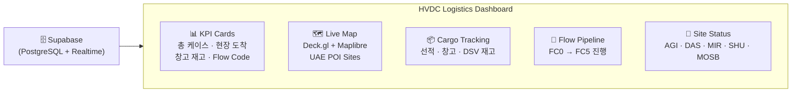
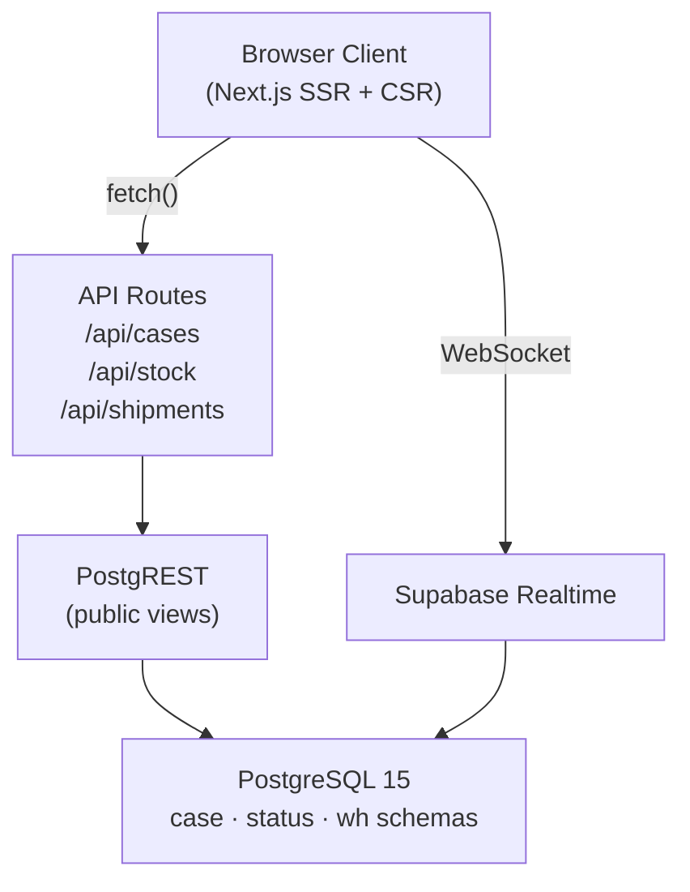

# HVDC Logistics Dashboard

> **Real-time logistics operations dashboard for UAE HVDC (High-Voltage Direct Current) power infrastructure projects.**

[](https://nextjs.org)
[](https://react.dev)
[](https://typescriptlang.org)
[](https://supabase.com)
[](https://tailwindcss.com)

---

## Overview



This dashboard provides real-time visibility into:
- **Cargo tracking** — shipments from origin ports to UAE project sites
- **Warehouse stock** — MOSB/DAS hub inventory levels
- **Flow code progression** — FC0 (Pre-Arrival) through FC5 (Site Delivery)
- **KPI monitoring** — live metrics with Supabase Realtime WebSocket updates
- **Geospatial map** — UAE HVDC site locations with cargo density heatmap

---

## Quick Start

### Prerequisites

- Node.js ≥ 20.x
- pnpm ≥ 10.28.0 (Turborepo 모노레포 필수)
- Supabase project (see [Supabase Setup](docs/SUPABASE.md))

### Installation

```bash
# Clone the monorepo
git clone <repo-url>
cd LOGI-MASTER-DASH

# Install dependencies
pnpm install

# Navigate to dashboard app
cd apps/logistics-dashboard

# Set up environment variables
cp .env.local.example .env.local
# Edit .env.local with your Supabase credentials
```

### Environment Variables

```bash
# .env.local
NEXT_PUBLIC_SUPABASE_URL=https://rkfffveonaskewwzghex.supabase.co
NEXT_PUBLIC_SUPABASE_ANON_KEY=<your-anon-key>
SUPABASE_SERVICE_ROLE_KEY=<your-service-role-key>
```

### Development Server

```bash
# From apps/logistics-dashboard
pnpm dev
# → http://localhost:3001
```

### Database Setup

Run scripts in order via Supabase SQL Editor:

1. **`supabase/scripts/20260124_hvdc_layers_status_case_ops.sql`** — Creates `status`, `case`, `ops` schemas + `public.v_*` views
2. **`supabase/migrations/`** — Apply in date order (starting `20260101_initial_schema.sql`)

Then seed data:
```bash
# From apps/logistics-dashboard
node recreate-tables.mjs   # Drop & recreate core tables
node seed-data.mjs         # Insert 1,050 rows (300 cases + 300 flows + 300 shipments + 150 stock)
```

Full database setup: [docs/SUPABASE.md](docs/SUPABASE.md) | [docs/DEPLOYMENT.md](docs/DEPLOYMENT.md)

---

## Technology Stack

| Layer | Technology | Version |
|-------|-----------|---------|
| Framework | Next.js (App Router) | 16.3 |
| UI Library | React | 19.2 |
| Language | TypeScript | 5.4 |
| Styling | Tailwind CSS + Shadcn UI | 3.4 |
| Map | Deck.gl + Maplibre GL | 9.x / 3.x |
| Charts | Recharts | 2.x |
| State | Zustand | 4.x |
| Database | Supabase (PostgreSQL 15) | 2.x client |
| Realtime | Supabase Realtime (WebSocket) | 2.x |

---

## Architecture Overview



Full architecture details: [docs/SYSTEM-ARCHITECTURE.md](docs/SYSTEM-ARCHITECTURE.md)

---

## Project Structure

```
LOGI-MASTER-DASH/                    # Turborepo 모노레포 루트
├── apps/
│   └── logistics-dashboard/         # Next.js 대시보드 앱
│       ├── app/                     # Next.js App Router
│       │   ├── layout.tsx           # Root layout (dark theme)
│       │   ├── (dashboard)/         # Route group with sidebar shell
│       │   │   ├── overview/        # KPI + Map + Live Feed
│       │   │   ├── cargo/           # Shipments + WH + DSV Stock
│       │   │   ├── pipeline/        # Flow FC0→FC5 visualization
│       │   │   └── sites/           # AGI/DAS/MIR/SHU/MOSB status
│       │   └── api/                 # BFF route handlers
│       ├── components/
│       │   ├── layout/              # Sidebar, Header, KpiProvider
│       │   ├── overview/            # KPI cards, Map, Right panel
│       │   ├── map/                 # Deck.gl layers, POI
│       │   ├── cargo/               # Tables, Drawer, Tabs
│       │   ├── pipeline/            # FlowPipeline, Charts
│       │   ├── sites/               # Site cards and detail
│       │   └── ui/                  # Shadcn base components
│       ├── hooks/                   # Custom React hooks (realtime, sync)
│       ├── lib/                     # Supabase client, utils, time
│       ├── store/                   # Zustand normalized store
│       ├── types/                   # TypeScript type definitions
│       ├── recreate-tables.mjs      # DB 테이블 DROP & 재생성 (개발용)
│       ├── seed-data.mjs            # 시드 데이터 삽입 (1,050행)
│       ├── test-insert.mjs          # 단일 행 연결 테스트
│       └── docs/                    # 상세 문서
└── supabase/                        # Supabase 설정 및 DB 스크립트
    ├── migrations/                  # 마이그레이션 SQL (날짜순 실행)
    ├── scripts/                     # DDL + 뷰 생성 SQL (scripts/ 먼저 실행)
    │   ├── 20260124_hvdc_layers_status_case_ops.sql  # ⭐ 핵심 스키마
    │   └── hvdc_copy_templates.sql  # CSV \copy 템플릿
    ├── data/raw/                    # 원본 JSON/CSV (❌ .gitignore 권장)
    ├── ontology/                    # HVDC 온톨로지 TTL 파일
    └── docs/                        # Supabase 운영 문서
```

---

## Key Features

### 📊 Real-time KPI Cards

| KPI | Korean Label | Data Source |
|-----|-------------|-------------|
| Total Cases | 전체 케이스 | `COUNT(*) FROM v_cases` |
| Site Arrival | 현장 도착 | `WHERE status_current = 'site'` |
| Warehouse Stock | 창고 재고 | `WHERE status_current = 'warehouse'` |
| Flow Distribution | Flow Code 분포 | `GROUP BY flow_code` |

### 🗺️ Geospatial Map

UAE HVDC project site visualization with:
- **ScatterplotLayer** — case locations colored by status
- **HeatmapLayer** — cargo density visualization
- **IconLayer** — HVDC site POI markers

### 🔄 Flow Pipeline (FC0 → FC5)

```
FC0 Pre Arrival → FC1 Order → FC2 Port → FC3 Customs → FC4 Warehouse → FC5 Site
```

### 📡 Real-time Updates

- Supabase WebSocket subscription on all data tables
- Exponential backoff reconnection (1s → 2s → 4s → 8s → 30s max)
- Multi-tab sync via BroadcastChannel (single WS per origin)
- Polling fallback every 30s when WebSocket unavailable

---

## HVDC Sites

| Code | Location | Operator | Coordinates |
|------|----------|----------|-------------|
| AGI | Abu Dhabi Grid Infrastructure | ADWEA | 24.45°N, 54.37°E |
| DAS | Dubai Airport Site | DEWA | 25.25°N, 55.36°E |
| MIR | Mirfa Power Plant | ADWEC | 23.92°N, 52.78°E |
| SHU | Shuweihat CCPP | ADWEC | 24.13°N, 51.87°E |
| MOSB | Musaffah Offshore Supply Base | DSV | 24.33°N, 54.46°E |

---

## API Reference

### `GET /api/cases/summary`
Returns KPI aggregation: totalCases, byStatus, bySite, byFlowCode, byVendor, totalSqm

### `GET /api/cases`
Paginated case list. Query params: `site`, `flow_code`, `status_current`, `vendor`, `page`, `limit`

### `GET /api/stock`
Warehouse stock levels. Query params: `location`, `sku`, `page`

### `GET /api/shipments`
Shipment list with ETA/ATA data.

Full API docs: [docs/SYSTEM-ARCHITECTURE.md#5-api-architecture](docs/SYSTEM-ARCHITECTURE.md#5-api-architecture)

---

## Troubleshooting

### KPI cards showing 0

```sql
-- Verify status distribution
SELECT status_current, COUNT(*) FROM public.v_cases GROUP BY status_current;

-- Fix if all rows are 'Pre Arrival'
UPDATE case.cases SET status_current = 'site'
WHERE ctid IN (SELECT ctid FROM case.cases ORDER BY created_at LIMIT 10);
UPDATE case.cases SET status_current = 'warehouse'
WHERE ctid IN (SELECT ctid FROM case.cases WHERE status_current = 'Pre Arrival' ORDER BY created_at LIMIT 10);
```

### 403 Forbidden from Supabase API

Custom schemas are not exposed to PostgREST by default. Create public views (see [Database Setup](#database-setup) above).

### Realtime not working

Enable Replication for `public.v_cases` in Supabase Dashboard → Database → Replication.

---

## Documentation Index

| File | Contents |
|------|----------|
| [CHANGELOG.md](CHANGELOG.md) | Version history, breaking changes |
| [docs/SYSTEM-ARCHITECTURE.md](docs/SYSTEM-ARCHITECTURE.md) | Architecture diagrams, data flow |
| [docs/LAYOUT.md](docs/LAYOUT.md) | UI layout, routing, CSS |
| [docs/COMPONENTS.md](docs/COMPONENTS.md) | Component API, hooks, patterns |
| [docs/SUPABASE.md](docs/SUPABASE.md) | DB schema, RLS, views, setup |
| [docs/DEPLOYMENT.md](docs/DEPLOYMENT.md) | GitHub + Vercel 배포, Supabase 스크립트 실행 순서 |

---

## Development Scripts

```bash
pnpm dev          # Start dev server (port 3001)
pnpm build        # Production build
pnpm start        # Serve production build
pnpm typecheck    # TypeScript type check
pnpm lint         # ESLint
pnpm test         # Vitest unit tests
```

---

*Built for UAE HVDC Infrastructure Logistics Operations*
