# Component Documentation — HVDC Logistics Dashboard

> **Version:** 2.0.0 | **Last Updated:** 2026-03-14
> **Component Count:** 53 custom components + Shadcn UI base

---

## Table of Contents

1. [Component Tree](#1-component-tree)
2. [Layout Components](#2-layout-components)
3. [Overview Components](#3-overview-components)
4. [Map Components](#4-map-components)
5. [Cargo Components](#5-cargo-components)
6. [Pipeline Components](#6-pipeline-components)
7. [Sites Components](#7-sites-components)
8. [Chain Components](#8-chain-components)
9. [UI Base Components (Shadcn)](#9-ui-base-components-shadcn)
10. [Custom Hooks](#10-custom-hooks)
11. [Component Communication Patterns](#11-component-communication-patterns)

---

## 0. Overview Cockpit Update (v2.0.0)

The Overview page was completely restructured in v2.0.0 (commit fd4e6be) from a 4-zone layout to a **7-row layout** with a new light-ops scoped theme (`[data-theme="light-ops"]`).

### Deprecated components (files preserved, no longer used in OverviewPageClient)

- `components/overview/OverviewRightPanel.tsx` — @deprecated; replaced by `MissionControl`
- `components/overview/OverviewBottomPanel.tsx` — @deprecated; replaced by `OpsSnapshot`

### New components (v2.0.0)

- `components/overview/ProgramFilterBar.tsx` — 48px mode-toggle + site filter bar
- `components/overview/ChainRibbonStrip.tsx` — Horizontal 6-node chain ribbon with ribbon-trace animation
- `components/overview/MissionControl.tsx` — Right-panel replacement (alerts, route summary, site readiness, live feed)
- `components/overview/SiteDeliveryMatrix.tsx` — 4-card grid (SHU/MIR/DAS/AGI) with hero Assigned metric
- `components/overview/OpenRadarTable.tsx` — Worklist table with 4 filter tabs (All/Critical/Amber/Overdue)
- `components/overview/OpsSnapshot.tsx` — Operational layer panel (WH Pressure, Worklist, Exceptions, Recent Feed)

### Unchanged overview components (still active)

- `components/overview/OverviewPageClient.tsx` — Shell; now applies `data-theme="light-ops"` on root div
- `components/overview/KpiStripCards.tsx` — Updated to 8-card grid (see §3.1)
- `components/overview/OverviewMap.tsx` — Map style updated to `positron-gl-style` (see §3.2)
- `components/overview/OverviewToolbar.tsx` — Toolbar row: search + layer toggles + new voyage button
- `components/overview/ShipmentSearchBar.tsx` — Fuzzy ID search with dropdown and map highlight
- `components/overview/MapLayerToggles.tsx` — Origin Arc / 항차 / Heatmap pill toggles
- `components/overview/NewVoyageModal.tsx` — Voyage entry form → POST /api/shipments/new
- `components/navigation/PageContextBanner.tsx` — URL-restored context chips for Pipeline / Sites / Cargo / Chain

### Design polish (commit c4eb9cb)

- `Sidebar.tsx` — bg `bg-[#071225]`; active item: `bg-[#2563EB]` with layered shadow; brand "HVDC" `text-[18px] font-bold tracking-[-0.02em] text-white`; nav items `rounded-xl px-4 py-3 text-[15px]`
- `LangToggle.tsx` — light floating pill: `border border-slate-200 bg-white p-1 shadow-sm`; buttons `px-3 py-1 text-[12px]`; inactive `text-slate-500`
- `lib/overview/ui.ts` — `gateClassLight()` returns full pill badge class (bg-red-50/amber/emerald + ring-1); added `uiTokens` export (shared design-token constants for all Overview components — see §11)

### CSS: light-ops scoped theme

Applied via `[data-theme="light-ops"]` on `OverviewPageClient`'s root div; sidebar and global pages remain dark.

| CSS variable | Value |
|---|---|
| `--ops-canvas` | `#F4F5F7` |
| `--ops-surface` | `#FFFFFF` |
| `--ops-border` | `#D9DEE5` |
| `--ops-risk` | risk accent |
| `--ops-warn` | warn accent |

### Supporting contracts

- `app/api/overview/route.ts`
- `app/api/chain/summary/route.ts`
- `lib/navigation/contracts.ts`
- `lib/overview/routeTypes.ts`
- `lib/overview/ui.ts` (updated — `gateClassLight`, `uiTokens`)
- `configs/overview.route-types.json`
- `configs/overview.destinations.json`

## 1. Component Tree

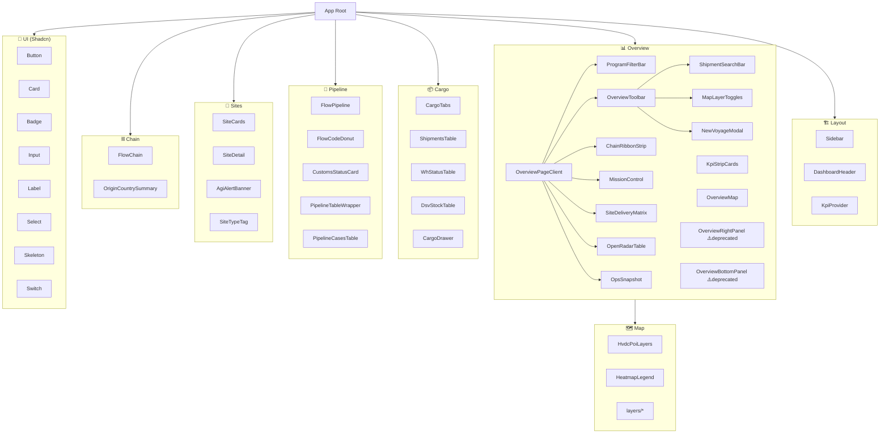

---

## 2. Layout Components

### 2.1 Sidebar

**File:** `components/layout/Sidebar.tsx`

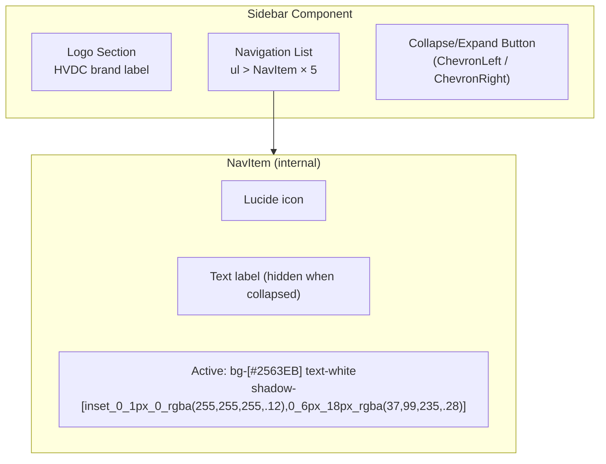

**Props:**

```typescript
// No external props — reads route from usePathname()
// Internal state: collapsed (useState)
```

**Navigation Items:**

| Route | Icon | Label |
|-------|------|-------|
| `/overview` | `Map` | Overview |
| `/chain` | `Network` | 물류 체인 |
| `/pipeline` | `ArrowRightLeft` | Pipeline |
| `/sites` | `Building2` | Sites |
| `/cargo` | `Package` | Cargo |

**Styles (v2.0.0):**

| Element | Class |
|---|---|
| Sidebar background | `bg-[#071225]` |
| Brand label | `text-[18px] font-bold tracking-[-0.02em] text-white` |
| Nav items | `rounded-xl px-4 py-3 text-[15px]` |
| Active item bg | `bg-[#2563EB]` |
| Active item shadow | `shadow-[inset_0_1px_0_rgba(255,255,255,.12),0_6px_18px_rgba(37,99,235,.28)]` |

**Behavior:**
- Toggle collapse: button click (ChevronLeft / ChevronRight)
- Active state: `pathname === item.href || pathname.startsWith(item.href + '/')`
- Collapsed width: `w-14` (56px); Expanded width: `w-48` (192px)
- Icon-only when collapsed; full label visible when expanded

---

### 2.2 DashboardHeader

**File:** `components/layout/DashboardHeader.tsx`

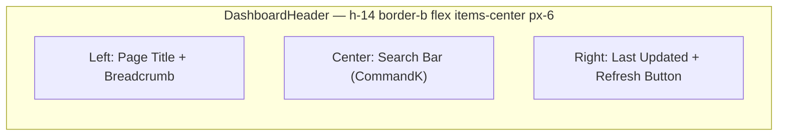

**Props:**

```typescript
interface DashboardHeaderProps {
  title: string
  lastUpdated?: Date
  onRefresh?: () => void
}
```

**Features:**
- Breadcrumb: auto-generated from route path
- Last updated: formatted with `lib/time.ts` → Dubai timezone
- Search: triggers Command Palette (Cmd+K)

---

### 2.3 KpiProvider

**File:** `components/layout/KpiProvider.tsx`

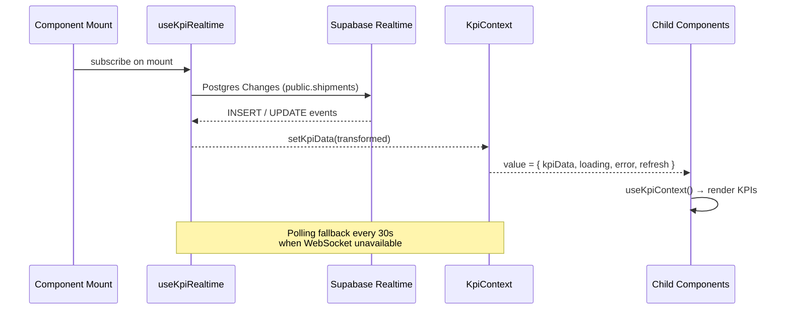

**Context Shape:**

```typescript
interface KpiContextValue {
  kpiData: CasesSummary | null
  loading: boolean
  error: string | null
  refresh: () => void
  lastUpdated: Date | null
}
```

**Realtime subscription:** Uses `useKpiRealtime` hook which subscribes to Supabase Realtime Postgres Changes on the `public.shipments` view. Falls back to polling (`/api/cases/summary`) every 30 seconds when the WebSocket connection is unavailable.

---

## 3. Overview Components

### 3.1 KpiStripCards

**File:** `components/overview/KpiStripCards.tsx`

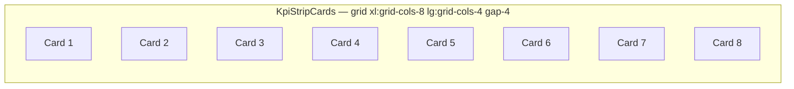

**KPI Card Structure:**

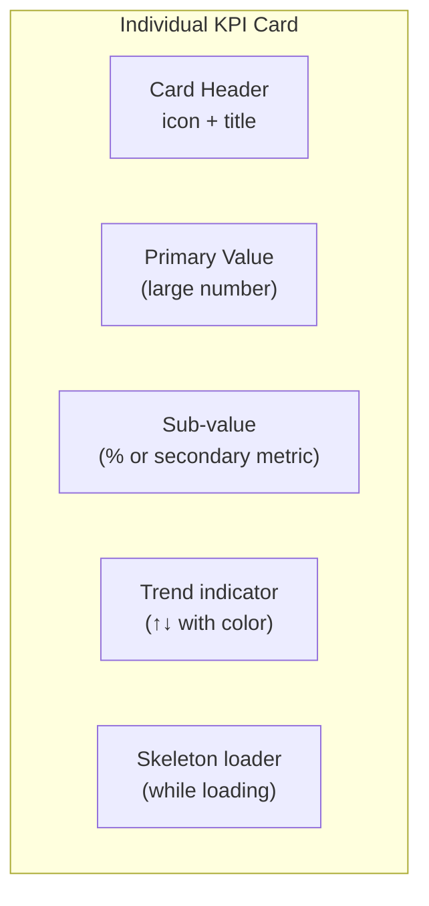

**Props:**

```typescript
interface KpiCardProps {
  title: string
  titleKo: string        // Korean label
  value: number
  subValue?: string      // e.g. "33.3%"
  icon: LucideIcon
  color: 'blue' | 'green' | 'yellow' | 'purple'
  loading?: boolean
}
```

**v2.0.0 changes:**
- Grid updated from `grid-cols-4` to `xl:grid-cols-8 lg:grid-cols-4` — now renders **8 cards**
- `toneClass()` uses `border-t-2` with `border-t-[var(--ops-risk)]` or `border-t-[var(--ops-warn)]` (border-top accent only, no background color fill)
- Hero value: `text-[35px] font-bold leading-none`

**Data Source:** `KpiContext` → `/api/cases/summary`

---

### 3.2 OverviewMap

**File:** `components/overview/OverviewMap.tsx`

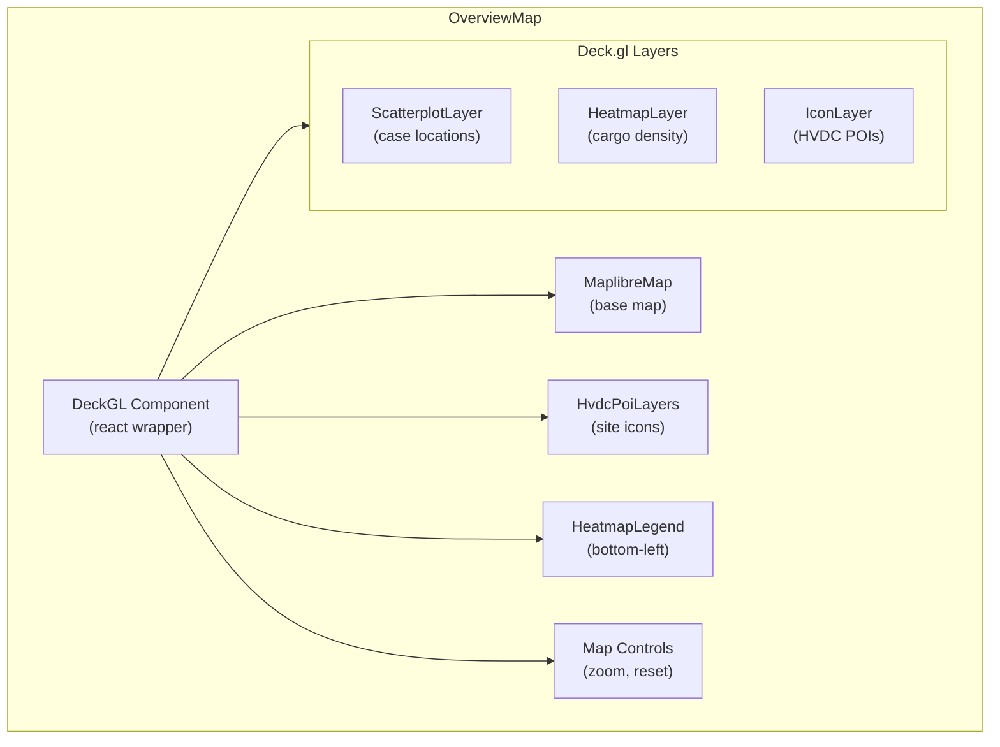

**Map Configuration:**

```typescript
const INITIAL_VIEW_STATE = {
  longitude: 54.37,   // UAE center
  latitude: 24.45,
  zoom: 7,
  pitch: 30,
  bearing: 0,
}

const MAP_STYLE = 'positron-gl-style'  // Grayscale/light tiles (changed in v2.0.0 from dark-matter)
```

> **v2.0.0:** Map style changed from `dark-matter` to `positron-gl-style` (grayscale/light) to match the new light-ops scoped theme on the Overview page.

**POI Sites (UAE):**

| Site | Code | Coordinates | Type |
|------|------|-------------|------|
| Abu Dhabi Grid | AGI | 24.45°N, 54.37°E | Site |
| Dubai Airport Site | DAS | 25.25°N, 55.36°E | Site |
| Mirfa Power Plant | MIR | 23.92°N, 52.78°E | Site |
| Shuweihat Plant | SHU | 24.13°N, 51.87°E | Site |
| Musaffah MOSB | MOSB | 24.33°N, 54.46°E | Hub |

---

### 3.3 OverviewRightPanel

> **@deprecated (v2.0.0)** — This component is no longer rendered in `OverviewPageClient`. It is replaced by `MissionControl` (§3.9). The file is preserved for reference but should not be used in new work.

**File:** `components/overview/OverviewRightPanel.tsx`

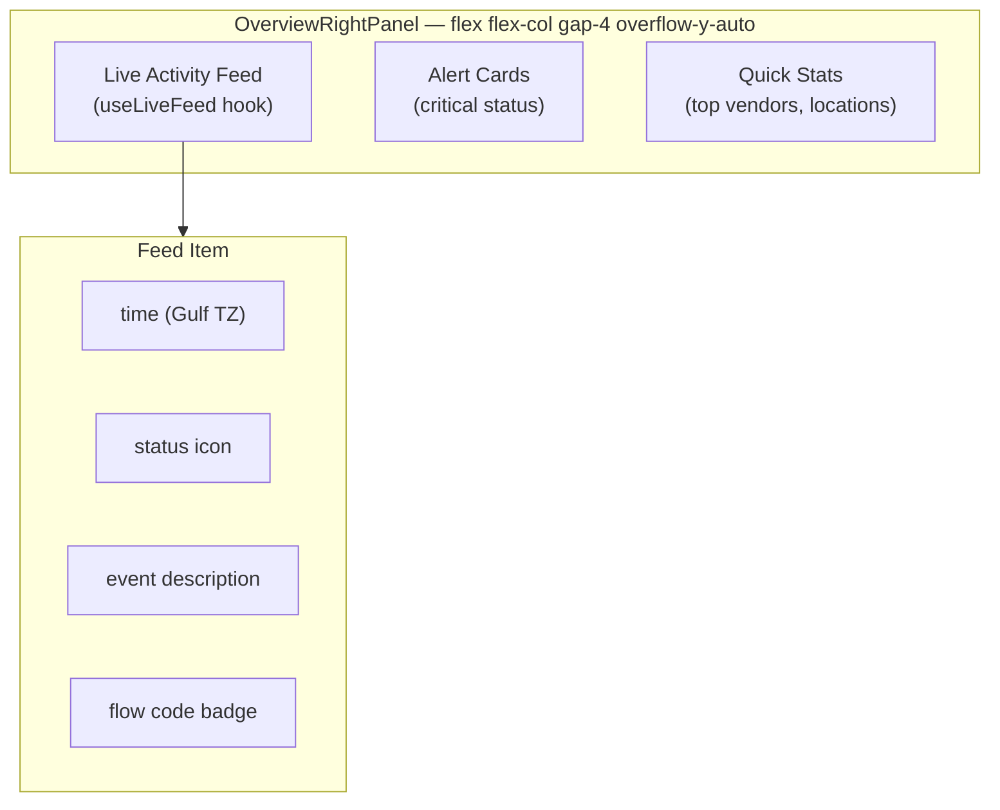

**Updated props (v1.3.0):**

```typescript
interface OverviewRightPanelProps {
  selectedShipmentId?: string | null
  onClearSelection?: () => void
}
```

When `selectedShipmentId` is set, a `ShipmentDetailCard` sub-component is rendered at the top of the panel showing full shipment details. `onClearSelection` is wired to a clear button inside the card.

---

### 3.6 OverviewToolbar System

**Files:**
- `components/overview/OverviewToolbar.tsx`
- `components/overview/ShipmentSearchBar.tsx`
- `components/overview/MapLayerToggles.tsx`
- `components/overview/NewVoyageModal.tsx`
- `lib/search/normalizeShipmentId.ts`

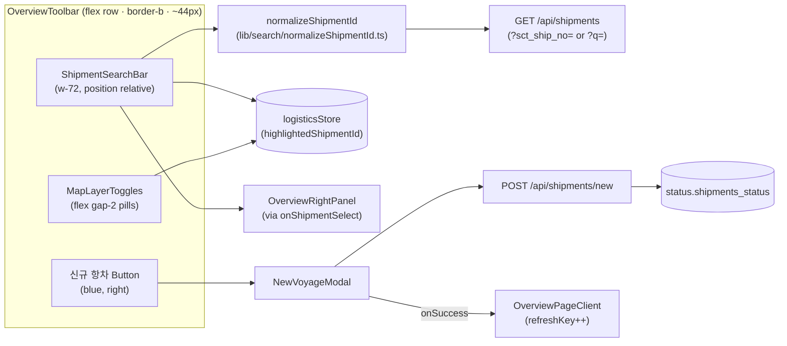

#### Props

**OverviewToolbar**

| Prop | Type | Description |
|------|------|-------------|
| `onShipmentSelect` | `(sctShipNo: string) => void` | Called when user selects a search result |
| `onNewVoyageClick` | `() => void` | Called when 신규 항차 button is clicked |

**ShipmentSearchBar**

| Prop | Type | Description |
|------|------|-------------|
| `onSelect` | `(sctShipNo: string) => void` | Called on result selection; also writes `logisticsStore.setHighlightedShipmentId` |

**MapLayerToggles**

No external props — reads and writes Zustand `logisticsStore` directly.

| Toggle | Store field | Default | Active style |
|--------|-------------|---------|-------------|
| Origin Arc 🌐 | `layerOriginArcs` | `true` | `bg-blue-600/80` |
| 항차 🚢 | `layerTrips` | `true` | `bg-blue-600/80` |
| Heatmap 🔥 | `showHeatmap` | — | `bg-blue-600/80` |

Inactive style: `bg-gray-800`.

**NewVoyageModal**

| Prop | Type | Description |
|------|------|-------------|
| `open` | `boolean` | Controls modal visibility |
| `onClose` | `() => void` | Called on cancel / close |
| `onSuccess` | `() => void` | Called after successful POST; triggers `refreshKey++` in `OverviewPageClient` |

Form fields (8 rows):

| Row | Fields |
|-----|--------|
| 1 | SCT SHIP NO (required) |
| 2 | Vendor |
| 3 | POL / POD |
| 4 | ship_mode / incoterms / MR No |
| 5 | Vessel / BL_AWB |
| 6 | ETD / ATD / ETA / ATA |
| 7 | transit_days / customs_days / inland_days |
| 8 | Site checkboxes: SHU / MIR / DAS / AGI |
| 9 | Description (textarea) |

HTTP: `POST /api/shipments/new`. A `409` response surfaces a "중복" error in the form. On `2xx`, `onSuccess()` and `onClose()` are called.

#### normalizeShipmentId utility

**File:** `lib/search/normalizeShipmentId.ts`

```typescript
function normalizeShipmentId(raw: string): { type: 'exact' | 'ilike'; value: string }
```

| Input pattern | Output type | Output value example |
|---------------|------------|---------------------|
| `hvdc-*` prefix | `exact` | `HVDC-ADOPT-SCT-0012` (uppercased) |
| `sct` + 1–4 digits | `exact` | `sct12` → `HVDC-ADOPT-SCT-0012` (zero-padded to 4) |
| `case` + digits | `ilike` | bare digits only |
| anything else | `ilike` | lowercased raw value |

Tests: `lib/search/__tests__/normalizeShipmentId.test.ts` (7 test cases, Vitest).

#### ShipmentSearchBar dropdown

- 300ms debounce before fetching
- Uses `normalizeShipmentId` to determine `exact` (`?sct_ship_no=`) vs `ilike` (`?q=`) query param
- Dropdown columns: sct_ship_no / vendor / voyage_stage / ETA / 상세 보기 link
- On select: `logisticsStore.setHighlightedShipmentId(result.id)` then `onSelect(sct_ship_no)`
- Click-outside closes dropdown (z-50 on dropdown container)

#### OverviewPageClient state (v1.3.0 additions)

```typescript
const [selectedShipmentId, setSelectedShipmentId] = useState<string | null>(null)
const [showNewVoyageModal, setShowNewVoyageModal]  = useState(false)
const [refreshKey, setRefreshKey]                  = useState(0)
```

`OverviewToolbar` is placed as the **first child** of `OverviewPageClient`, above `KpiStripCards`.

#### logisticsStore new fields (v1.3.0)

| Field | Type | Default | Action |
|-------|------|---------|--------|
| `layerOriginArcs` | `boolean` | `true` | `setLayerOriginArcs(v)` |
| `layerTrips` | `boolean` | `true` | `setLayerTrips(v)` |
| `highlightedShipmentId` | `string \| null` | `null` | `setHighlightedShipmentId(id)` |

#### createTripsLayer highlight behaviour

The 4th optional parameter `highlightId?: string | null` controls per-trip colouring:
- Matching trip: `[255, 255, 255, 220]` (white, high opacity)
- Non-matching trips: 30% alpha
- `updateTriggers.getColor: [highlightId]` ensures the layer re-renders when the highlight changes

---

### 3.7 ProgramFilterBar

**File:** `components/overview/ProgramFilterBar.tsx`

48px bar that sits at the top of the Overview page. Provides a Program/Ops mode toggle and a per-site filter.

**Props:**

| Prop | Type | Description |
|------|------|-------------|
| `mode` | `'program' \| 'ops'` | Current view mode |
| `onModeChange` | `(mode: 'program' \| 'ops') => void` | Mode toggle handler |
| `selectedSite` | `SiteKey \| null` | Currently selected site filter (`SHU`, `MIR`, `DAS`, `AGI`, or `null` for All) |
| `onSiteChange` | `(site: SiteKey \| null) => void` | Site filter change handler |
| `updatedAt` | `string` | ISO timestamp displayed as "last updated" hint |

**i18n:** Uses `useT().programBar.*` keys.

---

### 3.8 ChainRibbonStrip

**File:** `components/overview/ChainRibbonStrip.tsx`

Horizontal 6-node chain ribbon that mirrors the supply chain pipeline stages. Nodes are clickable and cross-link to the Pipeline page via `casesStore`.

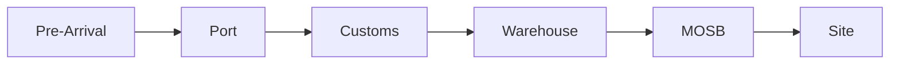

**Props:**

| Prop | Type | Description |
|------|------|-------------|
| `site` | `SiteKey` (optional) | Filter node counts by site |
| `onStageClick` | `(stage: PipelineStage) => void` (optional) | Called on node click; also calls `casesStore.setActivePipelineStage()` |

**Data:** Fetches `GET /api/chain/summary?site=<site>` on mount / when `site` changes.

**Animation:** Ribbon trace CSS animation (600ms) plays on mount and on active-stage change.

**Cross-page link:** Node click calls `casesStore.setActivePipelineStage(stage)` → Pipeline page `PipelineTableWrapper` reacts (see Pattern 7 in §11).

**i18n:** Uses `useT().chainRibbon.*` keys.

---

### 3.9 MissionControl

**File:** `components/overview/MissionControl.tsx`

Right-panel replacement for `OverviewRightPanel`. Rendered in the Overview 7-row layout as the persistent right column. Sections render in this order:

1. `ShipmentDetailCard` — conditional; shown only when `selectedShipmentId` is set
2. Alerts — `border-l-4` alert cards, light-ops styled
3. Route Summary
4. Site Readiness
5. Live Feed

**Props:**

| Prop | Type | Description |
|------|------|-------------|
| `data` | `OverviewData \| null` | Overview data object |
| `loading` | `boolean` | Loading state |
| `worklist` | `WorklistItem[]` | Active worklist items |
| `onNavigate` | `(intent: NavigationIntent) => void` | Navigation handler |
| `selectedShipmentId` | `string \| null` | ID of currently selected shipment; drives ShipmentDetailCard visibility |
| `onClearSelection` | `() => void` | Clears shipment selection (wired to clear button inside ShipmentDetailCard) |

**i18n:** Uses `useT().missionControl.*` keys.

**Store integration:** `logisticsStore.highlightedShipmentId` is kept in sync with `selectedShipmentId`.

---

### 3.10 SiteDeliveryMatrix

**File:** `components/overview/SiteDeliveryMatrix.tsx`

4-card grid displaying per-site delivery metrics for SHU, MIR, DAS, and AGI.

**Card anatomy (per site):**
- Site chip using `SITE_META.chipClass`
- Hero metric: **Assigned** count in `text-[34px]` font size
- Detail rows: delivered / pending / mosb / overdue / risk
- Risk badge with `ring-1` outline

**Layout:** `p-6` padding, subtle shadow on each card.

**Props:**

| Prop | Type | Description |
|------|------|-------------|
| `siteReadiness` | `OverviewSiteReadinessItem[]` | Per-site readiness data from overview API |
| `loading` | `boolean` | Loading state |
| `onNavigate` | `(intent: NavigationIntent) => void` | Navigation handler |

**i18n:** Uses `useT().siteMatrix.*` keys.

---

### 3.11 OpenRadarTable

**File:** `components/overview/OpenRadarTable.tsx`

Worklist table with 4 filter tabs. Supports row selection which drives the `MissionControl` shipment detail view.

**Filter tabs:** All / Critical / Amber / Overdue

**Row styles:**
- Default: `rounded-xl px-4 py-3.5 hover:bg-slate-50`
- Gate badges: colored pills (`bg-red-50 ring-1`)
- Selected row: `border-blue-200 bg-blue-50/40 ring-1 ring-blue-100`

**Scroll:** `max-h-[540px]` with overflow-y-auto.

**Props:**

| Prop | Type | Description |
|------|------|-------------|
| `worklist` | `WorklistItem[]` | Full worklist data |
| `data` | `OverviewData \| null` | Overview data for enrichment |
| `loading` | `boolean` | Loading state |
| `onNavigate` | `(intent: NavigationIntent) => void` | Navigation handler |

**i18n:** Uses `useT().openRadar.*` keys.

---

### 3.12 OpsSnapshot

**File:** `components/overview/OpsSnapshot.tsx`

Operational layer panel. Replaces `OverviewBottomPanel`. Background is `bg-[#F8FAFC]` (cool gray — replaces the warm beige used in v1.x).

**Sub-sections (4):**

| Sub-section | Description |
|---|---|
| WH Pressure | `h-2.5` color-coded horizontal bars per warehouse |
| Worklist | Top 5 open items |
| Exceptions | Exception items requiring attention |
| Recent Feed | Latest activity events |

**Props:**

| Prop | Type | Description |
|------|------|-------------|
| `data` | `OverviewData \| null` | Overview data |
| `worklist` | `WorklistItem[]` | Worklist items |
| `loading` | `boolean` | Loading state |
| `onNavigate` | `(intent: NavigationIntent) => void` | Navigation handler |

**i18n:** Uses `useT().opsSnapshot.*` keys.

---

## 4. Map Components

### 4.1 HvdcPoiLayers

**File:** `components/map/HvdcPoiLayers.tsx`

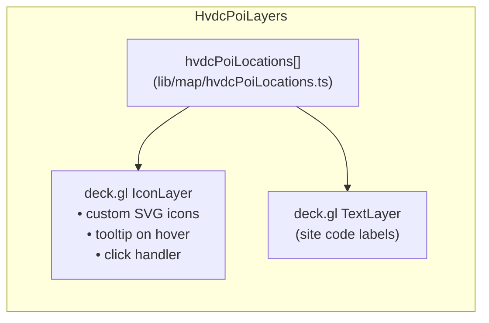

### 4.2 HeatmapLegend

**File:** `components/map/HeatmapLegend.tsx`

Shows color scale for cargo density heatmap (blue → red gradient).

### 4.3 Map Layers

**Directory:** `components/map/layers/`

| Layer File | Deck.gl Layer | Data |
|------------|---------------|------|
| `ScatterLayer` | `ScatterplotLayer` | Case locations with status colors |
| `HeatLayer` | `HeatmapLayer` | Cargo density by location |
| `IconLayer` | `IconLayer` | HVDC site icons |

---

## 5. Cargo Components

### 5.1 CargoTabs

**File:** `components/cargo/CargoTabs.tsx`

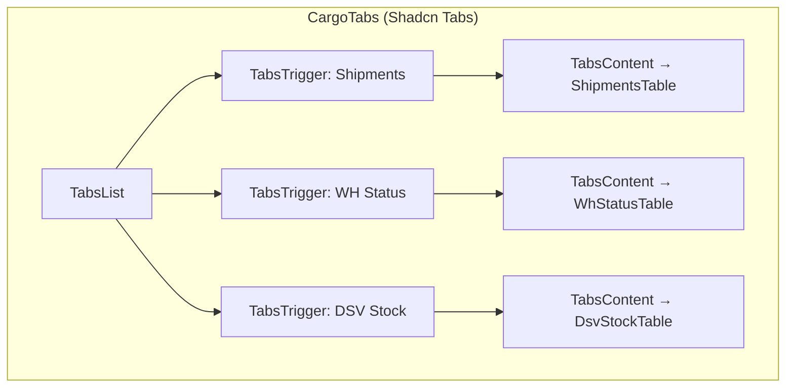

---

### 5.2 ShipmentsTable

**File:** `components/cargo/ShipmentsTable.tsx`

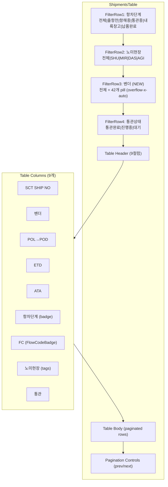

**State:**

```typescript
// 데이터
const [data, setData]   = useState<ShipmentRow[]>([])
const [total, setTotal] = useState(0)
const [page, setPage]   = useState(1)
const [loading, setLoading] = useState(false)

// 벤더 목록 (mount 시 /api/shipments/vendors 에서 fetch)
const [vendors, setVendors] = useState<{ vendor: string; count: number }[]>([])

// 필터
const [filter, setFilter] = useState({
  vendor: 'all',         // /api/shipments?vendor= 파라미터
  pod: 'all',
  customs_status: 'all',
  ship_mode: 'all',
})
const [voyageStage,   setVoyageStage]   = useState<string>('all')
const [nominatedSite, setNominatedSite] = useState<string>('all')
```

**Data Sources:**

| 엔드포인트 | 용도 | 호출 시점 |
|-----------|------|----------|
| `/api/shipments` | 페이지네이션 목록 | 필터/페이지 변경 시 |
| `/api/shipments/vendors` | 벤더 목록 + 건수 (42개) | mount 1회 |

**벤더 필터 동작:**

벤더 pill은 `Hitachi (570)`, `Siemens (66)` 형태로 표시.
선택 시 `filter.vendor`를 업데이트하여 `/api/shipments?vendor=Hitachi` 쿼리 발행.
재클릭 시 `'all'`로 초기화(토글).
42개 벤더가 많으므로 `overflow-x-auto` 가로 스크롤 적용.

---

### 5.3 WhStatusTable

**File:** `components/cargo/WhStatusTable.tsx`

Grid showing warehouse status per location with stock levels and utilization bars.

### 5.4 DsvStockTable

**File:** `components/cargo/DsvStockTable.tsx`

Paginated SKU-level stock table with quantity, unit, and location columns.

### 5.5 CargoDrawer

**File:** `components/cargo/CargoDrawer.tsx`

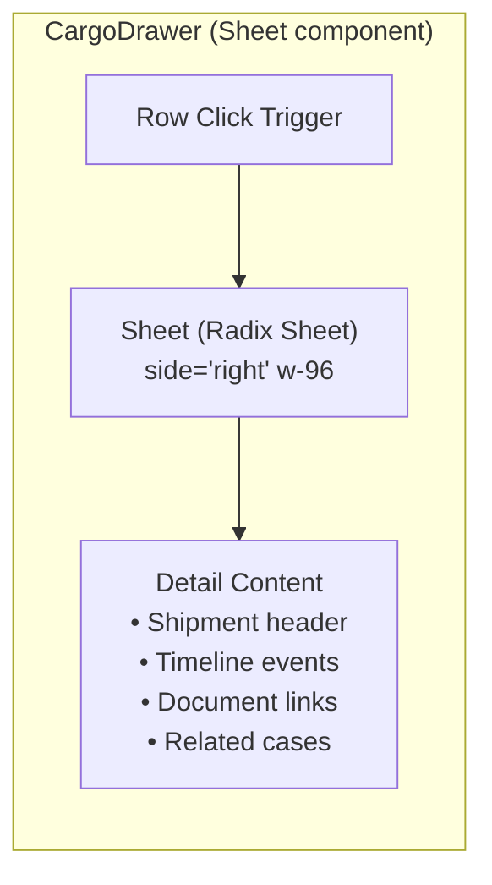

---

## 6. Pipeline Components

### 6.1 FlowPipeline

**File:** `components/pipeline/FlowPipeline.tsx`

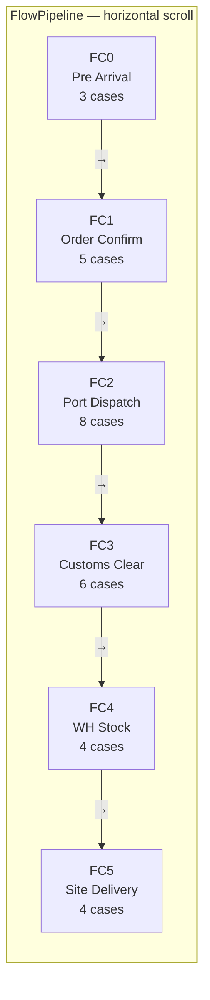

**Flow Code Definitions:**

| Code | Stage | Status Meaning |
|------|-------|----------------|
| 0 | Pre Arrival | Not yet arrived in region |
| 1 | Order Confirmed | PO confirmed, awaiting shipment |
| 2 | Port Dispatch | Departed origin port |
| 3 | Customs Clearance | In UAE customs (MOIAT/FANR) |
| 4 | Warehouse Stock | At MOSB/DAS warehouse |
| 5 | Site Delivery | Delivered to project site |

---

### 6.2 FlowCodeDonut

**File:** `components/pipeline/FlowCodeDonut.tsx`

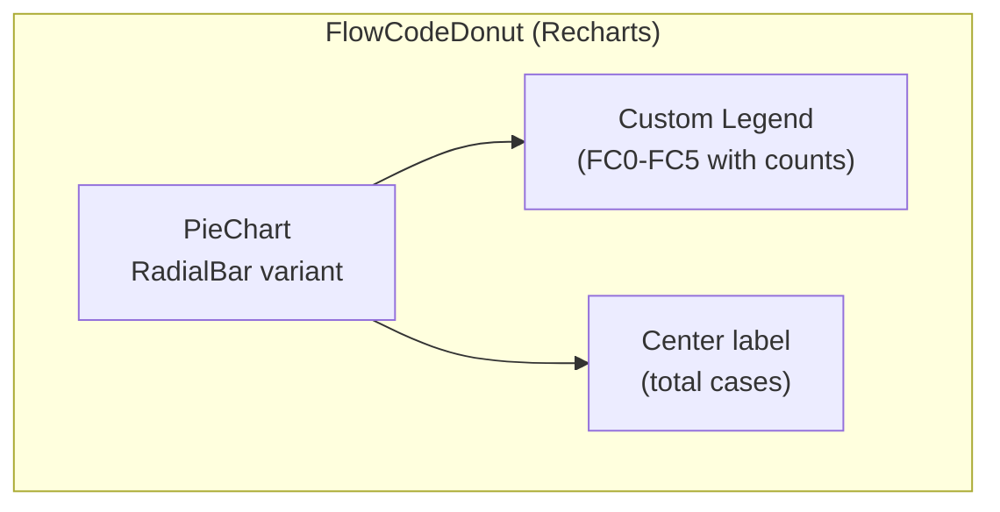

**Data:** Recharts `PieChart` with `Cell` per flow code, color-coded by stage progress.

### 6.3 CustomsStatusCard

**File:** `components/pipeline/CustomsStatusCard.tsx`

Shows UAE customs clearance status: MOIAT permits, FANR approvals, DOT transport permits.

---

### 6.4 PipelineCasesTable

**File:** `components/pipeline/PipelineCasesTable.tsx`

Bottom table on the Pipeline page (and embedded in the Chain page). Fetches case rows for a given pipeline stage independently — does **not** depend on `casesStore` for its data.

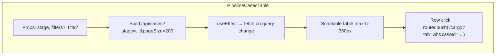

**Props:**

```typescript
interface Props {
  stage: PipelineStage | null   // null = show empty prompt
  filters?: PipelineTableFilters // site / vendor / category
  title?: string
}
```

**Table Columns:**

| # | Column | Source field |
|---|--------|-------------|
| 1 | Case No | `row.case_no` |
| 2 | Site | `row.site` |
| 3 | 현재 위치 | `row.status_location ?? row.status_current` |
| 4 | FC | `row.flow_code` (color badge FC0–FC5) |
| 5 | Storage | `normalizeStorageType(row.storage_type)` |
| 6 | Vendor | `row.source_vendor` |

**Behavior:**
- Fetches `/api/cases?stage=<stage>&pageSize=200` (plus optional filters) independently
- No `casesStore` dependency for data — self-contained fetch
- Row click navigates to `/cargo?tab=wh&caseId=<id>`
- Shows "파이프라인 단계를 선택하면 해당 케이스가 여기에 표시됩니다." when `stage` is null

---

### 6.5 PipelineTableWrapper

**File:** `components/pipeline/PipelineTableWrapper.tsx`

Client wrapper that bridges the Zustand store to `PipelineCasesTable`. Reads `casesStore.activePipelineStage` and manages local filter state.

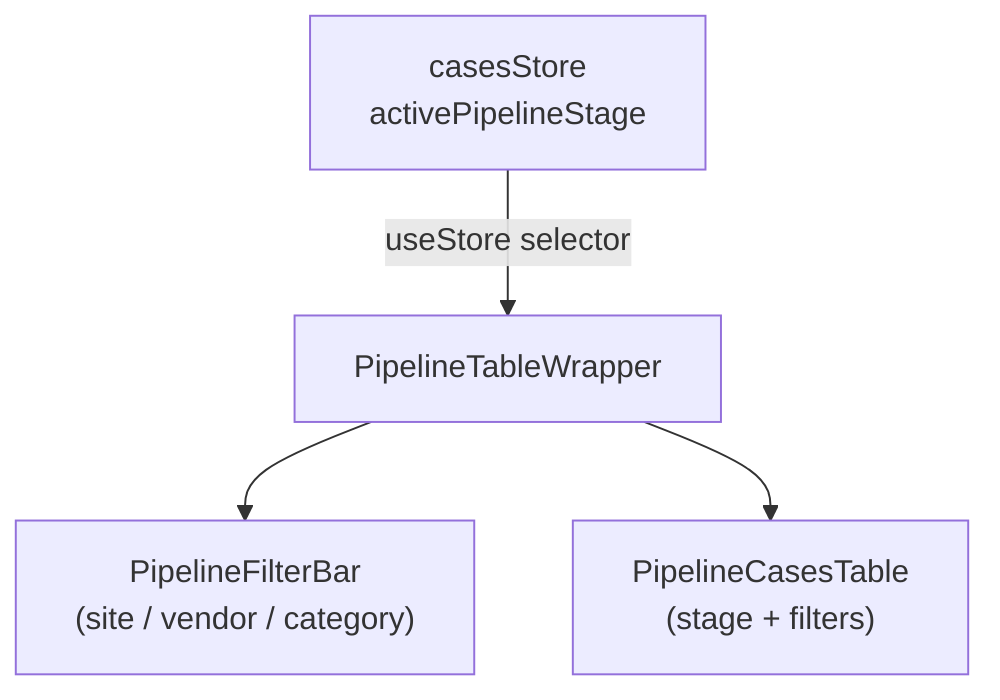

**Behavior:**
- Reads `activePipelineStage` from Zustand `casesStore`
- Owns local `filters` state (`site`, `vendor`, `category`)
- Renders `PipelineFilterBar` + `PipelineCasesTable` in a `space-y-4` stack
- Resets all filters to `'all'` on resetFilters()

---

## 7. Sites Components

### 7.1 SiteCards

**File:** `components/sites/SiteCards.tsx`

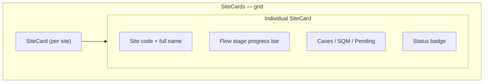

**Props:**

```typescript
interface SiteCardProps {
  siteCode: 'AGI' | 'DAS' | 'MIR' | 'SHU' | 'MOSB'
  siteName: string
  caseCount: number
  arrivedCount: number
  pendingCount: number
  sqm: number
  flowDistribution: Record<number, number>
  onClick: (site: string) => void
}
```

### 7.2 SiteDetail

**File:** `components/sites/SiteDetail.tsx`

Expandable detail panel showing full case list for a selected site.

### 7.3 AgiAlertBanner

**File:** `components/sites/AgiAlertBanner.tsx`

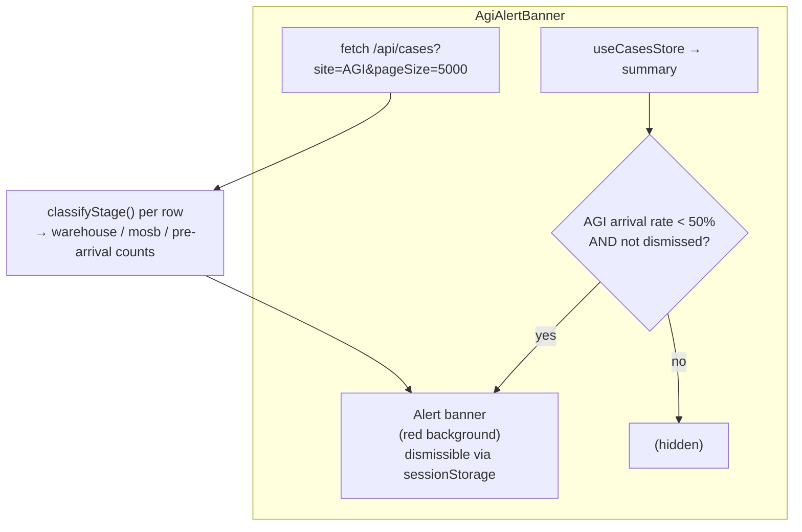

**Trigger condition:** AGI arrival rate (`arrived / total`) is **< 50%** and the user has not dismissed the banner this session.

**Alert message format:**

```
AGI 납품 경보  달성률 XX.X% — 미납 N건 (창고 N건 · MOSB N건 · 선적 전 N건)
```

**Implementation notes:**
- `useEffect` for `sessionStorage` read runs client-side without `typeof window` guard (component is always client-side due to `'use client'`)
- Separately fetches all AGI cases (`/api/cases?site=AGI&pageSize=5000`) to compute stage breakdown using `classifyStage(status_current, status_location)`
- Stage counts: `warehouse`, `mosb`, `pre-arrival` — displayed inline in the alert text
- Dismiss button writes `'true'` to `sessionStorage` key `agi_alert_dismissed` and sets local `dismissed` state

---

### 7.4 SiteTypeTag

**File:** `components/sites/SiteTypeTag.tsx`

Small badge component that visually classifies a site as land-based or island/offshore.

```mermaid
graph LR
    Input["site: string | null | undefined"]
    getSiteKind["getSiteKind(site)<br/>(lib/logistics/normalizers)"]
    Land["kind === 'land'<br/>→ 🏗 육상<br/>(emerald, Building2 icon)"]
    Island["kind === 'island'<br/>→ 🌊 해상 · MOSB<br/>(sky blue, Waves icon)"]
    Unknown["else<br/>→ 미지정<br/>(gray)"]

    Input --> getSiteKind
    getSiteKind --> Land
    getSiteKind --> Island
    getSiteKind --> Unknown
```

**Site classification:**

| Sites | Kind | Badge | Color |
|-------|------|-------|-------|
| SHU, MIR | `land` | 육상 | Emerald green |
| DAS, AGI | `island` | 해상 · MOSB | Sky blue |
| Other / null | — | 미지정 | Gray |

**Props:**

```typescript
interface SiteTypeTagProps {
  site: string | null | undefined
}
```

---

## 8. Chain Components

### 8.1 FlowChain

**File:** `components/chain/FlowChain.tsx`

Full-page supply chain visualization for the `/chain` route. Shows a horizontal 5-node pipeline (원산지 → 항구 → 창고 → MOSB → 현장) with clickable stage nodes that drive the bottom case table.

```mermaid
graph TD
    subgraph FlowChain["FlowChain"]
        Fetch["fetch /api/chain/summary on mount"]
        OriginSummary["OriginCountrySummary<br/>(hidden in compact mode)"]
        subgraph ChainSection["전체 물류 체인 section"]
            NodeGrid["5-node ChainNode grid<br/>(pre-arrival / port / warehouse / mosb / site)"]
            DetailsGrid["Details grid (3 cols)<br/>원산지·항구 현황 / 육상 현장 / 해상 현장"]
        end
        MosbBadge["MOSB 경유 건수 badge<br/>(Flow 3·4)"]
        CasesTable["PipelineCasesTable<br/>stage = selectedStage<br/>(hidden in compact mode)"]
    end

    Fetch --> OriginSummary
    Fetch --> ChainSection
    NodeGrid -->|"click"| CasesTable
```

**Props:**

```typescript
interface FlowChainProps {
  compact?: boolean  // default false
}
```

**When `compact={true}`:** hides `OriginCountrySummary` and `PipelineCasesTable` — shows only the stage node grid and details grid (used when embedding in smaller contexts).

**Data source:** `GET /api/chain/summary` → `ChainSummary` type:

```typescript
interface ChainSummary {
  origins: OriginSummaryRow[]   // origin countries by POL
  ports: { name: string; count: number }[]
  stages: Record<PipelineStage, number>
  sites: {
    land: { SHU: number; MIR: number }
    island: { DAS: number; AGI: number }
  }
  mosbTransit: number           // Flow Code 3 + 4 cases
}
```

**ChainNode (internal component):**

```typescript
interface ChainNodeProps {
  title: string
  subtitle: string
  count: number
  active?: boolean
  onClick?: () => void
}
```

Active node: `border-blue-500 bg-blue-500/10`. Inactive: `border-gray-800 bg-gray-900/80`.

---

### 8.2 OriginCountrySummary

**File:** `components/chain/OriginCountrySummary.tsx`

Horizontal bar chart showing top origin countries by POL (Port of Loading), displayed above the FlowChain pipeline nodes.

```mermaid
graph LR
    Input["origins: OriginSummaryRow[]"]
    Slice["slice(0, 8) — top 8 countries"]
    Bars["Proportional bar chart<br/>max = origins[0].count<br/>cyan fill (bg-cyan-500)"]

    Input --> Slice --> Bars
```

**Props:**

```typescript
interface OriginCountrySummaryProps {
  origins: OriginSummaryRow[]  // from ChainSummary.origins
}
```

**Data shape:**

```typescript
interface OriginSummaryRow {
  country: string
  count: number
}
```

**Behavior:**
- Renders up to 8 origin countries
- Bar width is proportional: `(origin.count / max) * 100%`
- Shows "원산지 데이터가 없습니다." when `origins` is empty
- Label: country name (left), count in 건 (right)

---

## 9. UI Base Components (Shadcn)

**Directory:** `components/ui/`

```mermaid
graph TD
    subgraph Shadcn["Shadcn UI Components"]
        Button["Button<br/>variants: default|outline|ghost|destructive<br/>sizes: sm|default|lg|icon"]
        Card["Card<br/>Card · CardHeader · CardTitle<br/>CardDescription · CardContent · CardFooter"]
        Badge["Badge<br/>variants: default|secondary|outline|destructive"]
        Input["Input<br/>controlled text input"]
        Label["Label<br/>htmlFor association"]
        Select["Select<br/>Select · SelectTrigger · SelectContent<br/>SelectItem · SelectValue"]
        Skeleton["Skeleton<br/>loading placeholder animation"]
        Switch["Switch<br/>toggle boolean"]
    end
```

### Button Variants

```typescript
// Usage
<Button variant="outline" size="sm">Filter</Button>
<Button variant="ghost" size="icon"><RefreshCw className="h-4 w-4" /></Button>
```

### Card Anatomy

```typescript
<Card>
  <CardHeader>
    <CardTitle>KPI Title</CardTitle>
    <CardDescription>subtitle</CardDescription>
  </CardHeader>
  <CardContent>
    <p className="text-2xl font-bold">30</p>
  </CardContent>
  <CardFooter>
    <p className="text-muted-foreground text-sm">+5 this week</p>
  </CardFooter>
</Card>
```

### Badge Color Mapping

| Status | Variant | Color |
|--------|---------|-------|
| `site` | `default` | Blue |
| `warehouse` | `secondary` | Purple |
| `Pre Arrival` | `outline` | Gray |
| `customs` | `destructive` | Amber |
| Flow Code 5 | `default` | Green |

---

## 10. Custom Hooks

```mermaid
graph TD
    subgraph Hooks["Custom Hooks — hooks/"]
        H1["useSupabaseRealtime<br/>WebSocket subscription<br/>with auto-reconnect"]
        H2["useKpiRealtime<br/>KPI-specific realtime<br/>= useSupabaseRealtime + KPI transform<br/>subscribes to public.shipments"]
        H3["useKpiRealtimeWithFallback<br/>= useKpiRealtime + polling fallback"]
        H4["useLiveFeed<br/>Activity event stream<br/>(last 50 events)"]
        H5["useInitialDataLoad<br/>Parallel Promise.all() fetch<br/>on component mount"]
        H6["useBatchUpdates<br/>Debounce rapid updates<br/>(300ms window)"]
        H7["useMultiTabSync<br/>BroadcastChannel<br/>cross-tab KPI sync"]
    end

    H1 --> H2
    H2 --> H3
```

### useSupabaseRealtime

```typescript
function useSupabaseRealtime<T>(options: {
  table: string
  event: 'INSERT' | 'UPDATE' | 'DELETE' | '*'
  filter?: string
  onData: (payload: RealtimePayload<T>) => void
  onError?: (error: Error) => void
}): {
  status: 'DISCONNECTED' | 'CONNECTING' | 'CONNECTED' | 'ERROR'
  reconnectCount: number
}
```

**Reconnection Strategy:**
```
Attempt 1: 1s delay
Attempt 2: 2s delay
Attempt 3: 4s delay
Attempt 4: 8s delay
Attempt 5: 16s delay
Attempt 6+: 30s delay (max)
```

### useKpiRealtime

Subscribes to Supabase Realtime Postgres Changes on the `public.shipments` view. Transforms row-level change events into KPI summary updates and updates `KpiContext`. Used by `KpiProvider`.

### useInitialDataLoad

```typescript
function useInitialDataLoad(): {
  cases: CaseRow[]
  summary: CasesSummary | null
  stock: StockRow[]
  loading: boolean
  error: string | null
}

// Internally uses:
// Promise.all([
//   fetch('/api/cases/summary'),
//   fetch('/api/cases'),
//   fetch('/api/stock'),
// ])
```

### useBatchUpdates

```typescript
function useBatchUpdates<T>(
  items: T[],
  delay: number = 300
): T[]

// Prevents UI thrashing during rapid realtime updates
// Buffers updates and applies them in a single render cycle
```

### useOverviewData

```typescript
function useOverviewData(options?: { refreshKey?: number }): {
  data: OverviewData | null
  loading: boolean
  error: string | null
}
```

Fetches `GET /api/overview` and returns parsed overview data for the Overview page. Contains three `useEffect`s:

1. Initial fetch on mount
2. Re-fetch when filter/query parameters change
3. Re-fetch when `options.refreshKey` changes — used by `OverviewPageClient` to trigger a data reload after a new voyage is submitted via `NewVoyageModal`

**Usage in OverviewPageClient (v1.3.0):**

```typescript
const [refreshKey, setRefreshKey] = useState(0)
const { data, loading } = useOverviewData({ refreshKey })

// After NewVoyageModal onSuccess:
// setRefreshKey(k => k + 1)  →  triggers the third useEffect
```

---

## 11. Component Communication Patterns

### Pattern 1: Context Provider (KPI data)

```mermaid
graph TD
    KpiProvider["KpiProvider (app/(dashboard)/layout)"]
    KpiContext["React.createContext()"]
    KpiStrip["KpiStripCards"]
    RightPanel["OverviewRightPanel"]
    Map["OverviewMap"]

    KpiProvider -->|"provides"| KpiContext
    KpiContext -->|"useContext()"| KpiStrip
    KpiContext -->|"useContext()"| RightPanel
    KpiContext -->|"useContext()"| Map
```

### Pattern 2: Zustand Store (global state)

```mermaid
graph LR
    Realtime["useSupabaseRealtime<br/>(hook)"]
    Store["logisticsStore<br/>(Zustand)"]
    Components["Components<br/>(useStore)"]

    Realtime -->|"store.upsertCase()"| Store
    Store -->|"selector subscription"| Components
    Note["Only components that<br/>subscribed to changed<br/>slice re-render"]
    Store -.-> Note
```

### Pattern 3: Prop Drilling (local state)

```mermaid
graph TD
    CargoPage["CargoPage (page.tsx)"]
    CargoTabs["CargoTabs<br/>(selectedRow, onRowClick)"]
    ShipmentsTable["ShipmentsTable<br/>(onRowClick prop)"]
    CargoDrawer["CargoDrawer<br/>(open, selectedRow)"]

    CargoPage -->|"selectedRow state"| CargoTabs
    CargoTabs -->|"onRowClick"| ShipmentsTable
    ShipmentsTable -->|"triggers setSelectedRow"| CargoPage
    CargoPage -->|"selectedRow prop"| CargoDrawer
```

### Pattern 4: URL State (filters)

```mermaid
graph LR
    FilterBar["Filter Controls<br/>(UI input)"]
    URL["URL Params<br/>?site=AGI&flow_code=3"]
    APIRoute["API Route<br/>reads searchParams"]
    Table["Data Table<br/>(re-renders on URL change)"]

    FilterBar -->|"router.push()"| URL
    URL -->|"useSearchParams()"| APIRoute
    APIRoute -->|"filtered response"| Table
```

### Pattern 5: Event Bridge (cross-page)

```mermaid
sequenceDiagram
    participant Map as OverviewMap
    participant Store as Zustand Store
    participant Pipeline as PipelinePage

    Map->>Store: store.setSelectedSite('AGI')
    Note over Store: selectedSite = 'AGI'
    Pipeline->>Store: useStore(s => s.selectedSite)
    Store-->>Pipeline: 'AGI'
    Pipeline->>Pipeline: filter pipeline by site
```

### Pattern 6: Self-contained Fetch (PipelineCasesTable)

```mermaid
graph LR
    Wrapper["PipelineTableWrapper<br/>(reads casesStore.activePipelineStage)"]
    Table["PipelineCasesTable<br/>(stage prop)"]
    API["GET /api/cases?stage=..."]

    Wrapper -->|"stage prop"| Table
    Table -->|"independent fetch"| API
    API -->|"rows"| Table
```

`PipelineCasesTable` fetches its own data directly via `/api/cases` and does not rely on `casesStore` for case row data. This makes it reusable across both the Pipeline page and the Chain page.

### Pattern 7: Cross-page Store Integration (ChainRibbonStrip → Pipeline)

```mermaid
sequenceDiagram
    participant Ribbon as ChainRibbonStrip (Overview)
    participant Store as casesStore (Zustand)
    participant Wrapper as PipelineTableWrapper (Pipeline)
    participant Table as PipelineCasesTable

    Ribbon->>Store: casesStore.setActivePipelineStage(stage)
    Note over Store: activePipelineStage = stage
    Wrapper->>Store: useStore(s => s.activePipelineStage)
    Store-->>Wrapper: stage
    Wrapper->>Table: stage prop
    Table->>Table: fetch /api/cases?stage=...
```

Clicking a node in `ChainRibbonStrip` on the Overview page writes `activePipelineStage` to `casesStore`. When the user navigates to the Pipeline page, `PipelineTableWrapper` reads that store value and pre-selects the same stage, showing the relevant cases immediately — no URL parameter passing required.

### Note: `uiTokens` export in `lib/overview/ui.ts`

`lib/overview/ui.ts` exports a `uiTokens` constant that centralises shared design-token values used across all Overview 2.0 components:

```typescript
export const uiTokens = {
  // used by KpiStripCards toneClass(), OpsSnapshot bars, MissionControl alert cards, etc.
}
```

Import from any Overview component to avoid hard-coding one-off colour strings and ensure consistency with the `[data-theme="light-ops"]` CSS variable set.

---

## Component Design Principles

```mermaid
mindmap
  root((Component Design))
    Composition
      Small focused components
      Compound component pattern
      Render prop where needed
    Performance
      React.memo for pure display
      useCallback for handlers
      useMemo for derived data
      Skeleton placeholders
    Accessibility
      Shadcn Radix primitives
      ARIA labels on icons
      Keyboard navigation
      Focus management
    Type Safety
      Props strictly typed
      No 'any' in components
      Discriminated unions
      Generic components
    Error Handling
      Error boundaries per section
      Graceful degradation
      Mock fallback data
      Toast notifications
```
