# Component Documentation — HVDC Logistics Dashboard

> **Version:** 1.0.0 | **Last Updated:** 2026-03-13
> **Component Count:** 37 custom components + Shadcn UI base

---

## Table of Contents

1. [Component Tree](#1-component-tree)
2. [Layout Components](#2-layout-components)
3. [Overview Components](#3-overview-components)
4. [Map Components](#4-map-components)
5. [Cargo Components](#5-cargo-components)
6. [Pipeline Components](#6-pipeline-components)
7. [Sites Components](#7-sites-components)
8. [UI Base Components (Shadcn)](#8-ui-base-components-shadcn)
9. [Custom Hooks](#9-custom-hooks)
10. [Component Communication Patterns](#10-component-communication-patterns)

---

## 1. Component Tree

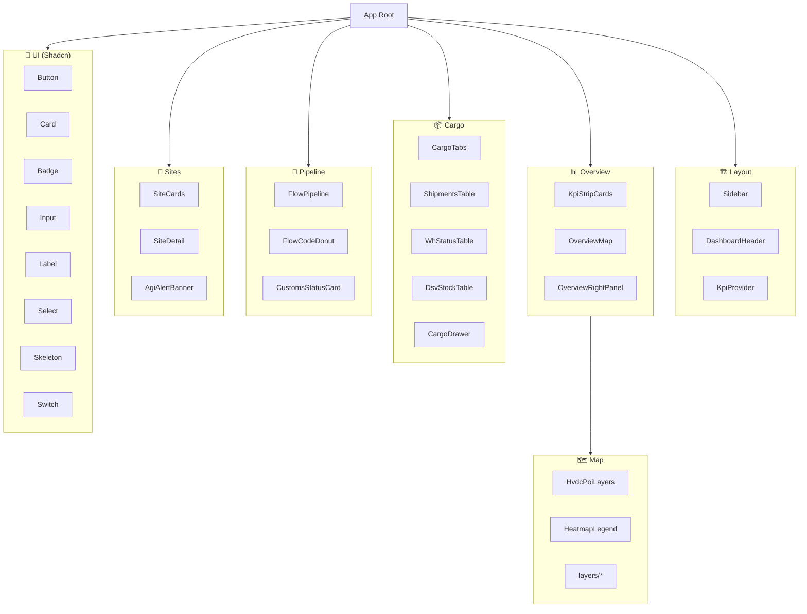

---

## 2. Layout Components

### 2.1 Sidebar

**File:** `components/layout/Sidebar.tsx`

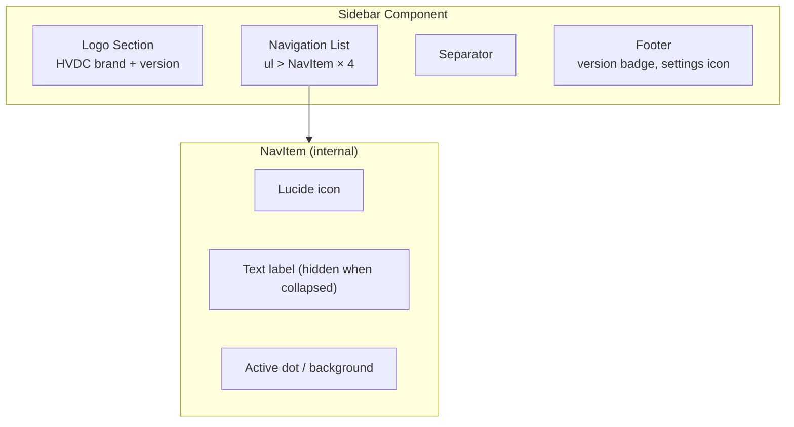

**Props:**

```typescript
// No external props — reads route from usePathname()
// Internal state: isCollapsed (useState)
```

**Navigation Items:**

| Route | Icon | Label |
|-------|------|-------|
| `/overview` | `LayoutDashboard` | Overview |
| `/cargo` | `Package` | Cargo |
| `/pipeline` | `GitBranch` | Pipeline |
| `/sites` | `MapPin` | Sites |

**Behavior:**
- Toggle collapse: `Cmd+B` keyboard shortcut
- Active state: `pathname.startsWith(item.href)`
- Tooltip on collapsed: Shows full label on hover

---

### 2.2 DashboardHeader

**File:** `components/layout/DashboardHeader.tsx`

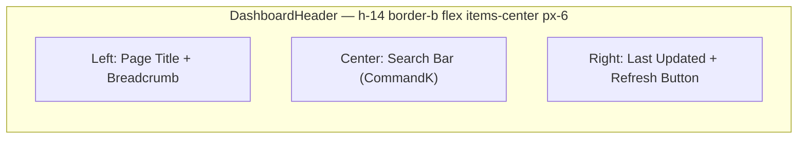

**Props:**

```typescript
interface DashboardHeaderProps {
  title: string
  lastUpdated?: Date
  onRefresh?: () => void
}
```

**Features:**
- Breadcrumb: auto-generated from route path
- Last updated: formatted with `lib/time.ts` → Dubai timezone
- Search: triggers Command Palette (Cmd+K)

---

### 2.3 KpiProvider

**File:** `components/layout/KpiProvider.tsx`

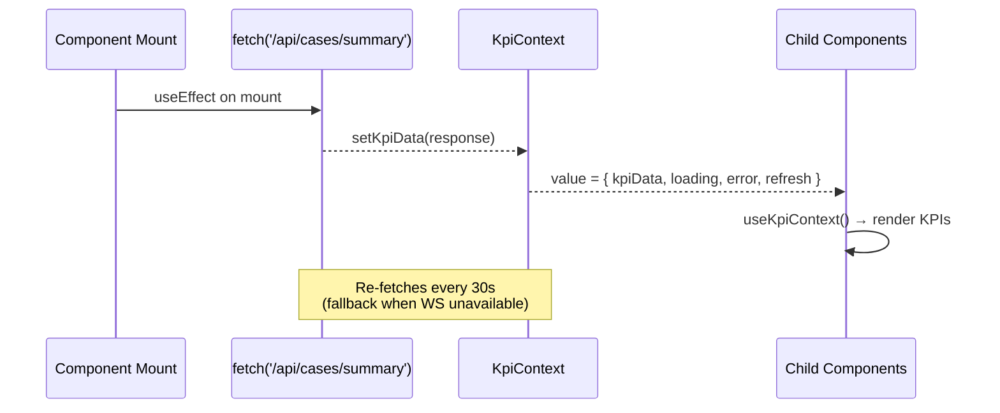

**Context Shape:**

```typescript
interface KpiContextValue {
  kpiData: CasesSummary | null
  loading: boolean
  error: string | null
  refresh: () => void
  lastUpdated: Date | null
}
```

---

## 3. Overview Components

### 3.1 KpiStripCards

**File:** `components/overview/KpiStripCards.tsx`

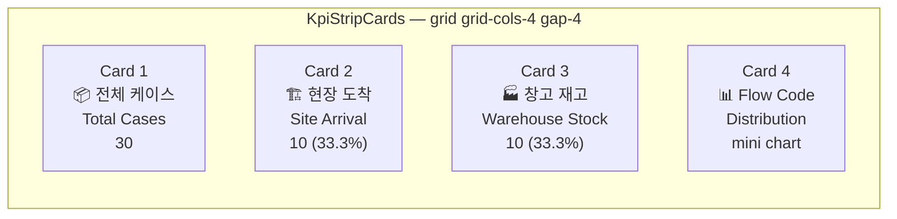

**KPI Card Structure:**

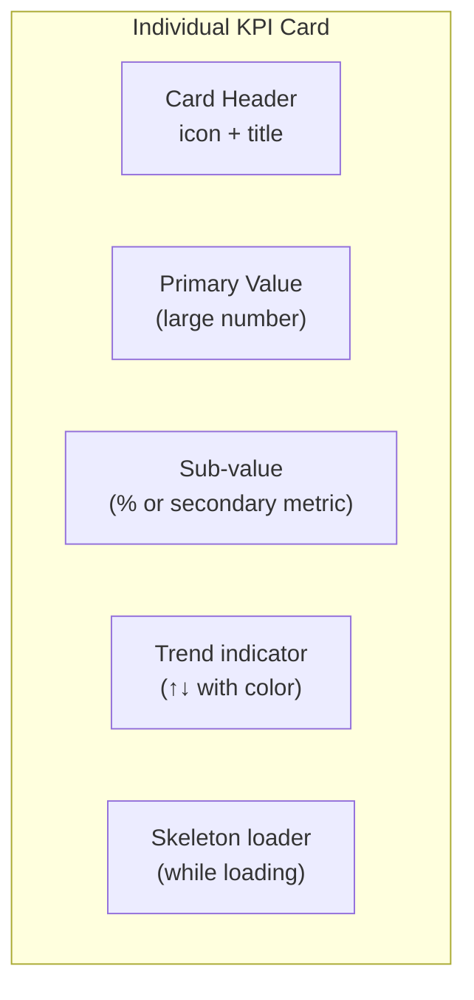

**Props:**

```typescript
interface KpiCardProps {
  title: string
  titleKo: string        // Korean label
  value: number
  subValue?: string      // e.g. "33.3%"
  icon: LucideIcon
  color: 'blue' | 'green' | 'yellow' | 'purple'
  loading?: boolean
}
```

**Data Source:** `KpiContext` → `/api/cases/summary`

---

### 3.2 OverviewMap

**File:** `components/overview/OverviewMap.tsx`

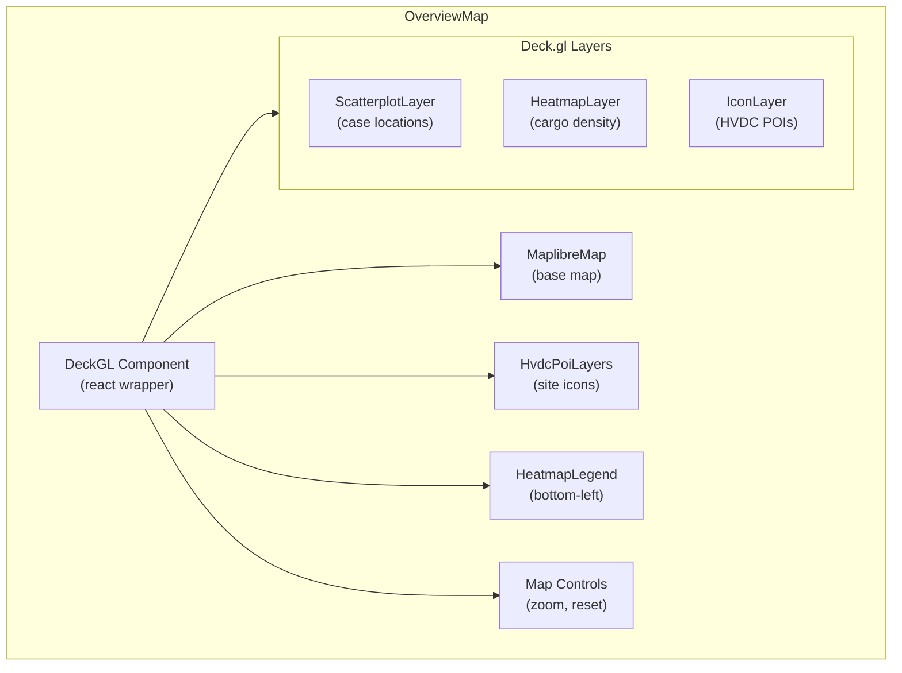

**Map Configuration:**

```typescript
const INITIAL_VIEW_STATE = {
  longitude: 54.37,   // UAE center
  latitude: 24.45,
  zoom: 7,
  pitch: 30,
  bearing: 0,
}

const MAP_STYLE = 'https://tiles.protomaps.com/...'  // Dark tiles
```

**POI Sites (UAE):**

| Site | Code | Coordinates | Type |
|------|------|-------------|------|
| Abu Dhabi Grid | AGI | 24.45°N, 54.37°E | Site |
| Dubai Airport Site | DAS | 25.25°N, 55.36°E | Site |
| Mirfa Power Plant | MIR | 23.92°N, 52.78°E | Site |
| Shuweihat Plant | SHU | 24.13°N, 51.87°E | Site |
| Musaffah MOSB | MOSB | 24.33°N, 54.46°E | Hub |

---

### 3.3 OverviewRightPanel

**File:** `components/overview/OverviewRightPanel.tsx`

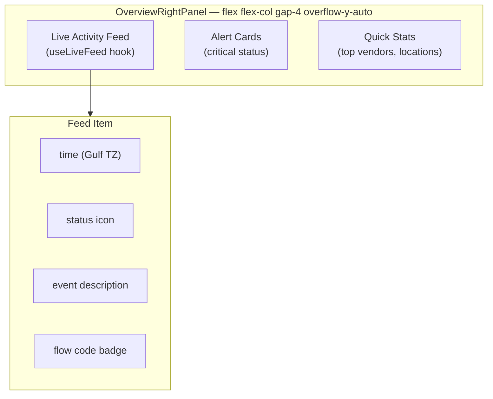

---

## 4. Map Components

### 4.1 HvdcPoiLayers

**File:** `components/map/HvdcPoiLayers.tsx`

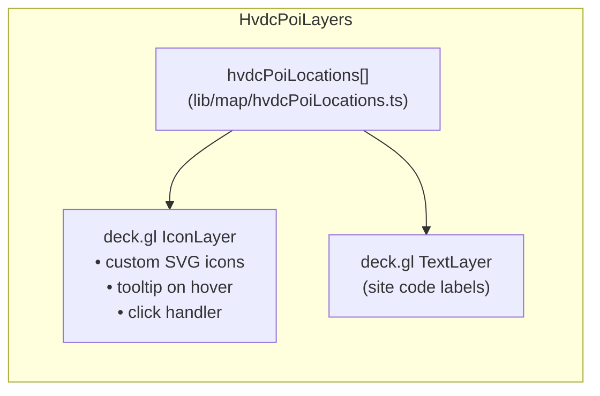

### 4.2 HeatmapLegend

**File:** `components/map/HeatmapLegend.tsx`

Shows color scale for cargo density heatmap (blue → red gradient).

### 4.3 Map Layers

**Directory:** `components/map/layers/`

| Layer File | Deck.gl Layer | Data |
|------------|---------------|------|
| `ScatterLayer` | `ScatterplotLayer` | Case locations with status colors |
| `HeatLayer` | `HeatmapLayer` | Cargo density by location |
| `IconLayer` | `IconLayer` | HVDC site icons |

---

## 5. Cargo Components

### 5.1 CargoTabs

**File:** `components/cargo/CargoTabs.tsx`

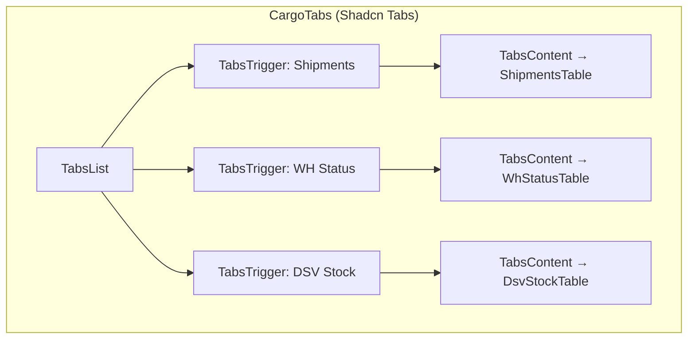

---

### 5.2 ShipmentsTable

**File:** `components/cargo/ShipmentsTable.tsx`

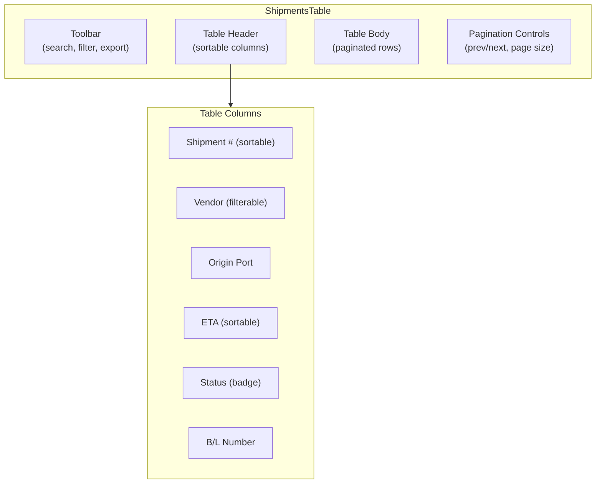

**Props:**

```typescript
interface ShipmentsTableProps {
  onRowClick?: (shipment: ShipmentRow) => void
}
```

**Data Source:** `/api/shipments` (paginated)

---

### 5.3 WhStatusTable

**File:** `components/cargo/WhStatusTable.tsx`

Grid showing warehouse status per location with stock levels and utilization bars.

### 5.4 DsvStockTable

**File:** `components/cargo/DsvStockTable.tsx`

Paginated SKU-level stock table with quantity, unit, and location columns.

### 5.5 CargoDrawer

**File:** `components/cargo/CargoDrawer.tsx`

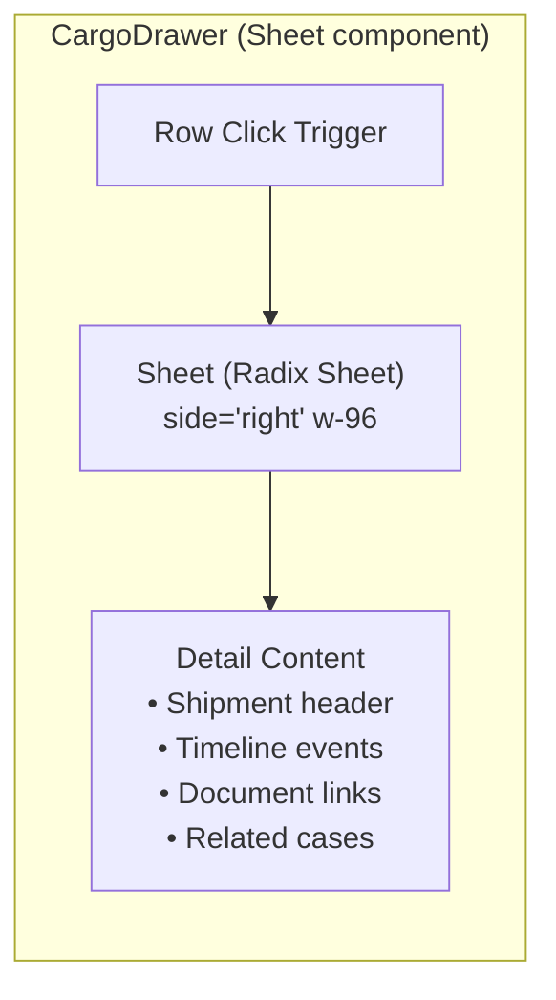

---

## 6. Pipeline Components

### 6.1 FlowPipeline

**File:** `components/pipeline/FlowPipeline.tsx`

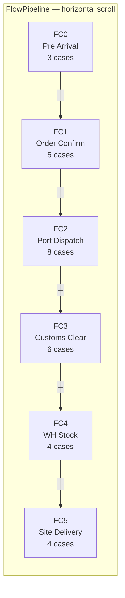

**Flow Code Definitions:**

| Code | Stage | Status Meaning |
|------|-------|----------------|
| 0 | Pre Arrival | Not yet arrived in region |
| 1 | Order Confirmed | PO confirmed, awaiting shipment |
| 2 | Port Dispatch | Departed origin port |
| 3 | Customs Clearance | In UAE customs (MOIAT/FANR) |
| 4 | Warehouse Stock | At MOSB/DAS warehouse |
| 5 | Site Delivery | Delivered to project site |

---

### 6.2 FlowCodeDonut

**File:** `components/pipeline/FlowCodeDonut.tsx`

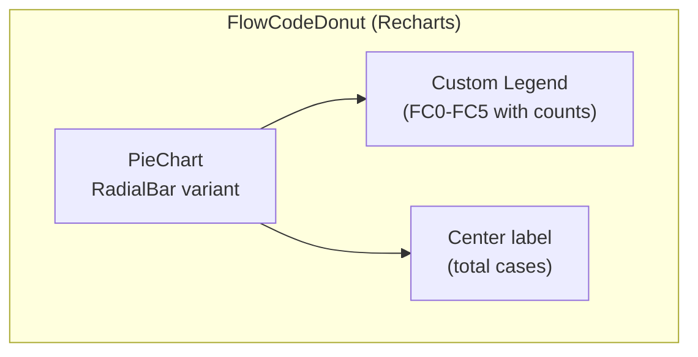

**Data:** Recharts `PieChart` with `Cell` per flow code, color-coded by stage progress.

### 6.3 CustomsStatusCard

**File:** `components/pipeline/CustomsStatusCard.tsx`

Shows UAE customs clearance status: MOIAT permits, FANR approvals, DOT transport permits.

---

## 7. Sites Components

### 7.1 SiteCards

**File:** `components/sites/SiteCards.tsx`

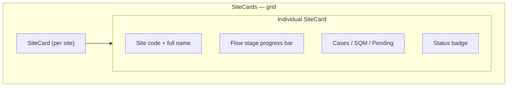

**Props:**

```typescript
interface SiteCardProps {
  siteCode: 'AGI' | 'DAS' | 'MIR' | 'SHU' | 'MOSB'
  siteName: string
  caseCount: number
  arrivedCount: number
  pendingCount: number
  sqm: number
  flowDistribution: Record<number, number>
  onClick: (site: string) => void
}
```

### 7.2 SiteDetail

**File:** `components/sites/SiteDetail.tsx`

Expandable detail panel showing full case list for a selected site.

### 7.3 AgiAlertBanner

**File:** `components/sites/AgiAlertBanner.tsx`

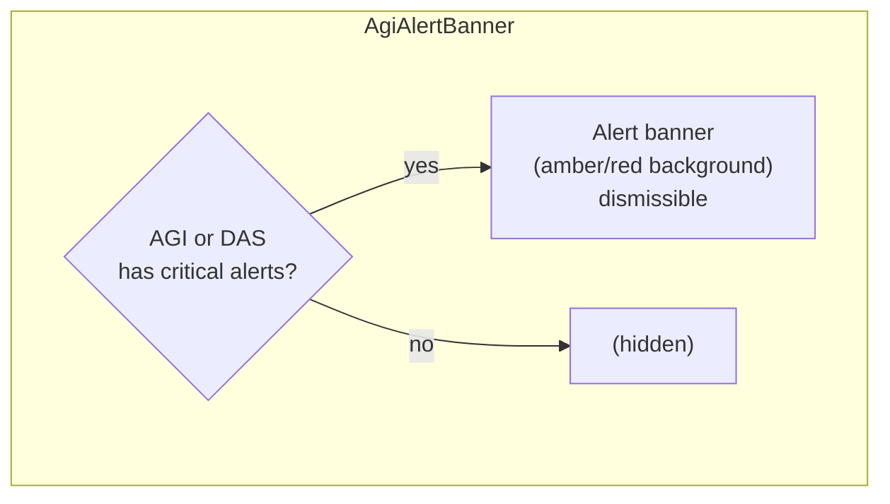

Displays when AGI or DAS sites have Flow Code ≥ 3 items overdue (FANR/MOIAT regulation compliance).

---

## 8. UI Base Components (Shadcn)

**Directory:** `components/ui/`

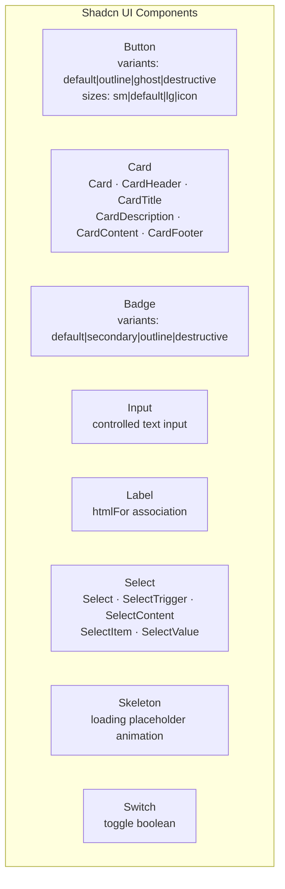

### Button Variants

```typescript
// Usage
<Button variant="outline" size="sm">Filter</Button>
<Button variant="ghost" size="icon"><RefreshCw className="h-4 w-4" /></Button>
```

### Card Anatomy

```typescript
<Card>
  <CardHeader>
    <CardTitle>KPI Title</CardTitle>
    <CardDescription>subtitle</CardDescription>
  </CardHeader>
  <CardContent>
    <p className="text-2xl font-bold">30</p>
  </CardContent>
  <CardFooter>
    <p className="text-muted-foreground text-sm">+5 this week</p>
  </CardFooter>
</Card>
```

### Badge Color Mapping

| Status | Variant | Color |
|--------|---------|-------|
| `site` | `default` | Blue |
| `warehouse` | `secondary` | Purple |
| `Pre Arrival` | `outline` | Gray |
| `customs` | `destructive` | Amber |
| Flow Code 5 | `default` | Green |

---

## 9. Custom Hooks

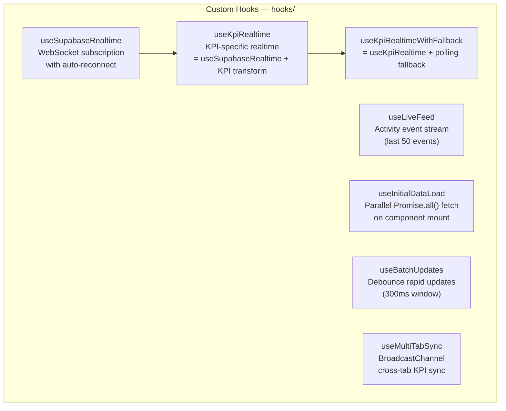

### useSupabaseRealtime

```typescript
function useSupabaseRealtime<T>(options: {
  table: string
  event: 'INSERT' | 'UPDATE' | 'DELETE' | '*'
  filter?: string
  onData: (payload: RealtimePayload<T>) => void
  onError?: (error: Error) => void
}): {
  status: 'DISCONNECTED' | 'CONNECTING' | 'CONNECTED' | 'ERROR'
  reconnectCount: number
}
```

**Reconnection Strategy:**
```
Attempt 1: 1s delay
Attempt 2: 2s delay
Attempt 3: 4s delay
Attempt 4: 8s delay
Attempt 5: 16s delay
Attempt 6+: 30s delay (max)
```

### useInitialDataLoad

```typescript
function useInitialDataLoad(): {
  cases: CaseRow[]
  summary: CasesSummary | null
  stock: StockRow[]
  loading: boolean
  error: string | null
}

// Internally uses:
// Promise.all([
//   fetch('/api/cases/summary'),
//   fetch('/api/cases'),
//   fetch('/api/stock'),
// ])
```

### useBatchUpdates

```typescript
function useBatchUpdates<T>(
  items: T[],
  delay: number = 300
): T[]

// Prevents UI thrashing during rapid realtime updates
// Buffers updates and applies them in a single render cycle
```

---

## 10. Component Communication Patterns

### Pattern 1: Context Provider (KPI data)

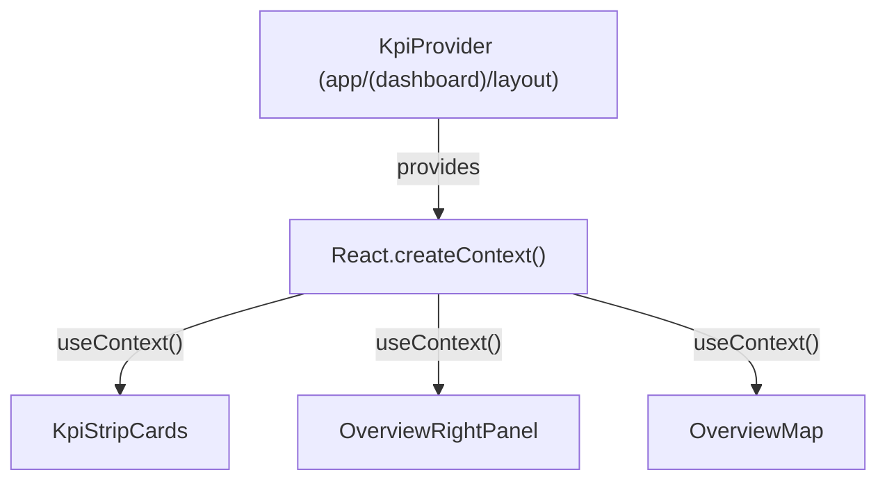

### Pattern 2: Zustand Store (global state)

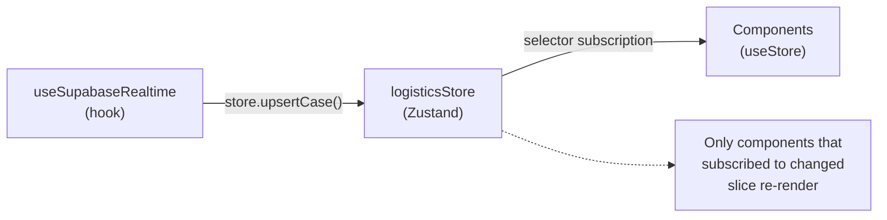

### Pattern 3: Prop Drilling (local state)

```mermaid
graph TD
    CargoPage["CargoPage (page.tsx)"]
    CargoTabs["CargoTabs<br/>(selectedRow, onRowClick)"]
    ShipmentsTable["ShipmentsTable<br/>(onRowClick prop)"]
    CargoDrawer["CargoDrawer<br/>(open, selectedRow)"]

    CargoPage -->|"selectedRow state"| CargoTabs
    CargoTabs -->|"onRowClick"| ShipmentsTable
    ShipmentsTable -->|"triggers setSelectedRow"| CargoPage
    CargoPage -->|"selectedRow prop"| CargoDrawer
```

### Pattern 4: URL State (filters)

```mermaid
graph LR
    FilterBar["Filter Controls<br/>(UI input)"]
    URL["URL Params<br/>?site=AGI&flow_code=3"]
    APIRoute["API Route<br/>reads searchParams"]
    Table["Data Table<br/>(re-renders on URL change)"]

    FilterBar -->|"router.push()"| URL
    URL -->|"useSearchParams()"| APIRoute
    APIRoute -->|"filtered response"| Table
```

### Pattern 5: Event Bridge (cross-page)

```mermaid
sequenceDiagram
    participant Map as OverviewMap
    participant Store as Zustand Store
    participant Pipeline as PipelinePage

    Map->>Store: store.setSelectedSite('AGI')
    Note over Store: selectedSite = 'AGI'
    Pipeline->>Store: useStore(s => s.selectedSite)
    Store-->>Pipeline: 'AGI'
    Pipeline->>Pipeline: filter pipeline by site
```

---

## Component Design Principles

```mermaid
mindmap
  root((Component Design))
    Composition
      Small focused components
      Compound component pattern
      Render prop where needed
    Performance
      React.memo for pure display
      useCallback for handlers
      useMemo for derived data
      Skeleton placeholders
    Accessibility
      Shadcn Radix primitives
      ARIA labels on icons
      Keyboard navigation
      Focus management
    Type Safety
      Props strictly typed
      No 'any' in components
      Discriminated unions
      Generic components
    Error Handling
      Error boundaries per section
      Graceful degradation
      Mock fallback data
      Toast notifications
```
