# GitHub + Vercel 배포 가이드

> **HVDC Logistics Dashboard — 신규 GitHub 레포지터리 → Vercel 배포 완전 가이드**
> Version: 2.0.0 | Updated: 2026-03-14

---

## 목차

1. [배포 아키텍처 개요](#1-배포-아키텍처-개요)
2. [GitHub에 올려야 할 파일 구조](#2-github에-올려야-할-파일-구조)
3. [제외해야 할 파일 (gitignore)](#3-제외해야-할-파일-gitignore)
4. [vercel.json 설정 확인](#4-verceljson-설정-확인)
5. [GitHub 레포 생성 → 업로드 절차](#5-github-레포-생성--업로드-절차)
6. [Vercel 배포 절차](#6-vercel-배포-절차)
7. [환경 변수 설정](#7-환경-변수-설정)
8. [⭐ Supabase 완전 설정 가이드](#8-supabase-완전-설정-가이드)
9. [데이터 임포트 (Excel → Supabase)](#9-데이터-임포트-excel--supabase)
10. [배포 후 검증](#10-배포-후-검증)
11. [트러블슈팅](#11-트러블슈팅)
12. [알려진 이슈 및 해결 현황](#12-알려진-이슈-및-해결-현황)
13. [Supabase 로컬 실행 파일 & 폴더 완전 가이드](#13-supabase-로컬-실행-파일--폴더-완전-가이드)
14. [v1.3.0 변경사항 (2026-03-14)](#v130-변경사항-2026-03-14)

---

## 1. 배포 아키텍처 개요

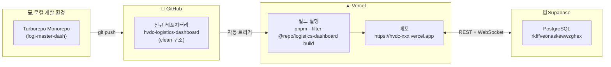

### 모노레포 구조 (Turborepo + pnpm workspaces)

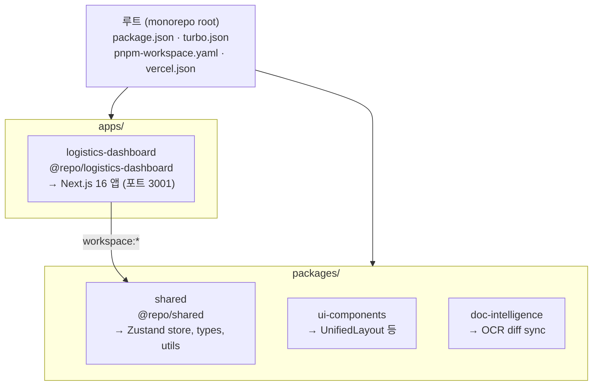

---

## 2. GitHub에 올려야 할 파일 구조

> ✅ = 반드시 포함 | ⚠️ = 선택 포함 | ❌ = 제외 필수

```
hvdc-logistics-dashboard/  ← GitHub 신규 레포 루트
│
├── ✅ package.json              # 루트 패키지 (pnpm@10.28.0, turbo)
├── ✅ pnpm-workspace.yaml       # 워크스페이스 정의
├── ✅ turbo.json                # Turborepo 태스크 설정
├── ✅ vercel.json               # Vercel 배포 설정 (핵심!)
├── ✅ pnpm-lock.yaml            # 의존성 버전 잠금 (반드시 포함)
├── ✅ .gitignore                # 제외 규칙
├── ✅ .env.example              # 환경변수 템플릿 (실제 값 없이)
│
├── ✅ apps/
│   └── logistics-dashboard/
│       ├── ✅ package.json
│       ├── ✅ next.config.mjs
│       ├── ✅ tsconfig.json
│       ├── ✅ tailwind.config.ts (또는 .js)
│       ├── ✅ postcss.config.js
│       ├── ✅ app/              # 페이지 & API 라우트
│       ├── ✅ components/       # React 컴포넌트
│       ├── ✅ hooks/            # Custom hooks
│       ├── ✅ lib/              # 유틸리티, Supabase 클라이언트
│       ├── ✅ store/            # Zustand store
│       ├── ✅ types/            # TypeScript 타입
│       ├── ✅ public/           # 정적 파일 (있으면)
│       ├── ✅ docs/             # 문서 (이 파일 포함)
│       ├── ✅ scripts/          # ETL 스크립트 (import-excel.mjs)
│       ├── ✅ README.md
│       ├── ✅ CHANGELOG.md
│       ├── ❌ node_modules/     # 절대 제외
│       ├── ❌ .next/            # 절대 제외 (빌드 산출물)
│       └── ❌ .env.local        # 절대 제외 (비밀키)
│
├── ✅ packages/
│   ├── shared/                  # @repo/shared — 필수!
│   │   ├── ✅ package.json
│   │   ├── ✅ tsconfig.json
│   │   ├── ✅ src/
│   │   │   ├── index.ts
│   │   │   ├── types/index.ts
│   │   │   ├── store/opsStore.ts
│   │   │   └── utils/buckets.ts
│   │   └── ❌ node_modules/
│   │
│   ├── ui-components/           # ⚠️ UnifiedLayout 사용 시 포함
│   │   └── src/UnifiedLayout.tsx
│   │
│   └── doc-intelligence/        # ⚠️ OCR 기능 사용 시 포함
│       └── src/
│
├── ✅ supabase/                 # Supabase DB 스크립트
│   ├── ✅ migrations/           # 마이그레이션 SQL (날짜순 실행)
│   │   ├── ✅ 20260101_initial_schema.sql
│   │   ├── ✅ 20260124_create_dashboard_views.sql
│   │   ├── ✅ 20260124_enable_realtime.sql
│   │   ├── ✅ 20260124_enable_realtime_layers.sql
│   │   ├── ✅ 20260125_public_shipments_view.sql
│   │   ├── ✅ 20260126_public_locations_seed_ontology.sql
│   │   ├── ✅ 20260127_api_views.sql  ← ⭐ v_cases + v_stock_onhand (API 필수!)
│   │   └── ✅ 20260313_add_shipment_columns.sql  ← ⭐ import-excel.mjs 전제조건
│   ├── ✅ scripts/              # ⭐ 핵심 DDL (migrations 전에 실행!)
│   │   ├── ✅ 20260124_hvdc_layers_status_case_ops.sql
│   │   └── ✅ hvdc_copy_templates.sql
│   ├── ✅ ontology/             # TTL 온톨로지 파일
│   │   ├── ✅ hvdc_ops_ontology.ttl
│   │   └── ✅ hvdc_ops_shapes.ttl
│   ├── ✅ docs/                 # Supabase 운영 문서
│   └── ❌ data/raw/             # 원본 데이터 (~35MB) — .gitignore 권장
│       # hvdc_all_status.json, hvdc_warehouse_status.json 등
│
└── ❌ node_modules/             # 절대 제외 (루트)
```

---

## 3. 제외해야 할 파일 (gitignore)

현재 `.gitignore` 이미 올바르게 설정되어 있습니다. 주요 제외 항목:

```gitignore
# 의존성 (Vercel이 pnpm install로 자동 설치)
node_modules/
.pnp
.yarn/*

# 빌드 산출물 (Vercel이 next build로 생성)
.next/
out/
build/
dist/

# 환경 변수 (Vercel 대시보드에서 직접 설정)
.env
.env.local
.env.development.local
.env.test.local
.env.production.local
# 단, .env.example 은 포함 OK

# Vercel/Turbo 캐시
.vercel/
.turbo/

# 로그
*.log
npm-debug.log*
pnpm-debug.log*

# Supabase 원본 데이터 (대용량 JSON/CSV ~35MB — Git LFS 또는 완전 제외)
supabase/data/raw/
# 단, supabase/migrations/, supabase/scripts/, supabase/ontology/ 는 포함 OK
```

---

## 4. vercel.json 설정 확인

**현재 프로젝트의 `vercel.json` — 이미 완벽하게 설정되어 있습니다.**

```json
{
  "framework": "nextjs",
  "installCommand": "pnpm install",
  "buildCommand": "pnpm --filter @repo/logistics-dashboard build",
  "outputDirectory": "apps/logistics-dashboard/.next"
}
```

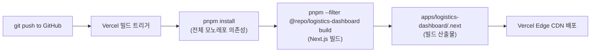

### 왜 이 설정이 완벽한가?

| 설정 | 값 | 이유 |
|------|-----|------|
| `installCommand` | `pnpm install` | 루트에서 실행 → 모든 workspace 패키지 설치 |
| `buildCommand` | `pnpm --filter @repo/logistics-dashboard build` | 해당 앱만 빌드 (의존성 `@repo/shared` 자동 포함) |
| `outputDirectory` | `apps/logistics-dashboard/.next` | 모노레포 내 Next.js 빌드 위치 명시 |

---

## 5. GitHub 레포 생성 → 업로드 절차

### Step 1: 신규 레포지터리 생성

```bash
# GitHub CLI 사용 (권장)
gh repo create hvdc-logistics-dashboard \
  --public \
  --description "HVDC Logistics Dashboard — Real-time UAE logistics monitoring"

# 또는 GitHub 웹에서:
# https://github.com/new
# Repository name: hvdc-logistics-dashboard
# Description: HVDC Logistics Dashboard
# Public/Private: 선택
# ❌ Initialize with README: 체크 해제 (우리가 직접 올림)
```

### Step 2: 깨끗한 폴더 구조 준비

현재 로컬이 복잡하므로, **필요한 파일만 새 폴더에 복사**하여 올리는 방법을 권장합니다.

```bash
# 새 폴더 생성
mkdir C:\Users\jichu\Desktop\hvdc-logistics-dashboard
cd C:\Users\jichu\Desktop\hvdc-logistics-dashboard

# Git 초기화
git init
git branch -M main
```

### Step 3: 복사해야 할 파일/폴더 목록

현재 위치: `C:\Users\jichu\Downloads\LOGI-MASTER-DASH-claude-improve-dashboard-layout-lnNFJ\`

```powershell
$src = "C:\Users\jichu\Downloads\LOGI-MASTER-DASH-claude-improve-dashboard-layout-lnNFJ"
$dst = "C:\Users\jichu\Desktop\hvdc-logistics-dashboard"

# 루트 설정 파일
Copy-Item "$src\package.json" $dst
Copy-Item "$src\pnpm-workspace.yaml" $dst
Copy-Item "$src\turbo.json" $dst
Copy-Item "$src\vercel.json" $dst
Copy-Item "$src\pnpm-lock.yaml" $dst
Copy-Item "$src\.gitignore" $dst
Copy-Item "$src\.env.example" $dst

# apps 폴더 (node_modules, .next 제외)
robocopy "$src\apps\logistics-dashboard" "$dst\apps\logistics-dashboard" /E /XD node_modules .next .turbo

# packages/shared (필수 의존성)
robocopy "$src\packages\shared" "$dst\packages\shared" /E /XD node_modules .turbo

# packages/ui-components (있으면)
robocopy "$src\packages\ui-components" "$dst\packages\ui-components" /E /XD node_modules
```

### Step 4: GitHub에 Push

```bash
cd C:\Users\jichu\Desktop\hvdc-logistics-dashboard

git add .
git commit -m "feat: initial commit — HVDC Logistics Dashboard v1.0.0"
git remote add origin https://github.com/<YOUR_USERNAME>/hvdc-logistics-dashboard.git
git push -u origin main
```

---

## 6. Vercel 배포 절차

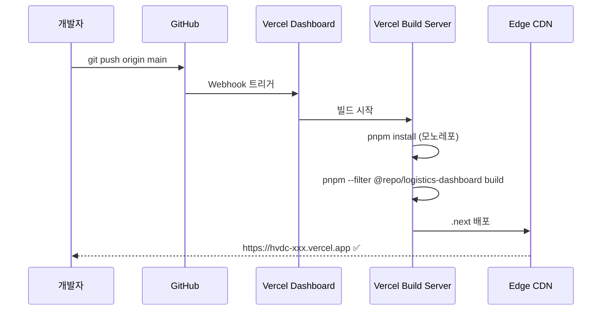

### Step 1: Vercel Import

1. [vercel.com/new](https://vercel.com/new) 접속
2. **"Import Git Repository"** 클릭
3. GitHub 계정 연결 → `hvdc-logistics-dashboard` 선택
4. **Framework Preset**: `Next.js` (자동 감지)
5. **Root Directory**: 비워두기 (루트에서 실행 — `vercel.json`이 처리)

### Step 2: 빌드 설정 확인

Vercel이 `vercel.json`을 자동으로 읽어 적용합니다.

| 설정 | 자동 감지 값 |
|------|------------|
| Framework | Next.js |
| Install Command | `pnpm install` |
| Build Command | `pnpm --filter @repo/logistics-dashboard build` |
| Output Directory | `apps/logistics-dashboard/.next` |

> ⚠️ 이 값들이 다르게 나타나면 수동으로 입력하세요.

### Step 3: 환경 변수 입력 (다음 섹션 참고)

### Step 4: Deploy 클릭

---

## 7. 환경 변수 설정

### Vercel 대시보드에서 설정할 변수

Vercel → Project → Settings → Environment Variables에서 추가:

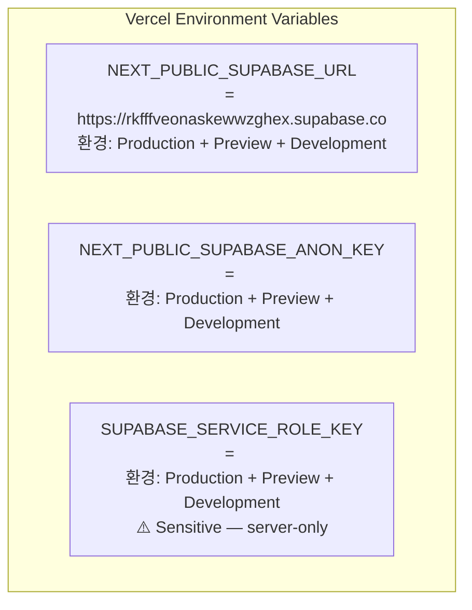

| 변수명 | 값 | 환경 | 공개여부 |
|-------|-----|------|---------|
| `NEXT_PUBLIC_SUPABASE_URL` | `https://rkfffveonaskewwzghex.supabase.co` | All | 공개 가능 |
| `NEXT_PUBLIC_SUPABASE_ANON_KEY` | `<YOUR_SUPABASE_ANON_KEY>` | All | 공개 가능 |
| `SUPABASE_SERVICE_ROLE_KEY` | `<YOUR_SUPABASE_SERVICE_ROLE_KEY>` | All | **민감 — Sensitive 체크** |

### 환경 변수 상세 설명

| 변수명 | 용도 | 보안 |
|--------|------|------|
| `NEXT_PUBLIC_SUPABASE_URL` | Supabase 프로젝트 URL (예: `https://rkfffveonaskewwzghex.supabase.co`) | 브라우저 번들에 포함됨 — 클라이언트 노출 허용 |
| `NEXT_PUBLIC_SUPABASE_ANON_KEY` | Supabase 익명 키 (RLS 정책 적용) | 브라우저 번들에 포함됨 — 공개 안전 |
| `SUPABASE_SERVICE_ROLE_KEY` | Supabase 서비스 역할 키 (RLS 우회) | **서버 전용 (API routes only)** — 절대 `NEXT_PUBLIC_` 접두사 사용 금지 |

> `SUPABASE_SERVICE_ROLE_KEY`는 API routes(`app/api/`)에서만 사용합니다.
> 클라이언트 컴포넌트에서 직접 사용하면 RLS가 무력화되므로 절대 금지입니다.
>
> **v1.3.0 중요**: `SUPABASE_SERVICE_ROLE_KEY`는 이제 **런타임에도 필수**입니다.
> `POST /api/shipments/new`가 `supabaseAdmin`을 사용하여 비공개 `status` 스키마에 직접 INSERT하기 때문입니다.
> ETL 전용이 아닌 **실시간 신규 항차 등록** 기능에도 사용됩니다.

```env
NEXT_PUBLIC_SUPABASE_URL=https://xxx.supabase.co
NEXT_PUBLIC_SUPABASE_ANON_KEY=eyJ...
SUPABASE_SERVICE_ROLE_KEY=eyJ...   ← Required for POST /api/shipments/new (writes to status schema)
```

### Vercel CLI로 설정하는 방법

```bash
# Vercel CLI 설치
npm i -g vercel

# 로그인
vercel login

# 환경 변수 추가
vercel env add NEXT_PUBLIC_SUPABASE_URL production
vercel env add NEXT_PUBLIC_SUPABASE_ANON_KEY production
vercel env add SUPABASE_SERVICE_ROLE_KEY production

# 또는 .env.local에서 일괄 import
vercel env pull  # 반대로 가져오기도 가능
```

---

## 8. ⭐ Supabase 완전 설정 가이드

> **새 환경에 배포할 때 Supabase를 처음부터 설정하는 전체 순서입니다.**
> Vercel 배포 전에 반드시 완료해야 합니다.

### 전체 설정 순서

```mermaid
flowchart TD
    S0["Supabase 프로젝트 확인\nrkfffveonaskewwzghex"] --> S1
    S1["STEP 1\n스키마 + 테이블 생성\n(case · status · wh)"] --> S2
    S2["STEP 2\n공개 뷰(VIEW) 생성\n(v_cases · v_stock_onhand\nshipments · v_shipments_master)"] --> S3
    S3["STEP 3\nGRANT 권한 부여\n(anon + authenticated)"] --> S4
    S4["STEP 4\nRLS 정책 설정\n(SELECT only)"] --> S5
    S5["STEP 5\nRealtime Publication\n(v_cases, v_stock_onhand 등)"] --> S6
    S6["STEP 6\n시드 데이터 삽입\n(1,050 rows — seed-data.mjs)"] --> S7
    S7["STEP 7\nCORS 허용 도메인 추가\n(Vercel 배포 URL)"] --> S8
    S8["✅ Supabase 준비 완료\n→ Vercel 배포 진행"]

    style S0 fill:#1a3a2a
    style S8 fill:#1a3a2a
```

---

### Supabase 프로젝트 정보

| 항목 | 값 |
|------|-----|
| Project ID | `rkfffveonaskewwzghex` |
| Project Name | supabase-cyan-yacht |
| URL | `https://rkfffveonaskewwzghex.supabase.co` |
| Region | ap-southeast-1 (Singapore) |
| Dashboard | `https://supabase.com/dashboard/project/rkfffveonaskewwzghex` |
| SQL Editor | `https://supabase.com/dashboard/project/rkfffveonaskewwzghex/sql/new` |

---

### STEP 1 — 스키마 + 테이블 생성

> Supabase Dashboard → SQL Editor → New Query → 아래 SQL 붙여넣기 → Run

```sql
-- ============================================================
-- STEP 1: 스키마 생성
-- ============================================================
CREATE SCHEMA IF NOT EXISTS "case";
CREATE SCHEMA IF NOT EXISTS status;
CREATE SCHEMA IF NOT EXISTS wh;

-- ============================================================
-- updated_at 자동 갱신 함수 (공통)
-- ============================================================
CREATE OR REPLACE FUNCTION update_updated_at()
RETURNS TRIGGER AS $$
BEGIN
    NEW.updated_at = NOW();
    RETURN NEW;
END;
$$ LANGUAGE plpgsql;

-- ============================================================
-- TABLE: case.cases — 화물 케이스 추적
-- ============================================================
CREATE TABLE IF NOT EXISTS "case".cases (
    id             UUID PRIMARY KEY DEFAULT gen_random_uuid(),
    case_number    TEXT UNIQUE NOT NULL,
    vendor         TEXT NOT NULL,
    site           TEXT NOT NULL CHECK (site IN ('AGI','DAS','MIR','SHU','MOSB')),
    status_current TEXT NOT NULL DEFAULT 'Pre Arrival',
    flow_code      INTEGER NOT NULL DEFAULT 0 CHECK (flow_code BETWEEN 0 AND 5),
    category       TEXT NOT NULL DEFAULT 'other',
    sqm            DECIMAL(10,2) DEFAULT 0,
    location       TEXT,
    notes          TEXT,
    created_at     TIMESTAMPTZ NOT NULL DEFAULT NOW(),
    updated_at     TIMESTAMPTZ NOT NULL DEFAULT NOW()
);

CREATE TRIGGER cases_updated_at
    BEFORE UPDATE ON "case".cases
    FOR EACH ROW EXECUTE FUNCTION update_updated_at();

CREATE INDEX IF NOT EXISTS idx_cases_site       ON "case".cases(site);
CREATE INDEX IF NOT EXISTS idx_cases_status     ON "case".cases(status_current);
CREATE INDEX IF NOT EXISTS idx_cases_flow_code  ON "case".cases(flow_code);
CREATE INDEX IF NOT EXISTS idx_cases_created_at ON "case".cases(created_at DESC);

-- ============================================================
-- TABLE: case.flows — 케이스 흐름 이력
-- ============================================================
CREATE TABLE IF NOT EXISTS "case".flows (
    id          UUID PRIMARY KEY DEFAULT gen_random_uuid(),
    case_id     UUID NOT NULL REFERENCES "case".cases(id) ON DELETE CASCADE,
    flow_code   INTEGER NOT NULL CHECK (flow_code BETWEEN 0 AND 5),
    stage       TEXT NOT NULL,
    status      TEXT NOT NULL DEFAULT 'pending'
                CHECK (status IN ('pending','active','completed','blocked')),
    stage_at    TIMESTAMPTZ NOT NULL DEFAULT NOW(),
    notes       TEXT,
    updated_by  TEXT,
    created_at  TIMESTAMPTZ NOT NULL DEFAULT NOW()
);

CREATE INDEX IF NOT EXISTS idx_flows_case_id   ON "case".flows(case_id);
CREATE INDEX IF NOT EXISTS idx_flows_flow_code ON "case".flows(flow_code);

-- ============================================================
-- TABLE: status.shipments_status — 선적 상태 추적
-- ============================================================
CREATE TABLE IF NOT EXISTS status.shipments_status (
    id                UUID PRIMARY KEY DEFAULT gen_random_uuid(),
    shipment_number   TEXT UNIQUE NOT NULL,
    vendor            TEXT NOT NULL,
    origin_port       TEXT NOT NULL,
    dest_port         TEXT NOT NULL,
    status            TEXT NOT NULL DEFAULT 'Pre Arrival',
    bl_number         TEXT,
    container_number  TEXT,
    eta               TIMESTAMPTZ,
    ata               TIMESTAMPTZ,
    etd               TIMESTAMPTZ,
    atd               TIMESTAMPTZ,
    vessel_name       TEXT,
    voyage_number     TEXT,
    freight_forwarder TEXT DEFAULT 'DSV',
    notes             TEXT,
    created_at        TIMESTAMPTZ NOT NULL DEFAULT NOW(),
    updated_at        TIMESTAMPTZ NOT NULL DEFAULT NOW()
);

CREATE TRIGGER shipments_updated_at
    BEFORE UPDATE ON status.shipments_status
    FOR EACH ROW EXECUTE FUNCTION update_updated_at();

-- ============================================================
-- TABLE: wh.stock_onhand — 창고 재고
-- ============================================================
CREATE TABLE IF NOT EXISTS wh.stock_onhand (
    id           UUID PRIMARY KEY DEFAULT gen_random_uuid(),
    sku          TEXT UNIQUE NOT NULL,
    description  TEXT NOT NULL,
    location     TEXT NOT NULL,
    quantity     DECIMAL(10,2) NOT NULL DEFAULT 0,
    unit         TEXT NOT NULL DEFAULT 'EA',
    category     TEXT NOT NULL DEFAULT 'other',
    batch_number TEXT,
    po_number    TEXT,
    weight_kg    DECIMAL(10,2),
    dimensions   TEXT,
    received_at  TIMESTAMPTZ,
    last_updated TIMESTAMPTZ NOT NULL DEFAULT NOW()
);

CREATE INDEX IF NOT EXISTS idx_stock_location ON wh.stock_onhand(location);
CREATE INDEX IF NOT EXISTS idx_stock_category ON wh.stock_onhand(category);
```

---

### STEP 2 — 공개 뷰(VIEW) 생성

> PostgREST는 `public` 스키마만 노출합니다.
> 커스텀 스키마(`case`, `status`, `wh`)에 접근하려면 반드시 public view가 필요합니다.

```sql
-- ============================================================
-- STEP 2: public 뷰 생성 (PostgREST 접근용)
-- ※ 아래 SQL 직접 실행 대신 supabase/migrations/ 파일을 순서대로 실행 권장
-- ============================================================

-- [필수] case.cases → public.v_cases  (API /api/cases, /api/cases/summary)
CREATE OR REPLACE VIEW public.v_cases AS
    SELECT id, case_no, hvdc_code, site, flow_code, flow_description,
           status_current, status_location, final_location,
           sqm, source_vendor, storage_type, stack_status,
           category, sct_ship_no, site_arrival_date, cbm, created_at
    FROM "case".cases;

-- [필수] wh.stock_onhand → public.v_stock_onhand  (API /api/stock)
CREATE OR REPLACE VIEW public.v_stock_onhand AS
    SELECT id, no, sku, description, location, pallet_id,
           qty, shipping_ref, date_received, created_at
    FROM wh.stock_onhand;

-- [필수] public.shipments 뷰  (API /api/shipments — recreate-tables.mjs 또는 20260125 파일로 생성)
-- → 20260125_public_shipments_view.sql 참조

-- [선택] public.v_shipments_master  (운영 집계용 — 20260124 파일로 생성)
-- → 20260124_create_dashboard_views.sql 참조
```

### 20260127_api_views.sql이 생성하는 뷰 목록

`supabase/migrations/20260127_api_views.sql` 실행 시 아래 뷰들이 생성됩니다:

| 뷰 이름 | 소스 테이블 | API 엔드포인트 |
|---------|-----------|--------------|
| `public.v_cases` | `"case".cases` | `/api/cases`, `/api/cases/summary` |
| `public.v_flows` | `"case".flows` | `/api/cases` (조인) |
| `public.v_shipments_status` | `status.shipments_status` | `/api/shipments` |
| `public.v_stock_onhand` | `wh.stock_onhand` | `/api/stock` |
| `public.shipments` | `status.shipments_status` + `"case".flows` + `"case".cases` | `/api/shipments` |

---

### STEP 3 — GRANT 권한 부여

```sql
-- ============================================================
-- STEP 3: anon / authenticated 역할에 SELECT 권한 부여
-- ※ 각 migration SQL 파일에 GRANT 포함되어 있음 — 자동 적용됨
-- ============================================================
GRANT SELECT ON public.v_cases        TO anon, authenticated;
GRANT SELECT ON public.v_stock_onhand TO anon, authenticated;
GRANT SELECT ON public.shipments      TO anon, authenticated;

-- 원본 스키마 접근 허용 (뷰가 내부적으로 참조)
GRANT USAGE ON SCHEMA "case"   TO anon, authenticated;
GRANT USAGE ON SCHEMA wh       TO anon, authenticated;
GRANT USAGE ON SCHEMA ops      TO anon, authenticated;
GRANT SELECT ON ALL TABLES IN SCHEMA "case"   TO anon, authenticated;
GRANT SELECT ON ALL TABLES IN SCHEMA wh       TO anon, authenticated;
GRANT SELECT ON ALL TABLES IN SCHEMA ops      TO anon, authenticated;
```

---

### STEP 4 — RLS (Row Level Security) 정책 설정

```sql
-- ============================================================
-- STEP 4: RLS 활성화 + SELECT 정책
-- ============================================================

-- v_cases
ALTER VIEW public.v_cases SET (security_invoker = true);
-- 뷰 자체에 RLS 대신 원본 테이블에 RLS 적용
ALTER TABLE "case".cases ENABLE ROW LEVEL SECURITY;
CREATE POLICY "cases_select_all" ON "case".cases
    FOR SELECT TO anon, authenticated USING (true);

ALTER TABLE "case".flows ENABLE ROW LEVEL SECURITY;
CREATE POLICY "flows_select_all" ON "case".flows
    FOR SELECT TO anon, authenticated USING (true);

ALTER TABLE status.shipments_status ENABLE ROW LEVEL SECURITY;
CREATE POLICY "shipments_select_all" ON status.shipments_status
    FOR SELECT TO anon, authenticated USING (true);

ALTER TABLE wh.stock_onhand ENABLE ROW LEVEL SECURITY;
CREATE POLICY "stock_select_all" ON wh.stock_onhand
    FOR SELECT TO anon, authenticated USING (true);
```

---

### STEP 5 — Realtime Publication 설정

> **방법 A: Supabase Dashboard** (권장)
> Dashboard → Database → Replication → Tables 탭
> → `public.v_cases` 토글 ON
> → `public.v_stock_onhand` 토글 ON
> → `public.shipments` 토글 ON (선택)

> **방법 B: SQL**

```sql
-- ============================================================
-- STEP 5: Realtime 활성화 (API가 실시간 업데이트를 수신하는 뷰)
-- ============================================================
ALTER PUBLICATION supabase_realtime ADD TABLE public.v_cases;
ALTER PUBLICATION supabase_realtime ADD TABLE public.v_stock_onhand;

-- 확인
SELECT tablename FROM pg_publication_tables
WHERE pubname = 'supabase_realtime';
-- 예상: v_cases, v_stock_onhand (+ 선택 추가 테이블들)
```

---

### STEP 6 — 시드 데이터 삽입

> 대시보드 KPI 카드가 실제 값을 표시하려면 시드 데이터가 필요합니다.

```sql
-- ============================================================
-- STEP 6-A: case.cases 시드 (30행)
-- ============================================================
INSERT INTO "case".cases
  (case_number, vendor, site, status_current, flow_code, category, sqm)
VALUES
  -- ✅ 현장 도착 (status='site', 10행)
  ('HVDC-2024-001','ABB',    'AGI','site',      5,'transformer',120.5),
  ('HVDC-2024-002','Siemens','DAS','site',      5,'switchgear', 85.0),
  ('HVDC-2024-003','GE',     'MIR','site',      5,'cable',      45.0),
  ('HVDC-2024-004','Nexans', 'SHU','site',      5,'cable',      60.0),
  ('HVDC-2024-005','ABB',    'AGI','site',      5,'breaker',    30.5),
  ('HVDC-2024-006','Siemens','DAS','site',      5,'transformer',110.0),
  ('HVDC-2024-007','GE',     'MIR','site',      5,'switchgear', 75.0),
  ('HVDC-2024-008','ABB',    'AGI','site',      4,'cable',      50.0),
  ('HVDC-2024-009','Nexans', 'SHU','site',      4,'breaker',    25.0),
  ('HVDC-2024-010','Siemens','MOSB','site',     4,'transformer',130.0),
  -- ✅ 창고 재고 (status='warehouse', 10행)
  ('HVDC-2024-011','ABB',    'AGI','warehouse', 3,'transformer', 95.0),
  ('HVDC-2024-012','GE',     'DAS','warehouse', 3,'cable',       40.0),
  ('HVDC-2024-013','Siemens','MIR','warehouse', 3,'switchgear',  65.0),
  ('HVDC-2024-014','Nexans', 'SHU','warehouse', 2,'cable',       55.0),
  ('HVDC-2024-015','ABB',    'AGI','warehouse', 2,'breaker',     20.0),
  ('HVDC-2024-016','Siemens','DAS','warehouse', 2,'transformer',100.0),
  ('HVDC-2024-017','GE',     'MOSB','warehouse',1,'cable',       35.0),
  ('HVDC-2024-018','ABB',    'SHU','warehouse', 1,'switchgear',  70.0),
  ('HVDC-2024-019','Nexans', 'MIR','warehouse', 1,'cable',       48.0),
  ('HVDC-2024-020','Siemens','AGI','warehouse', 0,'transformer',115.0),
  -- ✅ Pre Arrival (10행)
  ('HVDC-2024-021','GE',     'DAS','Pre Arrival',0,'breaker',    22.0),
  ('HVDC-2024-022','ABB',    'MIR','Pre Arrival',0,'transformer',125.0),
  ('HVDC-2024-023','Nexans', 'SHU','Pre Arrival',0,'cable',      52.0),
  ('HVDC-2024-024','Siemens','MOSB','Pre Arrival',0,'switchgear',80.0),
  ('HVDC-2024-025','ABB',    'AGI','Pre Arrival',1,'cable',      42.0),
  ('HVDC-2024-026','GE',     'DAS','Pre Arrival',1,'transformer',105.0),
  ('HVDC-2024-027','Nexans', 'MIR','Pre Arrival',1,'breaker',    28.0),
  ('HVDC-2024-028','Siemens','SHU','Pre Arrival',2,'cable',      58.0),
  ('HVDC-2024-029','ABB',    'MOSB','Pre Arrival',2,'switchgear',72.0),
  ('HVDC-2024-030','GE',     'AGI','Pre Arrival',3,'transformer',118.0);

-- ============================================================
-- STEP 6-B: status.shipments_status 시드 (10행)
-- ============================================================
INSERT INTO status.shipments_status
  (shipment_number, vendor, origin_port, dest_port, status, bl_number, container_number, vessel_name, eta)
VALUES
  ('MSC-2024-001','ABB',    'CNSHA','AEJEA','In Transit',  'MSCN123456','MSCU1234567','MSC ANNA',     NOW() + INTERVAL '5 days'),
  ('MSC-2024-002','Siemens','DEHAM','AEAUH','Port',        'MSCD234567','MSCU2345678','MSC BERLIN',   NOW() + INTERVAL '2 days'),
  ('MSC-2024-003','GE',     'NLRTM','AEJEA','Customs',     'MSCR345678','MSCU3456789','MSC ROTTERDAM',NOW() - INTERVAL '1 day'),
  ('MSC-2024-004','Nexans', 'CNSHA','AEAUH','Cleared',     'MSCN456789','MSCU4567890','MSC SHANGHAI',  NOW() - INTERVAL '3 days'),
  ('MSC-2024-005','ABB',    'KRPUS','AEJEA','Pre Arrival', 'MSCB567890','MSCU5678901','MSC BUSAN',    NOW() + INTERVAL '10 days'),
  ('MSC-2024-006','Siemens','DEHAM','AEAUH','In Transit',  'MSCD678901','MSCU6789012','MSC HAMBURG',  NOW() + INTERVAL '7 days'),
  ('MSC-2024-007','GE',     'CNSHA','AEJEA','Port',        'MSCN789012','MSCU7890123','MSC CHINA',    NOW() + INTERVAL '1 day'),
  ('MSC-2024-008','Nexans', 'NLRTM','AEAUH','Cleared',     'MSCR890123','MSCU8901234','MSC EUROPE',   NOW() - INTERVAL '2 days'),
  ('MSC-2024-009','ABB',    'JPYOK','AEJEA','In Transit',  'MSCJ901234','MSCU9012345','MSC YOKOHAMA', NOW() + INTERVAL '6 days'),
  ('MSC-2024-010','Siemens','DEHAM','AEAUH','Pre Arrival', 'MSCD012345','MSCU0123456','MSC FRANKFURT',NOW() + INTERVAL '14 days');

-- ============================================================
-- STEP 6-C: wh.stock_onhand 시드 (15행)
-- ============================================================
INSERT INTO wh.stock_onhand
  (sku, description, location, quantity, unit, category)
VALUES
  ('TRF-ABB-001',  'ABB HVDC Transformer 500kV',     'MOSB',    3.0,'EA','transformer'),
  ('TRF-SIE-001',  'Siemens Power Transformer 400kV','MOSB',    2.0,'EA','transformer'),
  ('CBL-NEX-001',  'Nexans HVDC Cable 500kV 1km',    'DAS-WH',  5.0,'EA','cable'),
  ('CBL-NEX-002',  'Nexans Control Cable 11kV',      'DAS-WH',  20.0,'MTR','cable'),
  ('SWG-GE-001',   'GE Gas-Insulated Switchgear',    'MOSB',    4.0,'SET','switchgear'),
  ('SWG-ABB-001',  'ABB AIS Switchgear 132kV',       'AGI-YARD',2.0,'SET','switchgear'),
  ('BRK-ABB-001',  'ABB SF6 Circuit Breaker',        'MOSB',    8.0,'EA','breaker'),
  ('BRK-SIE-001',  'Siemens HV Circuit Breaker',     'DAS-WH',  6.0,'EA','breaker'),
  ('TRF-GE-001',   'GE Step-Up Transformer',         'AGI-YARD',1.0,'EA','transformer'),
  ('CBL-ABB-001',  'ABB Land Cable 320kV',           'MOSB',    15.0,'MTR','cable'),
  ('SWG-SIE-001',  'Siemens GIS 245kV',              'DAS-WH',  3.0,'SET','switchgear'),
  ('TRF-NEX-001',  'Nexans Autotransformer 220kV',   'MOSB',    2.0,'EA','transformer'),
  ('BRK-GE-001',   'GE Vacuum Circuit Breaker 33kV', 'AGI-YARD',12.0,'EA','breaker'),
  ('CBL-SIE-001',  'Siemens MI Cable 500kV',         'DAS-WH',  8.0,'MTR','cable'),
  ('SWG-NEX-001',  'Nexans Cable Joint Kit',         'MOSB',    30.0,'SET','switchgear');
```

---

### STEP 7 — CORS 허용 도메인 설정

Vercel 배포 후 브라우저에서 Supabase API를 호출할 수 있으려면 CORS 설정이 필요합니다.

> **Supabase Dashboard → Project Settings → API → CORS allowed origins**

추가할 도메인:
```
https://hvdc-logistics-dashboard.vercel.app
https://*.vercel.app
http://localhost:3001
http://localhost:3000
```

```mermaid
graph LR
    Browser["브라우저\nhttps://hvdc-xxx.vercel.app"] -->|"API 요청"| Supabase["Supabase API\nrkfffveonaskewwzghex.supabase.co"]
    Supabase -->|"CORS 검사"| Check{"허용된 Origin?"}
    Check -->|"✅ 도메인 등록됨"| Allow["응답 반환"]
    Check -->|"❌ 미등록"| Block["CORS Error 차단"]
    style Block fill:#3a0000,color:#ff8080
    style Allow fill:#1a3a1a
```

---

### STEP 8 — 설정 완료 검증 SQL

모든 설정이 완료되었는지 아래 SQL로 한번에 확인합니다.

```sql
-- ============================================================
-- 설정 완료 검증 (Supabase SQL Editor에서 실행)
-- ============================================================

-- 1. 테이블 존재 확인
SELECT table_schema, table_name
FROM information_schema.tables
WHERE table_schema IN ('case','status','wh')
ORDER BY table_schema, table_name;
-- 예상: case.cases, case.flows, status.shipments_status, wh.stock_onhand

-- 2. 공개 뷰 확인 (API 필수 뷰 포함)
SELECT viewname FROM pg_views
WHERE schemaname = 'public'
  AND viewname IN ('v_cases', 'v_stock_onhand', 'shipments',
                   'v_shipments_master', 'v_cases_kpi', 'v_kpi_site_flow_daily');
-- 예상: v_cases, v_stock_onhand, shipments 반드시 포함 (API 동작 필수)

-- 3. 데이터 건수 확인
SELECT
    (SELECT COUNT(*) FROM public.v_cases)            AS total_cases,
    (SELECT COUNT(*) FILTER (WHERE status_current = 'site')
     FROM public.v_cases)                            AS site_arrived,
    (SELECT COUNT(*) FILTER (WHERE status_current = 'warehouse')
     FROM public.v_cases)                            AS warehouse,
    (SELECT COUNT(*) FROM public.shipments)          AS shipments,
    (SELECT COUNT(*) FROM public.v_stock_onhand)     AS stock_items;
-- import-excel.mjs 실행 후: total_cases=10,694 / shipments=890

-- 4. Realtime publication 확인
SELECT tablename FROM pg_publication_tables
WHERE pubname = 'supabase_realtime';
-- 예상: status.shipments_status, "case".cases, "case".flows 등

-- 5. RLS 정책 확인
SELECT schemaname, tablename, policyname, cmd
FROM pg_policies
WHERE schemaname IN ('case','status','wh')
ORDER BY schemaname, tablename;
-- 예상: 각 테이블에 SELECT 정책 존재
```

---

### Supabase 설정 체크리스트

- [ ] STEP 1: 스키마 생성 (`case`, `status`, `wh`, `ops`) + 핵심 테이블 생성 → `20260124_hvdc_layers_status_case_ops.sql`
- [ ] STEP 1b: `supabase/migrations/20260313_add_shipment_columns.sql` 실행 (import-excel.mjs 전제조건)
- [ ] STEP 2: public 뷰 생성 (`v_cases`, `v_stock_onhand`) → `20260127_api_views.sql`; (`shipments`, `v_shipments_master`) → `20260124–20260125` 파일
- [ ] STEP 3: GRANT 권한 부여 (`anon`, `authenticated`) — 각 뷰 파일에 포함
- [ ] STEP 4: RLS 활성화 + SELECT 정책
- [ ] STEP 5: Realtime Publication (`supabase_realtime`) — `v_cases`, `v_stock_onhand` 포함
- [ ] STEP 6: Excel 임포트 또는 시드 데이터 삽입 (아래 섹션 9 참조)
- [ ] STEP 7: CORS 허용 도메인 (Vercel URL + localhost)
- [ ] STEP 8: 검증 SQL 실행 → 모든 건수 정상 확인

---

## 9. 데이터 임포트 (Excel → Supabase)

> **실제 HVDC 운영 데이터를 Excel 파일에서 Supabase로 직접 임포트합니다.**
> 개발용 시드 데이터(1,050행) 대신 실제 데이터(cases 10,694 / flows 7,564 / shipments 890)를 사용할 때 실행합니다.

### 전제 조건

```bash
# 1. 마이그레이션 파일 먼저 실행 (Supabase SQL Editor)
#    supabase/migrations/20260313_add_shipment_columns.sql
#    → case.cases, case.flows 테이블에 Excel 컬럼 추가

# 2. 환경 변수 설정 (.env.local 또는 shell export)
#    NEXT_PUBLIC_SUPABASE_URL
#    SUPABASE_SERVICE_ROLE_KEY  ← service role 키 필수 (anon 키 불가)

# 3. Excel 파일 위치 확인
#    기본 경로: <프로젝트루트>/../Logi ontol core doc/HVDC STATUS1.xlsx
#    또는 인자로 경로 직접 지정 가능
```

### 실행 방법

```bash
# Excel 파일에서 Supabase로 초기 데이터 임포트
# 필수: 환경변수 설정 후 실행

# dry-run (데이터 미전송, 검증만)
node apps/logistics-dashboard/scripts/import-excel.mjs --dry-run

# dry-run + 커스텀 Excel 경로 지정
node apps/logistics-dashboard/scripts/import-excel.mjs --dry-run /path/to/HVDC\ STATUS1.xlsx

# 실제 임포트 (환경변수를 shell에서 직접 지정하는 경우)
NEXT_PUBLIC_SUPABASE_URL=https://rkfffveonaskewwzghex.supabase.co \
SUPABASE_SERVICE_ROLE_KEY=eyJ... \
node apps/logistics-dashboard/scripts/import-excel.mjs

# .env.local이 설정된 경우 (apps/logistics-dashboard/.env.local)
node apps/logistics-dashboard/scripts/import-excel.mjs
```

> **주의**: `import-excel.mjs`는 `SUPABASE_SERVICE_ROLE_KEY`만 사용합니다.
> `NEXT_PUBLIC_SUPABASE_ANON_KEY`로는 쓰기 권한이 없어 실행되지 않습니다.

### 예상 결과

```
──────────────────────────────────────────────────
  HVDC Excel Import
──────────────────────────────────────────────────
  Mode  : DRY-RUN (no data sent)
  Excel : /path/to/HVDC STATUS1.xlsx

Parsing Excel...
  Sheets found: [HVDC STATUS, Flows, Shipments, ...]

Dry-run summary:
  cases     : 10,694 rows
  flows     :  7,564 rows
  shipments :    890 rows

──────────────────────────────────────────────────
```

실제 임포트 완료 후 Supabase에서 확인:

```sql
SELECT
  (SELECT COUNT(*) FROM "case".cases)            AS cases,
  (SELECT COUNT(*) FROM "case".flows)            AS flows,
  (SELECT COUNT(*) FROM status.shipments_status) AS shipments;
-- 예상: 10694 / 7564 / 890
```

### import-excel.mjs 동작 상세

| 항목 | 내용 |
|------|------|
| 배치 크기 | 200행씩 upsert |
| 날짜 정규화 | Excel serial 날짜 → ISO 8601, 1900-01-00 및 1970 이전 값 → null |
| 사이트 검증 | AGI / DAS / MIR / SHU 만 허용 (그 외 → null) |
| 보관 타입 | Indoor / Outdoor / Outdoor Cov 정규화 |
| 벤더 정규화 | HITACHI → Hitachi, SIEMENS → Siemens |
| Flow Code | 0~5 정수, FLOW_LABELS 매핑 |
| 오류 처리 | 배치 단위 실패 시 계속 진행 (partial import 허용) |

---

## 10. 배포 후 검증

### 체크리스트

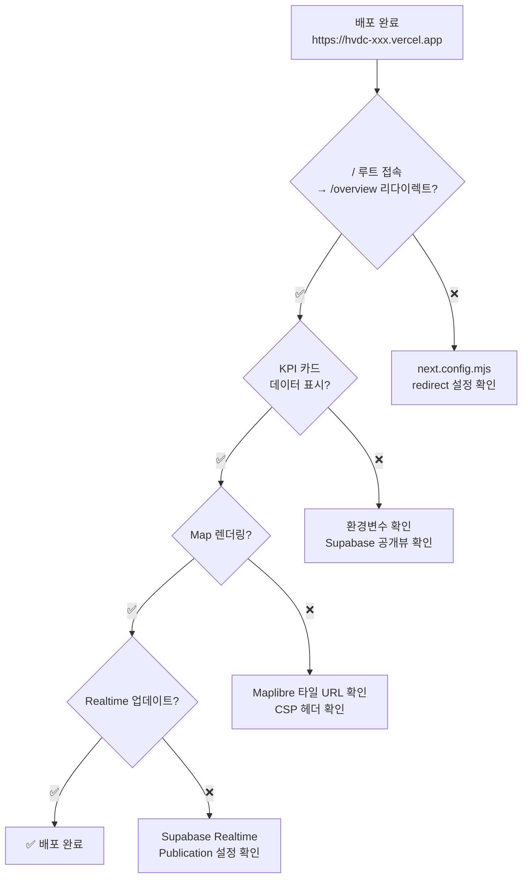

### 검증 URL 목록

배포 후 아래 URL을 순서대로 확인:

```
https://hvdc-xxx.vercel.app/           → /overview로 리다이렉트
https://hvdc-xxx.vercel.app/overview   → KPI + 지도 표시
https://hvdc-xxx.vercel.app/cargo      → 화물 테이블 표시
https://hvdc-xxx.vercel.app/pipeline   → 플로우 파이프라인 표시
https://hvdc-xxx.vercel.app/sites      → 사이트 카드 표시
https://hvdc-xxx.vercel.app/chain      → 전체 물류 체인 시각화
https://hvdc-xxx.vercel.app/api/cases/summary → JSON KPI 데이터
https://hvdc-xxx.vercel.app/api/cases         → JSON 케이스 목록
https://hvdc-xxx.vercel.app/api/chain/summary → JSON 공급망 요약
```

---

## 11. 트러블슈팅

### 빌드 에러: `Cannot find module '@repo/shared'`

```bash
# 원인: packages/shared 가 GitHub에 없음
# 해결: packages/shared 폴더 통째로 포함시켜야 함

# 확인
ls packages/shared/src/index.ts  # 이 파일이 없으면 빌드 실패
```

### 빌드 에러: `pnpm-lock.yaml not found`

```bash
# 원인: pnpm-lock.yaml을 gitignore에 추가했거나 누락
# 해결: pnpm-lock.yaml을 반드시 commit에 포함

git add pnpm-lock.yaml
git commit -m "fix: add pnpm-lock.yaml"
```

### 배포 후 API 403 에러

```sql
-- Supabase SQL Editor에서 실행
-- 공개 뷰 생성 확인
SELECT viewname FROM pg_views WHERE schemaname = 'public';
-- 필수 뷰: v_cases, v_stock_onhand, shipments, v_shipments_master 있어야 함

-- 없으면 Supabase SQL Editor에서 실행:
-- supabase/migrations/20260127_api_views.sql  (v_cases + v_stock_onhand)
-- supabase/migrations/20260125_public_shipments_view.sql  (shipments)
-- 또는 recreate-tables.mjs 재실행 후 seed-data.mjs 실행
```

### KPI가 1,000만 표시되고 실제 값이 안 나오는 경우

```
원인: Supabase PostgREST 기본 페이지 크기 = 1,000행
      SELECT COUNT(*) 대신 API로 전체 데이터를 가져올 때 1,000 이후가 잘림

해결: fetchAllCases() 함수의 pagination loop 확인
     → range(0, 999) → range(1000, 1999) → ... 반복으로 전체 로드
     → 실제 데이터 10,694건이 정상 표시되어야 함

관련 파일: apps/logistics-dashboard/store/casesStore.ts
```

### Vercel 빌드 타임아웃

```json
// vercel.json에 추가
{
  "framework": "nextjs",
  "installCommand": "pnpm install",
  "buildCommand": "pnpm --filter @repo/logistics-dashboard build",
  "outputDirectory": "apps/logistics-dashboard/.next",
  "functions": {
    "app/api/**": {
      "maxDuration": 30
    }
  }
}
```

### `ignoreBuildErrors: true` 경고

`next.config.mjs`에서 TypeScript 오류를 무시하도록 설정되어 있습니다. 프로덕션 배포 전에 타입 오류를 정리하려면:

```bash
# 로컬에서 타입 체크
pnpm --filter @repo/logistics-dashboard typecheck
# 또는
cd apps/logistics-dashboard && pnpm typecheck
```

### ESLint workspace binary 오류

```
원인: workspace 루트에 eslint binary가 설정되지 않음
      pnpm lint 실행 시 "eslint: command not found" 오류

상태: Non-blocking — Vercel 빌드에는 영향 없음
      TypeScript 타입 체크(pnpm typecheck)는 정상 동작

해결 (선택): apps/logistics-dashboard에서 직접 실행
      cd apps/logistics-dashboard && npx eslint .
```

---

## 12. 알려진 이슈 및 해결 현황

| 이슈 | 증상 | 해결 방법 | 상태 |
|------|------|----------|------|
| React Hydration Mismatch | 브라우저 콘솔에 "Extra attributes from the server" 경고 | Kapture 브라우저 확장이 DOM에 속성 추가 → `suppressHydrationWarning` 적용 | ✅ 해결됨 |
| KPI 1,000 표시 | cases KPI가 실제 10,694 대신 1,000으로 표시 | PostgREST db-max-rows=1000 한계 → `fetchAllCases()` pagination loop 구현 | ✅ 해결됨 |
| `ignoreBuildErrors: true` | TS 에러 무시됨 | `tsc --noEmit`은 별도 lint 단계에서 실행 | ⚠️ 유지 |
| `images: { unoptimized: true }` | 이미지 최적화 비활성 | 필요시 제거하고 next/image 설정 | ⚠️ 유지 |
| `@deck.gl/core: "latest"` | 버전 미고정 | 안정된 버전(^9.0.x)으로 고정 권장 | ⚠️ 유지 |
| `SUPABASE_SERVICE_ROLE_KEY` 하드코딩 | 구 .mjs 스크립트에 있었음 | 새 리포에는 해당 .mjs 미포함, 환경변수로 처리 | ✅ 해결됨 |
| ESLint workspace binary | `pnpm lint` 실패 | Non-blocking, `pnpm typecheck` 정상 통과 | ⚠️ 비차단 |

### 현재 구현 상태 요약

| 항목 | 상태 | 비고 |
|------|------|------|
| TypeScript 타입 체크 | ✅ 통과 | `pnpm typecheck` 오류 없음 |
| 실제 데이터 임포트 | ✅ 검증 완료 | cases 10,694 / flows 7,564 / shipments 890 (dry-run 확인) |
| Hydration warning | ✅ 해결됨 | `suppressHydrationWarning` 적용 |
| KPI pagination | ✅ 해결됨 | `fetchAllCases()` loop 구현 |
| ESLint | ⚠️ 비차단 | workspace eslint binary 미설정 (빌드 영향 없음) |

---

## 배포 구조 최종 요약

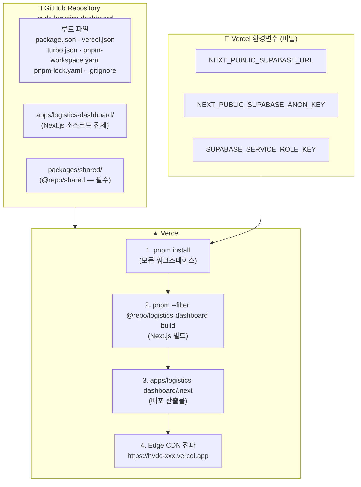

### 필수 파일 체크리스트 (GitHub 업로드 전 최종 확인)

- [ ] `package.json` (루트) — `pnpm@10.28.0`, `turbo@^2.4.0`
- [ ] `pnpm-workspace.yaml` — `apps/*`, `packages/*`
- [ ] `turbo.json` — dev/build 태스크 정의
- [ ] `vercel.json` — 빌드/배포 명령어
- [ ] `pnpm-lock.yaml` — **절대 제외 금지**
- [ ] `.gitignore` — node_modules, .next, .env.local 제외
- [ ] `.env.example` — 환경변수 템플릿 (실제값 없이)
- [ ] `apps/logistics-dashboard/` — 전체 소스코드
- [ ] `apps/logistics-dashboard/scripts/import-excel.mjs` — Excel ETL 스크립트
- [ ] `packages/shared/` — `@repo/shared` 워크스페이스 패키지
- [ ] `supabase/migrations/20260313_add_shipment_columns.sql` — import-excel.mjs 전제조건
- [ ] ❌ `node_modules/` 없음
- [ ] ❌ `.next/` 없음
- [ ] ❌ `.env.local` 없음

---

## 13. Supabase 로컬 실행 파일 & 폴더 완전 가이드

> 이 섹션은 프로젝트 루트의 `supabase/` 폴더와 `apps/logistics-dashboard/` 스크립트 전체를 문서화합니다.
> 새 Supabase 프로젝트를 처음 셋업하거나 데이터를 재적재할 때 이 섹션을 따르세요.

### 13-A. 전체 폴더 구조

```
[프로젝트 루트]
├── supabase/
│   ├── migrations/                ← SQL DDL 마이그레이션 (실행 순서 있음)
│   │   ├── 20260101_initial_schema.sql          (19.2 KB) ← public 스키마 기본 테이블 11개
│   │   ├── 20260124_create_dashboard_views.sql  ( 0.9 KB) ← public.v_shipments_master 기본 뷰
│   │   ├── 20260124_enable_realtime.sql         ( 6.4 KB) ← Realtime Publication 설정
│   │   ├── 20260124_enable_realtime_layers.sql  ( 1.4 KB) ← 레이어별 Realtime 추가 설정
│   │   ├── 20260125_public_shipments_view.sql   ( 1.3 KB) ← public.shipments 뷰 (worklist API용)
│   │   ├── 20260126_public_locations_seed_ontology.sql (2.5 KB) ← locations 시드 + 온톨로지
│   │   ├── 20260127_api_views.sql               (─── KB) ← ⭐ v_cases + v_flows + v_shipments_status + v_stock_onhand
│   │   └── 20260313_add_shipment_columns.sql    (─── KB) ← ⭐ import-excel.mjs 전제조건 컬럼 추가
│   │
│   ├── scripts/                   ← 고급 HVDC 전용 SQL
│   │   ├── 20260124_hvdc_layers_status_case_ops.sql (12.9 KB) ← ⭐ 핵심: status/case/ops 3-레이어 풀 스키마
│   │   └── hvdc_copy_templates.sql               ( 3.8 KB) ← COPY 명령 템플릿 (CSV 적재용)
│   │
│   ├── data/
│   │   └── raw/                   ← 원본 데이터 파일 (GitHub 제외 권장)
│   │       ├── HVDC_all_status.json              ( 1.7 MB) ← 전체 HVDC 상태 JSON
│   │       ├── hvdc_excel_reporter_final_sqm_rev_3.json (15.2 MB) ← Excel 리포터 전체 JSON
│   │       ├── hvdc_warehouse_status.csv         ( 3.0 MB) ← 창고 현황 CSV
│   │       └── hvdc_warehouse_status.json        (15.2 MB) ← 창고 현황 JSON
│   │
│   ├── docs/                      ← Supabase 설정 문서
│   │   ├── RUNBOOK_HVDC_SUPABASE_SETUP.md        ← 설정 순서 Runbook
│   │   ├── supabase.md                           (38.1 KB) ← 상세 DB 레퍼런스
│   │   ├── README_dashboard_ready_FULL.md        ← 대시보드 연동 가이드
│   │   ├── README_embedded_ops_ttl_patch.md      ← OPS TTL 패치 가이드
│   │   ├── README_hvdc_ops_ttl_export.md         (8.9 KB) ← OPS TTL 내보내기 가이드
│   │   └── README_Untitled-4_embedded_ops_ttl_v2.md ← OPS TTL v2 가이드
│   │
│   └── ontology/                  ← RDF/SHACL 온톨로지 파일
│       ├── hvdc_ops_ontology.ttl  (14.4 KB) ← HVDC 운영 온톨로지
│       └── hvdc_ops_shapes.ttl    ( 4.6 KB) ← SHACL 유효성 검사 Shape
│
└── apps/logistics-dashboard/
    ├── scripts/
    │   └── import-excel.mjs        (─── KB) ← ⭐ Excel → Supabase ETL (Node.js)
    ├── recreate-tables.mjs         ( 5.7 KB) ← 테이블 DROP & 재생성 스크립트
    ├── seed-data.mjs               (15.0 KB) ← 시드 데이터 삽입 스크립트 (300행 × 4테이블)
    └── test-insert.mjs             ( 0.5 KB) ← 연결 & insert 단위 테스트
```

---

### 13-B. 마이그레이션 실행 순서

> **⚠️ 중요**: SQL 파일은 파일명 날짜 순서대로 실행해야 합니다.
> Supabase SQL Editor: `https://app.supabase.com/project/<PROJECT_REF>/editor`

```
실행 순서:

① supabase/scripts/20260124_hvdc_layers_status_case_ops.sql  ← 가장 먼저 (3-레이어 스키마 생성)
   → status / "case" / ops 스키마 + 모든 테이블 + 공개 뷰 8개 생성

② supabase/migrations/20260101_initial_schema.sql            ← public 레거시 테이블 (선택)
   → public.shipments, public.locations 등 11개 테이블 (초기 v1 스키마)
   ⚠️ 이미 ①에서 status.shipments_status 가 생성되므로 충돌 주의

③ supabase/migrations/20260124_enable_realtime.sql           ← Realtime 활성화
④ supabase/migrations/20260124_enable_realtime_layers.sql    ← 레이어별 Realtime 추가
⑤ supabase/migrations/20260125_public_shipments_view.sql     ← public.shipments 뷰 (Worklist용)
⑥ supabase/migrations/20260126_public_locations_seed_ontology.sql ← locations 시드
⑦ supabase/migrations/20260127_api_views.sql                 ← ⭐ API 뷰 (v_cases + v_flows + v_shipments_status + v_stock_onhand)
⑧ supabase/migrations/20260313_add_shipment_columns.sql      ← ⭐ import-excel.mjs 전제조건 (마지막 실행)
```

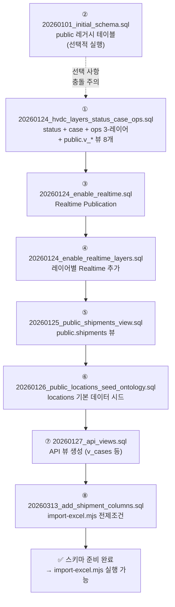

---

### 13-C. 스키마별 테이블 맵

#### `status` 스키마 — SSOT(Source of Truth) 레이어

| 테이블 | 설명 | PK |
|--------|------|----|
| `status.shipments_status` | 선적 마스터 (HVDC SSOT) | `hvdc_code` |
| `status.events_status` | 물류 이벤트 로그 | `event_id` |

#### `"case"` 스키마 — Option-C 케이스 레이어

| 테이블 | 설명 | PK |
|--------|------|----|
| `"case".shipments_case` | 선적 케이스 (Invoice/HS Code) | `hvdc_code` |
| `"case".cases` | 케이스 명세 (치수/중량) | `(hvdc_code, case_no)` |
| `"case".flows` | Flow Code 및 경로 | `(hvdc_code, case_no)` |
| `"case".locations` | 물류 거점 마스터 | `location_id` |
| `"case".events_case` | 케이스별 이벤트 시계열 | `event_id` (bigserial) |
| `"case".events_case_debug` | 이벤트 디버그 로그 | `debug_id` (bigserial) |

#### `ops` 스키마 — ETL 감사 레이어

| 테이블 | 설명 | PK |
|--------|------|----|
| `ops.etl_runs` | ETL 파이프라인 실행 이력 | `run_id` (UUID) |

#### `public` 뷰 레이어 — 대시보드 전용 읽기 인터페이스

| 뷰 | 소스 | 용도 |
|----|------|------|
| `public.v_cases` | `"case".cases` | `/api/cases`, `/api/cases/summary` |
| `public.v_flows` | `"case".flows` | 흐름 이력 조회 |
| `public.v_shipments_status` | `status.shipments_status` | `/api/shipments` |
| `public.v_stock_onhand` | `wh.stock_onhand` | `/api/stock` |
| `public.v_shipments_master` | `status.shipments_status` + `"case".shipments_case` | 선적 마스터 조회 |
| `public.v_shipments_timeline` | `status.events_status` + `"case".events_case` | 이벤트 타임라인 |
| `public.v_cases_kpi` | `"case".cases` + `"case".flows` | KPI 케이스 집계 |
| `public.v_flow_distribution` | `"case".flows` | Flow Code 분포 |
| `public.v_wh_inventory_current` | `"case".events_case` + `"case".locations` | 현재 창고 재고 |
| `public.v_case_event_segments` | `"case".events_case` | 이벤트 간 시간 분석 |
| `public.v_case_segments` | `"case".cases` + `"case".events_case` + `"case".flows` | 케이스 단계별 소요시간 |
| `public.v_kpi_site_flow_daily` | `public.v_case_segments` + `"case".flows` | 사이트별 일별 KPI |
| `public.shipments` | `status.shipments_status` + `"case".flows` + `"case".cases` | Worklist API 뷰 |

> **원칙**: 프론트엔드는 `public.v_*` 뷰와 `public.shipments` 뷰만 조회합니다. 직접 JOIN 금지.

---

### 13-D. `scripts/import-excel.mjs` — Excel → Supabase ETL

> **경로**: `apps/logistics-dashboard/scripts/import-excel.mjs`
> **용도**: Excel 파일(HVDC STATUS1.xlsx)에서 실제 운영 데이터를 Supabase로 임포트

#### 실행 방법

```bash
# dry-run 먼저 실행하여 검증
node apps/logistics-dashboard/scripts/import-excel.mjs --dry-run

# 실제 임포트
node apps/logistics-dashboard/scripts/import-excel.mjs
```

#### 필수 환경 변수

```env
NEXT_PUBLIC_SUPABASE_URL=https://rkfffveonaskewwzghex.supabase.co
SUPABASE_SERVICE_ROLE_KEY=eyJ...  ← service role 키 (anon 키로는 쓰기 불가)
```

#### 예상 결과

| 테이블 | 행 수 |
|--------|-------|
| `"case".cases` | **10,694행** |
| `"case".flows` | **7,564행** |
| `status.shipments_status` | **890행** |

---

### 13-E. `recreate-tables.mjs` — 테이블 DROP & 재생성

> **경로**: `apps/logistics-dashboard/recreate-tables.mjs`
> **용도**: 개발/테스트 중 4개 핵심 테이블을 드롭하고 재생성할 때 사용

#### 실행 방법

```bash
# apps/logistics-dashboard 폴더에서
cd apps/logistics-dashboard
node recreate-tables.mjs
```

#### 동작 상세

1. **pg-meta API 시도** — `${SUPABASE_URL}/pg/query` 엔드포인트로 DDL 실행
2. **실패 시 RPC 폴백** — `exec_sql` RPC 함수 시도

#### 생성되는 테이블 (시드 데이터용 간소화 버전)

```sql
"case".cases          -- 케이스 마스터 (16컬럼)
"case".flows          -- Flow Code 이력 (6컬럼)
status.shipments_status  -- 선적 상태 (15컬럼)
wh.stock_onhand       -- 창고 현재고 (10컬럼)
```

#### 추가 작업

- 4개 테이블 모두 RLS 활성화 (`anon_read` + `service_all` 정책)
- `public.shipments` 뷰 재생성
- `NOTIFY pgrst, 'reload schema'` 호출 (PostgREST 스키마 캐시 갱신)

> **⚠️ 주의**: DROP CASCADE가 포함되어 있으므로 기존 데이터가 모두 삭제됩니다.
> 프로덕션에서는 사용 금지.

---

### 13-F. `seed-data.mjs` — 시드 데이터 삽입

> **경로**: `apps/logistics-dashboard/seed-data.mjs`
> **용도**: 개발/데모용 가상 데이터 생성 및 삽입

#### 실행 방법

```bash
# 방법 1: apps/logistics-dashboard에서 직접 실행
cd apps/logistics-dashboard
node seed-data.mjs

# 방법 2: 프로젝트 루트에서
node apps/logistics-dashboard/seed-data.mjs
```

#### 생성 데이터 규모

| 테이블 | 행 수 | 설명 |
|--------|-------|------|
| `"case".cases` | **300행** | Site 분포: AGI 40% / SHU·MIR·DAS 각 20% |
| `"case".flows` | **300행** | Flow Code 0~5, 오프쇼어(AGI/DAS)는 FC≥3 강제 |
| `status.shipments_status` | **300행** | ETD/ETA/ATA 랜덤 생성 (2025~2026) |
| `wh.stock_onhand` | **150행** | 15가지 HVDC 자재, 7개 창고 위치 |
| **합계** | **1,050행** | |

> **실제 데이터가 필요한 경우**: `seed-data.mjs` 대신 `scripts/import-excel.mjs`를 사용하세요.
> Excel import 결과: cases 10,694 / flows 7,564 / shipments 890

---

### 13-G. `test-insert.mjs` — 연결 테스트

> **경로**: `apps/logistics-dashboard/test-insert.mjs`
> **용도**: Supabase 연결 및 `"case".cases` 테이블 insert 단위 테스트

#### 실행 방법

```bash
cd apps/logistics-dashboard
node test-insert.mjs
```

#### 성공 / 실패 판단

```bash
# 성공 시
OK, data: null

# 실패 시 (예: 테이블 미존재)
ERROR: { "code": "42P01", "details": null, "hint": null,
         "message": "relation \"case.cases\" does not exist" }
```

---

### 13-H. `supabase/scripts/` — 고급 SQL 스크립트

#### `20260124_hvdc_layers_status_case_ops.sql` (12.9 KB)

> **⭐ 가장 중요한 파일** — 프로덕션 Supabase 환경의 완전한 스키마

이 파일 하나로:
- `status` 스키마 2개 테이블 + 7개 인덱스
- `"case"` 스키마 6개 테이블 + 15개 인덱스 (복합 PK, 외래키 포함)
- `ops` 스키마 1개 테이블
- `public` 뷰 8개 (`v_shipments_master`, `v_shipments_timeline`, `v_cases_kpi`, `v_flow_distribution`, `v_wh_inventory_current`, `v_case_event_segments`, `v_case_segments`, `v_kpi_site_flow_daily`)

```bash
# Supabase SQL Editor에서 전체 내용 실행
# 파일 경로: supabase/scripts/20260124_hvdc_layers_status_case_ops.sql
```

#### `hvdc_copy_templates.sql` (3.8 KB)

> CSV 파일을 `\copy` 명령으로 테이블에 적재하는 템플릿

```sql
-- 사용 예시 (psql 클라이언트)
\copy status.shipments_status FROM 'hvdc_output/supabase/shipments.csv' CSV HEADER;
\copy "case".cases FROM 'hvdc_output/optionC/cases.csv' CSV HEADER;
```

---

### 13-I. `supabase/data/raw/` — 원본 데이터 파일

> **⚠️ GitHub 업로드 제외 권장** — 파일 크기 합계 약 35 MB

| 파일 | 크기 | 용도 |
|------|------|------|
| `HVDC_all_status.json` | 1.7 MB | 전체 HVDC 선적 상태 (JSON) |
| `hvdc_excel_reporter_final_sqm_rev_3.json` | 15.2 MB | Excel 리포터 최종본 (SQM 포함) |
| `hvdc_warehouse_status.csv` | 3.0 MB | 창고 현황 CSV (ETL 입력) |
| `hvdc_warehouse_status.json` | 15.2 MB | 창고 현황 JSON (ETL 입력) |

`.gitignore`에 추가 권장:
```gitignore
# 대용량 원본 데이터 (Supabase에 직접 로드)
supabase/data/raw/
```

---

### 13-J. `supabase/ontology/` — RDF 온톨로지

| 파일 | 크기 | 용도 |
|------|------|------|
| `hvdc_ops_ontology.ttl` | 14.4 KB | HVDC 운영 온톨로지 (Turtle 형식) |
| `hvdc_ops_shapes.ttl` | 4.6 KB | SHACL 유효성 검사 Shape |

> 온톨로지는 데이터 품질 검증(`RUNBOOK_HVDC_SUPABASE_SETUP.md` Gate 1 QA)에 활용됩니다.

---

### 13-K. 신규 Supabase 프로젝트 완전 셋업 순서

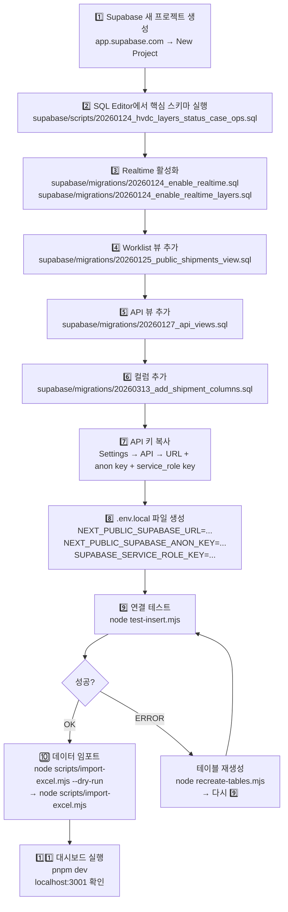

#### 빠른 실행 명령어 모음

```bash
# 1. 프로젝트 루트로 이동
cd C:\Users\jichu\Downloads\LOGI-MASTER-DASH-claude-improve-dashboard-layout-lnNFJ

# 2. 패키지 설치
pnpm install

# 3. 연결 테스트 (Supabase 키 설정 후)
node apps/logistics-dashboard/test-insert.mjs

# 4. 테이블 재생성 (필요 시)
node apps/logistics-dashboard/recreate-tables.mjs

# 5-a. Excel 데이터 임포트 (실제 운영 데이터)
node apps/logistics-dashboard/scripts/import-excel.mjs --dry-run  # 검증
node apps/logistics-dashboard/scripts/import-excel.mjs             # 실제 임포트

# 5-b. 또는 개발용 시드 데이터 (1,050행)
node apps/logistics-dashboard/seed-data.mjs

# 6. 대시보드 개발 서버 실행
pnpm dev
# → http://localhost:3001
```

---

### 13-L. `.env.local` 설정 (로컬 개발용)

> **경로**: `apps/logistics-dashboard/.env.local` (gitignore 대상)

```env
# 현재 활성 Supabase 프로젝트: supabase-cyan-yacht (rkfffveonaskewwzghex)
NEXT_PUBLIC_SUPABASE_URL=https://rkfffveonaskewwzghex.supabase.co
NEXT_PUBLIC_SUPABASE_ANON_KEY=<Supabase 대시보드 → Settings → API → anon key>

# 서버/Edge Function 전용 (클라이언트 노출 금지)
# import-excel.mjs 실행에도 이 키가 필요합니다
SUPABASE_SERVICE_ROLE_KEY=<Supabase 대시보드 → Settings → API → service_role key>

NODE_ENV=development
```

> 신규 Supabase 프로젝트로 교체 시 위 3개 값만 변경하면 됩니다.

---

### 13-M. Gate 1 QA — 데이터 품질 검증 SQL

Supabase SQL Editor에서 실행:

```sql
-- 1. 테이블 행 수 확인
SELECT
  (SELECT count(*) FROM "case".cases)            AS cases,
  (SELECT count(*) FROM "case".flows)            AS flows,
  (SELECT count(*) FROM status.shipments_status) AS shipments,
  (SELECT count(*) FROM wh.stock_onhand)         AS stock;
-- import-excel.mjs 실행 후: 10694 / 7564 / 890 / (기존 시드)
-- seed-data.mjs 실행 후: 300 / 300 / 300 / 150

-- 2. Flow Code 분포 확인
SELECT flow_code, count(*) FROM "case".cases GROUP BY flow_code ORDER BY 1;

-- 3. 오프쇼어 사이트 Flow Code 위반 체크 (0이면 정상)
SELECT count(*) AS violations
FROM "case".cases
WHERE site IN ('AGI', 'DAS') AND flow_code < 3;

-- 4. public.v_cases 뷰 조회 확인
SELECT count(*) FROM public.v_cases;

-- 5. Realtime Publication 확인
SELECT * FROM pg_publication_tables
WHERE pubname = 'supabase_realtime';

-- 6. RLS 정책 확인
SELECT schemaname, tablename, policyname, cmd, roles
FROM pg_policies
ORDER BY schemaname, tablename;
```

---

---

## v1.3.0 변경사항 (2026-03-14)

### 신규 기능
- Overview 툴바: 화물 검색 + 지도 레이어 토글 + 신규 항차 등록
- `POST /api/shipments/new` — `status.shipments_status` 직접 INSERT (SERVICE_ROLE_KEY 필요)
- `GET /api/shipments?q=` — ilike 부분 검색 추가

### 배포 시 확인사항
- Vercel 환경변수에 `SUPABASE_SERVICE_ROLE_KEY` 설정 필수 (신규 항차 등록 기능 동작)
- TypeScript: 0 errors (`pnpm tsc --noEmit`)
- Vitest: 7/7 tests passing (`pnpm vitest run`)

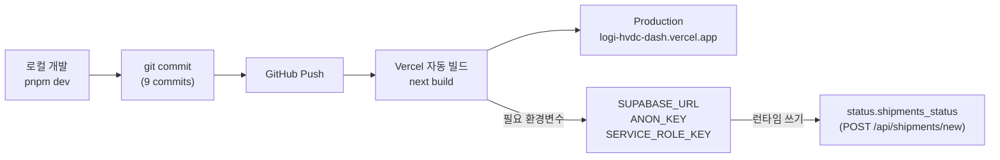

---

## v2.0.0 변경사항 (2026-03-14)

### Overview 2.0 — 7-Row Executive Layout (fd4e6be)

**구조 변경:**
- Overview 페이지: 4-zone 다크 테마 → 7-row light-ops scoped 테마
- `data-theme="light-ops"` 루트 div — 다른 페이지 무영향

**신규 컴포넌트 (6):**
- `ProgramFilterBar` — Program/Ops 모드 토글 + 현장 필터 바
- `ChainRibbonStrip` — 6-노드 체인 리본 (`/api/chain/summary` 연동)
- `MissionControl` — 알림/경로/현장 준비도/활동 피드 패널
- `SiteDeliveryMatrix` — 4-카드 현장 납품 현황 (Assigned hero metric)
- `OpenRadarTable` — 4-탭 미결 레이더 테이블 (540px 스크롤)
- `OpsSnapshot` — 운영 레이어 패널 (WH Pressure + Worklist + Exceptions + Feed)

**Deprecated (파일 보존, import 제거):**
- `OverviewRightPanel.tsx` → MissionControl로 대체
- `OverviewBottomPanel.tsx` → OpsSnapshot으로 대체

**신규 API:**
- `GET /api/overview` — 집계 BFF (KPI 8개 + alerts + siteReadiness + worklist + liveFeed)

**신규 i18n:**
- `programBar`, `missionControl`, `siteMatrix`, `openRadar`, `opsSnapshot`, `chainRibbon` 섹션 추가 (EN/KO)

**Cross-page 연동:**
- `ChainRibbonStrip` 노드 클릭 → `casesStore.activePipelineStage` → Pipeline 페이지 반응
- `MissionControl.selectedShipmentId` ← `logisticsStore.highlightedShipmentId`

### Design Polish Patch 1 (c4eb9cb)

**UI 개선:**
- Sidebar: `bg-[#071225]` 딥 네이비, 활성 메뉴 파란 glow shadow, 브랜드 18px bold white
- LangToggle: 다크 헤더 위 흰색 pill floating (`bg-white shadow-sm`)
- `lib/overview/ui.ts`: `gateClassLight()` → full pill badge (bg + ring-1), `uiTokens` 상수 export
- SiteDeliveryMatrix: `p-6` 카드, Assigned hero 큰 숫자, risk badge ring-1
- OpenRadarTable: `rounded-xl px-4 py-3.5` 행, 선택 상태 ring, 스크롤 540px
- OpsSnapshot: 베이지 제거 (`#F7F3EA → #F8FAFC`), WH bar h-2.5 + 색상 분기

**TypeScript:** 0 errors (모든 변경 후 `pnpm typecheck` 통과)

---

*문서 작성: 2026-03-13 | 최종 수정: 2026-03-14*
*버전: 2.0.0 — Overview 2.0 7-Row Executive Layout, 6 신규 컴포넌트, Design Polish Patch 1*
*기준 프로젝트: LOGI-MASTER-DASH-claude-improve-dashboard-layout*
