# Layout Documentation — HVDC Logistics Dashboard

> **Version:** 1.0.0 | **Last Updated:** 2026-03-13
> **Framework:** Next.js 16 App Router | **Theme:** Dark (forced)

---

## Table of Contents

1. [Layout Hierarchy](#1-layout-hierarchy)
2. [Root Layout](#2-root-layout)
3. [Dashboard Shell Layout](#3-dashboard-shell-layout)
4. [Overview Page Layout](#4-overview-page-layout)
5. [Cargo Page Layout](#5-cargo-page-layout)
6. [Pipeline Page Layout](#6-pipeline-page-layout)
7. [Sites Page Layout](#7-sites-page-layout)
8. [Responsive Breakpoints](#8-responsive-breakpoints)
9. [Navigation Flow](#9-navigation-flow)
10. [CSS Architecture](#10-css-architecture)

---

## 1. Layout Hierarchy

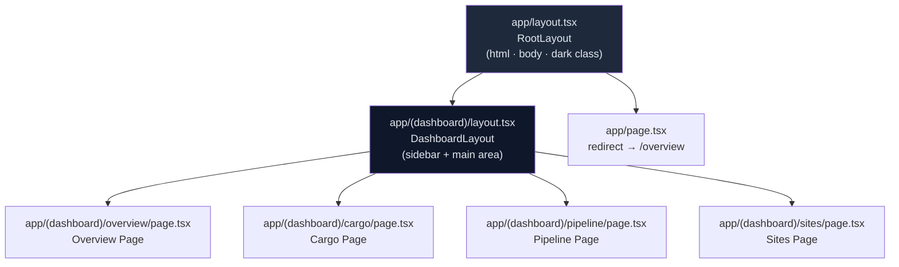

---

## 2. Root Layout

**File:** `app/layout.tsx`

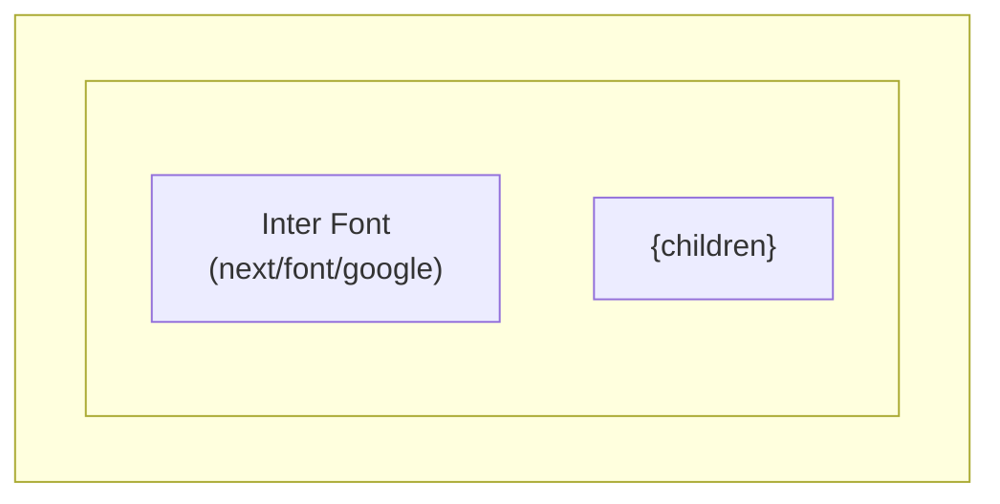

### Layout Properties

| Property | Value | Purpose |
|----------|-------|---------|
| `lang` | `"ko"` | Korean language (HVDC project) |
| `className` | `"dark"` | Forces dark theme globally |
| `font` | Inter (variable) | CSS variable `--font-inter` |
| `bg` | `bg-background` | Tailwind CSS variable → `hsl(var(--background))` |
| `minHeight` | `min-h-screen` | Full viewport height |
| Meta `title` | `"HVDC Logistics Dashboard"` | Browser tab title |
| Meta `description` | Project description | SEO |

### Font Configuration

```typescript
const inter = Inter({
  subsets: ['latin'],
  variable: '--font-inter',
  display: 'swap',
})
```

---

## 3. Dashboard Shell Layout

**File:** `app/(dashboard)/layout.tsx`

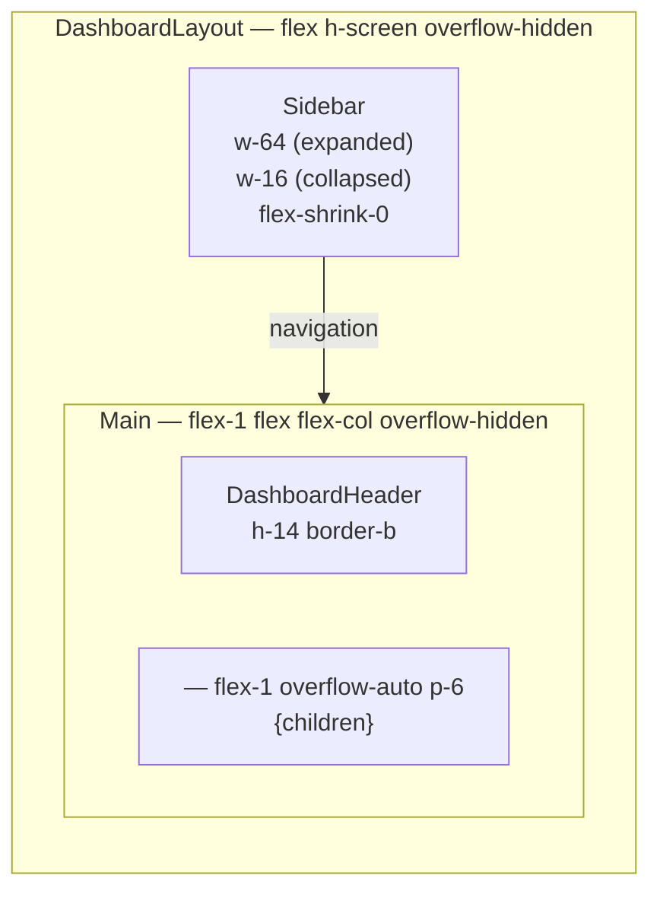

### Sidebar Dimensions

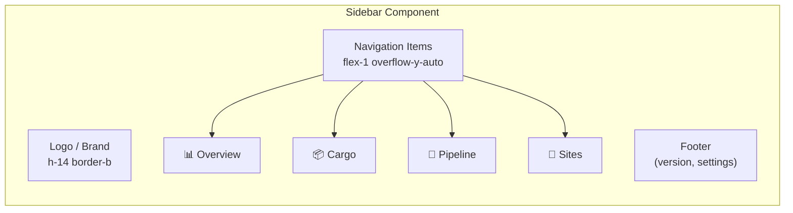

| State | Width | Behavior |
|-------|-------|----------|
| Expanded | `w-64` (256px) | Shows icon + label |
| Collapsed | `w-16` (64px) | Shows icon only |
| Mobile | `hidden` | Off-canvas (future) |

### Grid Layout Diagram

```
┌────────────────────────────────────────────────────────┐
│                    100vw × 100vh                       │
├──────────┬─────────────────────────────────────────────┤
│          │  DashboardHeader (h-14)                     │
│ Sidebar  ├─────────────────────────────────────────────┤
│ (w-64)   │                                             │
│          │  <main> — flex-1 overflow-auto p-6          │
│          │  {page content}                             │
│          │                                             │
└──────────┴─────────────────────────────────────────────┘
```

---

## 4. Overview Page Layout

**File:** `app/(dashboard)/overview/page.tsx`

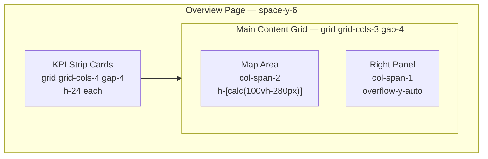

### KPI Strip Layout

```
┌──────────┬──────────┬──────────┬──────────┐
│  Total   │  현장    │  창고    │  Flow    │
│  Cases   │  도착    │  재고    │  Code    │
│  30      │  10      │  10      │  Dist.   │
│  📦      │  🏗️      │  🏭      │  📊      │
└──────────┴──────────┴──────────┴──────────┘
 col-span-1  col-span-1  col-span-1  col-span-1
         grid-cols-4 gap-4
```

### Main Content Layout

```
┌─────────────────────────────┬─────────────────┐
│                             │  Right Panel    │
│  Map (Deck.gl + Maplibre)   │                 │
│                             │  Live Feed      │
│  col-span-2                 │  ─────────────  │
│  h-[calc(100vh-280px)]      │  Alert Cards    │
│                             │  ─────────────  │
│                             │  Quick Stats    │
│                             │  col-span-1     │
└─────────────────────────────┴─────────────────┘
```

### KpiProvider Context Tree

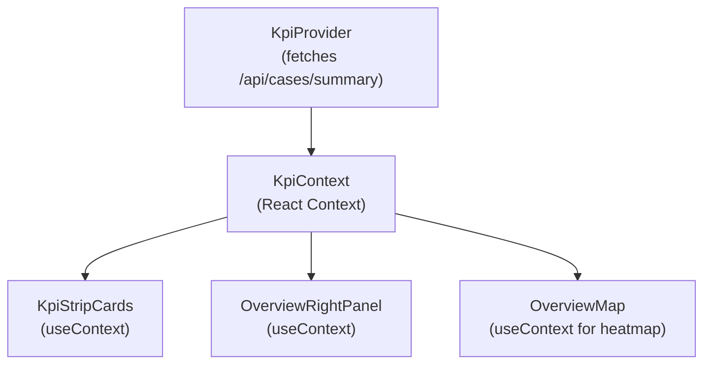

---

## 5. Cargo Page Layout

**File:** `app/(dashboard)/cargo/page.tsx`

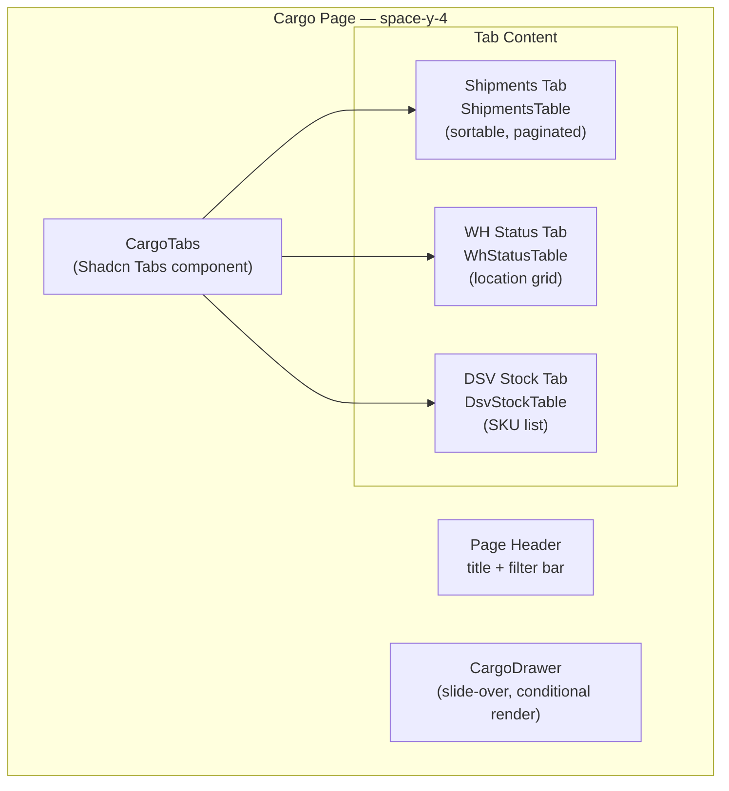

### Cargo Page Grid

```
┌────────────────────────────────────────────────────────┐
│  Page Header + Filter Bar                              │
├────────────────────────────────────────────────────────┤
│  [Shipments] [WH Status] [DSV Stock]  ← Tabs           │
├────────────────────────────────────────────────────────┤
│                                                        │
│  Active Tab Content (full width)                       │
│  • Sortable columns                                    │
│  • Pagination controls                                 │
│  • Row click → CargoDrawer opens from right            │
│                                                        │
└────────────────────────────────────────────────────────┘

                                     ┌──────────────┐
                                     │ CargoDrawer  │
                                     │ (w-96 slide) │
                                     │              │
                                     └──────────────┘
```

---

## 6. Pipeline Page Layout

**File:** `app/(dashboard)/pipeline/page.tsx`

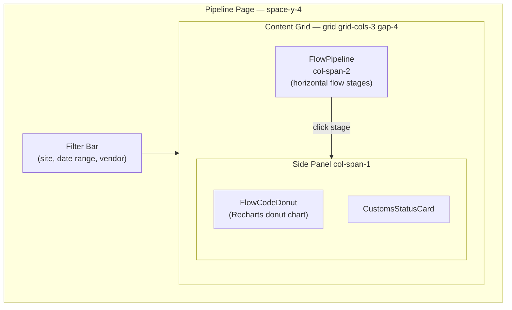

### Flow Pipeline Visual

```
Flow Code Progression:
┌──────┬──────┬──────┬──────┬──────┬──────┐
│  FC0 │  FC1 │  FC2 │  FC3 │  FC4 │  FC5 │
│      │      │      │      │      │      │
│ Pre  │Order │ Port │Customs│  WH  │ Site │
│Arrive│ Conf │ Disp │Clear │Stock │Deliv │
│  3   │  5   │  8   │  6   │  4   │  4   │
└──────┴──────┴──────┴──────┴──────┴──────┘
  ←────────── Flow direction ──────────→
```

---

## 7. Sites Page Layout

**File:** `app/(dashboard)/sites/page.tsx`

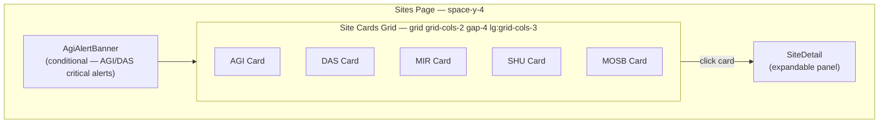

### Site Card Layout

```
┌─────────────────────────────┐
│  AGI — Abu Dhabi Grid (ADWEA)│
│  ●●●●●○ Flow Stage Progress │
├─────────────────────────────┤
│  Cases: 8    Pending: 2     │
│  SQM: 450    In Transit: 3  │
├─────────────────────────────┤
│  ▓▓▓▓▓▓▓░░░  67% complete  │
└─────────────────────────────┘
```

---

## 8. Responsive Breakpoints

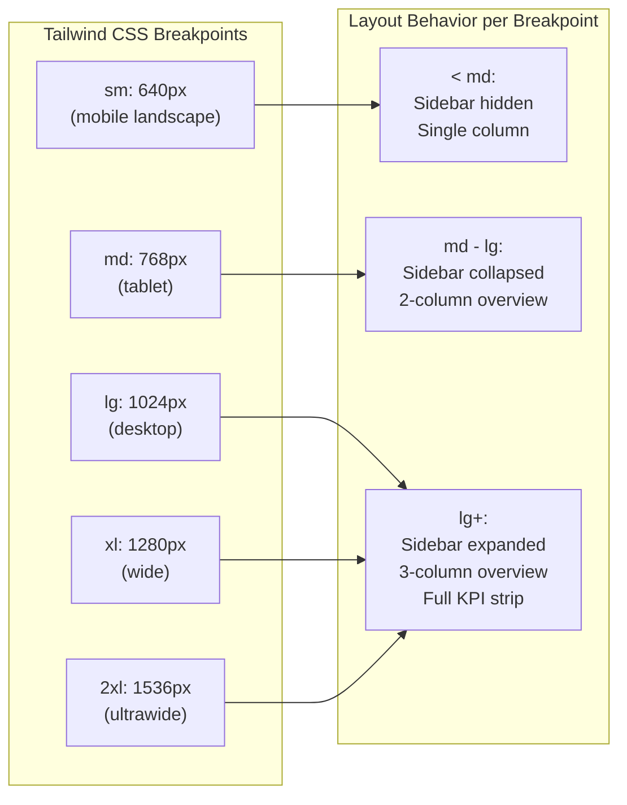

### Grid Responsiveness

| Component | Mobile (<md) | Tablet (md-lg) | Desktop (lg+) |
|-----------|-------------|----------------|---------------|
| KPI Strip | 2 cols | 4 cols | 4 cols |
| Overview Main | 1 col | 2 cols | 3 cols |
| Site Cards | 1 col | 2 cols | 3 cols |
| Sidebar | hidden | w-16 | w-64 |
| Cargo Tables | scroll-x | scroll-x | full width |

---

## 9. Navigation Flow

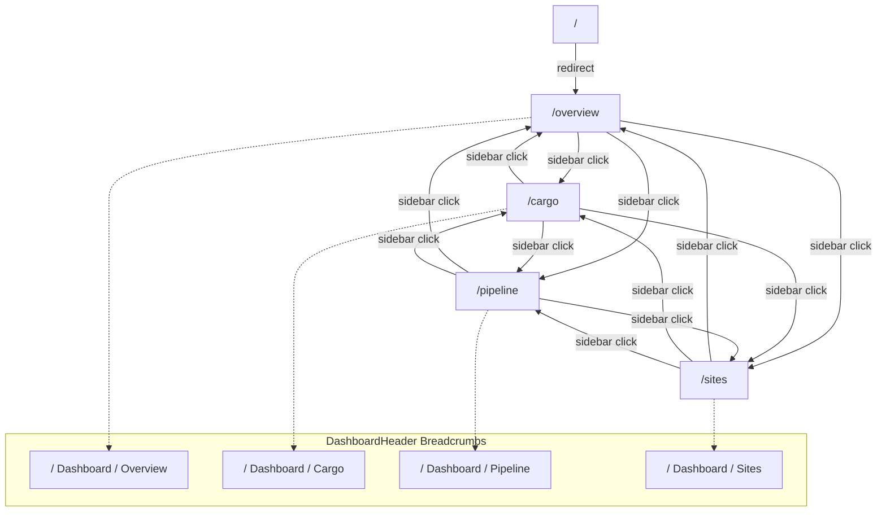

### Active Route Indication

```typescript
// Sidebar uses usePathname() for active detection
const pathname = usePathname()
const isActive = pathname.startsWith(item.href)

// Applied classes:
// Active: "bg-accent text-accent-foreground font-medium"
// Inactive: "text-muted-foreground hover:bg-accent/50"
```

---

## 10. CSS Architecture

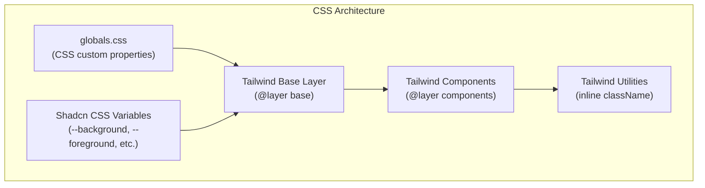

### CSS Custom Properties (Dark Theme)

```css
/* globals.css — dark theme tokens */
:root {
  --background: 222.2 84% 4.9%;      /* deep navy */
  --foreground: 210 40% 98%;          /* near-white */
  --card: 222.2 84% 4.9%;
  --card-foreground: 210 40% 98%;
  --popover: 222.2 84% 4.9%;
  --popover-foreground: 210 40% 98%;
  --primary: 210 40% 98%;
  --primary-foreground: 222.2 47.4% 11.2%;
  --secondary: 217.2 32.6% 17.5%;
  --secondary-foreground: 210 40% 98%;
  --muted: 217.2 32.6% 17.5%;
  --muted-foreground: 215 20.2% 65.1%;
  --accent: 217.2 32.6% 17.5%;
  --accent-foreground: 210 40% 98%;
  --destructive: 0 62.8% 30.6%;
  --destructive-foreground: 210 40% 98%;
  --border: 217.2 32.6% 17.5%;
  --input: 217.2 32.6% 17.5%;
  --ring: 212.7 26.8% 83.9%;
  --radius: 0.5rem;
}
```

### Spacing System

| Token | Value | Usage |
|-------|-------|-------|
| `p-4` | 16px | Card internal padding |
| `p-6` | 24px | Page content padding |
| `gap-4` | 16px | Grid/flex gap |
| `space-y-4` | 16px | Vertical stack spacing |
| `space-y-6` | 24px | Section spacing |
| `h-14` | 56px | Header height |
| `h-24` | 96px | KPI card height |

### Z-Index Layers

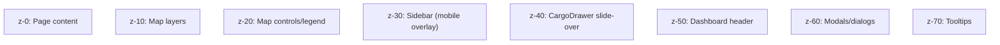
