# Layout Documentation — HVDC Logistics Dashboard

> **Version:** 2.0.0 | **Last Updated:** 2026-03-14
> **Framework:** Next.js 16 App Router | **Theme:** Dark (global) + Light-ops (Overview scoped)

---

## Table of Contents

1. [Layout Hierarchy](#1-layout-hierarchy)
2. [Root Layout](#2-root-layout)
3. [Dashboard Shell Layout](#3-dashboard-shell-layout)
4. [Overview Page Layout](#4-overview-page-layout)
5. [Cargo Page Layout](#5-cargo-page-layout)
6. [Pipeline Page Layout](#6-pipeline-page-layout)
7. [Sites Page Layout](#7-sites-page-layout)
8. [Chain Page Layout](#8-chain-page-layout)
9. [Responsive Breakpoints](#9-responsive-breakpoints)
10. [Navigation Flow](#10-navigation-flow)
11. [CSS Architecture](#11-css-architecture)

---

## 0. Overview Cockpit Update (v2.0)

The `/overview` page was completely restructured in v2.0. The old 4-zone layout (KPI rail + MapView + RightPanel + BottomPanel) has been replaced with a **7-row flex column layout** scoped under `data-theme="light-ops"`.

**Key changes:**
- Layout is now `overflow-auto` (scrollable) instead of fixed-height `overflow-hidden`
- Root div carries `data-theme="light-ops"` which activates a scoped light theme for the Overview page only — all other pages remain dark
- `ProgramFilterBar` (Row 2) is a new 48px bar with mode toggle, site filter, and `updatedAt` timestamp
- `ChainRibbonStrip` (Row 4) is a new 6-node horizontal ribbon fetching `/api/chain/summary`
- `SiteDeliveryMatrix` (Row 6) is a new 4-column card grid for per-site delivery status
- `MissionControl` replaces `OverviewRightPanel` (file preserved but removed from layout)
- `OpsSnapshot` replaces `OverviewBottomPanel` (file preserved but removed from layout)
- Every clickable overview card or map target continues to navigate to `/pipeline`, `/sites`, `/cargo`, or `/chain`
- Overview page data is sourced from `GET /api/overview` and hydrated through page-local `useOverviewData()`

## 1. Layout Hierarchy

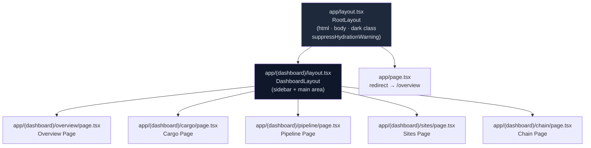

---

## 2. Root Layout

**File:** `app/layout.tsx`

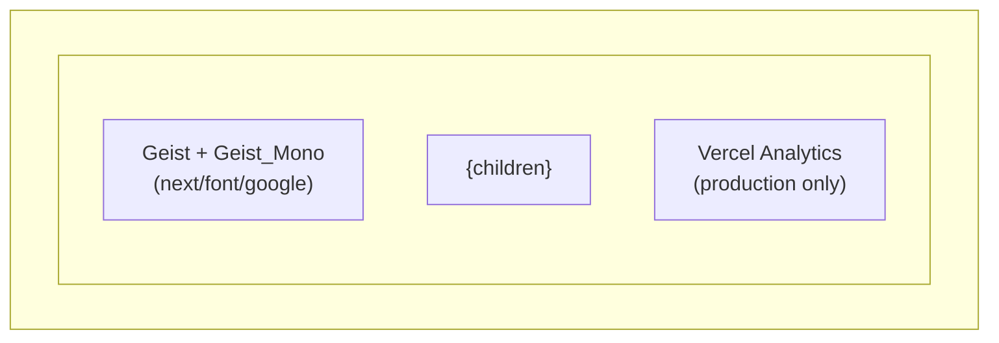

### Layout Properties

| Property | Value | Purpose |
|----------|-------|---------|
| `lang` | `"en"` | Language attribute |
| `className` | `"dark text-foreground font-sans"` | Forces dark theme + base typography |
| `suppressHydrationWarning` (html) | `true` | Suppress hydration mismatch on `<html>` |
| `suppressHydrationWarning` (body) | `true` | Suppress hydration mismatch on `<body>` |
| `font` | Geist, Geist_Mono | CSS variable `--font-geist` / `--font-geist-mono` |
| Meta `title` | `"MOSB Logistics Dashboard"` | Browser tab title |
| Meta `description` | Real-time logistics monitoring | SEO |
| `themeColor` | `"#0a0a0a"` | Mobile browser chrome color |

### Font Configuration

```typescript
const _geist = Geist({ subsets: ['latin'] })
const _geistMono = Geist_Mono({ subsets: ['latin'] })
```

### Hydration Warning Suppression

`suppressHydrationWarning` is applied to both the `<html>` and `<body>` elements. This is required because browser extensions (notably Kapture and similar DevTools extensions) inject attributes into the DOM before React hydration completes, causing React to detect a mismatch between server-rendered HTML and the client DOM. The prop tells React to skip the mismatch check for these top-level elements only.

**Why this is safe here:** The attributes injected by extensions (e.g., `data-*` attributes) do not affect rendering or logic — they are purely extension-internal metadata. Suppressing the warning at this level does not mask genuine application hydration bugs.

**Scope:** `suppressHydrationWarning` only suppresses warnings one level deep — it does not disable hydration checking for the entire subtree. Application components deeper in the tree are still fully hydration-checked.

---

## 3. Dashboard Shell Layout

**File:** `app/(dashboard)/layout.tsx`

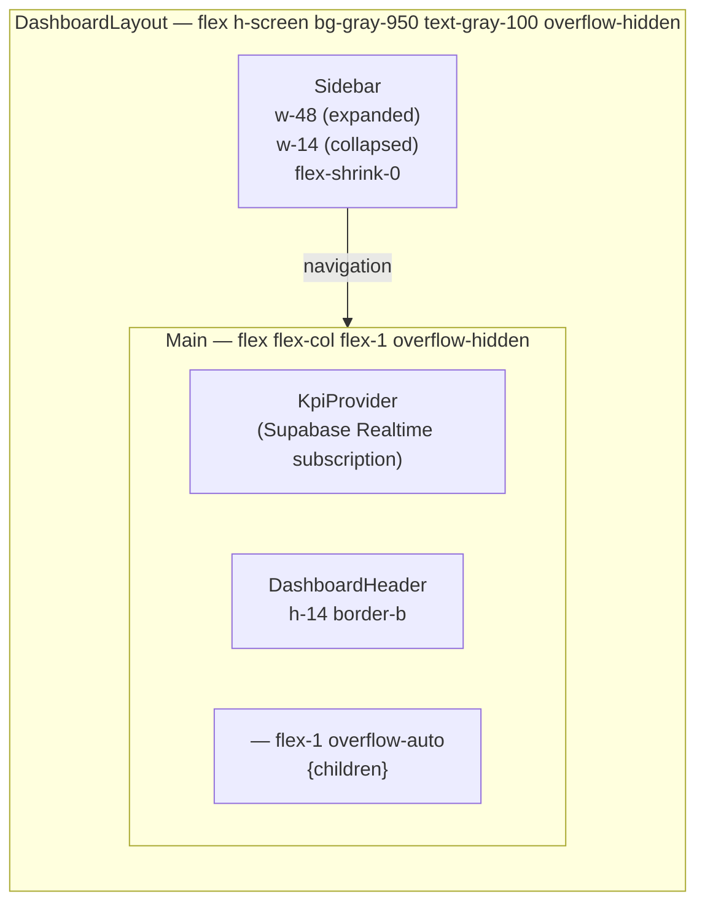

### Sidebar Dimensions

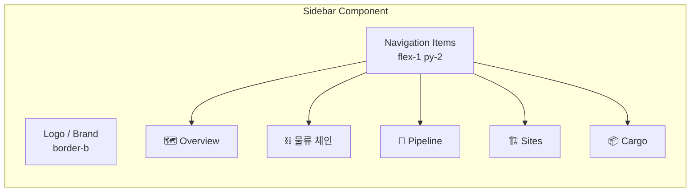

| State | Width | Behavior |
|-------|-------|----------|
| Expanded | `w-48` (192px) | Shows icon + label |
| Collapsed | `w-14` (56px) | Shows icon only |
| Mobile | `hidden` | Off-canvas (future) |

### Sidebar Style (Design Polish Patch 1 — commit c4eb9cb)

| Element | Value | Previous value |
|---------|-------|---------------|
| Sidebar background | `bg-[#071225]` (deeper navy) | `bg-gray-900` |
| Nav item shape | `rounded-xl px-4 py-3 text-[15px]` | `rounded-lg px-3 py-2.5 text-sm` |
| Active nav item | `bg-[#2563EB] shadow-[inset_0_1px_0_rgba(255,255,255,.12),0_6px_18px_rgba(37,99,235,.28)]` | `bg-blue-600 text-white` |

### LangToggle (Design Polish Patch 1)

The language toggle in `DashboardHeader` is styled as a **light floating pill** on the dark header:

```
border border-slate-200 bg-white p-1 shadow-sm
```

This contrasts with the surrounding dark header (`bg-gray-950` / `border-b border-gray-800`) to make the toggle visually distinct.

### Grid Layout Diagram

```
┌────────────────────────────────────────────────────────┐
│                    100vw × 100vh                       │
├──────────┬─────────────────────────────────────────────┤
│          │  KpiProvider (invisible, Realtime hook)     │
│          ├─────────────────────────────────────────────┤
│ Sidebar  │  DashboardHeader (h-14)                     │
│ (w-48)   ├─────────────────────────────────────────────┤
│          │                                             │
│          │  <main> — flex-1 overflow-auto              │
│          │  {page content}                             │
│          │                                             │
└──────────┴─────────────────────────────────────────────┘
```

---

## 4. Overview Page Layout

**File:** `app/(dashboard)/overview/OverviewPageClient.tsx`

> v2.0 (commit fd4e6be): Complete restructure. The old 4-zone fixed-height layout is replaced with a
> **7-row flex column** layout under `data-theme="light-ops"`. The page is now `overflow-auto`
> (scrollable) rather than `overflow-hidden` (fixed-height).

### Root Div

```tsx
<div
  data-theme="light-ops"
  className="flex h-full flex-col overflow-auto bg-[var(--ops-canvas)] text-[var(--ops-text-strong)]"
>
```

### 7-Row Structure

```
OverviewPageClient (data-theme="light-ops", flex col, h-full, overflow-auto)
├── Row 1: OverviewToolbar         (~44px, existing, unchanged)
├── Row 2: ProgramFilterBar        (48px, NEW — mode toggle + site filter + updatedAt)
├── Row 3: KpiStripCards ×8        (modified — 8 cards, grid xl:grid-cols-8 lg:grid-cols-4)
├── Row 4: ChainRibbonStrip        (NEW — 6-node horizontal ribbon, /api/chain/summary)
├── Row 5: [OverviewMap 2fr] | [MissionControl 1fr]   (min-h-[480px], xl:grid-cols-[2fr_1fr])
├── Row 6: SiteDeliveryMatrix      (NEW — 4 cards, grid xl:grid-cols-4)
└── Row 7: [OpenRadarTable 7fr] | [OpsSnapshot 5fr]   (xl:grid-cols-[7fr_5fr])
```

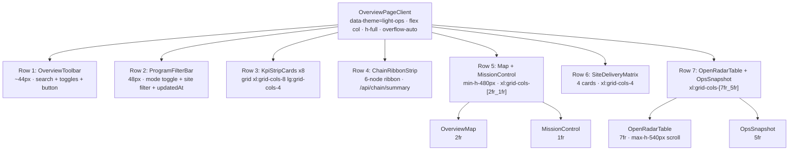

### Page Layout ASCII Diagram

```
+-------------------------------------------------------------------+
|  Row 1: OverviewToolbar (~44px)                                   |
|  [ShipmentSearchBar]  [Arc][항차][Heat]          [신규 항차 >]   |
+-------------------------------------------------------------------+
|  Row 2: ProgramFilterBar (48px)                                   |
|  [Mode Toggle]  [Site Filter v]                    [updatedAt]    |
+--------+--------+--------+--------+--------+--------+------+------+
| KPI 1  | KPI 2  | KPI 3  | KPI 4  | KPI 5  | KPI 6  | KPI7 | KPI8 |
|          Row 3: KpiStripCards x8 (xl:grid-cols-8)   ~88px        |
+-------------------------------------------------------------------+
|  Row 4: ChainRibbonStrip (~80px)                                  |
|  [Node 1] -- [Node 2] -- [Node 3] -- [Node 4] -- [Node 5] -- [Node 6] |
+------------------------------------------+------------------------+
|                                          |                        |
|  OverviewMap                             |  MissionControl        |
|  (Deck.gl + MapLibre)                    |  1fr                   |
|  2fr · min-h-[480px]                     |                        |
|                  Row 5                   |                        |
+----------+----------+----------+---------+------------------------+
|  Site 1  |  Site 2  |  Site 3  |  Site 4                         |
|               Row 6: SiteDeliveryMatrix (xl:grid-cols-4)         |
+------------------------------------------+------------------------+
|  OpenRadarTable                          |  OpsSnapshot           |
|  7fr · max-h-[540px] overflow-y-auto     |  5fr                   |
|                  Row 7                                            |
+-------------------------------------------------------------------+
```

---

### Row 1: OverviewToolbar (~44px, unchanged from v1.3.0)

**File:** `components/overview/OverviewToolbar.tsx`

The toolbar sits between the `DashboardHeader` and `ProgramFilterBar`, using `flex items-center justify-between` with a `border-b` separator.

| Zone | Component | Layout class | Notes |
|------|-----------|-------------|-------|
| Left | `ShipmentSearchBar` | `w-72 relative` | Dropdown positioned `absolute top-full z-50` |
| Center | `MapLayerToggles` | `flex gap-2` | Pill buttons |
| Right | 신규 항차 button | — | Blue (`bg-blue-600`), opens `NewVoyageModal` |

**ShipmentSearchBar dropdown z-index:** The input wrapper uses `position: relative` and the results dropdown uses `z-50` to float above the map and KPI strip without being clipped.

**MapLayerToggles pill states:**

```
Active:   bg-blue-600/80  text-white
Inactive: bg-gray-800     text-gray-400
```

Each pill directly toggles a boolean field in `logisticsStore` — no prop threading required.

---

### Row 2: ProgramFilterBar (48px, NEW)

**File:** `components/overview/ProgramFilterBar.tsx`

A new 48px filter bar below the toolbar. Contains three zones:

| Zone | Content | Notes |
|------|---------|-------|
| Left | Mode toggle | Switches between program display modes |
| Center | Site filter dropdown | Filters all rows by site |
| Right | `updatedAt` timestamp | Shows last data refresh time |

---

### Row 3: KpiStripCards x8 (modified)

8 KPI cards in a responsive grid. Layout class: `grid xl:grid-cols-8 lg:grid-cols-4`.

```
+--------+--------+--------+--------+--------+--------+--------+--------+
| KPI 1  | KPI 2  | KPI 3  | KPI 4  | KPI 5  | KPI 6  | KPI 7  | KPI 8  |
+--------+--------+--------+--------+--------+--------+--------+--------+
         xl: 8 columns        lg: 4 columns (wraps)        ~88px
```

---

### Row 4: ChainRibbonStrip (NEW)

**File:** `components/overview/ChainRibbonStrip.tsx`
**Data:** `GET /api/chain/summary`

A horizontal 6-node ribbon (~80px) visualising the end-to-end logistics chain. Nodes are connected by traced lines using `--ops-accent` (`#C6F10E`).

```
[Origin] ---- [Port] ---- [WH] ---- [MOSB] ---- [Transit] ---- [Site]
  Node 1       Node 2     Node 3    Node 4        Node 5        Node 6
                              ~80px · /api/chain/summary
```

---

### Row 5: OverviewMap + MissionControl (min-h-[480px])

Grid: `xl:grid-cols-[2fr_1fr]`

```
+------------------------------------+--------------------+
|  OverviewMap                       |  MissionControl    |
|  (Deck.gl + MapLibre)              |  (replaces         |
|  2fr · min-h-[480px]               |   OverviewRight    |
|                                    |   Panel)  1fr      |
+------------------------------------+--------------------+
```

- **OverviewMap** (`2fr`): Deck.gl arc/scatter layers + MapLibre base, min-h-[480px]
- **MissionControl** (`1fr`): Replaces the old `OverviewRightPanel`. `OverviewRightPanel.tsx` is preserved on disk but removed from `OverviewPageClient`.

---

### Row 6: SiteDeliveryMatrix (NEW)

**File:** `components/overview/SiteDeliveryMatrix.tsx`

4 cards in a grid, one per site (~280px total height). Layout class: `grid xl:grid-cols-4`.

```
+--------------+--------------+--------------+--------------+
|   Site A     |   Site B     |   Site C     |   Site D     |
|  Delivery    |  Delivery    |  Delivery    |  Delivery    |
|  Status      |  Status      |  Status      |  Status      |
+--------------+--------------+--------------+--------------+
                      ~280px · xl:grid-cols-4
```

---

### Row 7: OpenRadarTable + OpsSnapshot

Grid: `xl:grid-cols-[7fr_5fr]`

```
+------------------------------------+--------------------+
|  OpenRadarTable                    |  OpsSnapshot       |
|  7fr · max-h-[540px] scroll        |  (replaces         |
|                                    |   OverviewBottom   |
|                                    |   Panel)  5fr      |
+------------------------------------+--------------------+
```

- **OpenRadarTable** (`7fr`): Scrollable table with `max-h-[540px]`
- **OpsSnapshot** (`5fr`): Replaces the old `OverviewBottomPanel`. `OverviewBottomPanel.tsx` is preserved on disk but removed from `OverviewPageClient`. Outer bg changed to `bg-[#F8FAFC]` (was warm beige `#F7F3EA`).

---

### Deprecated Components (files preserved, removed from OverviewPageClient)

| File | Replaced by | Notes |
|------|-------------|-------|
| `components/overview/OverviewRightPanel.tsx` | `MissionControl` | File preserved on disk |
| `components/overview/OverviewBottomPanel.tsx` | `OpsSnapshot` | File preserved on disk |

---

### Height Budget (Overview 2.0 — approx. scroll layout)

The Overview page is `overflow-auto` (scrollable), not fixed-height. Key heights:

| Zone | Height | Notes |
|------|--------|-------|
| OverviewToolbar | ~44px | Row 1, unchanged |
| ProgramFilterBar | 48px | Row 2, new |
| KpiStripCards (8 cards) | ~88px | Row 3, modified |
| ChainRibbonStrip | ~80px | Row 4, new |
| Map + MissionControl | min-h-[480px] | Row 5 |
| SiteDeliveryMatrix | ~280px (4 cards) | Row 6, new |
| OpenRadarTable + OpsSnapshot | max-h-[540px] scroll | Row 7 |

---

### KpiProvider Context Tree

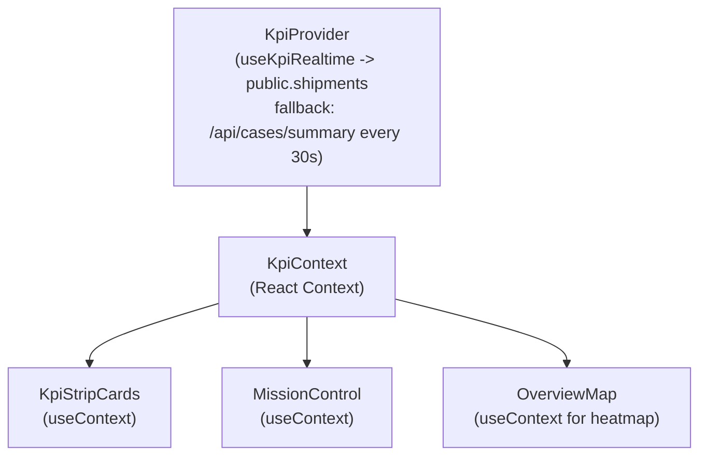
---

## 5. Cargo Page Layout

**File:** `app/(dashboard)/cargo/page.tsx`

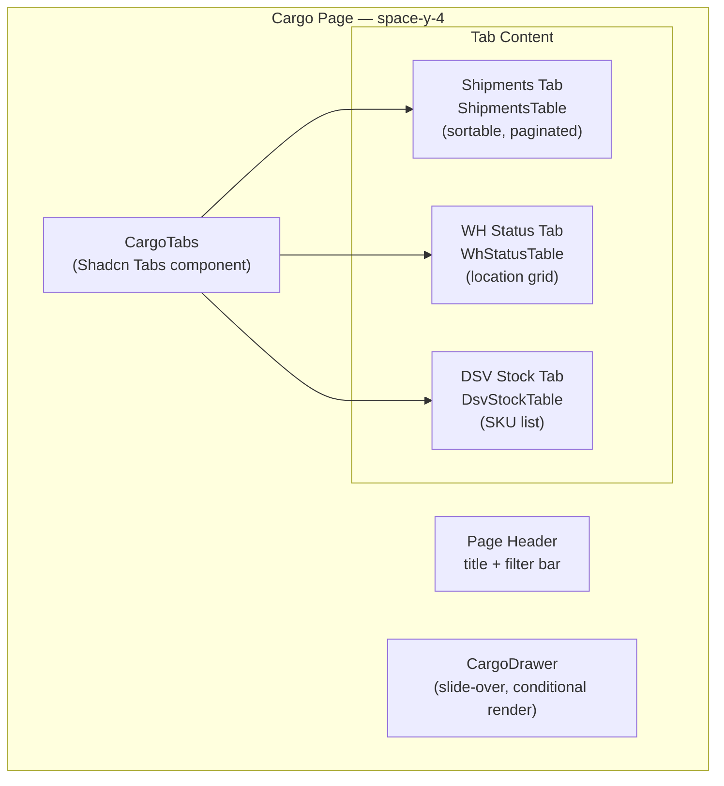

### Cargo Page Grid

```
┌────────────────────────────────────────────────────────┐
│  Page Header + Filter Bar                              │
├────────────────────────────────────────────────────────┤
│  [Shipments] [WH Status] [DSV Stock]  ← Tabs           │
├────────────────────────────────────────────────────────┤
│                                                        │
│  Active Tab Content (full width)                       │
│  • Sortable columns                                    │
│  • Pagination controls                                 │
│  • Row click → CargoDrawer opens from right            │
│                                                        │
└────────────────────────────────────────────────────────┘

                                     ┌──────────────┐
                                     │ CargoDrawer  │
                                     │ (w-96 slide) │
                                     │              │
                                     └──────────────┘
```

---

## 6. Pipeline Page Layout

**File:** `app/(dashboard)/pipeline/page.tsx`

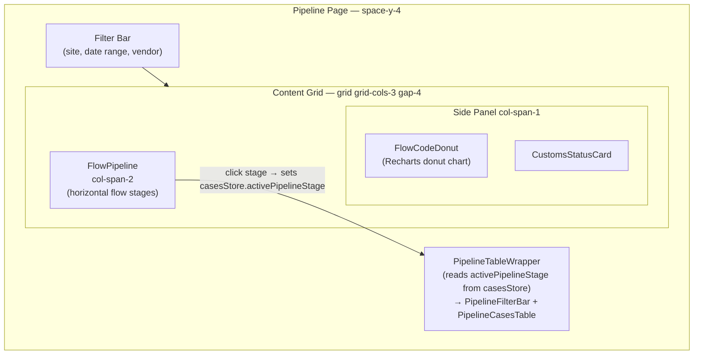

### Flow Pipeline Visual

```
Flow Code Progression:
┌──────┬──────┬──────┬──────┬──────┬──────┐
│  FC0 │  FC1 │  FC2 │  FC3 │  FC4 │  FC5 │
│      │      │      │      │      │      │
│ Pre  │Order │ Port │Customs│  WH  │ Site │
│Arrive│ Conf │ Disp │Clear │Stock │Deliv │
│  3   │  5   │  8   │  6   │  4   │  4   │
└──────┴──────┴──────┴──────┴──────┴──────┘
  ←────────── Flow direction ──────────→
```

---

## 7. Sites Page Layout

**File:** `app/(dashboard)/sites/page.tsx`

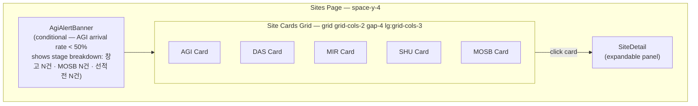

### Site Card Layout

```
┌─────────────────────────────┐
│  AGI — Abu Dhabi Grid (ADWEA)│
│  ●●●●●○ Flow Stage Progress │
├─────────────────────────────┤
│  Cases: 8    Pending: 2     │
│  SQM: 450    In Transit: 3  │
├─────────────────────────────┤
│  ▓▓▓▓▓▓▓░░░  67% complete  │
└─────────────────────────────┘
```

---

## 8. Chain Page Layout

**File:** `app/(dashboard)/chain/page.tsx`

Route: `/chain` — 전체 물류 체인 시각화 (FlowChain + OriginCountrySummary)

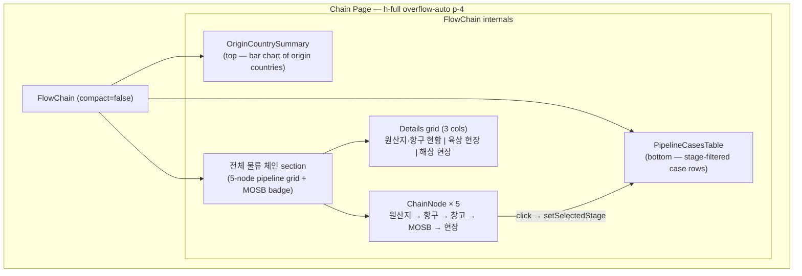

### Chain Page Visual Structure

```
┌────────────────────────────────────────────────────────┐
│  OriginCountrySummary                                  │
│  원산지 집계 — POL 기준 상위 국가 (bar chart)            │
├────────────────────────────────────────────────────────┤
│  전체 물류 체인                      [MOSB 경유 N건]   │
│  ┌────────┬──────┬──────┬──────┬──────┐               │
│  │ Pre-   │ Port │  WH  │ MOSB │ Site │  ← clickable  │
│  │arrival │      │      │      │      │    ChainNodes  │
│  └────────┴──────┴──────┴──────┴──────┘               │
│                                                        │
│  ┌──────────────────┬────────────┬──────────────────┐  │
│  │ 원산지 / 항구 현황│  육상 현장  │    해상 현장     │  │
│  │ Top 5 + 항구목록  │  SHU / MIR │   DAS / AGI      │  │
│  └──────────────────┴────────────┴──────────────────┘  │
├────────────────────────────────────────────────────────┤
│  PipelineCasesTable                                    │
│  (rows for selected stage — max-h-360px scrollable)    │
└────────────────────────────────────────────────────────┘
```

**Data flow:** `FlowChain` fetches `GET /api/chain/summary` on mount. Clicking a `ChainNode` sets `selectedStage` (local state), which is passed as the `stage` prop to `PipelineCasesTable`. The table independently fetches `/api/cases?stage=<stage>`.

---

## 9. Responsive Breakpoints

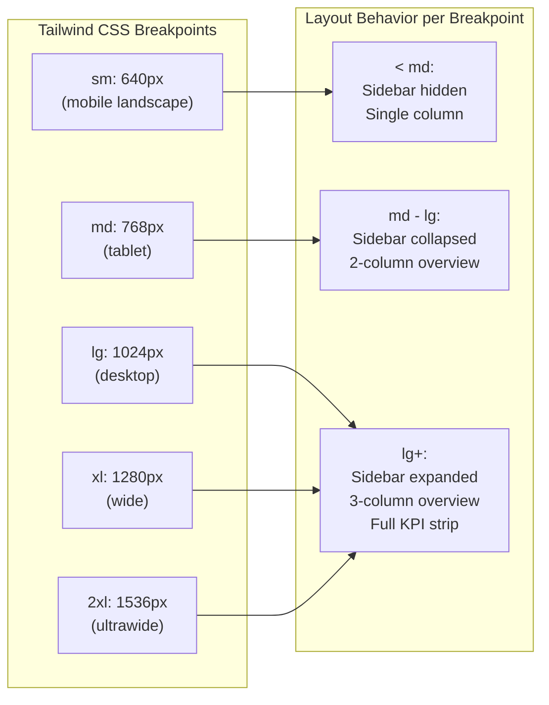

### Grid Responsiveness

| Component | Mobile (<md) | Tablet (md-lg) | Desktop (lg) | Wide (xl+) |
|-----------|-------------|----------------|--------------|------------|
| KPI Strip | 2 cols | 4 cols | 4 cols | 8 cols |
| Overview Main | 1 col | 2 cols | 3 cols | 7-row scroll |
| Site Cards | 1 col | 2 cols | 3 cols | 3 cols |
| Chain Details | 1 col | 2 cols | 3 cols | 3 cols |
| SiteDeliveryMatrix | 1 col | 2 cols | 2 cols | 4 cols |
| Sidebar | hidden | w-14 | w-48 | w-48 |
| Cargo Tables | scroll-x | scroll-x | full width | full width |

---

## 10. Navigation Flow

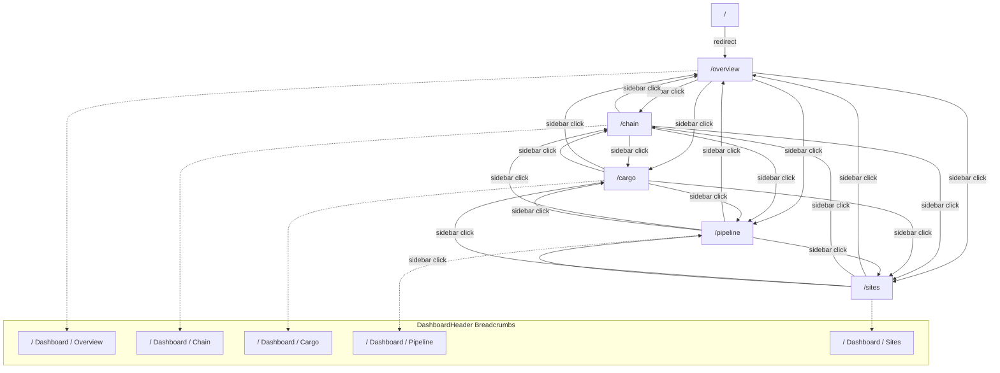

### Active Route Indication

```typescript
// Sidebar uses usePathname() for active detection
const pathname = usePathname()
const isActive = pathname === item.href || pathname.startsWith(item.href + '/')

// Applied classes:
// Active:   "bg-blue-600 text-white"
// Inactive: "text-gray-400 hover:bg-gray-800 hover:text-gray-200"
```

---

## 11. CSS Architecture

`globals.css` now contains **two theme zones**:
1. **Dark global theme** — `:root` tokens applied to the entire app
2. **Light-ops scoped theme** — `[data-theme="light-ops"]` tokens applied only to the Overview page root div

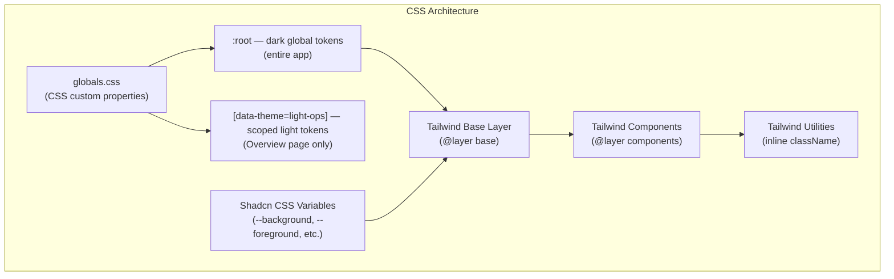

### CSS Custom Properties (Dark Theme — global)

```css
/* globals.css — dark theme tokens */
:root {
  --background: 222.2 84% 4.9%;      /* deep navy */
  --foreground: 210 40% 98%;          /* near-white */
  --card: 222.2 84% 4.9%;
  --card-foreground: 210 40% 98%;
  --popover: 222.2 84% 4.9%;
  --popover-foreground: 210 40% 98%;
  --primary: 210 40% 98%;
  --primary-foreground: 222.2 47.4% 11.2%;
  --secondary: 217.2 32.6% 17.5%;
  --secondary-foreground: 210 40% 98%;
  --muted: 217.2 32.6% 17.5%;
  --muted-foreground: 215 20.2% 65.1%;
  --accent: 217.2 32.6% 17.5%;
  --accent-foreground: 210 40% 98%;
  --destructive: 0 62.8% 30.6%;
  --destructive-foreground: 210 40% 98%;
  --border: 217.2 32.6% 17.5%;
  --input: 217.2 32.6% 17.5%;
  --ring: 212.7 26.8% 83.9%;
  --radius: 0.5rem;
}
```

### CSS Custom Properties (Light-ops Scoped Theme — Overview only)

The `[data-theme="light-ops"]` selector is scoped to the `OverviewPageClient` root div. It does **not** affect any other page. The dashboard shell (`app/(dashboard)/layout.tsx`) remains dark (`bg-gray-950`).

```css
/* globals.css — light-ops scoped theme (Overview page only) */
[data-theme="light-ops"] {
  --ops-canvas:       #F4F5F7;   /* page background */
  --ops-surface:      #FFFFFF;   /* card/panel background */
  --ops-surface-warm: #F7F3EA;   /* (legacy, kept for compat) */
  --ops-border:       #D9DEE5;   /* borders */
  --ops-text-strong:  #101215;   /* headings */
  --ops-text-muted:   #697586;   /* labels */
  --ops-accent:       #C6F10E;   /* chain ribbon trace */
  --ops-info:         #2563EB;   /* info blue */
  --ops-warn:         #D97706;   /* amber warning */
  --ops-risk:         #DC2626;   /* red risk */
  --ops-done:         #16A34A;   /* green done */
}
```

| Token | Value | Usage |
|-------|-------|-------|
| `--ops-canvas` | `#F4F5F7` | Page background (replaces dark `bg-gray-950`) |
| `--ops-surface` | `#FFFFFF` | Card and panel backgrounds |
| `--ops-border` | `#D9DEE5` | Card borders, dividers |
| `--ops-text-strong` | `#101215` | Headings and primary text |
| `--ops-text-muted` | `#697586` | Secondary labels |
| `--ops-accent` | `#C6F10E` | ChainRibbonStrip trace lines |
| `--ops-info` | `#2563EB` | Info states, active indicators |
| `--ops-warn` | `#D97706` | Amber warning states |
| `--ops-risk` | `#DC2626` | Red risk/alert states |
| `--ops-done` | `#16A34A` | Green complete states |

### Spacing System

| Token | Value | Usage |
|-------|-------|-------|
| `p-4` | 16px | Card internal padding |
| `p-6` | 24px | Page content padding |
| `gap-4` | 16px | Grid/flex gap |
| `space-y-4` | 16px | Vertical stack spacing |
| `space-y-6` | 24px | Section spacing |
| `h-14` | 56px | Header height |
| `h-24` | 96px | KPI card height |

### Z-Index Layers

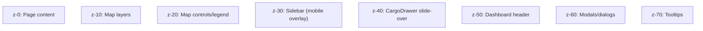
