# Layout Documentation — HVDC Logistics Dashboard

> **Version:** 1.3.0 | **Last Updated:** 2026-03-14
> **Framework:** Next.js 16 App Router | **Theme:** Dark (forced)

---

## Table of Contents

1. [Layout Hierarchy](#1-layout-hierarchy)
2. [Root Layout](#2-root-layout)
3. [Dashboard Shell Layout](#3-dashboard-shell-layout)
4. [Overview Page Layout](#4-overview-page-layout)
5. [Cargo Page Layout](#5-cargo-page-layout)
6. [Pipeline Page Layout](#6-pipeline-page-layout)
7. [Sites Page Layout](#7-sites-page-layout)
8. [Chain Page Layout](#8-chain-page-layout)
9. [Responsive Breakpoints](#9-responsive-breakpoints)
10. [Navigation Flow](#10-navigation-flow)
11. [CSS Architecture](#11-css-architecture)

---

## 0. Overview Cockpit Update

- `/overview` keeps the integrated invariant: `상단 KPI rail + 좌측 MapView + 우측 RightPanel + 하단 HVDC panel`
- Every clickable overview card or map target now navigates to `/pipeline`, `/sites`, `/cargo`, or `/chain`
- Destination pages restore state from URL and show plain-language context chips
- Overview page data is now sourced from `GET /api/overview` and hydrated through page-local `useOverviewData()`
- Public route labels come from `configs/overview.route-types.json`; destination contracts come from `configs/overview.destinations.json`

## 1. Layout Hierarchy

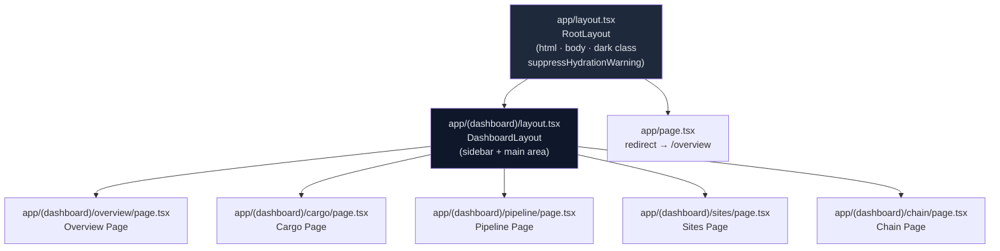

---

## 2. Root Layout

**File:** `app/layout.tsx`

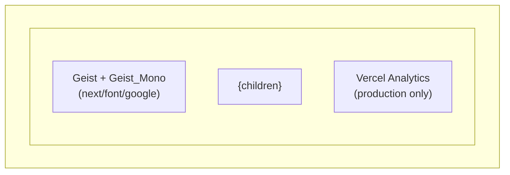

### Layout Properties

| Property | Value | Purpose |
|----------|-------|---------|
| `lang` | `"en"` | Language attribute |
| `className` | `"dark text-foreground font-sans"` | Forces dark theme + base typography |
| `suppressHydrationWarning` (html) | `true` | Suppress hydration mismatch on `<html>` |
| `suppressHydrationWarning` (body) | `true` | Suppress hydration mismatch on `<body>` |
| `font` | Geist, Geist_Mono | CSS variable `--font-geist` / `--font-geist-mono` |
| Meta `title` | `"MOSB Logistics Dashboard"` | Browser tab title |
| Meta `description` | Real-time logistics monitoring | SEO |
| `themeColor` | `"#0a0a0a"` | Mobile browser chrome color |

### Font Configuration

```typescript
const _geist = Geist({ subsets: ['latin'] })
const _geistMono = Geist_Mono({ subsets: ['latin'] })
```

### Hydration Warning Suppression

`suppressHydrationWarning` is applied to both the `<html>` and `<body>` elements. This is required because browser extensions (notably Kapture and similar DevTools extensions) inject attributes into the DOM before React hydration completes, causing React to detect a mismatch between server-rendered HTML and the client DOM. The prop tells React to skip the mismatch check for these top-level elements only.

**Why this is safe here:** The attributes injected by extensions (e.g., `data-*` attributes) do not affect rendering or logic — they are purely extension-internal metadata. Suppressing the warning at this level does not mask genuine application hydration bugs.

**Scope:** `suppressHydrationWarning` only suppresses warnings one level deep — it does not disable hydration checking for the entire subtree. Application components deeper in the tree are still fully hydration-checked.

---

## 3. Dashboard Shell Layout

**File:** `app/(dashboard)/layout.tsx`

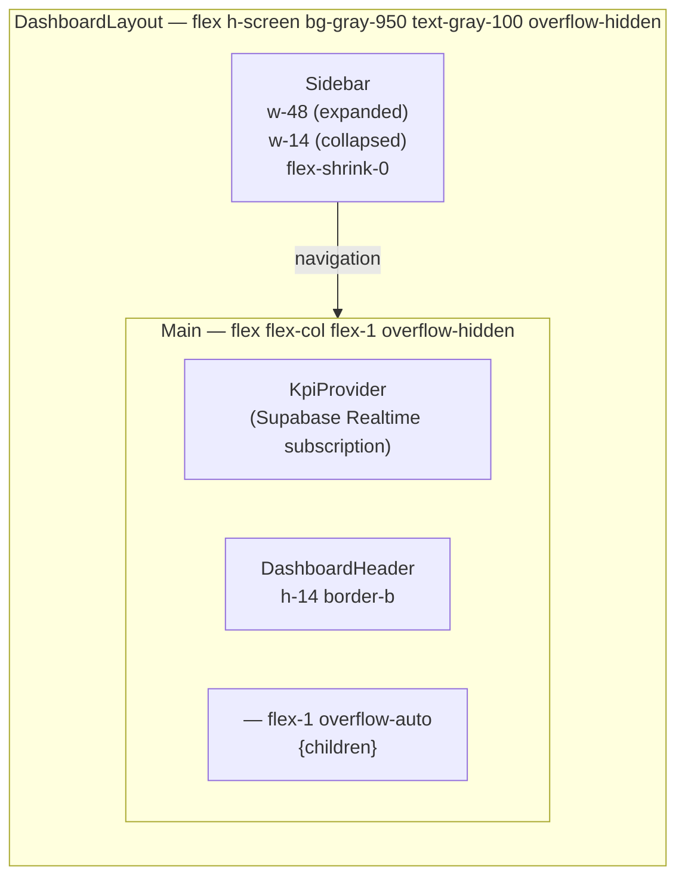

### Sidebar Dimensions

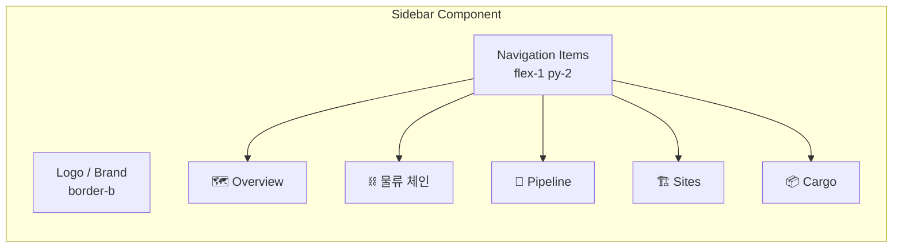

| State | Width | Behavior |
|-------|-------|----------|
| Expanded | `w-48` (192px) | Shows icon + label |
| Collapsed | `w-14` (56px) | Shows icon only |
| Mobile | `hidden` | Off-canvas (future) |

### Grid Layout Diagram

```
┌────────────────────────────────────────────────────────┐
│                    100vw × 100vh                       │
├──────────┬─────────────────────────────────────────────┤
│          │  KpiProvider (invisible, Realtime hook)     │
│          ├─────────────────────────────────────────────┤
│ Sidebar  │  DashboardHeader (h-14)                     │
│ (w-48)   ├─────────────────────────────────────────────┤
│          │                                             │
│          │  <main> — flex-1 overflow-auto              │
│          │  {page content}                             │
│          │                                             │
└──────────┴─────────────────────────────────────────────┘
```

---

## 4. Overview Page Layout

**File:** `app/(dashboard)/overview/OverviewPageClient.tsx`

> Layout type changed from grid-based to **flex column** in v1.3.0 to support
> a fixed bottom panel and proper viewport-filling behaviour without overflow.
> v1.3.0 also adds `OverviewToolbar` as the first child above `KpiStripCards`.

```
OverviewPageClient (flex col, h-full, overflow-hidden)
├── OverviewToolbar        ← NEW (v1.3.0): ~44px, search + toggles + button
├── KpiStripCards          ← ~80px KPI rail (5 cards)
├── Middle section (flex-1, min-h-0)
│   ├── OverviewMap        ← left, flex-1, min-h-[360px]
│   └── OverviewRightPanel ← right, xl:w-[360px], overflow-y-auto
│       └── ShipmentDetailCard ← NEW (v1.3.0): shown when shipment selected
└── OverviewBottomPanel    ← ~240px, worklist + pipeline strip
```

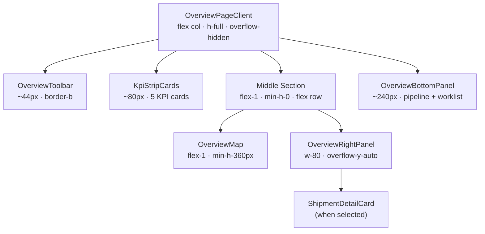

The older mermaid diagram (pre-v1.3.0):

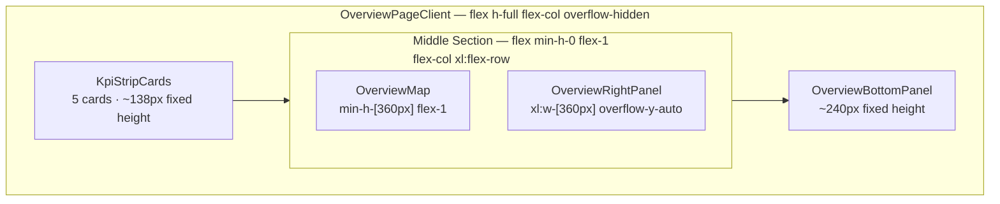

### OverviewToolbar Layout (v1.3.0)

**File:** `components/overview/OverviewToolbar.tsx`

The toolbar sits between the `DashboardHeader` and `KpiStripCards`, using `flex items-center justify-between` with a `border-b border-gray-800` separator and approximately **44px** height.

```
┌──────────────────────────────────────────────────────────┐
│  [ShipmentSearchBar w-72]  [🌐 Arc][🚢 항차][🔥 Heat]  [신규 항차 ▸] │
│  ← left ──────────────── center ──────────────── right →  │
└──────────────────────────────────────────────────────────┘
                  ~44px · border-b · flex items-center justify-between
```

| Zone | Component | Layout class | Notes |
|------|-----------|-------------|-------|
| Left | `ShipmentSearchBar` | `w-72 relative` | Dropdown positioned `absolute top-full z-50` |
| Center | `MapLayerToggles` | `flex gap-2` | Pill buttons |
| Right | 신규 항차 button | — | Blue (`bg-blue-600`), opens `NewVoyageModal` |

**ShipmentSearchBar dropdown z-index:** The input wrapper uses `position: relative` and the results dropdown uses `z-50` to float above the map and KPI strip without being clipped.

**MapLayerToggles pill states:**

```
Active:   bg-blue-600/80  text-white
Inactive: bg-gray-800     text-gray-400
```

Each pill directly toggles a boolean field in `logisticsStore` — no prop threading required.

---

### KPI Strip Layout

5개 카드, `flex` 행, 고정 높이 ~138px (패딩 포함).

```
┌──────────┬──────────┬──────────┬──────────┬──────────┐
│  Total   │  현장    │  창고    │  Flow    │  긴급    │
│  Cases   │  도착    │  재고    │  Code    │  알람    │
│  30      │  10      │  10      │  Dist.   │   2      │
└──────────┴──────────┴──────────┴──────────┴──────────┘
                  flex row · 5 cards · ~138px
```

### Middle Section Layout

`flex-1` + `min-h-0` 조합으로 KPI strip과 bottom panel 사이의 남은 공간을 채운다.
`xl` 미만: 세로 적층 / `xl` 이상: 가로 배치.

```
┌─────────────────────────────────────┬───────────────────┐
│                                     │  OverviewRight    │
│  OverviewMap                        │  Panel            │
│  (Deck.gl + MapLibre)               │  xl:w-[360px]     │
│                                     │                   │
│  min-h-[360px]                      │  4개 섹션:        │
│  flex-1 (남은 가로 공간 차지)       │  • 예외 보드      │
│                                     │  • 운송 경로 요약 │
│                                     │  • 현장 준비도    │
│                                     │  • 최근 활동      │
│                                     │  overflow-y-auto  │
└─────────────────────────────────────┴───────────────────┘
```

### Bottom Panel Layout

`border-t border-gray-800 bg-gray-950/60 p-4`, 총 높이 ~240px.

```
┌─────────────────────────────────────┬──────────────────┐
│  Pipeline Stages                    │  Priority        │
│                                     │  Worklist        │
│  [FC0] [FC1] [FC2] [FC3] [FC4]      │                  │
│  md:grid-cols-5 버튼 행             │  max-h-[160px]   │
│                                     │  overflow-y-auto │
│  xl:grid-cols-[1.5fr_1fr]           │                  │
└─────────────────────────────────────┴──────────────────┘
                      ~240px
```

내부 구조:
- 컨테이너: `grid gap-4 xl:grid-cols-[1.5fr_1fr]`
- 왼쪽: Pipeline 단계 버튼 5개 (`md:grid-cols-5`)
- 오른쪽: Priority Worklist (`max-h-[160px] overflow-y-auto`)

### Height Budget (viewport ~739px 기준, v1.3.0)

| Zone | Height | Notes |
|------|--------|-------|
| OverviewToolbar | ~44px | 고정 (v1.3.0 신규) |
| KPI Strip | ~80px | 고정 |
| Bottom Panel | ~240px | 고정 (pipeline + worklist max-h-[160px]) |
| Middle (flex-1) | ~375px | 739 − 44 − 80 − 240 |
| Map min-h | 360px | min-h-[360px] 충족 ✓ |
| Right Panel content | ~343px | 375px − 32px(padding), overflow-y-auto |

### KpiProvider Context Tree

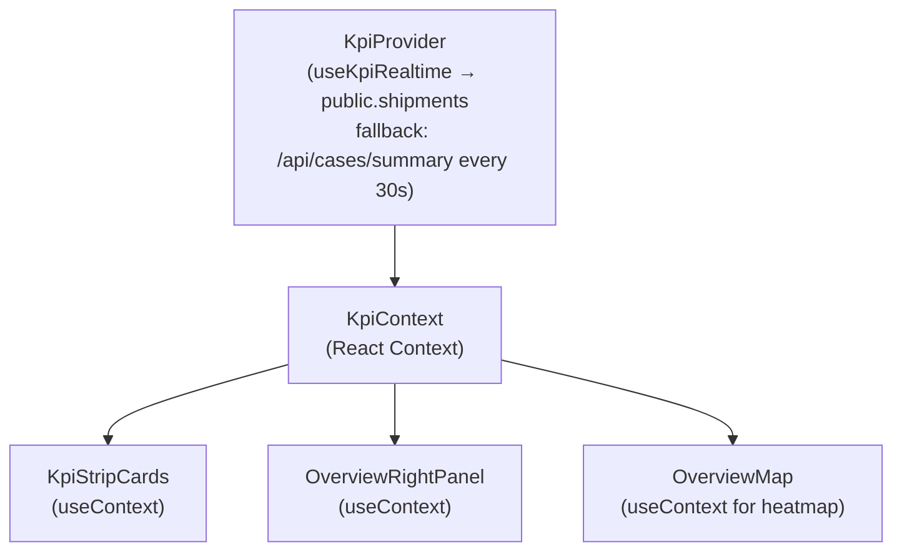

---

## 5. Cargo Page Layout

**File:** `app/(dashboard)/cargo/page.tsx`

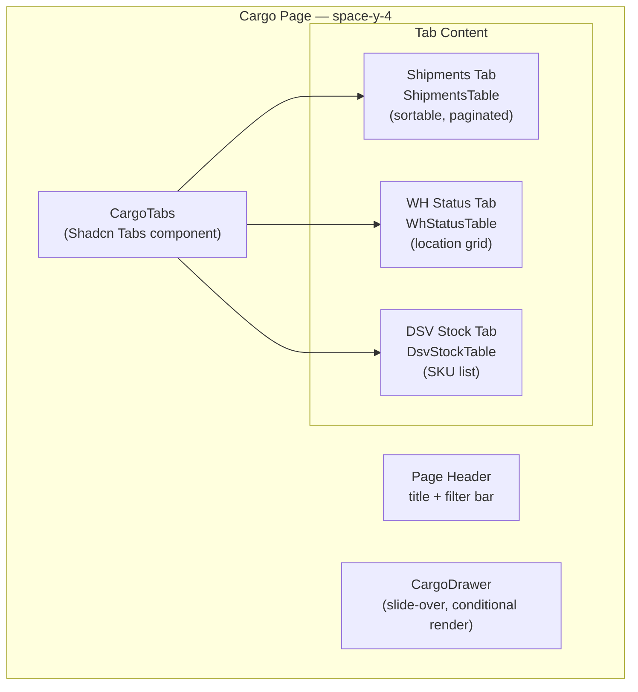

### Cargo Page Grid

```
┌────────────────────────────────────────────────────────┐
│  Page Header + Filter Bar                              │
├────────────────────────────────────────────────────────┤
│  [Shipments] [WH Status] [DSV Stock]  ← Tabs           │
├────────────────────────────────────────────────────────┤
│                                                        │
│  Active Tab Content (full width)                       │
│  • Sortable columns                                    │
│  • Pagination controls                                 │
│  • Row click → CargoDrawer opens from right            │
│                                                        │
└────────────────────────────────────────────────────────┘

                                     ┌──────────────┐
                                     │ CargoDrawer  │
                                     │ (w-96 slide) │
                                     │              │
                                     └──────────────┘
```

---

## 6. Pipeline Page Layout

**File:** `app/(dashboard)/pipeline/page.tsx`

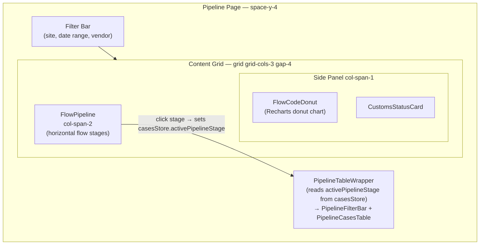

### Flow Pipeline Visual

```
Flow Code Progression:
┌──────┬──────┬──────┬──────┬──────┬──────┐
│  FC0 │  FC1 │  FC2 │  FC3 │  FC4 │  FC5 │
│      │      │      │      │      │      │
│ Pre  │Order │ Port │Customs│  WH  │ Site │
│Arrive│ Conf │ Disp │Clear │Stock │Deliv │
│  3   │  5   │  8   │  6   │  4   │  4   │
└──────┴──────┴──────┴──────┴──────┴──────┘
  ←────────── Flow direction ──────────→
```

---

## 7. Sites Page Layout

**File:** `app/(dashboard)/sites/page.tsx`

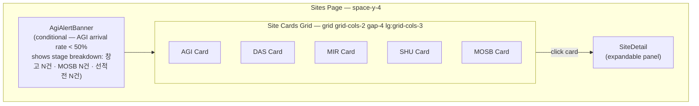

### Site Card Layout

```
┌─────────────────────────────┐
│  AGI — Abu Dhabi Grid (ADWEA)│
│  ●●●●●○ Flow Stage Progress │
├─────────────────────────────┤
│  Cases: 8    Pending: 2     │
│  SQM: 450    In Transit: 3  │
├─────────────────────────────┤
│  ▓▓▓▓▓▓▓░░░  67% complete  │
└─────────────────────────────┘
```

---

## 8. Chain Page Layout

**File:** `app/(dashboard)/chain/page.tsx`

Route: `/chain` — 전체 물류 체인 시각화 (FlowChain + OriginCountrySummary)

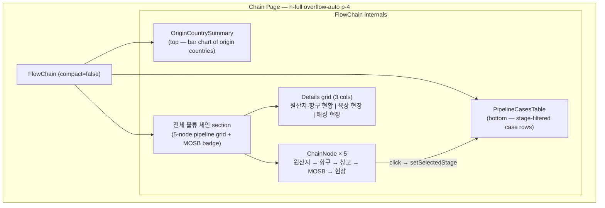

### Chain Page Visual Structure

```
┌────────────────────────────────────────────────────────┐
│  OriginCountrySummary                                  │
│  원산지 집계 — POL 기준 상위 국가 (bar chart)            │
├────────────────────────────────────────────────────────┤
│  전체 물류 체인                      [MOSB 경유 N건]   │
│  ┌────────┬──────┬──────┬──────┬──────┐               │
│  │ Pre-   │ Port │  WH  │ MOSB │ Site │  ← clickable  │
│  │arrival │      │      │      │      │    ChainNodes  │
│  └────────┴──────┴──────┴──────┴──────┘               │
│                                                        │
│  ┌──────────────────┬────────────┬──────────────────┐  │
│  │ 원산지 / 항구 현황│  육상 현장  │    해상 현장     │  │
│  │ Top 5 + 항구목록  │  SHU / MIR │   DAS / AGI      │  │
│  └──────────────────┴────────────┴──────────────────┘  │
├────────────────────────────────────────────────────────┤
│  PipelineCasesTable                                    │
│  (rows for selected stage — max-h-360px scrollable)    │
└────────────────────────────────────────────────────────┘
```

**Data flow:** `FlowChain` fetches `GET /api/chain/summary` on mount. Clicking a `ChainNode` sets `selectedStage` (local state), which is passed as the `stage` prop to `PipelineCasesTable`. The table independently fetches `/api/cases?stage=<stage>`.

---

## 9. Responsive Breakpoints

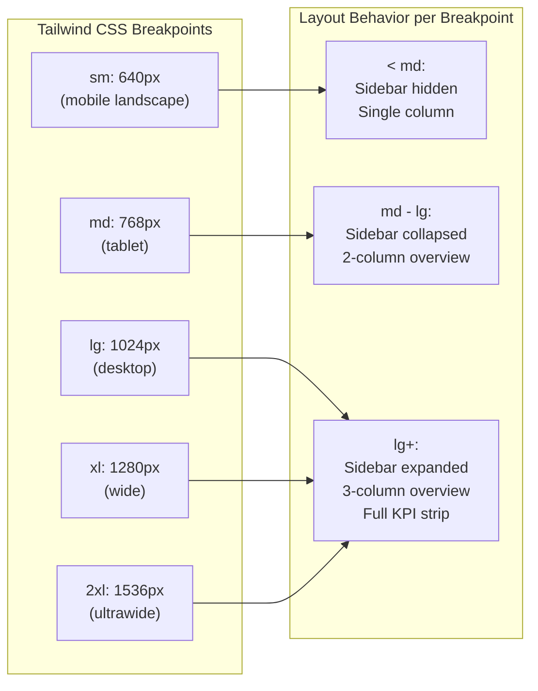

### Grid Responsiveness

| Component | Mobile (<md) | Tablet (md-lg) | Desktop (lg+) |
|-----------|-------------|----------------|---------------|
| KPI Strip | 2 cols | 4 cols | 4 cols |
| Overview Main | 1 col | 2 cols | 3 cols |
| Site Cards | 1 col | 2 cols | 3 cols |
| Chain Details | 1 col | 2 cols | 3 cols |
| Sidebar | hidden | w-14 | w-48 |
| Cargo Tables | scroll-x | scroll-x | full width |

---

## 10. Navigation Flow

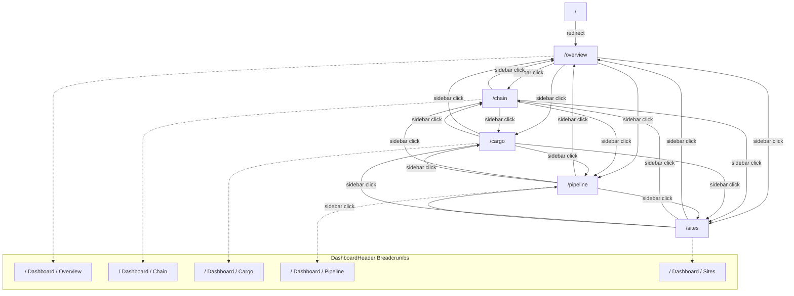

### Active Route Indication

```typescript
// Sidebar uses usePathname() for active detection
const pathname = usePathname()
const isActive = pathname === item.href || pathname.startsWith(item.href + '/')

// Applied classes:
// Active:   "bg-blue-600 text-white"
// Inactive: "text-gray-400 hover:bg-gray-800 hover:text-gray-200"
```

---

## 11. CSS Architecture

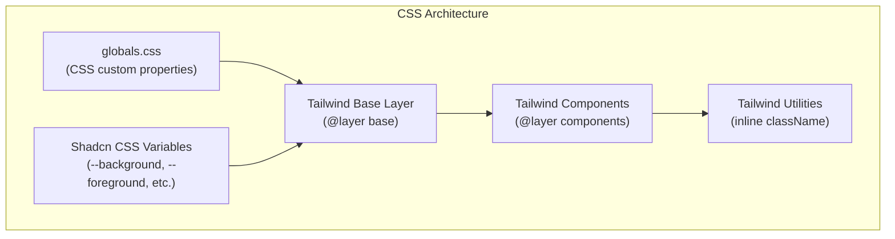

### CSS Custom Properties (Dark Theme)

```css
/* globals.css — dark theme tokens */
:root {
  --background: 222.2 84% 4.9%;      /* deep navy */
  --foreground: 210 40% 98%;          /* near-white */
  --card: 222.2 84% 4.9%;
  --card-foreground: 210 40% 98%;
  --popover: 222.2 84% 4.9%;
  --popover-foreground: 210 40% 98%;
  --primary: 210 40% 98%;
  --primary-foreground: 222.2 47.4% 11.2%;
  --secondary: 217.2 32.6% 17.5%;
  --secondary-foreground: 210 40% 98%;
  --muted: 217.2 32.6% 17.5%;
  --muted-foreground: 215 20.2% 65.1%;
  --accent: 217.2 32.6% 17.5%;
  --accent-foreground: 210 40% 98%;
  --destructive: 0 62.8% 30.6%;
  --destructive-foreground: 210 40% 98%;
  --border: 217.2 32.6% 17.5%;
  --input: 217.2 32.6% 17.5%;
  --ring: 212.7 26.8% 83.9%;
  --radius: 0.5rem;
}
```

### Spacing System

| Token | Value | Usage |
|-------|-------|-------|
| `p-4` | 16px | Card internal padding |
| `p-6` | 24px | Page content padding |
| `gap-4` | 16px | Grid/flex gap |
| `space-y-4` | 16px | Vertical stack spacing |
| `space-y-6` | 24px | Section spacing |
| `h-14` | 56px | Header height |
| `h-24` | 96px | KPI card height |

### Z-Index Layers

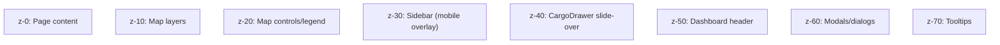
