# Supabase Documentation — HVDC Logistics Dashboard

> **Version:** 1.1.0 | **Last Updated:** 2026-03-13
> **Project ID:** `rkfffveonaskewwzghex` | **Name:** supabase-cyan-yacht
> **Region:** ap-southeast-1 | **PostgreSQL:** 15

---

## Table of Contents

1. [Project Overview](#1-project-overview)
2. [Database Schema Design](#2-database-schema-design)
3. [Table Definitions](#3-table-definitions)
4. [Public View Layer (운영 뷰)](#4-public-view-layer-운영-뷰)
5. [Row Level Security (RLS)](#5-row-level-security-rls)
6. [PostgREST Access Pattern](#6-postgrest-access-pattern)
7. [Supabase 페이지네이션 패턴 (db-max-rows=1000 우회)](#7-supabase-페이지네이션-패턴-db-max-rows1000-우회)
8. [Supabase Realtime Configuration](#8-supabase-realtime-configuration)
9. [API Keys & Authentication](#9-api-keys--authentication)
10. [Supabase Client Configuration](#10-supabase-client-configuration)
11. [Supabase Scripts (DDL + ETL)](#11-supabase-scripts-ddl--etl)
12. [Seed Data](#12-seed-data)
13. [SQL Reference](#13-sql-reference)
14. [Troubleshooting](#14-troubleshooting)

---

## 1. Project Overview

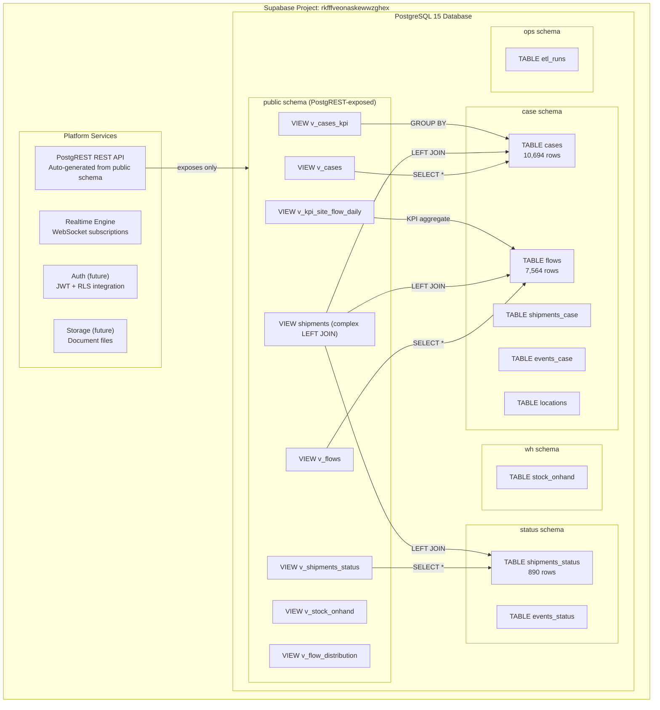

### Connection Details

| Property | Value |
|----------|-------|
| Project URL | `https://rkfffveonaskewwzghex.supabase.co` |
| Project Name | supabase-cyan-yacht |
| Region | ap-southeast-1 (Singapore) |
| PostgreSQL Version | 15 |
| PostgREST Version | v12 |

### 실제 데이터 볼륨

| 테이블 | 행 수 |
|--------|-------|
| `case.cases` | **10,694 rows** |
| `case.flows` | **7,564 rows** |
| `status.shipments_status` | **890 rows** |

---

## 2. Database Schema Design

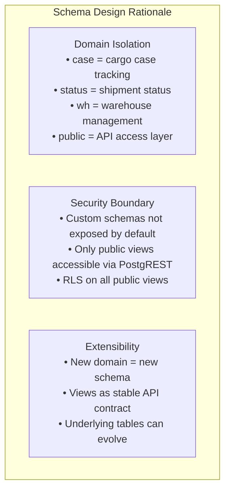

### Schema Map

```mermaid
erDiagram
    direction TB

    case_cases {
        uuid id PK
        text case_no "케이스 번호"
        text hvdc_code "HVDC 코드"
        text site "AGI | DAS | MIR | SHU | MOSB"
        int flow_code "0-5 (AGI/DAS ≥ 3 강제)"
        text flow_description "Flow Code 설명"
        text status_current "현재 상태"
        text status_location "현재 위치"
        text final_location "최종 납품지"
        numeric sqm "면적 m²"
        numeric cbm "체적 m³"
        text source_vendor "납품업체"
        text storage_type "Indoor | Outdoor | Outdoor Cov"
        text stack_status "적재 상태"
        text category "Elec | Mech | Inst."
        text sct_ship_no "SCT 선적번호"
        date site_arrival_date "현장 도착일"
        timestamptz created_at
    }

    case_flows {
        uuid id PK
        text case_no "케이스 번호"
        text hvdc_code "HVDC 코드"
        text sct_ship_no "SCT 선적번호"
        int flow_code "실제 적용 코드"
        text flow_description "Flow Code 설명"
        timestamptz created_at
    }

    status_shipments_status {
        uuid id PK
        text hvdc_code "HVDC 코드"
        text status_no "상태 번호"
        text vendor "납품업체"
        text pol "Port of Loading (LOCODE)"
        text pod "Port of Discharge (LOCODE)"
        text vessel "선박명"
        text bl_awb "B/L 또는 AWB 번호"
        text ship_mode "SEA | AIR"
        date etd
        date eta
        date atd
        date ata
        text incoterms
        date final_delivery_date "최종 납품일"
        integer transit_days "해상 운송일수"
        integer customs_days "통관 소요일수"
        integer inland_days "내륙 운송일수"
        boolean doc_shu "SHU 서류 완료"
        boolean doc_das "DAS 서류 완료"
        boolean doc_mir "MIR 서류 완료"
        boolean doc_agi "AGI 서류 완료"
        timestamptz created_at
    }

    wh_stock_onhand {
        uuid id PK
        int no
        text sku
        text description
        text location "MOSB | DAS | AGI"
        text pallet_id
        int qty
        text shipping_ref
        date date_received
        timestamptz created_at
    }

    ops_etl_runs {
        uuid id PK
        text run_type "status | case | wh"
        text status "running | success | failed"
        int rows_processed
        int rows_skipped
        text error_message
        timestamptz started_at
        timestamptz finished_at
    }

    case_cases ||--o{ case_flows : "hvdc_code / case_no"
    case_cases ||--o{ status_shipments_status : "hvdc_code"
```

### 스키마 레이어 구조

| 스키마 | 역할 | 테이블 수 |
|--------|------|-----------|
| `status` | 선적/배송 상태 SSOT (원본 JSON → ETL) | 2 |
| `"case"` | 케이스 단위 추적 (Option-C 레이어) | 6 |
| `ops` | ETL 실행 로그 | 1 |
| `wh` | 창고 재고 관리 | 1 |
| `public` | API 노출 뷰 레이어 (PostgREST 전용) | 뷰 8개+ |

---

## 3. Table Definitions

### 3.1 `case.cases`

Primary cargo case tracking table. **현재 10,694 rows.**

```sql
CREATE SCHEMA IF NOT EXISTS "case";

CREATE TABLE IF NOT EXISTS "case".cases (
    id                UUID PRIMARY KEY DEFAULT gen_random_uuid(),
    case_no           TEXT UNIQUE NOT NULL,           -- e.g. HVDC-2024-001
    hvdc_code         TEXT,                           -- HVDC 코드
    sct_ship_no       TEXT,                           -- SCT 선적번호
    site              TEXT NOT NULL,                  -- AGI, DAS, MIR, SHU, MOSB
    flow_code         INTEGER NOT NULL DEFAULT 0
                      CHECK (flow_code BETWEEN 0 AND 5),
    flow_description  TEXT,
    status_current    TEXT NOT NULL DEFAULT 'Pre Arrival',
    status_location   TEXT,
    final_location    TEXT,
    sqm               DECIMAL(10,2) DEFAULT 0,
    cbm               NUMERIC,
    source_vendor     TEXT,
    storage_type      TEXT,                           -- Indoor | Outdoor | Outdoor Cov
    stack_status      TEXT,
    category          TEXT NOT NULL DEFAULT 'other',  -- Elec | Mech | Inst.
    site_arrival_date DATE,
    created_at        TIMESTAMPTZ NOT NULL DEFAULT NOW(),
    updated_at        TIMESTAMPTZ NOT NULL DEFAULT NOW()
);
```

**Status Values:**

| `status_current` | Meaning | KPI Card |
|-----------------|---------|----------|
| `'Pre Arrival'` | Not yet in UAE | — |
| `'transit'` | In international transit | — |
| `'customs'` | UAE customs clearance | — |
| `'warehouse'` | At MOSB/DAS warehouse | 창고 재고 |
| `'site'` | Delivered to project site | 현장 도착 |

---

### 3.2 `case.flows`

Case flow code records. **현재 7,564 rows.**

```sql
CREATE TABLE IF NOT EXISTS "case".flows (
    id               UUID PRIMARY KEY DEFAULT gen_random_uuid(),
    case_no          TEXT,
    sct_ship_no      TEXT,
    hvdc_code        TEXT,
    flow_code        INTEGER NOT NULL CHECK (flow_code BETWEEN 0 AND 5),
    flow_description TEXT,
    created_at       TIMESTAMPTZ NOT NULL DEFAULT NOW()
);

CREATE INDEX idx_flows_case_no   ON "case".flows(case_no);
CREATE INDEX idx_flows_flow_code ON "case".flows(flow_code);
```

---

### 3.3 `status.shipments_status`

International shipment tracking. **현재 890 rows.**

```sql
CREATE SCHEMA IF NOT EXISTS status;

CREATE TABLE IF NOT EXISTS status.shipments_status (
    id                   UUID PRIMARY KEY DEFAULT gen_random_uuid(),
    hvdc_code            TEXT UNIQUE NOT NULL,
    status_no            TEXT,
    vendor               TEXT NOT NULL,
    pol                  TEXT NOT NULL,      -- Port of Loading LOCODE
    pod                  TEXT NOT NULL,      -- Port of Discharge LOCODE
    vessel               TEXT,
    bl_awb               TEXT,               -- Bill of Lading / AWB
    ship_mode            TEXT,               -- SEA | AIR
    etd                  DATE,
    eta                  DATE,
    atd                  DATE,
    ata                  DATE,
    incoterms            TEXT,
    -- Analytics columns (20260313 migration)
    final_delivery_date  DATE,
    transit_days         INTEGER,
    customs_days         INTEGER,
    inland_days          INTEGER,
    doc_shu              BOOLEAN DEFAULT FALSE,
    doc_das              BOOLEAN DEFAULT FALSE,
    doc_mir              BOOLEAN DEFAULT FALSE,
    doc_agi              BOOLEAN DEFAULT FALSE,
    created_at           TIMESTAMPTZ NOT NULL DEFAULT NOW()
);
```

---

### 3.4 `wh.stock_onhand`

Warehouse stock on-hand inventory.

```sql
CREATE SCHEMA IF NOT EXISTS wh;

CREATE TABLE IF NOT EXISTS wh.stock_onhand (
    id            UUID PRIMARY KEY DEFAULT gen_random_uuid(),
    no            INTEGER,
    sku           TEXT UNIQUE NOT NULL,    -- e.g. TRF-ABB-001
    description   TEXT NOT NULL,
    location      TEXT NOT NULL,           -- MOSB, DAS-WH, AGI-YARD
    pallet_id     TEXT,
    qty           INTEGER NOT NULL DEFAULT 0,
    shipping_ref  TEXT,
    date_received DATE,
    created_at    TIMESTAMPTZ NOT NULL DEFAULT NOW()
);

CREATE INDEX idx_stock_location ON wh.stock_onhand(location);
```

---

## 4. Public View Layer (운영 뷰)

> **원칙:** 프론트엔드는 `public.*` 뷰만 조회한다. 직접 JOIN 금지.

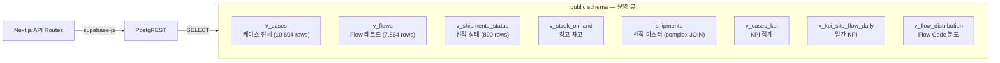

### 뷰 목록 및 용도

| 뷰 이름 | 용도 | 주요 소스 테이블 |
|---------|------|-----------------|
| `v_cases` | 케이스 API 뷰 (전체 컬럼) | `"case".cases` |
| `v_flows` | Flow Code API 뷰 | `"case".flows` |
| `v_shipments_status` | 선적 상태 API 뷰 (analytics 컬럼 포함) | `status.shipments_status` |
| `v_stock_onhand` | 창고 재고 API 뷰 | `wh.stock_onhand` |
| `shipments` | 선적 마스터 (hvdc_code 기준 LEFT JOIN) | `status.shipments_status` + `case.flows` + `case.cases` |
| `v_cases_kpi` | 케이스 KPI (사이트·Flow Code별) | `"case".cases` GROUP BY |
| `v_kpi_site_flow_daily` | 사이트별 일간 KPI | `"case".cases` + `"case".flows` |
| `v_flow_distribution` | Flow Code 분포 통계 | `"case".flows` |

### 핵심 뷰 SQL 요약

```sql
-- v_cases: 케이스 API 뷰 (20260127_api_views.sql)
CREATE OR REPLACE VIEW public.v_cases AS
SELECT
  id, case_no, hvdc_code, site, flow_code, flow_description,
  status_current, status_location, final_location,
  sqm, source_vendor, storage_type, stack_status,
  category, sct_ship_no, site_arrival_date, cbm, created_at
FROM "case".cases;

-- v_flows: Flow Code API 뷰
CREATE OR REPLACE VIEW public.v_flows AS
SELECT
  id, case_no, sct_ship_no, hvdc_code,
  flow_code, flow_description, created_at
FROM "case".flows;

-- v_shipments_status: 선적 상태 API 뷰 (analytics 컬럼 포함, 20260313 migration)
CREATE OR REPLACE VIEW public.v_shipments_status AS
SELECT
  id, hvdc_code, status_no, vendor, pol, pod, vessel, bl_awb, ship_mode,
  etd, eta, atd, ata, incoterms,
  final_delivery_date, transit_days, customs_days, inland_days,
  doc_shu, doc_das, doc_mir, doc_agi,
  created_at
FROM status.shipments_status;

-- shipments: 선적 마스터 (complex LEFT JOIN — /api/shipments, /api/chain/summary 에서 사용)
CREATE OR REPLACE VIEW public.shipments AS
WITH flow_rollup AS (
  SELECT
    sct_ship_no,
    CASE
      WHEN COUNT(DISTINCT flow_code) = 1 THEN MIN(flow_code)
      WHEN COUNT(DISTINCT flow_code) > 1 THEN 5
      ELSE NULL
    END AS flow_code
  FROM "case".flows
  WHERE sct_ship_no IS NOT NULL
  GROUP BY sct_ship_no
),
case_rollup AS (
  SELECT
    sct_ship_no,
    CASE
      WHEN COUNT(DISTINCT COALESCE(site, final_location)) = 1 THEN MIN(COALESCE(site, final_location))
      WHEN COUNT(DISTINCT COALESCE(site, final_location)) > 1 THEN 'Mixed'
      ELSE NULL
    END AS final_location,
    MAX(site_arrival_date) AS site_arrival_date
  FROM "case".cases
  WHERE sct_ship_no IS NOT NULL
  GROUP BY sct_ship_no
)
SELECT
  ss.hvdc_code::text AS id,
  ss.hvdc_code       AS sct_ship_no,
  ss.status_no       AS mr_number,
  ss.vendor,
  ss.pol             AS port_of_loading,
  ss.pod             AS port_of_discharge,
  ss.vessel          AS vessel_name,
  ss.bl_awb          AS bl_awb_no,
  ss.ship_mode,
  ss.etd, ss.atd, ss.eta, ss.ata,
  COALESCE(ss.final_delivery_date, case_rollup.site_arrival_date, ss.ata) AS delivery_date,
  ss.incoterms,
  flow_rollup.flow_code,
  case_rollup.final_location,
  ss.transit_days, ss.customs_days, ss.inland_days,
  ss.doc_shu, ss.doc_das, ss.doc_mir, ss.doc_agi
FROM status.shipments_status ss
LEFT JOIN flow_rollup ON flow_rollup.sct_ship_no = ss.hvdc_code
LEFT JOIN case_rollup ON case_rollup.sct_ship_no = ss.hvdc_code;
```

> 전체 DDL: `supabase/migrations/20260127_api_views.sql` 및 `supabase/migrations/20260313_add_shipment_columns.sql`

### Why Views Instead of Direct Schema Access?

```mermaid
graph TD
    Problem["Problem: PostgREST only exposes\nthe 'public' schema by default"]

    Option1["Option A: Add schemas to\nsupabase.toml db.schema config\n(requires infrastructure access)"]

    Option2["Option B: Create public views\n(simple SQL, no config needed)\n✅ CHOSEN"]

    Option3["Option C: Use service_role key\nin API routes\n(security concern)"]

    Problem --> Option1
    Problem --> Option2
    Problem --> Option3

    style Option2 fill:#1a3a1a
```

**Decision:** Public views provide:
1. **No config changes needed** — works with default Supabase setup
2. **Stable API contract** — views can be modified without changing API routes
3. **Independent RLS** — views have their own RLS policies
4. **Zero performance overhead** — PostgreSQL views are essentially free (no materialization)

---

## 5. Row Level Security (RLS)

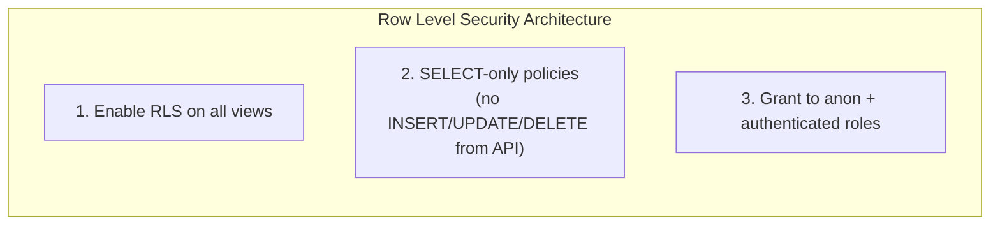

### RLS Setup SQL

```sql
-- Enable RLS on all public views
ALTER TABLE public.v_cases ENABLE ROW LEVEL SECURITY;
ALTER TABLE public.v_flows ENABLE ROW LEVEL SECURITY;
ALTER TABLE public.v_shipments_status ENABLE ROW LEVEL SECURITY;
ALTER TABLE public.v_stock_onhand ENABLE ROW LEVEL SECURITY;

-- Allow SELECT for anonymous users (dashboard is read-only public)
CREATE POLICY "v_cases_select_all"
    ON public.v_cases
    FOR SELECT
    TO anon, authenticated
    USING (true);

CREATE POLICY "v_flows_select_all"
    ON public.v_flows
    FOR SELECT
    TO anon, authenticated
    USING (true);

CREATE POLICY "v_shipments_status_select_all"
    ON public.v_shipments_status
    FOR SELECT
    TO anon, authenticated
    USING (true);

CREATE POLICY "v_stock_onhand_select_all"
    ON public.v_stock_onhand
    FOR SELECT
    TO anon, authenticated
    USING (true);
```

### Future RLS (with Auth)

```sql
-- Site-based access control (when Auth is implemented)
CREATE POLICY "cases_by_user_site"
    ON public.v_cases
    FOR SELECT
    TO authenticated
    USING (
        site = (
            SELECT assigned_site
            FROM public.user_profiles
            WHERE user_id = auth.uid()
        )
        OR
        (SELECT role FROM public.user_profiles WHERE user_id = auth.uid()) = 'admin'
    );
```

---

## 6. PostgREST Access Pattern

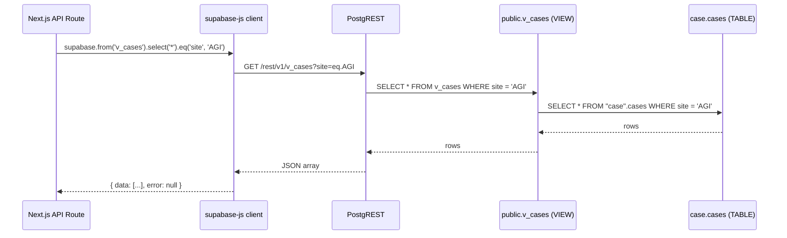

### supabase-js Query Examples

```typescript
// ✅ Correct: query public view
const { data, error } = await supabase
  .from('v_cases')
  .select('*')
  .eq('site', 'AGI')
  .order('created_at', { ascending: false })
  .range(0, 49)

// ❌ Wrong: custom schema (403 Forbidden)
const { data, error } = await supabase
  .schema('case')     // This fails — schema not exposed
  .from('cases')
  .select('*')

// KPI aggregation pattern
const { data: allCases } = await supabase
  .from('v_cases')
  .select('status_current, flow_code, site, sqm, source_vendor')

// Aggregate in JavaScript (since PostgREST doesn't support GROUP BY directly)
const totalCases = allCases.length
const byStatus = Object.fromEntries(
  [...new Set(allCases.map(c => c.status_current))].map(s => [
    s,
    allCases.filter(c => c.status_current === s).length
  ])
)
```

### Filter Operations

```typescript
// Single value filter
.eq('status_current', 'site')

// Multiple values (IN)
.in('status_current', ['site', 'warehouse'])

// Range
.range(page * limit, (page + 1) * limit - 1)

// Order
.order('created_at', { ascending: false })

// Text search
.ilike('vendor', '%ABB%')

// Null check
.is('ata', null)          // where ata IS NULL
.not('ata', 'is', null)   // where ata IS NOT NULL
```

---

## 7. Supabase 페이지네이션 패턴 (db-max-rows=1000 우회)

> **배경:** PostgREST 서버는 `db-max-rows=1000` 설정으로 단일 응답을 최대 1,000행으로 제한한다.
> `.range(0, 29999)` 로 넓은 범위를 지정해도 **서버가 강제로 1,000행까지만 반환**한다.
> 10,694 rows인 `case.cases` 전체를 읽으려면 **페이지 루프 패턴**이 필수다.

```typescript
// PostgREST db-max-rows=1000 서버 제한 우회 — 페이지 루프 패턴
// .range(0, 29999) 로는 우회 불가 (서버가 강제 제한)
async function fetchAllCases() {
  const PAGE = 1000
  const cols = 'site, flow_code, status_current, status_location, sqm, source_vendor, storage_type'
  const allRows: Array<Record<string, unknown>> = []
  let offset = 0

  while (true) {
    const { data, error } = await supabase
      .from('v_cases')
      .select(cols)
      .range(offset, offset + PAGE - 1)
      .order('id')

    if (error) throw error
    if (!data || data.length === 0) break
    allRows.push(...data)
    if (data.length < PAGE) break   // 마지막 페이지
    offset += PAGE
  }

  return allRows
}
```

### 사용 위치

| API Route | 함수 | 이유 |
|-----------|------|------|
| `/api/cases/summary` | `fetchAllCases()` | KPI 집계 — 전체 10,694 rows 필요 |
| `/api/chain/summary` | `fetchAllCasesForChain()` | 체인 집계 — 전체 rows 필요 |

### 페이지네이션이 필요 없는 경우

`/api/cases` (목록 API)는 사용자가 요청한 `page` + `pageSize` 기준으로 서버 페이지네이션을 적용하므로, 단일 `.range()` 호출로 충분하다. 루프 패턴은 **전체 집계(aggregation)** 가 필요한 경우에만 사용한다.

---

## 8. Supabase Realtime Configuration

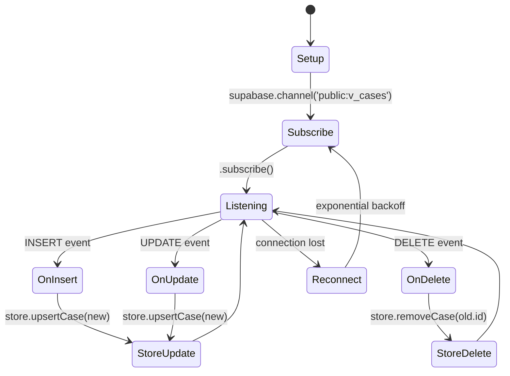

### Realtime Subscription Code

```typescript
// hooks/useSupabaseRealtime.ts
const channel = supabase
  .channel('public:v_cases')
  .on(
    'postgres_changes',
    {
      event: '*',           // INSERT | UPDATE | DELETE
      schema: 'public',
      table: 'v_cases',
    },
    (payload) => {
      switch (payload.eventType) {
        case 'INSERT':
          store.upsertCase(payload.new as CaseRow)
          break
        case 'UPDATE':
          store.upsertCase(payload.new as CaseRow)
          break
        case 'DELETE':
          store.removeCase(payload.old.id)
          break
      }
    }
  )
  .subscribe()
```

### Enable Realtime for Views

In Supabase Dashboard → Database → Replication:

1. Enable **Realtime** for `public.v_cases`
2. Enable **Realtime** for `public.v_stock_onhand`
3. Enable **Realtime** for `public.v_shipments_status`

Or via SQL:
```sql
-- Enable realtime for public views
ALTER PUBLICATION supabase_realtime ADD TABLE public.v_cases;
ALTER PUBLICATION supabase_realtime ADD TABLE public.v_flows;
ALTER PUBLICATION supabase_realtime ADD TABLE public.v_shipments_status;
ALTER PUBLICATION supabase_realtime ADD TABLE public.v_stock_onhand;
```

---

## 9. API Keys & Authentication

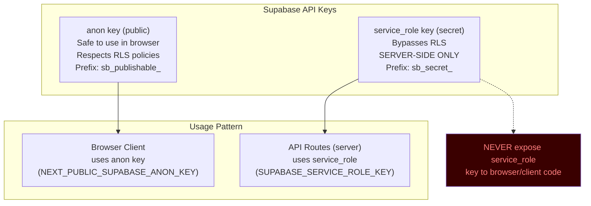

### Environment Variables

| 변수명 | 범위 | 용도 |
|--------|------|------|
| `NEXT_PUBLIC_SUPABASE_URL` | 브라우저 + 서버 | Supabase 프로젝트 URL |
| `NEXT_PUBLIC_SUPABASE_ANON_KEY` | 브라우저 + 서버 | RLS 적용 읽기 전용 키 |
| `SUPABASE_SERVICE_ROLE_KEY` | **서버 전용** | RLS 우회 — API Routes에서만 사용 |

### Key Usage in Code

```typescript
// lib/supabase.ts — client factory

// Browser (client components, hooks)
export const supabase = createClient(
  process.env.NEXT_PUBLIC_SUPABASE_URL!,
  process.env.NEXT_PUBLIC_SUPABASE_ANON_KEY!
)

// Server (API routes only) — supabaseAdmin
import { createClient } from '@supabase/supabase-js'

const supabaseAdmin = createClient(
  process.env.NEXT_PUBLIC_SUPABASE_URL!,
  process.env.SUPABASE_SERVICE_ROLE_KEY!,  // Never in NEXT_PUBLIC_
  {
    auth: {
      autoRefreshToken: false,
      persistSession: false,
    }
  }
)
```

> **중요:** 모든 API Route (`/api/cases`, `/api/chain/summary`, `/api/shipments` 등)는 `supabaseAdmin` (service_role) 클라이언트를 사용한다.

---

## 10. Supabase Client Configuration

```typescript
// lib/supabase.ts
import { createClient } from '@supabase/supabase-js'

const supabaseUrl = process.env.NEXT_PUBLIC_SUPABASE_URL
const supabaseAnonKey = process.env.NEXT_PUBLIC_SUPABASE_ANON_KEY

// Graceful fallback — prevents crash when env vars missing
if (!supabaseUrl || !supabaseAnonKey) {
  console.warn('Supabase env vars missing — using mock data fallback')
}

export const supabase = supabaseUrl && supabaseAnonKey
  ? createClient(supabaseUrl, supabaseAnonKey, {
      realtime: {
        params: {
          eventsPerSecond: 10,
        },
      },
      db: {
        schema: 'public',  // Always public schema
      },
      auth: {
        persistSession: true,
        autoRefreshToken: true,
      },
    })
  : null  // null triggers mock fallback in lib/api.ts
```

### Mock Fallback Pattern

```typescript
// lib/api.ts
export async function fetchCasesSummary(): Promise<CasesSummary> {
  if (!supabase) {
    // Return static mock data when Supabase unavailable
    return MOCK_CASES_SUMMARY
  }

  const response = await fetch('/api/cases/summary')
  if (!response.ok) throw new Error('Failed to fetch KPI data')
  return response.json()
}
```

---

## 11. Supabase Scripts (DDL + ETL)

### 11.1 스크립트 실행 순서

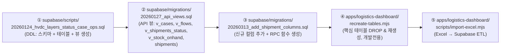

> **중요:** 마이그레이션 파일은 번호순으로 실행한다. `20260127_api_views.sql`이 없으면 `/api/cases`, `/api/shipments` 엔드포인트가 실패한다.

### 11.2 핵심 마이그레이션: `20260127_api_views.sql`

경로: `supabase/migrations/20260127_api_views.sql`

> **이 파일이 없으면 `/api/cases`, `/api/stock`, `/api/shipments`, `/api/chain/summary` 엔드포인트가 실패합니다.**

| 생성 객체 | 종류 | 소스 | 사용 API |
|----------|------|------|---------|
| `public.v_cases` | VIEW | `"case".cases` | `/api/cases`, `/api/cases/summary`, `/api/chain/summary` |
| `public.v_flows` | VIEW | `"case".flows` | 직접 쿼리 |
| `public.v_shipments_status` | VIEW | `status.shipments_status` | `/api/stock` |
| `public.v_stock_onhand` | VIEW | `wh.stock_onhand` | `/api/stock` |
| `public.shipments` | VIEW (complex JOIN) | `status.shipments_status` + `case.flows` + `case.cases` | `/api/shipments`, `/api/chain/summary` |

### 11.3 신규 마이그레이션: `20260313_add_shipment_columns.sql`

경로: `supabase/migrations/20260313_add_shipment_columns.sql`

추가 내용:
1. `case.cases`에 신규 컬럼 추가: `sct_ship_no`, `cbm`, `storage_type`, `stack_status`, `category`, `site_arrival_date`
2. `case.flows`에 신규 컬럼 추가: `sct_ship_no`, `hvdc_code`
3. `status.shipments_status`에 analytics 컬럼 추가: `final_delivery_date`, `transit_days`, `customs_days`, `inland_days`, `doc_shu`, `doc_das`, `doc_mir`, `doc_agi`
4. `public.v_shipments_status` 뷰 재생성 (신규 컬럼 포함)
5. `public.shipments` 뷰 재생성 (transit_days, customs_days, inland_days, doc_* 컬럼 포함)
6. RPC 헬퍼 함수 생성: `import_truncate_tables()`, `import_cases_batch(jsonb)`, `import_flows_batch(jsonb)`, `import_shipments_batch(jsonb)`

### 11.4 `scripts/import-excel.mjs` (Excel → Supabase ETL)

경로: `apps/logistics-dashboard/scripts/import-excel.mjs`

```bash
node scripts/import-excel.mjs
```

**동작:**
1. Excel 파일(`.xlsx`)에서 케이스·Flow·선적 데이터 추출
2. `import_truncate_tables()` RPC 호출로 기존 데이터 초기화
3. `import_cases_batch(jsonb)` RPC로 `case.cases` 배치 삽입 (1,000행 단위)
4. `import_flows_batch(jsonb)` RPC로 `case.flows` 배치 삽입
5. `import_shipments_batch(jsonb)` RPC로 `status.shipments_status` 배치 삽입

> **참고:** RPC 함수는 `SECURITY DEFINER`로 실행되며 `service_role` 권한이 필요하다. `.env.local`의 `SUPABASE_SERVICE_ROLE_KEY`를 사용한다.

### 11.5 `recreate-tables.mjs` (개발 전용)

경로: `apps/logistics-dashboard/recreate-tables.mjs`

```bash
node recreate-tables.mjs
```

동작:
1. `"case".cases`, `"case".flows`, `status.shipments_status`, `wh.stock_onhand` DROP CASCADE
2. 위 4개 테이블 재생성 (RLS 포함)
3. `public.shipments` 뷰 재생성
4. `NOTIFY pgrst, 'reload schema'` (PostgREST 스키마 캐시 갱신)

> **개발 전용** — 운영 환경에서 절대 실행 금지 (모든 데이터 삭제됨)

### 11.6 핵심 SQL 파일: `20260124_hvdc_layers_status_case_ops.sql`

경로: `supabase/scripts/20260124_hvdc_layers_status_case_ops.sql` (12.9 KB)

생성 객체 요약:

| 스키마 | 객체 | 종류 |
|--------|------|------|
| `status` | `shipments_status`, `events_status` | TABLE |
| `"case"` | `shipments_case`, `cases`, `flows`, `locations`, `events_case`, `events_case_debug` | TABLE |
| `ops` | `etl_runs` | TABLE |
| `public` | `v_shipments_master`, `v_shipments_timeline`, `v_cases_kpi`, `v_flow_distribution`, `v_wh_inventory_current`, `v_case_event_segments`, `v_case_segments`, `v_kpi_site_flow_daily` | VIEW |

---

## 12. Seed Data

> **참고:** 현재 운영 데이터는 `scripts/import-excel.mjs`로 실제 Excel 파일에서 로드되었다.
> 아래는 개발 초기 seed 패턴 참고용이다.

### Seed Data Distribution

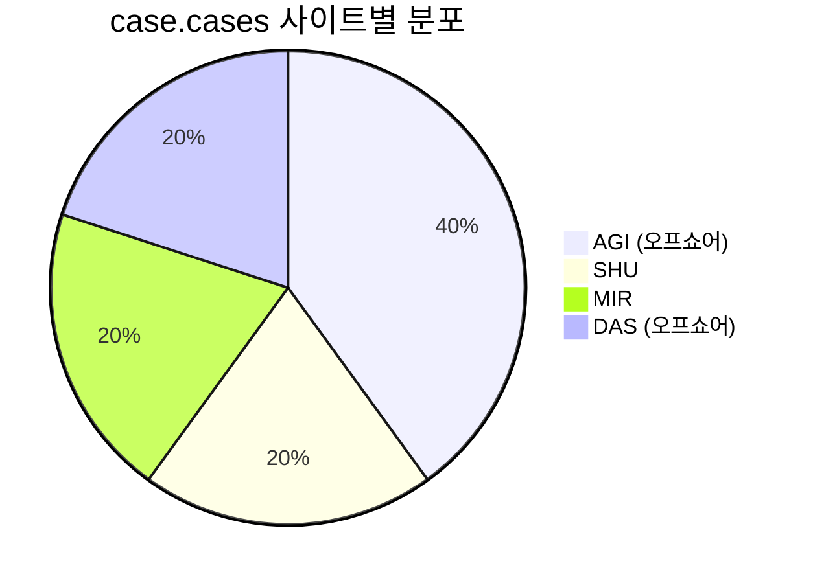

### 삽입 데이터 요약 (seed-data.mjs 기준)

| 테이블 | 행 수 | 주요 규칙 |
|--------|-------|-----------|
| `"case".cases` | 300 | AGI 40% / SHU·MIR·DAS 각 20% |
| `"case".flows` | 300 | AGI/DAS(오프쇼어): FC ≥ 3 강제 |
| `status.shipments_status` | 300 | hvdc_code 기준 매핑 |
| `wh.stock_onhand` | 150 | MOSB·DAS·AGI 창고 재고 |

### 오프쇼어 Flow Code 규칙

```js
// AGI, DAS는 오프쇼어 사이트 → FC 3, 4, 5만 허용
const offshoreFC = () => rand([3, 3, 4, 4, 5])  // 가중치: FC3 40%, FC4 40%, FC5 20%
const onshorFC   = () => rand([0, 1, 2, 3, 4, 5])

const flow_code = ['AGI', 'DAS'].includes(site) ? offshoreFC() : onshorFC()
```

> 이 규칙은 **Flow Code v3.5** 정책을 반영한다. AGI·DAS 오프쇼어 사이트는 항상 FC ≥ 3.

---

## 13. SQL Reference

### Useful Diagnostic Queries

```sql
-- Check all schemas
SELECT schema_name FROM information_schema.schemata ORDER BY schema_name;

-- Check tables per schema
SELECT table_schema, table_name, table_type
FROM information_schema.tables
WHERE table_schema IN ('case', 'status', 'wh', 'public')
ORDER BY table_schema, table_name;

-- 실제 데이터 볼륨 확인
SELECT
  (SELECT COUNT(*) FROM "case".cases) AS cases_count,
  (SELECT COUNT(*) FROM "case".flows) AS flows_count,
  (SELECT COUNT(*) FROM status.shipments_status) AS shipments_count;

-- KPI verification
SELECT
    COUNT(*) AS total_cases,
    COUNT(*) FILTER (WHERE status_current = 'site') AS site_arrived,
    COUNT(*) FILTER (WHERE status_current = 'warehouse') AS warehouse,
    COUNT(*) FILTER (WHERE status_current = 'Pre Arrival') AS pre_arrival
FROM public.v_cases;

-- Flow code distribution
SELECT flow_code, COUNT(*) AS count
FROM public.v_cases
GROUP BY flow_code
ORDER BY flow_code;

-- Vendor distribution
SELECT source_vendor, COUNT(*) AS count, SUM(sqm) AS total_sqm
FROM public.v_cases
GROUP BY source_vendor
ORDER BY count DESC;

-- Site breakdown
SELECT site, status_current, COUNT(*) AS count
FROM public.v_cases
GROUP BY site, status_current
ORDER BY site, status_current;

-- Check RLS policies
SELECT tablename, policyname, roles, cmd, qual
FROM pg_policies
WHERE schemaname = 'public'
ORDER BY tablename, policyname;

-- Check publications (realtime)
SELECT * FROM pg_publication_tables
WHERE pubname = 'supabase_realtime';
```

### View Inspection

```sql
-- 모든 public 뷰 목록 확인
SELECT schemaname, viewname
FROM pg_views
WHERE schemaname = 'public'
ORDER BY viewname;

-- API 뷰 정의 확인
SELECT schemaname, viewname, definition
FROM pg_views
WHERE schemaname = 'public'
    AND viewname IN ('v_cases', 'v_flows', 'v_stock_onhand',
                     'v_shipments_status', 'shipments',
                     'v_cases_kpi', 'v_kpi_site_flow_daily',
                     'v_flow_distribution')
ORDER BY viewname;

-- GRANT 현황 확인
SELECT grantee, privilege_type, table_name
FROM information_schema.role_table_grants
WHERE table_schema = 'public'
  AND table_name IN ('v_cases', 'v_flows', 'v_stock_onhand', 'v_shipments_status', 'shipments')
ORDER BY table_name, grantee;
```

---

## 14. Troubleshooting

### Error: 403 Forbidden on PostgREST

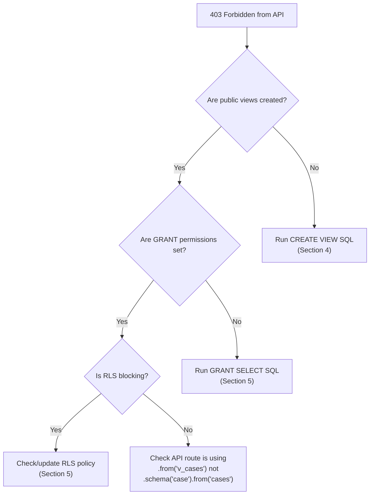

```sql
-- Quick fix: recreate everything
DROP VIEW IF EXISTS public.v_cases CASCADE;
CREATE OR REPLACE VIEW public.v_cases AS SELECT * FROM "case".cases;
GRANT SELECT ON public.v_cases TO anon, authenticated;

-- Verify fix
SELECT COUNT(*) FROM public.v_cases;
```

### Error: KPI가 1,000으로 잘림 (db-max-rows 제한)

```
증상: totalCases = 1000 (실제 10,694인데 1,000만 반환됨)
원인: PostgREST db-max-rows=1000 서버 제한
해결: Section 7의 페이지 루프 패턴 사용
```

```typescript
// 잘못된 방법 — 서버가 1,000행만 반환
const { data } = await supabase.from('v_cases').select('*').range(0, 29999)

// 올바른 방법 — 페이지 루프로 전체 데이터 수집
// → Section 7 fetchAllCases() 참조
```

### Error: Realtime not receiving events

```sql
-- Verify realtime publication
SELECT * FROM pg_publication_tables WHERE pubname = 'supabase_realtime';

-- Add if missing
ALTER PUBLICATION supabase_realtime ADD TABLE public.v_cases;

-- Check realtime is enabled in Supabase dashboard:
-- Dashboard → Database → Replication → v_cases (enable toggle)
```

### Error: KPI shows 0 for site/warehouse

```sql
-- Verify data distribution
SELECT status_current, COUNT(*)
FROM public.v_cases
GROUP BY status_current;
```

### Performance Queries

```sql
-- Check query performance on v_cases
EXPLAIN ANALYZE SELECT * FROM public.v_cases WHERE site = 'AGI';

-- Add index if site filter is slow
CREATE INDEX IF NOT EXISTS idx_cases_site ON "case".cases(site);
CREATE INDEX IF NOT EXISTS idx_cases_status ON "case".cases(status_current);
CREATE INDEX IF NOT EXISTS idx_cases_flow_code ON "case".cases(flow_code);
CREATE INDEX IF NOT EXISTS idx_cases_created_at ON "case".cases(created_at DESC);
CREATE INDEX IF NOT EXISTS idx_cases_id ON "case".cases(id);  -- pagination loop에 필수
```
