# Supabase Documentation — HVDC Logistics Dashboard

> **Version:** 1.0.0 | **Last Updated:** 2026-03-13
> **Project ID:** `rkfffveonaskewwzghex` | **Name:** supabase-cyan-yacht
> **Region:** ap-southeast-1 | **PostgreSQL:** 15

---

## Table of Contents

1. [Project Overview](#1-project-overview)
2. [Database Schema Design](#2-database-schema-design)
3. [Table Definitions](#3-table-definitions)
4. [Public View Layer (운영 뷰)](#4-public-view-layer-운영-뷰)
5. [Row Level Security (RLS)](#5-row-level-security-rls)
6. [PostgREST Access Pattern](#6-postgrest-access-pattern)
7. [Supabase Realtime Configuration](#7-supabase-realtime-configuration)
8. [API Keys & Authentication](#8-api-keys--authentication)
9. [Supabase Client Configuration](#9-supabase-client-configuration)
10. [Supabase Scripts (DDL + ETL)](#10-supabase-scripts-ddl--etl)
11. [Seed Data](#11-seed-data)
12. [SQL Reference](#12-sql-reference)
13. [Troubleshooting](#13-troubleshooting)

---

## 1. Project Overview

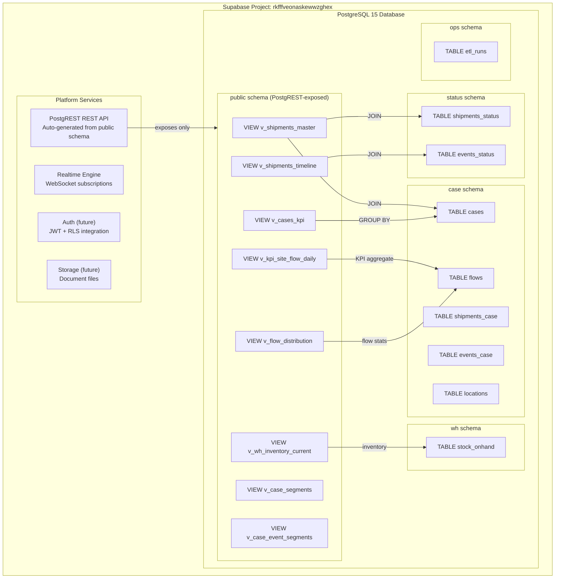

### Connection Details

| Property | Value |
|----------|-------|
| Project URL | `https://rkfffveonaskewwzghex.supabase.co` |
| Project Name | supabase-cyan-yacht |
| Region | ap-southeast-1 (Singapore) |
| PostgreSQL Version | 15 |
| PostgREST Version | v12 |

---

## 2. Database Schema Design

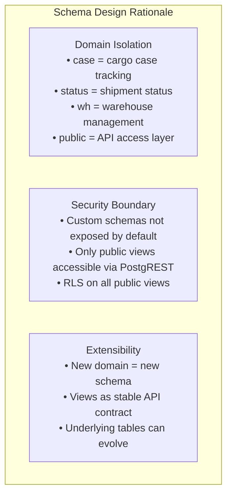

### Schema Map

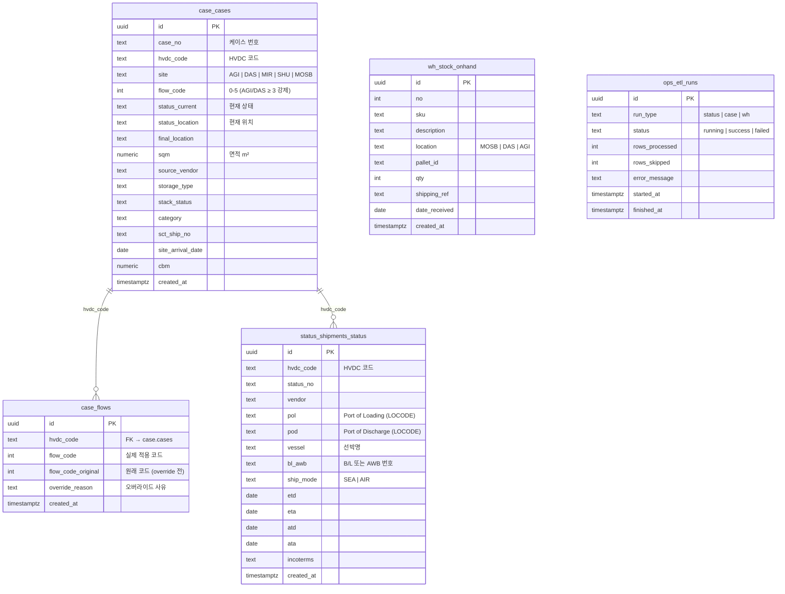

### 스키마 레이어 구조

| 스키마 | 역할 | 테이블 수 |
|--------|------|-----------|
| `status` | 선적/배송 상태 SSOT (원본 JSON → ETL) | 2 |
| `"case"` | 케이스 단위 추적 (Option-C 레이어) | 6 |
| `ops` | ETL 실행 로그 | 1 |
| `wh` | 창고 재고 관리 | 1 |
| `public` | API 노출 뷰 레이어 (PostgREST 전용) | 뷰 8개 |

---

## 3. Table Definitions

### 3.1 `case.cases`

Primary cargo case tracking table.

```sql
CREATE SCHEMA IF NOT EXISTS "case";

CREATE TABLE IF NOT EXISTS "case".cases (
    id            UUID PRIMARY KEY DEFAULT gen_random_uuid(),
    case_number   TEXT UNIQUE NOT NULL,           -- e.g. HVDC-2024-001
    vendor        TEXT NOT NULL,                  -- ABB, Siemens, GE, Nexans, etc.
    site          TEXT NOT NULL,                  -- AGI, DAS, MIR, SHU, MOSB
    status_current TEXT NOT NULL DEFAULT 'Pre Arrival',
    flow_code     INTEGER NOT NULL DEFAULT 0      -- 0-5
                  CHECK (flow_code BETWEEN 0 AND 5),
    category      TEXT NOT NULL DEFAULT 'other',
    sqm           DECIMAL(10,2) DEFAULT 0,
    location      TEXT,
    notes         TEXT,
    created_at    TIMESTAMPTZ NOT NULL DEFAULT NOW(),
    updated_at    TIMESTAMPTZ NOT NULL DEFAULT NOW()
);

-- Auto-update updated_at
CREATE OR REPLACE FUNCTION update_updated_at()
RETURNS TRIGGER AS $$
BEGIN
    NEW.updated_at = NOW();
    RETURN NEW;
END;
$$ LANGUAGE plpgsql;

CREATE TRIGGER cases_updated_at
    BEFORE UPDATE ON "case".cases
    FOR EACH ROW EXECUTE FUNCTION update_updated_at();
```

**Status Values:**

| `status_current` | Meaning | KPI Card |
|-----------------|---------|----------|
| `'Pre Arrival'` | Not yet in UAE | — |
| `'transit'` | In international transit | — |
| `'customs'` | UAE customs clearance | — |
| `'warehouse'` | At MOSB/DAS warehouse | 창고 재고 |
| `'site'` | Delivered to project site | 현장 도착 |

---

### 3.2 `case.flows`

Case flow stage history.

```sql
CREATE TABLE IF NOT EXISTS "case".flows (
    id          UUID PRIMARY KEY DEFAULT gen_random_uuid(),
    case_id     UUID NOT NULL REFERENCES "case".cases(id) ON DELETE CASCADE,
    flow_code   INTEGER NOT NULL CHECK (flow_code BETWEEN 0 AND 5),
    stage       TEXT NOT NULL,
    status      TEXT NOT NULL DEFAULT 'pending'
                CHECK (status IN ('pending', 'active', 'completed', 'blocked')),
    stage_at    TIMESTAMPTZ NOT NULL DEFAULT NOW(),
    notes       TEXT,
    updated_by  TEXT,
    created_at  TIMESTAMPTZ NOT NULL DEFAULT NOW()
);

CREATE INDEX idx_flows_case_id ON "case".flows(case_id);
CREATE INDEX idx_flows_flow_code ON "case".flows(flow_code);
```

---

### 3.3 `status.shipments_status`

International shipment tracking.

```sql
CREATE SCHEMA IF NOT EXISTS status;

CREATE TABLE IF NOT EXISTS status.shipments_status (
    id                 UUID PRIMARY KEY DEFAULT gen_random_uuid(),
    shipment_number    TEXT UNIQUE NOT NULL,
    vendor             TEXT NOT NULL,
    origin_port        TEXT NOT NULL,      -- LOCODE: CNSHA, DEHAM, NLRTM
    dest_port          TEXT NOT NULL,      -- LOCODE: AEJEA, AEAUH
    status             TEXT NOT NULL DEFAULT 'Pre Arrival',
    bl_number          TEXT,               -- Bill of Lading
    container_number   TEXT,
    eta                TIMESTAMPTZ,
    ata                TIMESTAMPTZ,
    etd                TIMESTAMPTZ,
    atd                TIMESTAMPTZ,
    vessel_name        TEXT,
    voyage_number      TEXT,
    freight_forwarder  TEXT DEFAULT 'DSV',
    notes              TEXT,
    created_at         TIMESTAMPTZ NOT NULL DEFAULT NOW(),
    updated_at         TIMESTAMPTZ NOT NULL DEFAULT NOW()
);

CREATE TRIGGER shipments_updated_at
    BEFORE UPDATE ON status.shipments_status
    FOR EACH ROW EXECUTE FUNCTION update_updated_at();
```

---

### 3.4 `wh.stock_onhand`

Warehouse stock on-hand inventory.

```sql
CREATE SCHEMA IF NOT EXISTS wh;

CREATE TABLE IF NOT EXISTS wh.stock_onhand (
    id            UUID PRIMARY KEY DEFAULT gen_random_uuid(),
    sku           TEXT UNIQUE NOT NULL,    -- e.g. TRF-ABB-001
    description   TEXT NOT NULL,
    location      TEXT NOT NULL,           -- MOSB, DAS-WH, AGI-YARD
    quantity      DECIMAL(10,2) NOT NULL DEFAULT 0,
    unit          TEXT NOT NULL DEFAULT 'EA',
    category      TEXT NOT NULL DEFAULT 'other',
    batch_number  TEXT,
    po_number     TEXT,
    weight_kg     DECIMAL(10,2),
    dimensions    TEXT,
    received_at   TIMESTAMPTZ,
    last_updated  TIMESTAMPTZ NOT NULL DEFAULT NOW()
);

CREATE INDEX idx_stock_location ON wh.stock_onhand(location);
CREATE INDEX idx_stock_category ON wh.stock_onhand(category);
```

---

## 4. Public View Layer (운영 뷰)

> **원칙:** 프론트엔드는 `public.v_*` 뷰만 조회한다. 직접 JOIN 금지.

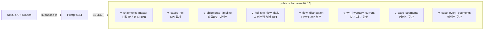

### 뷰 목록 및 용도

| 뷰 이름 | 용도 | 주요 소스 테이블 |
|---------|------|-----------------|
| `v_shipments_master` | 선적 마스터 (hvdc_code 기준 JOIN) | `status.shipments_status` + `case.cases` + `case.flows` |
| `v_shipments_timeline` | 선적 이벤트 타임라인 | `status.events_status` |
| `v_cases_kpi` | 케이스 KPI (사이트·Flow Code별) | `case.cases` GROUP BY |
| `v_flow_distribution` | Flow Code 분포 통계 | `case.flows` |
| `v_wh_inventory_current` | 창고 재고 현황 | `wh.stock_onhand` |
| `v_case_segments` | 케이스별 구간 정보 | `case.cases` + `case.events_case` |
| `v_case_event_segments` | 이벤트 기반 구간 | `case.events_case` |
| `v_kpi_site_flow_daily` | 사이트별 일간 KPI | `case.cases` + `case.flows` |

### 핵심 뷰 SQL 요약

```sql
-- v_shipments_master: 선적 + 케이스 + Flow Code JOIN
CREATE OR REPLACE VIEW public.v_shipments_master AS
SELECT
    ss.hvdc_code,
    ss.vendor,
    ss.pol, ss.pod, ss.vessel, ss.bl_awb, ss.ship_mode,
    ss.etd, ss.eta, ss.atd, ss.ata, ss.incoterms,
    c.site, c.flow_code, c.status_current, c.final_location,
    f.flow_code_original, f.override_reason
FROM status.shipments_status ss
LEFT JOIN "case".cases c      ON c.hvdc_code = ss.hvdc_code
LEFT JOIN "case".flows f      ON f.hvdc_code = ss.hvdc_code;

-- v_cases_kpi: 사이트·Flow Code별 케이스 집계
CREATE OR REPLACE VIEW public.v_cases_kpi AS
SELECT
    site,
    flow_code,
    COUNT(*)                                    AS case_count,
    SUM(sqm)                                    AS total_sqm,
    COUNT(*) FILTER (WHERE status_current = 'site')      AS site_count,
    COUNT(*) FILTER (WHERE status_current = 'warehouse') AS wh_count
FROM "case".cases
GROUP BY site, flow_code;

-- v_kpi_site_flow_daily: 일간 KPI 집계
CREATE OR REPLACE VIEW public.v_kpi_site_flow_daily AS
SELECT
    c.site,
    f.flow_code,
    DATE(c.created_at)  AS kpi_date,
    COUNT(*)            AS cnt,
    SUM(c.sqm)          AS total_sqm,
    f.requires_review
FROM "case".cases c
JOIN "case".flows f ON f.hvdc_code = c.hvdc_code
GROUP BY c.site, f.flow_code, DATE(c.created_at), f.requires_review;
```

> 전체 DDL: `supabase/scripts/20260124_hvdc_layers_status_case_ops.sql`

### Why Views Instead of Direct Schema Access?

```mermaid
graph TD
    Problem["Problem: PostgREST only exposes\nthe 'public' schema by default"]

    Option1["Option A: Add schemas to\nsupabase.toml db.schema config\n(requires infrastructure access)"]

    Option2["Option B: Create public views\n(simple SQL, no config needed)\n✅ CHOSEN"]

    Option3["Option C: Use service_role key\nin API routes\n(security concern)"]

    Problem --> Option1
    Problem --> Option2
    Problem --> Option3

    style Option2 fill:#1a3a1a
```

**Decision:** Public views provide:
1. **No config changes needed** — works with default Supabase setup
2. **Stable API contract** — views can be modified without changing API routes
3. **Independent RLS** — views have their own RLS policies
4. **Zero performance overhead** — PostgreSQL views are essentially free (no materialization)

---

## 5. Row Level Security (RLS)

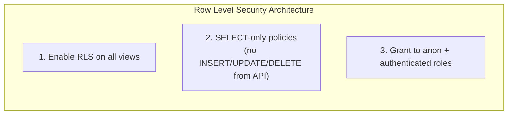

### RLS Setup SQL

```sql
-- Enable RLS on all public views
ALTER TABLE public.v_cases ENABLE ROW LEVEL SECURITY;
ALTER TABLE public.v_flows ENABLE ROW LEVEL SECURITY;
ALTER TABLE public.v_shipments_status ENABLE ROW LEVEL SECURITY;
ALTER TABLE public.v_stock_onhand ENABLE ROW LEVEL SECURITY;

-- Allow SELECT for anonymous users (dashboard is read-only public)
CREATE POLICY "v_cases_select_all"
    ON public.v_cases
    FOR SELECT
    TO anon, authenticated
    USING (true);

CREATE POLICY "v_flows_select_all"
    ON public.v_flows
    FOR SELECT
    TO anon, authenticated
    USING (true);

CREATE POLICY "v_shipments_status_select_all"
    ON public.v_shipments_status
    FOR SELECT
    TO anon, authenticated
    USING (true);

CREATE POLICY "v_stock_onhand_select_all"
    ON public.v_stock_onhand
    FOR SELECT
    TO anon, authenticated
    USING (true);
```

### Future RLS (with Auth)

```sql
-- Site-based access control (when Auth is implemented)
CREATE POLICY "cases_by_user_site"
    ON public.v_cases
    FOR SELECT
    TO authenticated
    USING (
        site = (
            SELECT assigned_site
            FROM public.user_profiles
            WHERE user_id = auth.uid()
        )
        OR
        (SELECT role FROM public.user_profiles WHERE user_id = auth.uid()) = 'admin'
    );
```

---

## 6. PostgREST Access Pattern

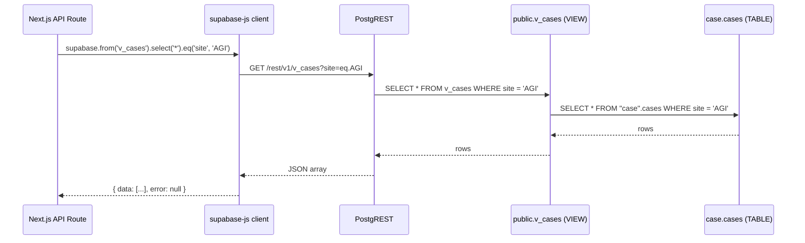

### supabase-js Query Examples

```typescript
// ✅ Correct: query public view
const { data, error } = await supabase
  .from('v_cases')
  .select('*')
  .eq('site', 'AGI')
  .order('created_at', { ascending: false })
  .range(0, 49)

// ❌ Wrong: custom schema (403 Forbidden)
const { data, error } = await supabase
  .schema('case')     // This fails — schema not exposed
  .from('cases')
  .select('*')

// KPI aggregation pattern
const { data: allCases } = await supabase
  .from('v_cases')
  .select('status_current, flow_code, site, sqm, vendor')

// Aggregate in JavaScript (since PostgREST doesn't support GROUP BY directly)
const totalCases = allCases.length
const byStatus = Object.fromEntries(
  [...new Set(allCases.map(c => c.status_current))].map(s => [
    s,
    allCases.filter(c => c.status_current === s).length
  ])
)
```

### Filter Operations

```typescript
// Single value filter
.eq('status_current', 'site')

// Multiple values (IN)
.in('status_current', ['site', 'warehouse'])

// Range
.range(page * limit, (page + 1) * limit - 1)

// Order
.order('created_at', { ascending: false })

// Text search
.ilike('vendor', '%ABB%')

// Null check
.is('ata', null)          // where ata IS NULL
.not('ata', 'is', null)   // where ata IS NOT NULL
```

---

## 7. Supabase Realtime Configuration

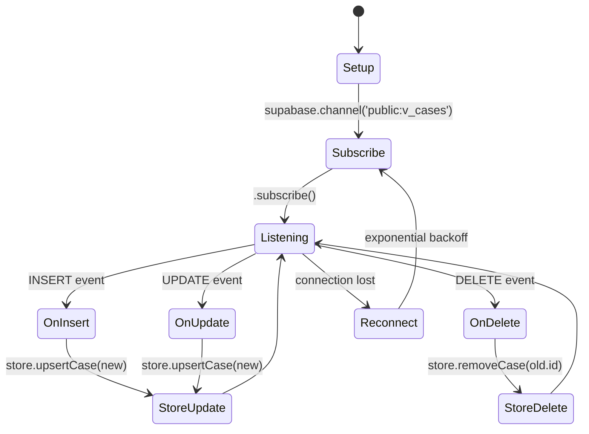

### Realtime Subscription Code

```typescript
// hooks/useSupabaseRealtime.ts
const channel = supabase
  .channel('public:v_cases')
  .on(
    'postgres_changes',
    {
      event: '*',           // INSERT | UPDATE | DELETE
      schema: 'public',
      table: 'v_cases',
    },
    (payload) => {
      switch (payload.eventType) {
        case 'INSERT':
          store.upsertCase(payload.new as CaseRow)
          break
        case 'UPDATE':
          store.upsertCase(payload.new as CaseRow)
          break
        case 'DELETE':
          store.removeCase(payload.old.id)
          break
      }
    }
  )
  .subscribe()
```

### Enable Realtime for Views

In Supabase Dashboard → Database → Replication:

1. Enable **Realtime** for `public.v_cases`
2. Enable **Realtime** for `public.v_stock_onhand`
3. Enable **Realtime** for `public.v_shipments_status`

Or via SQL:
```sql
-- Enable realtime for public views
ALTER PUBLICATION supabase_realtime ADD TABLE public.v_cases;
ALTER PUBLICATION supabase_realtime ADD TABLE public.v_flows;
ALTER PUBLICATION supabase_realtime ADD TABLE public.v_shipments_status;
ALTER PUBLICATION supabase_realtime ADD TABLE public.v_stock_onhand;
```

---

## 8. API Keys & Authentication


### Key Usage in Code

```typescript
// lib/supabase.ts — client factory

// Browser (client components, hooks)
export const supabase = createClient(
  process.env.NEXT_PUBLIC_SUPABASE_URL!,
  process.env.NEXT_PUBLIC_SUPABASE_ANON_KEY!
)

// Server (API routes only)
import { createClient } from '@supabase/supabase-js'

const supabaseAdmin = createClient(
  process.env.NEXT_PUBLIC_SUPABASE_URL!,
  process.env.SUPABASE_SERVICE_ROLE_KEY!,  // Never in NEXT_PUBLIC_
  {
    auth: {
      autoRefreshToken: false,
      persistSession: false,
    }
  }
)
```

---

## 9. Supabase Client Configuration

```typescript
// lib/supabase.ts
import { createClient } from '@supabase/supabase-js'

const supabaseUrl = process.env.NEXT_PUBLIC_SUPABASE_URL
const supabaseAnonKey = process.env.NEXT_PUBLIC_SUPABASE_ANON_KEY

// Graceful fallback — prevents crash when env vars missing
if (!supabaseUrl || !supabaseAnonKey) {
  console.warn('Supabase env vars missing — using mock data fallback')
}

export const supabase = supabaseUrl && supabaseAnonKey
  ? createClient(supabaseUrl, supabaseAnonKey, {
      realtime: {
        params: {
          eventsPerSecond: 10,
        },
      },
      db: {
        schema: 'public',  // Always public schema
      },
      auth: {
        persistSession: true,
        autoRefreshToken: true,
      },
    })
  : null  // null triggers mock fallback in lib/api.ts
```

### Mock Fallback Pattern

```typescript
// lib/api.ts
export async function fetchCasesSummary(): Promise<CasesSummary> {
  if (!supabase) {
    // Return static mock data when Supabase unavailable
    return MOCK_CASES_SUMMARY
  }

  const response = await fetch('/api/cases/summary')
  if (!response.ok) throw new Error('Failed to fetch KPI data')
  return response.json()
}
```

---

## 10. Supabase Scripts (DDL + ETL)

### 10.1 스크립트 실행 순서

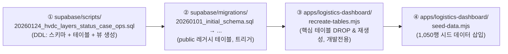

> **중요:** `scripts/` 폴더를 `migrations/`보다 먼저 실행한다. `20260124_hvdc_layers_status_case_ops.sql`이 운영 스키마 전체를 정의한다.

### 10.2 핵심 SQL 파일: `20260124_hvdc_layers_status_case_ops.sql`

경로: `supabase/scripts/20260124_hvdc_layers_status_case_ops.sql` (12.9 KB)

생성 객체 요약:

| 스키마 | 객체 | 종류 |
|--------|------|------|
| `status` | `shipments_status`, `events_status` | TABLE |
| `"case"` | `shipments_case`, `cases`, `flows`, `locations`, `events_case`, `events_case_debug` | TABLE |
| `ops` | `etl_runs` | TABLE |
| `public` | `v_shipments_master`, `v_shipments_timeline`, `v_cases_kpi`, `v_flow_distribution`, `v_wh_inventory_current`, `v_case_event_segments`, `v_case_segments`, `v_kpi_site_flow_daily` | VIEW |

### 10.5 ⭐ 신규 마이그레이션: `20260127_api_views.sql`

경로: `supabase/migrations/20260127_api_views.sql`

> **이 파일이 없으면 `/api/cases`, `/api/stock` 엔드포인트가 실패합니다.**

| 생성 뷰 | 소스 테이블 | 사용 API |
|---------|------------|---------|
| `public.v_cases` | `"case".cases` | `/api/cases`, `/api/cases/summary` |
| `public.v_stock_onhand` | `wh.stock_onhand` | `/api/stock` |

```sql
-- Supabase SQL Editor에서 실행:
-- 또는 migrations/ 폴더에 포함되어 있어 순서대로 실행 시 자동 적용
```

**배경:** PostgREST는 `public` 스키마만 노출하므로, `case` 및 `wh` 커스텀 스키마의 테이블에 직접 접근 불가. 이 뷰들이 없으면 API가 즉시 `404 Not Found` 반환.

```bash
# Supabase SQL Editor에서 실행 또는:
psql "$DATABASE_URL" -f supabase/scripts/20260124_hvdc_layers_status_case_ops.sql
```

### 10.3 `recreate-tables.mjs` (개발 전용)

경로: `apps/logistics-dashboard/recreate-tables.mjs`

```bash
node recreate-tables.mjs
```

동작:
1. `"case".cases`, `"case".flows`, `status.shipments_status`, `wh.stock_onhand` DROP CASCADE
2. 위 4개 테이블 재생성 (RLS 포함)
3. `public.shipments` 뷰 재생성
4. `NOTIFY pgrst, 'reload schema'` (PostgREST 스키마 캐시 갱신)

> ⚠️ **개발 전용** — 운영 환경에서 절대 실행 금지 (모든 데이터 삭제됨)

### 10.4 `seed-data.mjs`

경로: `apps/logistics-dashboard/seed-data.mjs`

```bash
node seed-data.mjs
```

배치 upsert 방식으로 데이터 삽입. `recreate-tables.mjs` 실행 후 사용.

---

## 11. Seed Data

### Seed Data Distribution (1,050 rows)

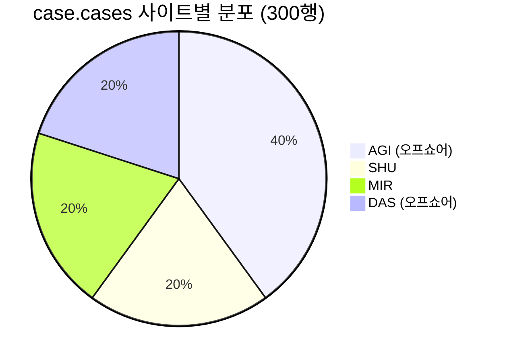

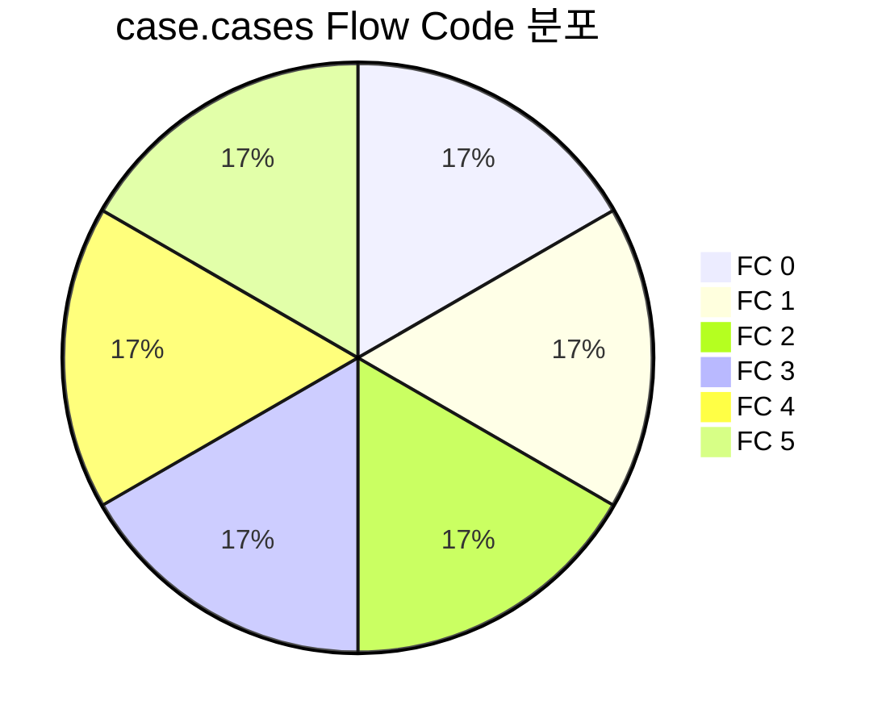

### 삽입 데이터 요약

| 테이블 | 행 수 | 주요 규칙 |
|--------|-------|-----------|
| `"case".cases` | 300 | AGI 40% / SHU·MIR·DAS 각 20% |
| `"case".flows` | 300 | AGI/DAS(오프쇼어): FC ≥ 3 강제 |
| `status.shipments_status` | 300 | hvdc_code 기준 매핑 |
| `wh.stock_onhand` | 150 | MOSB·DAS·AGI 창고 재고 |
| **합계** | **1,050** | |

### 오프쇼어 Flow Code 규칙 (seed-data.mjs)

```js
// AGI, DAS는 오프쇼어 사이트 → FC 3, 4, 5만 허용
const offshoreFC = () => rand([3, 3, 4, 4, 5])  // 가중치: FC3 40%, FC4 40%, FC5 20%
const onshorFC   = () => rand([0, 1, 2, 3, 4, 5])

const flow_code = ['AGI', 'DAS'].includes(site) ? offshoreFC() : onshorFC()
```

> 이 규칙은 **Flow Code v3.5** 정책을 반영한다. AGI·DAS 오프쇼어 사이트는 항상 FC ≥ 3.

---

## 12. SQL Reference

### Useful Diagnostic Queries

```sql
-- Check all schemas
SELECT schema_name FROM information_schema.schemata ORDER BY schema_name;

-- Check tables per schema
SELECT table_schema, table_name, table_type
FROM information_schema.tables
WHERE table_schema IN ('case', 'status', 'wh', 'public')
ORDER BY table_schema, table_name;

-- KPI verification
SELECT
    COUNT(*) AS total_cases,
    COUNT(*) FILTER (WHERE status_current = 'site') AS site_arrived,
    COUNT(*) FILTER (WHERE status_current = 'warehouse') AS warehouse,
    COUNT(*) FILTER (WHERE status_current = 'Pre Arrival') AS pre_arrival
FROM public.v_cases;

-- Flow code distribution
SELECT flow_code, COUNT(*) AS count
FROM public.v_cases
GROUP BY flow_code
ORDER BY flow_code;

-- Vendor distribution
SELECT vendor, COUNT(*) AS count, SUM(sqm) AS total_sqm
FROM public.v_cases
GROUP BY vendor
ORDER BY count DESC;

-- Site breakdown
SELECT site, status_current, COUNT(*) AS count
FROM public.v_cases
GROUP BY site, status_current
ORDER BY site, status_current;

-- Check RLS policies
SELECT tablename, policyname, roles, cmd, qual
FROM pg_policies
WHERE schemaname = 'public'
ORDER BY tablename, policyname;

-- Check publications (realtime)
SELECT * FROM pg_publication_tables
WHERE pubname = 'supabase_realtime';
```

### View Inspection

```sql
-- 모든 public 뷰 목록 확인
SELECT schemaname, viewname
FROM pg_views
WHERE schemaname = 'public'
ORDER BY viewname;

-- API 뷰 정의 확인 (v_cases, v_stock_onhand — 20260127_api_views.sql로 생성)
SELECT schemaname, viewname, definition
FROM pg_views
WHERE schemaname = 'public'
    AND viewname IN ('v_cases', 'v_stock_onhand',
                     'v_shipments_master', 'v_cases_kpi',
                     'v_kpi_site_flow_daily', 'v_flow_distribution',
                     'v_wh_inventory_current', 'v_case_segments',
                     'v_case_event_segments', 'v_shipments_timeline',
                     'shipments')
ORDER BY viewname;

-- GRANT 현황 확인
SELECT grantee, privilege_type, table_name
FROM information_schema.role_table_grants
WHERE table_schema = 'public'
  AND table_name IN ('v_cases', 'v_stock_onhand', 'v_shipments_master')
ORDER BY table_name, grantee;
```

---

## 13. Troubleshooting

### Error: 403 Forbidden on PostgREST

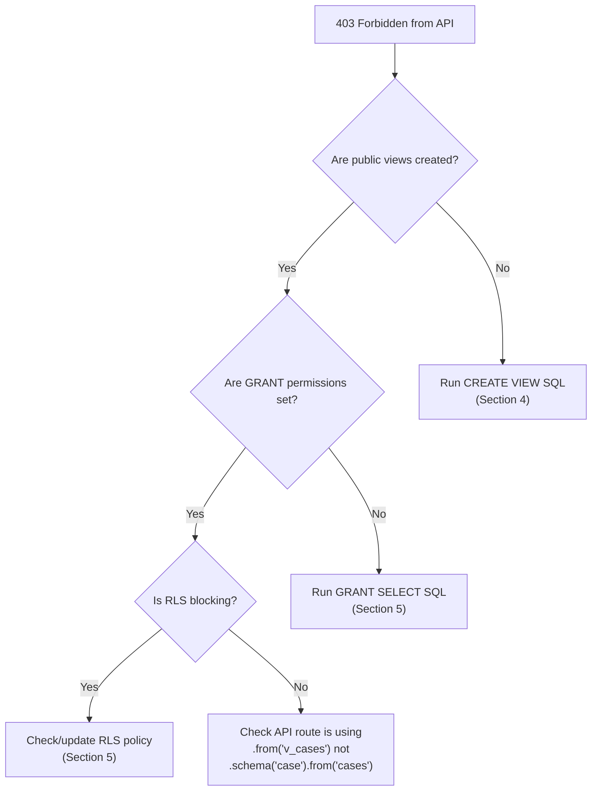

```sql
-- Quick fix: recreate everything
DROP VIEW IF EXISTS public.v_cases CASCADE;
CREATE OR REPLACE VIEW public.v_cases AS SELECT * FROM "case".cases;
GRANT SELECT ON public.v_cases TO anon, authenticated;

-- Verify fix
SELECT COUNT(*) FROM public.v_cases;
```

### Error: Realtime not receiving events

```sql
-- Verify realtime publication
SELECT * FROM pg_publication_tables WHERE pubname = 'supabase_realtime';

-- Add if missing
ALTER PUBLICATION supabase_realtime ADD TABLE public.v_cases;

-- Check realtime is enabled in Supabase dashboard:
-- Dashboard → Database → Replication → v_cases (enable toggle)
```

### Error: KPI shows 0 for site/warehouse

```sql
-- Verify data distribution
SELECT status_current, COUNT(*)
FROM public.v_cases
GROUP BY status_current;

-- Fix: update status values
UPDATE "case".cases
SET status_current = 'site'
WHERE id IN (
    SELECT id FROM "case".cases
    ORDER BY created_at
    LIMIT 10
);

UPDATE "case".cases
SET status_current = 'warehouse'
WHERE id IN (
    SELECT id FROM "case".cases
    WHERE status_current != 'site'
    ORDER BY created_at
    LIMIT 10
);
```

### Performance Queries

```sql
-- Check query performance on v_cases
EXPLAIN ANALYZE SELECT * FROM public.v_cases WHERE site = 'AGI';

-- Add index if site filter is slow
CREATE INDEX IF NOT EXISTS idx_cases_site ON "case".cases(site);
CREATE INDEX IF NOT EXISTS idx_cases_status ON "case".cases(status_current);
CREATE INDEX IF NOT EXISTS idx_cases_flow_code ON "case".cases(flow_code);
CREATE INDEX IF NOT EXISTS idx_cases_created_at ON "case".cases(created_at DESC);
```
