# System Architecture — HVDC Logistics Dashboard

> **Version:** 2.0.0 | **Last Updated:** 2026-03-14
> **Stack:** Next.js 16 · React 19 · TypeScript 5 · Supabase · Deck.gl · Zustand

---

## Table of Contents

1. [Architecture Overview](#1-architecture-overview)
2. [Technology Stack](#2-technology-stack)
3. [Application Layers](#3-application-layers)
4. [Data Flow Architecture](#4-data-flow-architecture)
5. [API Architecture](#5-api-architecture)
6. [State Management](#6-state-management)
7. [Realtime Architecture](#7-realtime-architecture)
8. [Database Architecture](#8-database-architecture)
9. [Frontend Rendering Strategy](#9-frontend-rendering-strategy)
10. [Security Architecture](#10-security-architecture)
11. [Performance Architecture](#11-performance-architecture)
12. [Deployment Architecture](#12-deployment-architecture)

---

## 0. Overview Cockpit Architecture Update

### v2.0 Overview (commits fd4e6be, c4eb9cb)

**BFF Endpoint**

`GET /api/overview` — Aggregated BFF that fans out to `/api/cases/summary`, `/api/worklist`, `/api/events`, `/api/locations`, `/api/location-status`, and `/api/shipments/stages`. Returns `OverviewCockpitResponse` with the following top-level fields: `hero.metrics[8]` (KPI cards), `alerts[]`, `routeSummary[]`, `siteReadiness[]`, `liveFeed[]`, `pipeline[]`, `worklist{}`, and `generatedAt`. Consumed by the `useOverviewData({ refreshKey })` hook.

**Hero KPI Rail — 8 metrics (expanded from 5)**

| id | Value source | Tone condition |
|---|---|---|
| `total-shipments` | `shipmentStages.total` | neutral |
| `final-delivered` | `shipmentStages.delivered` | neutral |
| `open-anomaly` | anomaly calc | warning `>0` |
| `overdue-eta` | `worklist.kpis.overdueCount` | critical `>0` |
| `critical-pod` | `agi_das` alert count | warning `>0` |
| `critical-mode` | `worklist.kpis.redCount` | warning `>0` |
| `agi-risk` | AGI `readinessPercent` | critical `<50`, warn `<80` |
| `data-freshness` | `freshnessMinutes` | warn `>30`, critical `>60` |

**7-Row Page Layout**

OverviewPageClient is structured as a 7-row layout: `ProgramFilterBar` → `ChainRibbonStrip` → KPI strip → `MissionControl` → `SiteDeliveryMatrix` → `OpenRadarTable` → `OpsSnapshot`.

**6 New Components**

| Component | File |
|-----------|------|
| `ProgramFilterBar` | `components/overview/ProgramFilterBar.tsx` |
| `ChainRibbonStrip` | `components/overview/ChainRibbonStrip.tsx` |
| `MissionControl` | `components/overview/MissionControl.tsx` |
| `SiteDeliveryMatrix` | `components/overview/SiteDeliveryMatrix.tsx` |
| `OpenRadarTable` | `components/overview/OpenRadarTable.tsx` |
| `OpsSnapshot` | `components/overview/OpsSnapshot.tsx` |

**Deprecated Components (files preserved, no longer rendered)**

- `OverviewRightPanel.tsx`
- `OverviewBottomPanel.tsx`

**Cross-Page State Connections**

- `casesStore.activePipelineStage` — set by `ChainRibbonStrip` node click; `PipelineTableWrapper` reads this to auto-filter the pipeline page.
- `logisticsStore.highlightedShipmentId` — existing field; `MissionControl` is now a new consumer alongside the existing search bar flow.
- `filterSite: SiteKey | null` — local state in `OverviewPageClient`; drives both `ChainRibbonStrip` (highlights active site) and `SiteDeliveryMatrix` (row selection).

**Light-Ops CSS Scoped Theme**

`SITE_META` extended with `chipClass` (light-ops chip styles) and `riskColor` fields alongside the existing `accentClass` (dark-panel). `lib/overview/ui.ts` exports `gateClassLight()` (upgraded to full pill badge: `bg-red-50 + ring-1`) and the shared design token constants object `uiTokens` (`panel`, `panelSubtle`, `hoverCard`, `hoverRow`).

**New i18n Sections** added to `lib/i18n/translations.ts`: `programBar`, `missionControl`, `siteMatrix`, `openRadar`, `opsSnapshot`, `chainRibbon`.

**Design Polish Patch (commit c4eb9cb)**

- Sidebar: `bg-[#071225]`, active shadow, brand 18 px bold
- `LangToggle`: light white pill
- `SiteDeliveryMatrix`: `p-6`, hero metric, ring badges
- `OpenRadarTable`: `rounded-xl` rows, 540 px scroll area, selected-state ring
- `OpsSnapshot`: `bg-[#F8FAFC]` (warm beige removed), `h-2.5` WH bars, worklist border rows

**Carry-forward from v1.3.0 (still valid)**

- `KpiProvider` remains the single global realtime owner; overview does not add a second global subscription.
- Public overview vocabulary is config-driven via `configs/overview.route-types.json` and `configs/overview.destinations.json`.
- Cross-page navigation is URL-first through `lib/navigation/contracts.ts`; `flow_code` remains an internal compatibility field only.
- `useOverviewData` accepts `refreshKey` — new voyage submission triggers overview re-fetch.

## 1. Architecture Overview

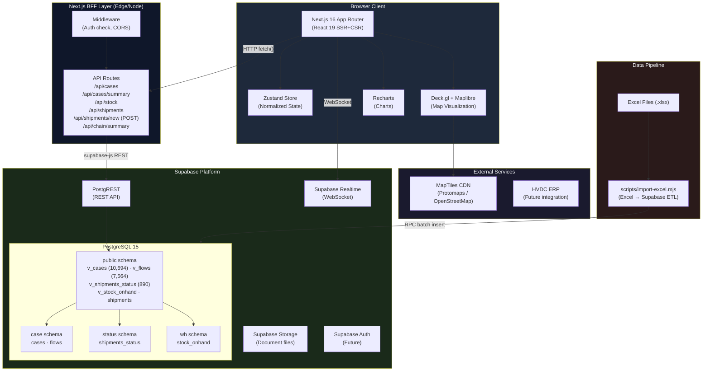

---

## 2. Technology Stack

```mermaid
mindmap
  root((HVDC Dashboard))
    Frontend
      Next.js 16.3
        App Router
        Server Components
        Server Actions
      React 19.2
        Concurrent Features
        Suspense
        use() hook
      TypeScript 5.4
        Strict mode
        Path aliases
    UI
      Tailwind CSS 3.4
        Dark theme
        CSS variables
      Shadcn UI
        Radix primitives
        Accessible components
      Deck.gl 9
        WebGL 2.0 layers
        GPU acceleration
      Maplibre GL 3
        Vector tiles
        Custom styles
      Recharts 2
        SVG charts
        Responsive
    Data
      Supabase
        PostgreSQL 15
        PostgREST v12
        Realtime v2
      Zustand 4
        Normalized store
        Immer middleware
        Devtools
    Build
      Turbopack
        Fast refresh
        Module federation
      ESLint 9
      Prettier 3
```

### Version Matrix

| Package | Version | Purpose |
|---------|---------|---------|
| `next` | 16.3.x | Framework & BFF |
| `react` | 19.2.0 | UI runtime |
| `typescript` | 5.4.x | Type safety |
| `@supabase/supabase-js` | 2.x | DB client |
| `@deck.gl/react` | 9.x | Map layers |
| `maplibre-gl` | 3.x | Map renderer |
| `recharts` | 2.x | Charts |
| `zustand` | 4.x | State management |
| `tailwindcss` | 3.4.x | Styling |
| `@radix-ui/*` | latest | UI primitives |

---

## 3. Application Layers

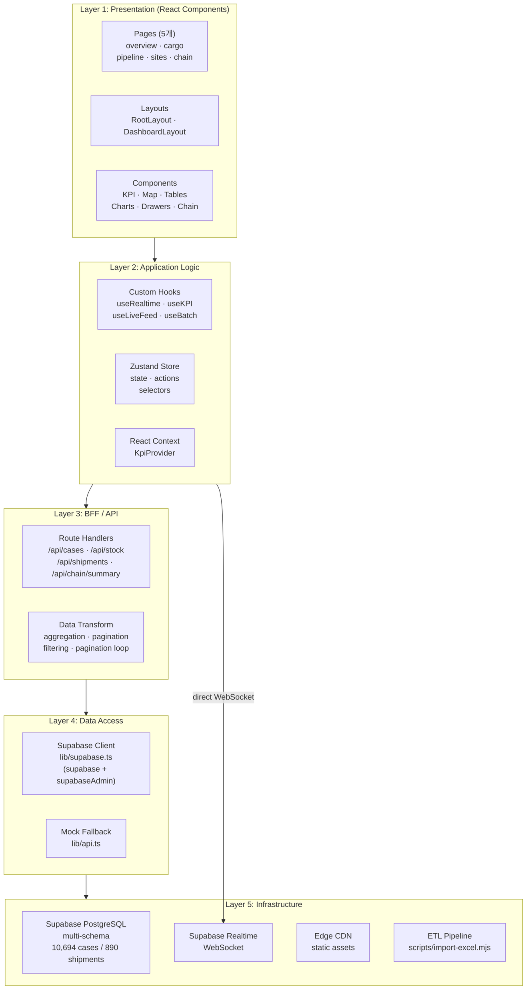

---

## 4. Data Flow Architecture

### 4.1 Initial Page Load

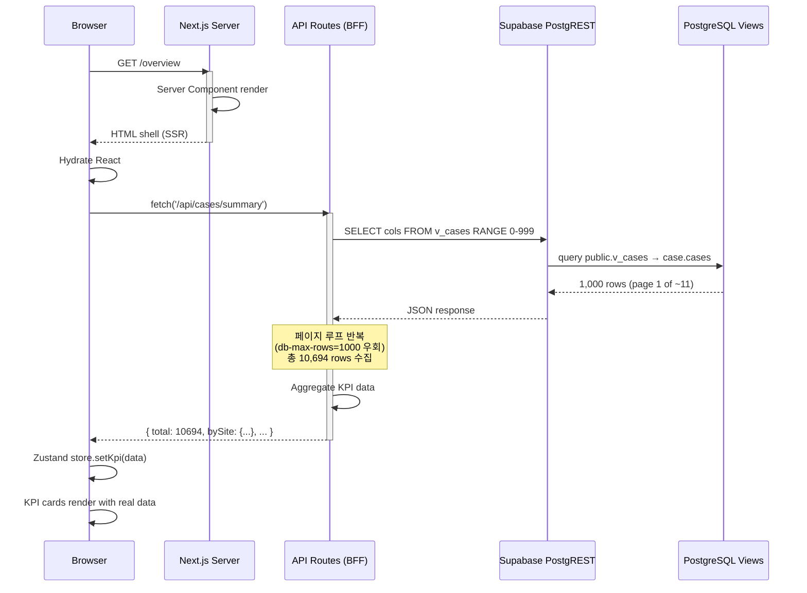

### 4.2 Pagination Loop (db-max-rows=1000 우회)

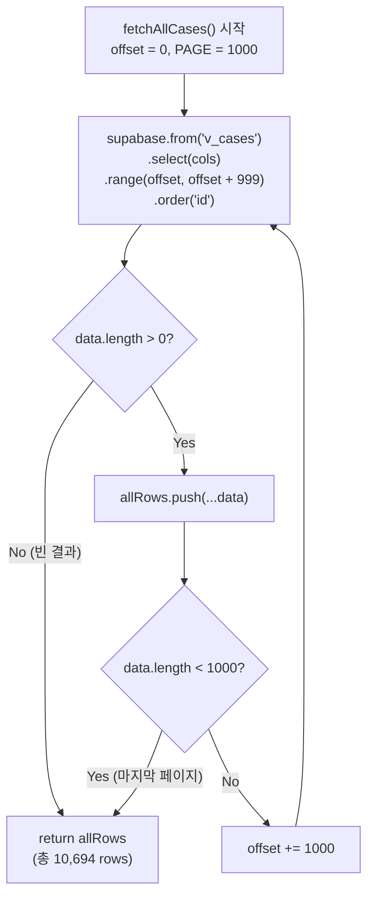

> `/api/cases/summary` 와 `/api/chain/summary` 양쪽에서 이 패턴을 사용한다.

### 4.3 Realtime Update Flow

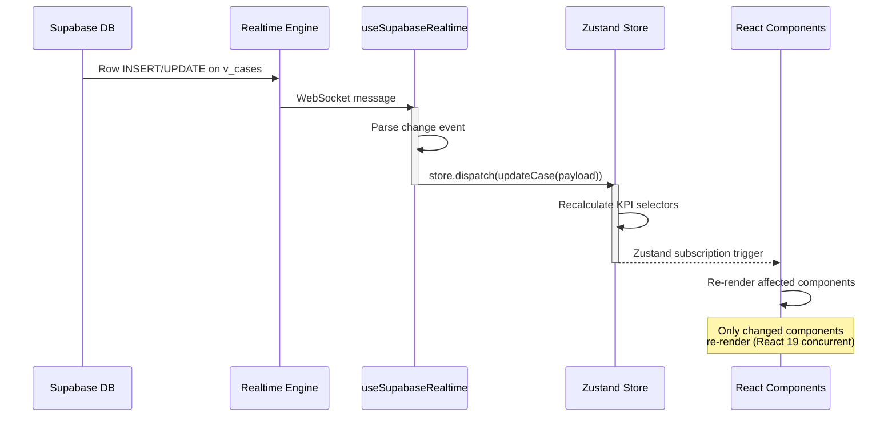

### 4.4 Filter / Search Flow

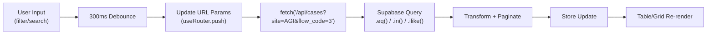

---

## 5. API Architecture

```mermaid
graph LR
    subgraph Routes["API Route Handlers"]
        R1["/api/cases\nGET · paginated list"]
        R2["/api/cases/summary\nGET · KPI aggregation\n(전체 10,694 rows)"]
        R3["/api/stock\nGET · warehouse stock"]
        R4["/api/shipments\nGET · shipment list\n(public.shipments VIEW)"]
        R5["/api/chain/summary\nGET · 전체 물류 체인 집계"]
        R6["/api/events\nGET · activity events"]
        R7["/api/locations\nGET · location list"]
        R8["/api/location-status\nGET · per-location KPI"]
        R9["/api/worklist\nGET · work items"]
        R10["/api/shipments/origin-summary\nGET · 출발지 국가별 집계"
        R11["/api/shipments/vendors
GET · 고유 벤더 목록 + 건수 (42개)"]
        R12["/api/shipments/stages
GET · 항차 단계별 집계"]
        R13["/api/shipments/new
POST · 신규 항차 등록 · status.shipments_status INSERT · 200/409/400/500"]
        R14["/api/overview
GET · Aggregated BFF · OverviewCockpitResponse"]
    end

    subgraph QueryParams["Query Parameters"]
        QP1["site: AGI|DAS|MIR|SHU|MOSB"]
        QP2["flow_code: 0|1|2|3|4|5"]
        QP3["status_current: site|warehouse|..."]
        QP4["vendor: string"]
        QP5["page: number (default 1)"]
        QP6["pageSize: number (default 50)"]
        QP7["stage: PipelineStage"]
    end

    subgraph SupabaseViews["Supabase Views"]
        V1["public.v_cases"]
        V2["public.v_flows"]
        V3["public.v_shipments_status"]
        V4["public.v_stock_onhand"]
        V5["public.shipments (complex JOIN)"]
    end

    R1 --> V1
    R2 --> V1
    R3 --> V4
    R4 --> V5
    R5 --> V1
    R5 --> V5
    R6 --> V1
    R7 --> V1
    R8 --> V1
    R9 --> V1
    R10 --> V5
    R11 --> V5
    R12 --> V5
    R14 --> V1
    R14 --> V5

    QueryParams -.->|"filter params"| R1
    QueryParams -.->|"filter params"| R4
```

### 페이지네이션 전략

| API | 전략 | 이유 |
|-----|------|------|
| `/api/cases` | 서버 페이지네이션 (`page` + `pageSize`) | 사용자가 페이지를 탐색하는 목록 UI |
| `/api/cases?stage=X` | 클라이언트 필터링 (최대 20,000 rows 로드 후 필터) | stage는 DB 컬럼 아니므로 PostgREST 필터 불가 |
| `/api/cases/summary` | **전체 로드** (pagination loop) | KPI 집계에 전체 10,694 rows 필요 |
| `/api/chain/summary` | **전체 로드** (pagination loop) | 체인 집계에 전체 rows 필요 |
| `/api/shipments` | 서버 페이지네이션 | 890 rows — 단순 페이징으로 충분 |
| `/api/shipments/vendors` | **전체 로드** (pagination loop) | 벤더 distinct + 건수 집계에 전체 rows 필요 |
| `/api/shipments/stages` | **전체 로드** (pagination loop) | 항차 단계 집계에 전체 rows 필요 |
| `/api/shipments/new` | INSERT (POST) | 신규 항차 등록 — 페이지네이션 없음 |

### 신규/변경 API 요약 (v1.3.0 → v2.0.0)

| Route | 버전 | 변경 | 설명 |
|-------|------|------|------|
| `POST /api/shipments/new` | v1.3.0 | 신규 | 신규 항차 등록 · status.shipments_status INSERT · 200/409/400/500 |
| `GET /api/shipments?q=` | v1.3.0 | 변경 | `?q=` ilike param — `sct_ship_no` 컬럼 부분 매칭 (mutually exclusive with `?sct_ship_no=` exact match via else if) |
| `GET /api/overview` | v2.0.0 | 신규 | Aggregated BFF — fans out to 6 internal endpoints; returns `OverviewCockpitResponse` with `hero.metrics[8]`, `alerts[]`, `routeSummary[]`, `siteReadiness[]`, `liveFeed[]`, `pipeline[]`, `worklist{}`, `generatedAt` |

### 항차 생성 흐름 (POST /api/shipments/new)

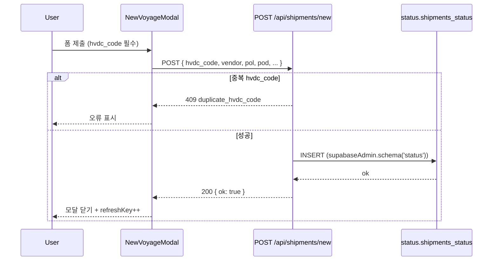

### Response Schemas

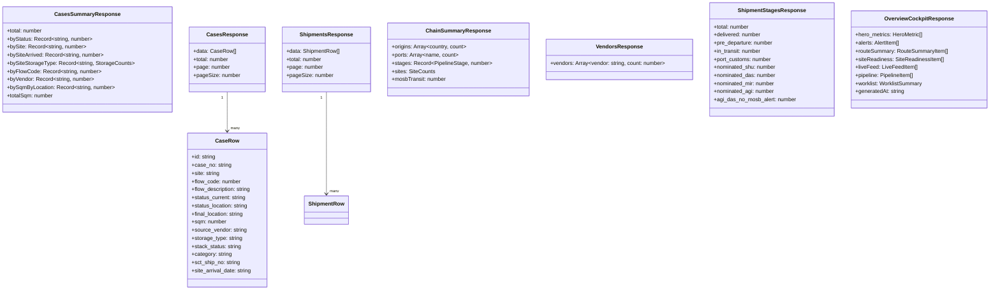

---

## 6. State Management

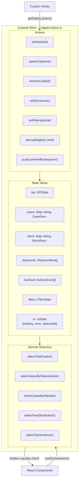

### logisticsStore 확장 필드 (v1.3.0 신규, v2.0.0 유지)

```
logisticsStore:
  layerOriginArcs: boolean    ← v1.3.0: OriginArcLayer on/off
  layerTrips: boolean         ← v1.3.0: TripsLayer on/off
  highlightedShipmentId       ← v1.3.0: selected trip UUID for highlight
                                v2.0.0: MissionControl도 이 필드를 소비
```

Actions: `toggleLayerOriginArcs()`, `toggleLayerTrips()`, `setHighlightedShipmentId(id)`

### casesStore 신규 필드 (v2.0.0)

```
casesStore:
  activePipelineStage: PipelineStage | null
    ← ChainRibbonStrip 노드 클릭 시 set
    → PipelineTableWrapper가 읽어 파이프라인 페이지 자동 필터링
```

Actions: `setActivePipelineStage(stage: PipelineStage | null)`

Store file: `store/casesStore.ts`

### OverviewPageClient 로컬 상태 (v2.0.0)

```
OverviewPageClient (local state):
  filterSite: SiteKey | null
    ← site chip 클릭 또는 SiteDeliveryMatrix 행 선택 시 set
    → ChainRibbonStrip (활성 사이트 하이라이트)
    → SiteDeliveryMatrix (행 선택 링 표시)
```

### 검색 및 하이라이트 흐름 (v1.3.0)

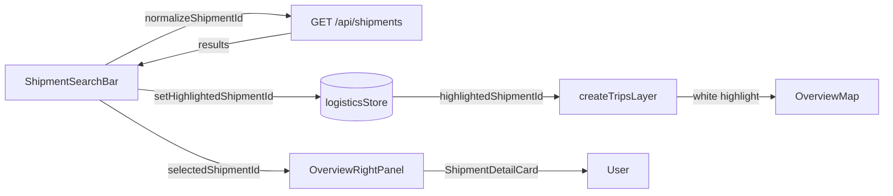

### Store Normalization Pattern

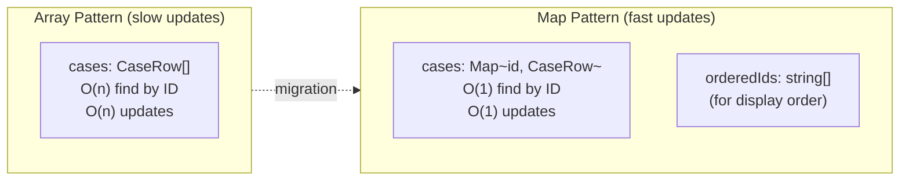

---

## 7. Realtime Architecture

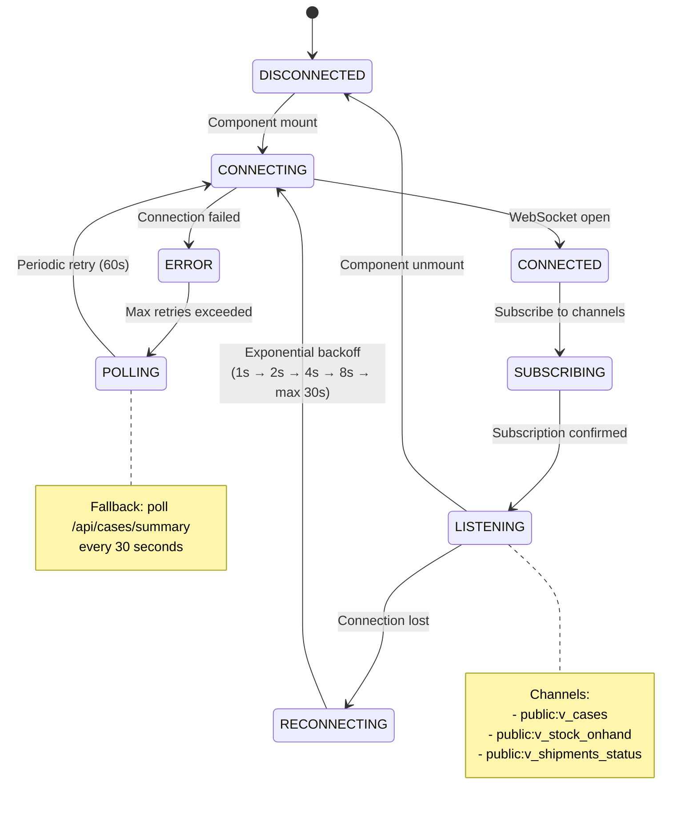

### Multi-Tab Synchronization

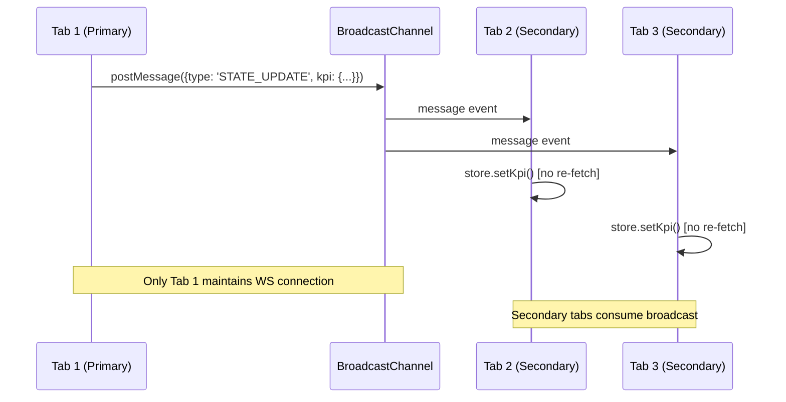

---

## 8. Database Architecture

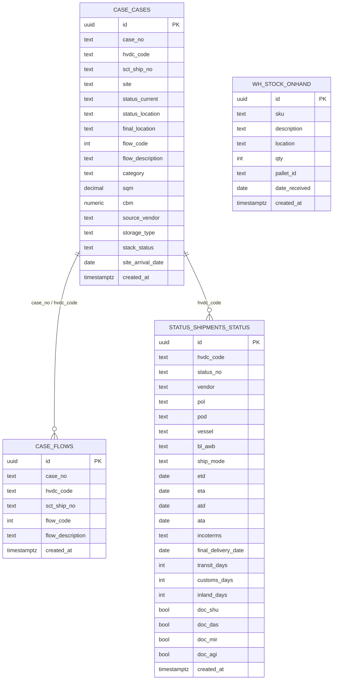

### Schema Isolation & View Layer

```mermaid
graph TB
    subgraph PG["PostgreSQL 15"]
        subgraph PublicSchema["public schema (PostgREST exposed)"]
            VC["VIEW v_cases\n(10,694 rows)"]
            VF["VIEW v_flows\n(7,564 rows)"]
            VS["VIEW v_shipments_status\n(890 rows)"]
            VW["VIEW v_stock_onhand"]
            VM["VIEW shipments\n(complex LEFT JOIN)"]
        end

        subgraph CaseSchema["case schema (isolated)"]
            TC["TABLE cases"]
            TF["TABLE flows"]
        end

        subgraph StatusSchema["status schema (isolated)"]
            TS["TABLE shipments_status"]
        end

        subgraph WhSchema["wh schema (isolated)"]
            TW["TABLE stock_onhand"]
        end
    end

    subgraph PostgREST["PostgREST API"]
        PR["Exposes only\npublic schema"]
    end

    PR --> VC
    PR --> VF
    PR --> VS
    PR --> VW
    PR --> VM

    VC -->|"SELECT *"| TC
    VF -->|"SELECT *"| TF
    VS -->|"SELECT *"| TS
    VW -->|"SELECT *"| TW
    VM -->|"LEFT JOIN"| TS
    VM -->|"LEFT JOIN"| TF
    VM -->|"LEFT JOIN"| TC

    style PublicSchema fill:#1a3a1a
    style CaseSchema fill:#1a1a3a
    style StatusSchema fill:#3a1a1a
    style WhSchema fill:#3a2a1a
```

---

## 9. Frontend Rendering Strategy

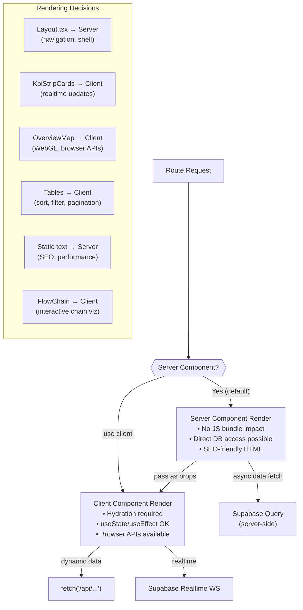

### 5개 페이지 구조

| 페이지 | 경로 | 주요 기능 |
|--------|------|-----------|
| Overview | `/overview` | KPI strip · OverviewMap · 실시간 피드 |
| Pipeline | `/pipeline` | FlowPipeline · PipelineFilterBar · PipelineCasesTable |
| Sites | `/sites` | SiteCards · SiteDetail · AgiAlertBanner |
| Cargo | `/cargo` | CargoTabs · WhStatusTable · CargoDrawer |
| Chain | `/chain` | 전체 물류 체인 시각화 · OriginCountrySummary · FlowChain |

---

## 10. Security Architecture

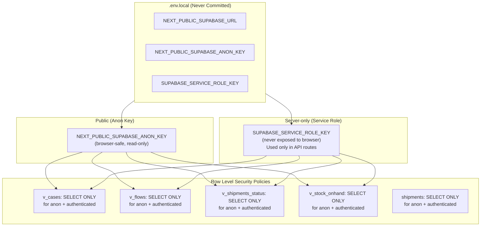

> **패턴:** 모든 Next.js API Route는 `supabaseAdmin` (service_role 클라이언트)를 사용한다. 브라우저 클라이언트는 `supabase` (anon 클라이언트)를 사용한다.

---

## 11. Performance Architecture

```mermaid
graph LR
    subgraph Optimizations["Performance Optimizations"]
        direction TB
        O1["Turbopack\nFast dev builds\nModule dedup"]
        O2["React.memo()\nStable selector refs\nShallow equality"]
        O3["Zustand normalized\nMap-based O(1) lookup\nSelective subscriptions"]
        O4["Debounced updates\nuseBatchUpdates\n300ms debounce"]
        O5["Deck.gl GPU\nWebGL 2.0 layers\nInstance rendering"]
        O6["WS dedup\nBroadcastChannel\nSingle WS per origin"]
        O7["SWR-like cache\nstaleTime: 30s\nAPI response cache"]
        O8["Pagination loop\ndb-max-rows 우회\n1,000 rows/req × ~11회"]
    end

    subgraph Metrics["Target Metrics"]
        M1["LCP < 2.5s"]
        M2["FID < 100ms"]
        M3["CLS < 0.1"]
        M4["WS latency < 200ms"]
    end

    Optimizations --> Metrics
```

---

## 12. Deployment Architecture

```mermaid
graph TB
    subgraph Local["Local Development"]
        Dev["next dev (Turbopack)\nlocalhost:3001"]
        LocalDB["Supabase Cloud\n(shared dev project)"]
    end

    subgraph CI["CI/CD (GitHub Actions)"]
        Lint["ESLint + TypeScript check"]
        Test["Vitest unit tests"]
        Build["next build"]
    end

    subgraph Prod["Production"]
        Vercel["Vercel\n(Edge Network)"]
        SupabaseProd["Supabase Production\nrkfffveonaskewwzghex\n10,694 cases / 890 shipments"]
    end

    Local --> CI
    CI -->|"on merge to main"| Prod
    Prod --> SupabaseProd

    subgraph EnvProd["Production Env Vars"]
        PV1["NEXT_PUBLIC_SUPABASE_URL"]
        PV2["NEXT_PUBLIC_SUPABASE_ANON_KEY"]
        PV3["SUPABASE_SERVICE_ROLE_KEY"]
    end

    EnvProd --> Vercel
```

### Directory Structure

```
apps/logistics-dashboard/
├── app/                          # Next.js App Router
│   ├── layout.tsx               # Root layout (dark theme, Inter font)
│   ├── page.tsx                 # Redirects → /overview
│   ├── globals.css              # Global CSS + CSS variables
│   ├── (dashboard)/             # Route group (shared layout)
│   │   ├── layout.tsx           # Dashboard shell (sidebar + main)
│   │   ├── overview/page.tsx    # KPI + Map + Feed
│   │   ├── cargo/page.tsx       # Shipments + Stock
│   │   ├── pipeline/page.tsx    # Flow pipeline
│   │   ├── sites/page.tsx       # Site status
│   │   └── chain/page.tsx       # 전체 물류 체인 시각화 (신규)
│   └── api/                     # BFF Route Handlers
│       ├── cases/route.ts       # 케이스 목록 (페이지네이션)
│       ├── cases/summary/route.ts  # KPI 집계 (전체 10,694 rows)
│       ├── stock/route.ts
│       ├── shipments/route.ts   # 선적 목록 (public.shipments VIEW)
│       ├── shipments/origin-summary/route.ts
│       ├── chain/summary/route.ts  # 물류 체인 집계 (신규)
│       ├── events/route.ts
│       ├── locations/route.ts
│       ├── location-status/route.ts
│       ├── worklist/route.ts
│       └── overview/route.ts    # Aggregated BFF (v2.0 신규) → OverviewCockpitResponse
├── components/                   # React Components
│   ├── layout/                  # Shell components (Sidebar, DashboardHeader)
│   ├── overview/                # Overview page components
│   │   ├── OverviewMap.tsx      # Deck.gl map
│   │   ├── ProgramFilterBar.tsx # v2.0 신규: 프로그램 필터 바
│   │   ├── ChainRibbonStrip.tsx # v2.0 신규: 체인 리본 (activePipelineStage set)
│   │   ├── MissionControl.tsx   # v2.0 신규: 미션 컨트롤 패널
│   │   ├── SiteDeliveryMatrix.tsx # v2.0 신규: 사이트별 납품 매트릭스
│   │   ├── OpenRadarTable.tsx   # v2.0 신규: 오픈 레이더 이상징후 테이블
│   │   ├── OpsSnapshot.tsx      # v2.0 신규: 운영 스냅샷 패널
│   │   ├── OverviewRightPanel.tsx  # deprecated (파일 보존)
│   │   └── OverviewBottomPanel.tsx # deprecated (파일 보존)
│   ├── map/                     # Deck.gl map components (PoiLocationsLayer)
│   ├── cargo/                   # Cargo (CargoDrawer, CargoTabs, WhStatusTable)
│   ├── pipeline/                # Pipeline (FlowPipeline, PipelineFilterBar,
│   │                            #           PipelineCasesTable, PipelineTableWrapper)
│   ├── sites/                   # Sites (SiteCards, SiteDetail,
│   │                            #        AgiAlertBanner, SiteTypeTag)
│   ├── chain/                   # Chain page components (신규)
│   │                            #   FlowChain, OriginCountrySummary
│   └── ui/                      # Shadcn base components
├── hooks/                        # Custom React hooks
├── lib/                          # Utilities & clients
│   ├── supabase.ts              # Supabase client (supabase + supabaseAdmin)
│   ├── api.ts                   # Fetch + mock fallback
│   ├── utils.ts                 # cn() utility
│   ├── time.ts                  # Dubai timezone
│   ├── cases/                   # Cases domain logic
│   │   ├── pipelineStage.ts     # classifyStage(), PipelineStage type
│   │   └── storageType.ts       # normalizeStorageType()
│   ├── logistics/               # Logistics domain logic
│   │   └── normalizers.ts       # normalizeSite(), extractOriginCountry(), etc.
│   ├── data/                    # Static data
│   ├── map/                     # Map data (poiLocations.ts, flowLines.ts)
│   ├── overview/                # Overview domain logic (v2.0 신규)
│   │   └── ui.ts                # gateClassLight(), uiTokens, SITE_META (chipClass, riskColor)
│   ├── hvdc/                    # HVDC domain logic
│   └── search/                  # Search index
├── scripts/
│   └── import-excel.mjs         # Excel → Supabase ETL (신규)
├── store/
│   ├── logisticsStore.ts        # Zustand store (layer toggles, highlightedShipmentId)
│   └── casesStore.ts            # v2.0 신규: activePipelineStage (ChainRibbonStrip → PipelineTableWrapper)
├── types/
│   ├── logistics.ts             # KPIData, LogisticsState
│   ├── cases.ts                 # CaseRow, StockRow, ShipmentRow, etc.
│   └── chain.ts                 # ChainSummary (신규)
├── public/                       # Static assets
├── supabase/
│   └── migrations/              # SQL 마이그레이션 파일
│       ├── 20260127_api_views.sql        # v_cases, v_flows, shipments 뷰
│       └── 20260313_add_shipment_columns.sql  # analytics 컬럼 + RPC 함수
├── .env.local                   # Environment variables (not committed)
├── next.config.ts               # Next.js config
├── tailwind.config.ts           # Tailwind config
├── tsconfig.json                # TypeScript config
├── recreate-tables.mjs          # 개발전용 테이블 재생성
├── package.json
├── CHANGELOG.md
└── README.md
```

### 신규 컴포넌트 목록 (최근 추가)

| 컴포넌트 | 위치 | 버전 | 용도 |
|----------|------|------|------|
| `SiteTypeTag` | `components/sites/SiteTypeTag.tsx` | v1.x | 사이트 유형 태그 (온쇼어/오프쇼어) |
| `FlowChain` | `components/chain/` | v1.x | 전체 물류 체인 시각화 |
| `OriginCountrySummary` | `components/chain/` | v1.x | 출발지 국가별 요약 |
| `PipelineCasesTable` | `components/pipeline/PipelineCasesTable.tsx` | v1.x | 파이프라인 케이스 테이블 |
| `PipelineTableWrapper` | `components/pipeline/PipelineTableWrapper.tsx` | v1.x | 파이프라인 테이블 컨테이너 (casesStore.activePipelineStage 구독) |
| `ProgramFilterBar` | `components/overview/ProgramFilterBar.tsx` | v2.0 | 오버뷰 프로그램 필터 바 (사이트/프로그램 chip 선택) |
| `ChainRibbonStrip` | `components/overview/ChainRibbonStrip.tsx` | v2.0 | 물류 체인 리본 노드 — 클릭 시 casesStore.activePipelineStage 설정 |
| `MissionControl` | `components/overview/MissionControl.tsx` | v2.0 | 핵심 KPI 미션 컨트롤 패널 — highlightedShipmentId 소비 |
| `SiteDeliveryMatrix` | `components/overview/SiteDeliveryMatrix.tsx` | v2.0 | 사이트별 납품 현황 매트릭스 — filterSite 연동 |
| `OpenRadarTable` | `components/overview/OpenRadarTable.tsx` | v2.0 | 오픈 이상징후 레이더 테이블 (rounded-xl rows, 540 px scroll) |
| `OpsSnapshot` | `components/overview/OpsSnapshot.tsx` | v2.0 | 운영 스냅샷 패널 — WH bars, worklist border rows |
