# System Architecture — HVDC Logistics Dashboard

> **Version:** 1.0.0 | **Last Updated:** 2026-03-13
> **Stack:** Next.js 16 · React 19 · TypeScript 5 · Supabase · Deck.gl · Zustand

---

## Table of Contents

1. [Architecture Overview](#1-architecture-overview)
2. [Technology Stack](#2-technology-stack)
3. [Application Layers](#3-application-layers)
4. [Data Flow Architecture](#4-data-flow-architecture)
5. [API Architecture](#5-api-architecture)
6. [State Management](#6-state-management)
7. [Realtime Architecture](#7-realtime-architecture)
8. [Database Architecture](#8-database-architecture)
9. [Frontend Rendering Strategy](#9-frontend-rendering-strategy)
10. [Security Architecture](#10-security-architecture)
11. [Performance Architecture](#11-performance-architecture)
12. [Deployment Architecture](#12-deployment-architecture)

---

## 1. Architecture Overview

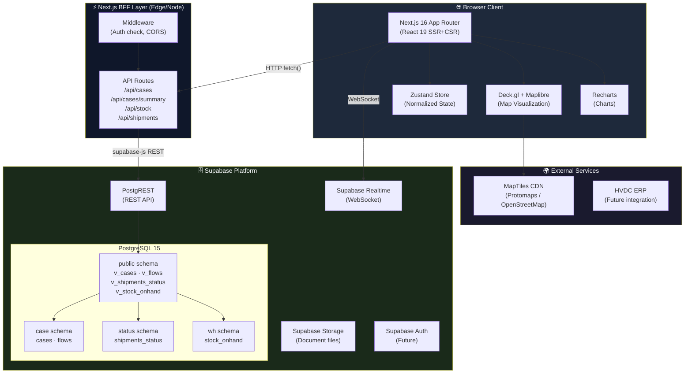

---

## 2. Technology Stack

```mermaid
mindmap
  root((HVDC Dashboard))
    Frontend
      Next.js 16.3
        App Router
        Server Components
        Server Actions
      React 19.2
        Concurrent Features
        Suspense
        use() hook
      TypeScript 5.4
        Strict mode
        Path aliases
    UI
      Tailwind CSS 3.4
        Dark theme
        CSS variables
      Shadcn UI
        Radix primitives
        Accessible components
      Deck.gl 9
        WebGL 2.0 layers
        GPU acceleration
      Maplibre GL 3
        Vector tiles
        Custom styles
      Recharts 2
        SVG charts
        Responsive
    Data
      Supabase
        PostgreSQL 15
        PostgREST v12
        Realtime v2
      Zustand 4
        Normalized store
        Immer middleware
        Devtools
    Build
      Turbopack
        Fast refresh
        Module federation
      ESLint 9
      Prettier 3
```

### Version Matrix

| Package | Version | Purpose |
|---------|---------|---------|
| `next` | 16.3.x | Framework & BFF |
| `react` | 19.2.0 | UI runtime |
| `typescript` | 5.4.x | Type safety |
| `@supabase/supabase-js` | 2.x | DB client |
| `@deck.gl/react` | 9.x | Map layers |
| `maplibre-gl` | 3.x | Map renderer |
| `recharts` | 2.x | Charts |
| `zustand` | 4.x | State management |
| `tailwindcss` | 3.4.x | Styling |
| `@radix-ui/*` | latest | UI primitives |

---

## 3. Application Layers

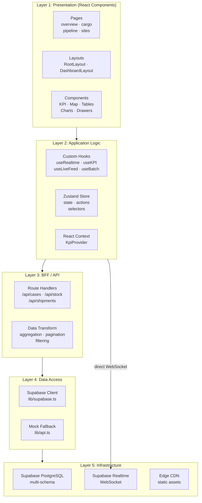

---

## 4. Data Flow Architecture

### 4.1 Initial Page Load

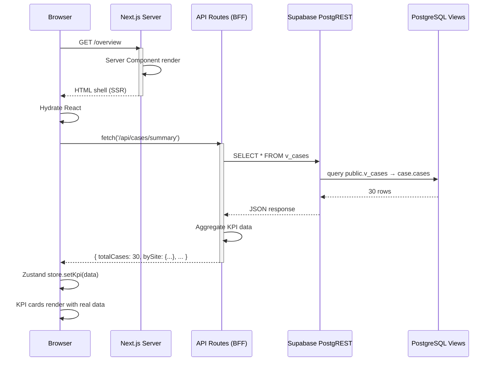

### 4.2 Realtime Update Flow

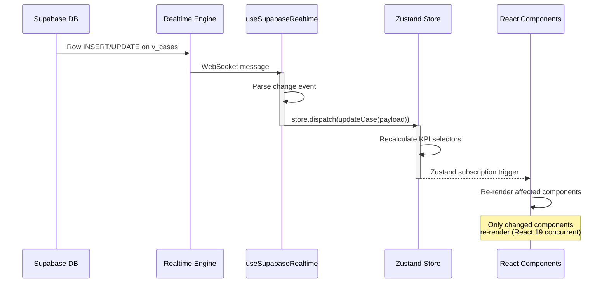

### 4.3 Filter / Search Flow

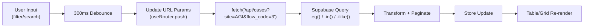

---

## 5. API Architecture

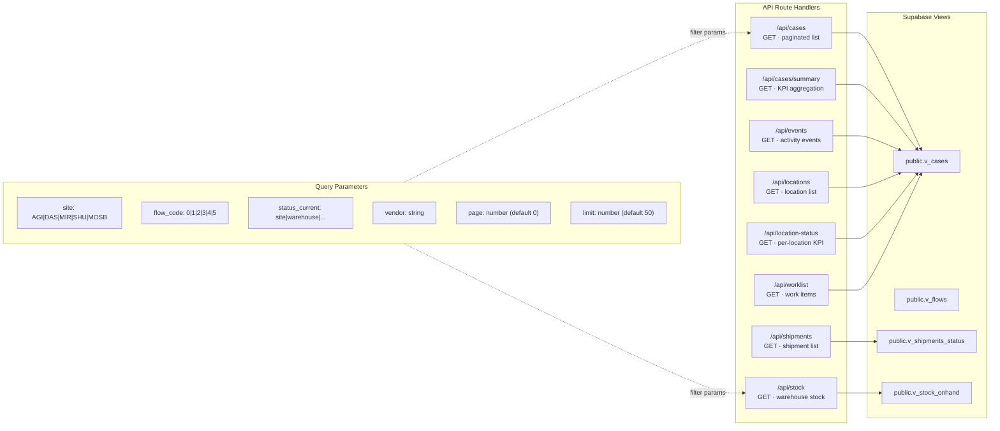

### Response Schemas

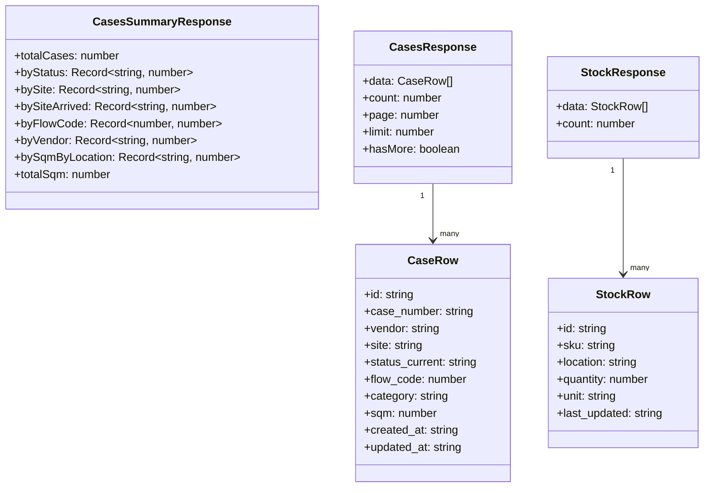

---

## 6. State Management

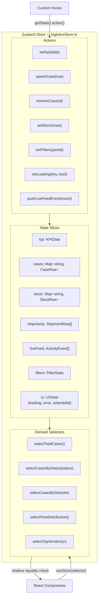

### Store Normalization Pattern

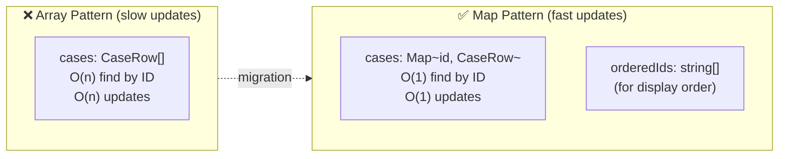

---

## 7. Realtime Architecture

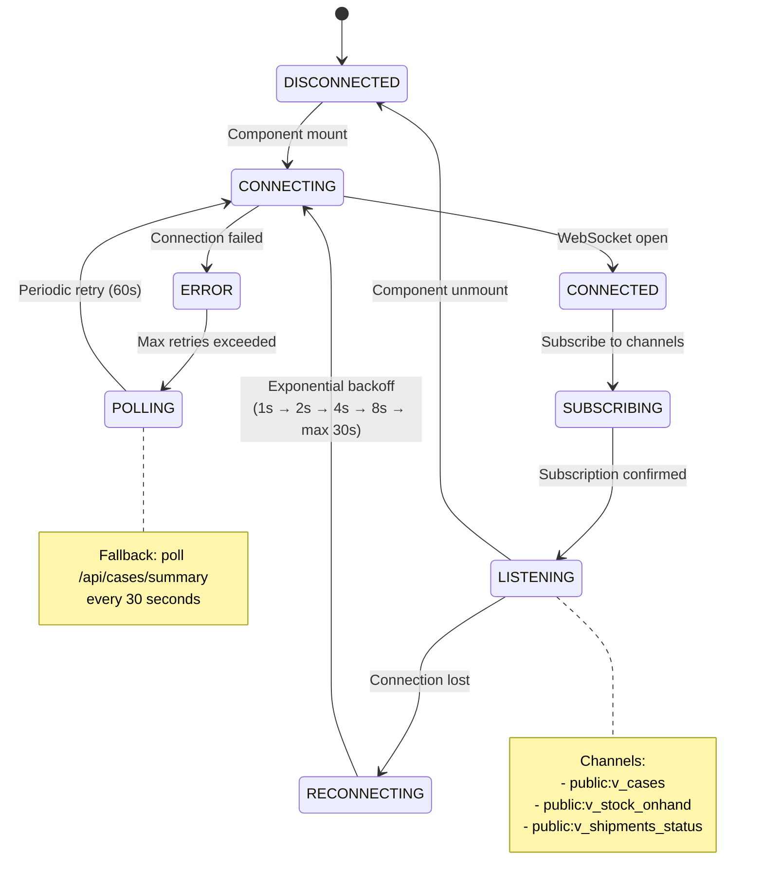

### Multi-Tab Synchronization

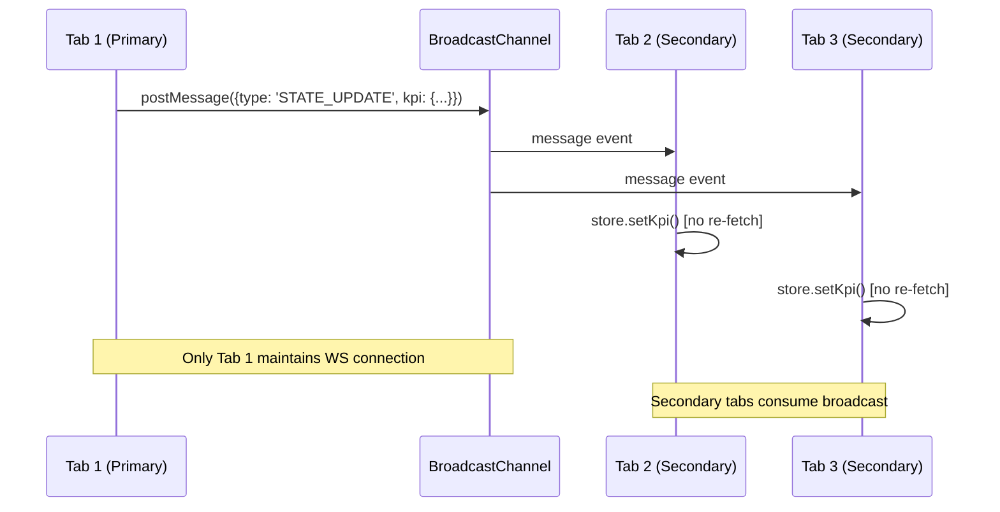

---

## 8. Database Architecture

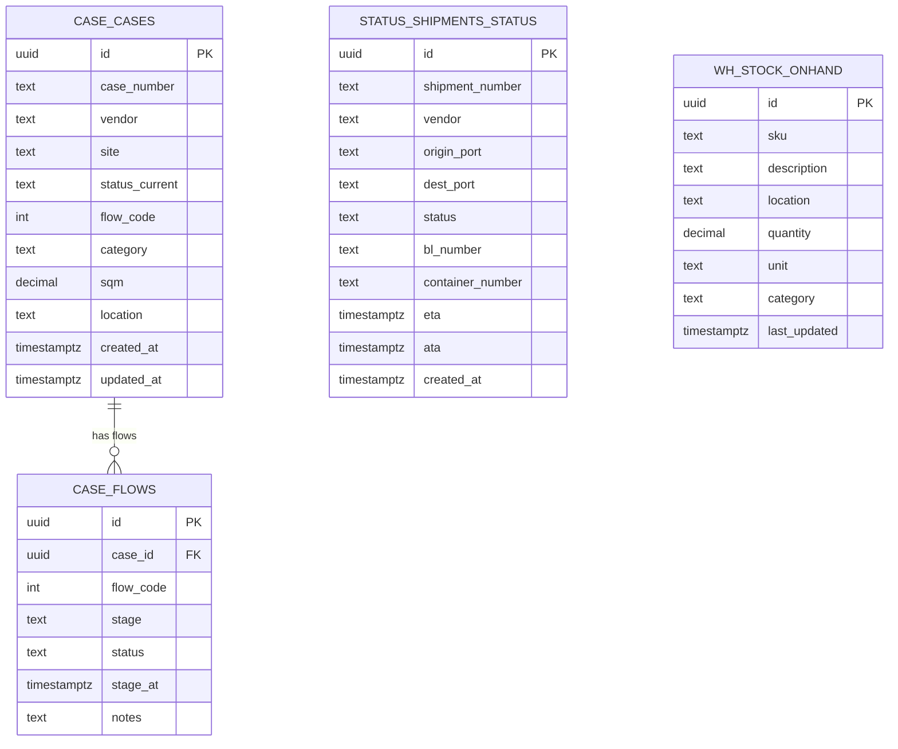

### Schema Isolation & View Layer

```mermaid
graph TB
    subgraph PG["PostgreSQL 15"]
        subgraph PublicSchema["public schema (PostgREST exposed)"]
            VC["VIEW v_cases"]
            VF["VIEW v_flows"]
            VS["VIEW v_shipments_status"]
            VW["VIEW v_stock_onhand"]
        end

        subgraph CaseSchema["case schema (isolated)"]
            TC["TABLE cases"]
            TF["TABLE flows"]
        end

        subgraph StatusSchema["status schema (isolated)"]
            TS["TABLE shipments_status"]
        end

        subgraph WhSchema["wh schema (isolated)"]
            TW["TABLE stock_onhand"]
        end
    end

    subgraph PostgREST["PostgREST API"]
        PR["Exposes only<br/>public schema"]
    end

    PR --> VC
    PR --> VF
    PR --> VS
    PR --> VW

    VC -->|"SELECT *"| TC
    VF -->|"SELECT *"| TF
    VS -->|"SELECT *"| TS
    VW -->|"SELECT *"| TW

    style PublicSchema fill:#1a3a1a
    style CaseSchema fill:#1a1a3a
    style StatusSchema fill:#3a1a1a
    style WhSchema fill:#3a2a1a
```

---

## 9. Frontend Rendering Strategy

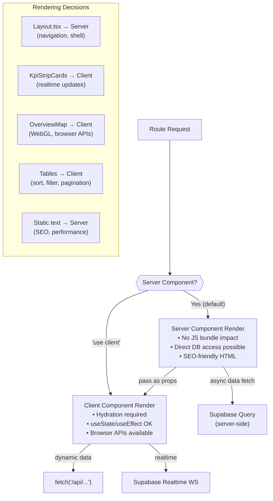

---

## 10. Security Architecture

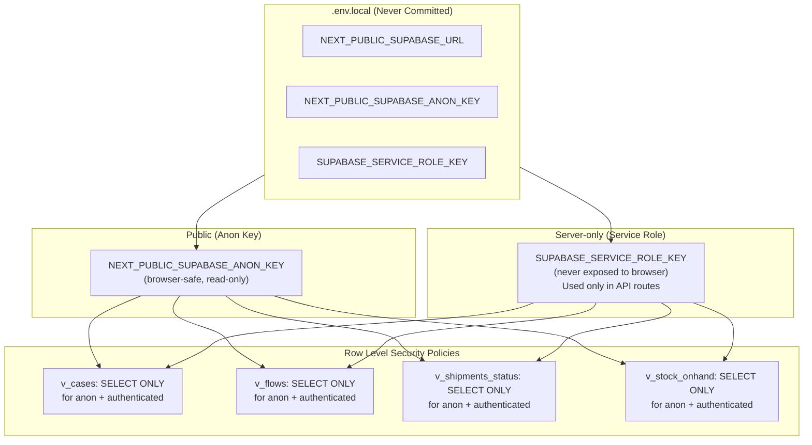

---

## 11. Performance Architecture

```mermaid
graph LR
    subgraph Optimizations["Performance Optimizations"]
        direction TB
        O1["🗜️ Turbopack<br/>Fast dev builds<br/>Module dedup"]
        O2["🧠 React.memo()<br/>Stable selector refs<br/>Shallow equality"]
        O3["📦 Zustand normalized<br/>Map-based O(1) lookup<br/>Selective subscriptions"]
        O4["🔄 Debounced updates<br/>useBatchUpdates<br/>300ms debounce"]
        O5["🗺️ Deck.gl GPU<br/>WebGL 2.0 layers<br/>Instance rendering"]
        O6["📡 WS dedup<br/>BroadcastChannel<br/>Single WS per origin"]
        O7["💾 SWR-like cache<br/>staleTime: 30s<br/>API response cache"]
        O8["🖼️ Image optimization<br/>next/image<br/>WebP conversion"]
    end

    subgraph Metrics["Target Metrics"]
        M1["LCP < 2.5s"]
        M2["FID < 100ms"]
        M3["CLS < 0.1"]
        M4["WS latency < 200ms"]
    end

    Optimizations --> Metrics
```

---

## 12. Deployment Architecture

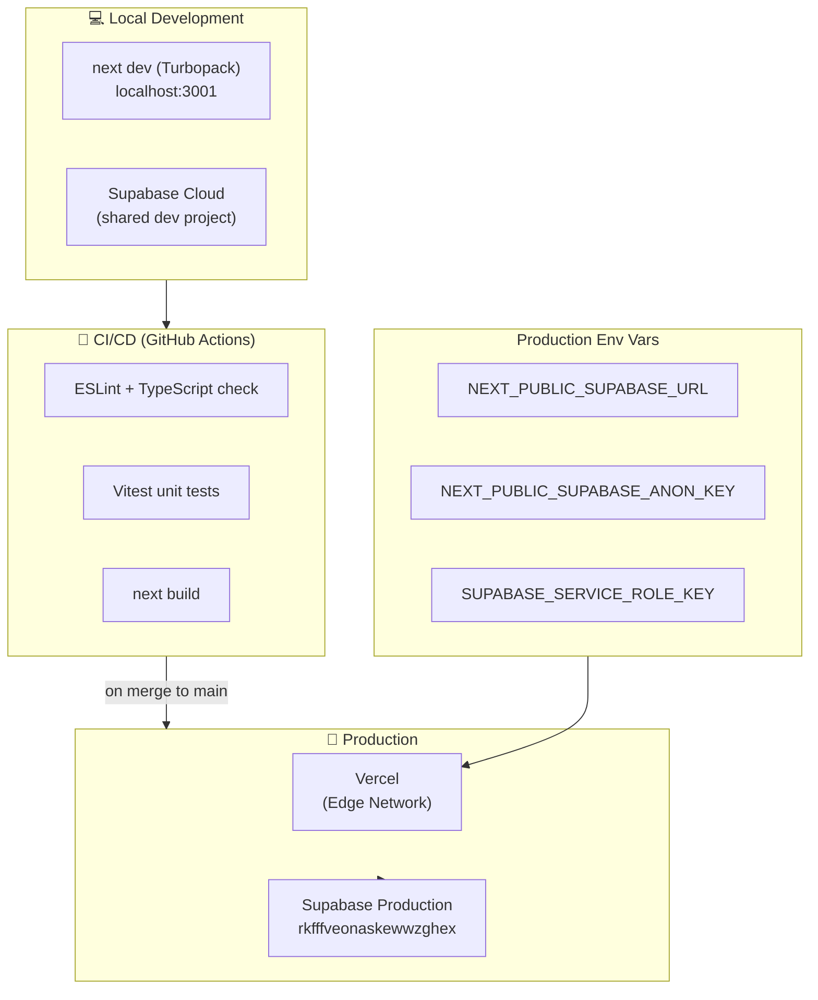

### Directory Structure

```
apps/logistics-dashboard/
├── app/                          # Next.js App Router
│   ├── layout.tsx               # Root layout (dark theme, Inter font)
│   ├── page.tsx                 # Redirects → /overview
│   ├── globals.css              # Global CSS + CSS variables
│   ├── (dashboard)/             # Route group (shared layout)
│   │   ├── layout.tsx           # Dashboard shell (sidebar + main)
│   │   ├── overview/page.tsx    # KPI + Map + Feed
│   │   ├── cargo/page.tsx       # Shipments + Stock
│   │   ├── pipeline/page.tsx    # Flow pipeline
│   │   └── sites/page.tsx       # Site status
│   └── api/                     # BFF Route Handlers
│       ├── cases/route.ts
│       ├── cases/summary/route.ts
│       ├── stock/route.ts
│       ├── shipments/route.ts
│       ├── events/route.ts
│       ├── locations/route.ts
│       ├── location-status/route.ts
│       └── worklist/route.ts
├── components/                   # React Components
│   ├── layout/                  # Shell components
│   ├── overview/                # Overview page components
│   ├── map/                     # Deck.gl map components
│   ├── cargo/                   # Cargo page components
│   ├── pipeline/                # Pipeline page components
│   ├── sites/                   # Sites page components
│   └── ui/                      # Shadcn base components
├── hooks/                        # Custom React hooks
├── lib/                          # Utilities & clients
│   ├── supabase.ts              # Supabase client
│   ├── api.ts                   # Fetch + mock fallback
│   ├── utils.ts                 # cn() utility
│   ├── time.ts                  # Dubai timezone
│   ├── data/                    # Static data
│   ├── map/                     # Map data
│   ├── hvdc/                    # HVDC domain logic
│   └── search/                  # Search index
├── store/
│   └── logisticsStore.ts        # Zustand store
├── types/
│   ├── logistics.ts             # KPIData, LogisticsState
│   └── cases.ts                 # CaseRow, StockRow, etc.
├── public/                       # Static assets
├── .env.local                   # Environment variables (not committed)
├── next.config.ts               # Next.js config
├── tailwind.config.ts           # Tailwind config
├── tsconfig.json                # TypeScript config
├── package.json
├── CHANGELOG.md
└── README.md
```
